# ATLES MASTER PLAN

> Complete Technical Blueprint — 92-Step Architecture
> Version 1.0 | September 2026
> Repository: Ahammedzihad/atles
> Classification: CANONICAL PROJECT SPECIFICATION

---

## 1. COVER PAGE

```text
================================================================================
                                                                              
                               A T L E S                                      
                                                                              
                          MASTER PLAN                                         
                                                                              
       Complete Technical Blueprint — 92-Step Architecture                    
                                                                              
================================================================================

Version:        1.0
Date:           September 2026
Repository:     Ahammedzihad/atles
Classification: CANONICAL PROJECT SPECIFICATION

================================================================================
```

## 2. DOCUMENT PURPOSE AND READING GUIDE

### Document Purpose
This document serves as the absolute canonical specification for the Atles project. It is not a theoretical whitepaper; it is a concrete, actionable technical blueprint designed to guide the development of a personal AI operating layer from initial prototypes to a fully autonomous, self-improving system. 

It functions as:
- **Canonical Specification:** The single source of truth for architectural decisions, system behaviors, and data models.
- **Development Reference:** A step-by-step implementation guide detailing precise components, inputs, outputs, and acceptance criteria.
- **Architecture Reference:** A comprehensive mapping of system boundaries, internal components, and data flows.
- **Multi-Agent Blueprint:** A defined structure for the Orchestrator and specialized sub-agents.
- **Memory/Learning Reference:** The definitive guide to how Atles forms experiences, extracts facts, and learns skills over time.
- **JARVIS Roadmap:** The evolution plan for the user-facing presence layer.
- **Guide for AI Assistants:** Structured context to allow autonomous AI agents (like Antigravity Pro) to understand the project and assist in building it.
- **PDF Source:** The foundational text to be compiled into a complete, shareable PDF document.

### Reading Guide
The Master Plan is divided into logically progressive sections:
- **Section A (Front Matter & Vision):** Start here to understand the core philosophy, the relationship between Atles Brain and JARVIS Presence, and the overarching architecture (FC-01).
- **Section B (Foundation & Core Infrastructure):** Details the local-first backend, hardware constraints, and basic integrations.
- **Section C (Memory & Experience):** Explains how chat history is converted into structured experiences and permanent knowledge.
- **Section D (Multi-Agent System & Orchestration):** Covers the routing, delegation, and management of specialized agents.
- **Section E (JARVIS Presence):** Details the interactive, multi-modal frontend and user interfaces.
- **Section F (Execution & Controlled Autonomy):** Focuses on tools, sandbox execution, permission management, and audit trails.
- **Section G (Continuous Learning & Self-Reflection):** Describes the background processes where Atles reviews its own performance and upgrades its skills.
- **Section H (Future Expansion):** Outlines long-term goals and scaling strategies once the core is stable.

For each technical step, refer to the standardized Step Template, which includes precise inputs/outputs, implementation status, and related flowcharts.

## 3. TABLE OF CONTENTS

### Section A: Front Matter and Vision
- 1. Cover Page
- 2. Document Purpose and Reading Guide
- 3. Table of Contents
- 4. Executive Vision
- 5. Master Architecture Flowchart (FC-01)
- 6. System Boundaries and Design Principles
- 7. Atles and JARVIS Relationship
- 8. Flowchart Index

### Section B: Foundation and Infrastructure (Steps 1-15)
- Step 01 — Project Initialization and Repository Setup
- Step 02 — Next.js Frontend Foundation
- Step 03 — FastAPI Backend Foundation
- Step 04 — Ollama Local Integration and Model Bootstrapping
- Step 05 — Basic Chat Interface and Bi-directional Connection
- Step 06 — Database Schema Design and SQLite Setup
- Step 07 — User Session and Authentication Scaffolding
- Step 08 — Configuration Management and Environment Variables
- Step 09 — Logging and System Telemetry Basics
- Step 10 — Initial Prompt Engineering Framework
- Step 11 — Local API Rate Limiting and Queueing
- Step 12 — Health Checking and Liveness Monitoring
- Step 13 — System Resource Monitoring (CPU/RAM Awareness)
- Step 14 — Basic Error Handling and Fallback Mechanisms
- Step 15 — Dockerization and Containerization Strategy

### Section C: Memory, Knowledge, and Experience (Steps 16-30)
- Step 16 — Short-Term Context Window Management
- Step 17 — Vector Database Integration (ChromaDB Local)
- Step 18 — Semantic Chunking and Embedding Generation
- Step 19 — Fact Extraction Pipeline
- Step 20 — Entity Recognition and Relationship Mapping
- Step 21 — Long-Term Memory Storage and Retrieval
- Step 22 — Chat History to Experience Conversion
- Step 23 — Temporal Reasoning (Past vs Present Facts)
- Step 24 — Memory Consolidation (Background Task)
- Step 25 — Contradiction Resolution and Fact Updating
- Step 26 — Semantic Search and Context Injection
- Step 27 — User Preference Profiling
- Step 28 — Skill and Strategy Memory
- Step 29 — Memory Pruning and Forgetting Mechanisms
- Step 30 — Data Portability and Export

### Section D: Multi-Agent System and Orchestration (Steps 31-45)
- Step 31 — Orchestrator Agent Bootstrapping
- Step 32 — Intent Classification and Task Routing
- Step 33 — Sub-agent Interface Definition
- Step 34 — Researcher Agent Implementation
- Step 35 — Coder Agent Implementation
- Step 36 — Planner Agent Implementation
- Step 37 — Multi-Agent Message Bus
- Step 38 — Agent Context Isolation and Sharing
- Step 39 — Parallel Execution and Synchronization
- Step 40 — Conflict Resolution between Agents
- Step 41 — Agent State Management and Checkpointing
- Step 42 — Dynamic Agent Instantiation
- Step 43 — Cross-Agent Memory Access
- Step 44 — Agent Performance Metrics
- Step 45 — Centralized Orchestrator Dashboard

### Section E: JARVIS Presence (Steps 46-60)
- Step 46 — Wake Word Detection Integration
- Step 47 — Speech-to-Text (STT) Processing
- Step 48 — Text-to-Speech (TTS) Voice Generation
- Step 49 — UI/UX Overhaul for Ambient Awareness
- Step 50 — Proactive Notification System
- Step 51 — Screen Context Capture (OCR/Vision)
- Step 52 — Multimodal Input Handling
- Step 53 — Audio Feedback and Sound Design
- Step 54 — System Status Dashboard Visualization
- Step 55 — Personality and Tone Configuration
- Step 56 — Interruptibility and Real-Time Interaction
- Step 57 — Mobile Companion App Interface
- Step 58 — Wearable Device Integration Stubs
- Step 59 — Emotion and Sentiment Recognition
- Step 60 — JARVIS Identity Lock and Security

### Section F: Tools, Execution, and Controlled Autonomy (Steps 61-75)
- Step 61 — Tool Registry and Schema Definition
- Step 62 — File System Access and Management Tools
- Step 63 — Web Browsing and Scraping Tools
- Step 64 — Terminal and Command Execution Tools
- Step 65 — API Calling and Webhook Tools
- Step 66 — Permission System (Allow/Deny/Ask)
- Step 67 — Human-in-the-Loop Approval Interface
- Step 68 — Sandbox Environment for Code Execution
- Step 69 — Execution Audit Trail and Logging
- Step 70 — Rollback and Undo Mechanisms
- Step 71 — Task Delegation and Queueing
- Step 72 — Asynchronous Task Notifications
- Step 73 — Rate Limiting for External Tools
- Step 74 — Tool Failure Recovery and Retries
- Step 75 — Budget and Cost Tracking (For external APIs if used)

### Section G: Continuous Learning and Reflection (Steps 76-85)
- Step 76 — Execution Review Pipeline
- Step 77 — Success/Failure Classification
- Step 78 — Automated Post-Mortem Generation
- Step 79 — Prompt Optimization Loop
- Step 80 — Tool Usage Efficiency Analysis
- Step 81 — Agent Skill Upgrading (Writing new tools)
- Step 82 — Behavioral Adaptation based on Feedback
- Step 83 — Periodic System Self-Diagnosis
- Step 84 — Idle Time Processing (Background Reflection)
- Step 85 — Learning Reports to User

### Section H: Future Intelligence and Scaling (Steps 86-92)
- Step 86 — Integration with Larger Hosted Models (Optional)
- Step 87 — Swarm Intelligence and Distributed Agents
- Step 88 — Advanced Predictive Planning
- Step 89 — Deep Personalization via Life Logging
- Step 90 — Cross-Device Synchronization
- Step 91 — Community Tool Sharing Ecosystem
- Step 92 — Full Level 3 Autonomy Milestone

### Flowchart Index
- FC-01 to FC-40 (See Section 8)


## 4. EXECUTIVE VISION

Atles is not a chatbot. It is a **personal AI operating layer**. 

In the current landscape of AI, most tools exist as stateless, transactional conversational agents. A user inputs a prompt, the system responds, and the interaction ends. While chat history may be preserved as a chronological log, the AI does not genuinely learn, adapt, or accumulate experience over time. 

Atles fundamentally challenges this paradigm. It is designed to be an ever-present, context-aware intelligence that operates securely within the user's local hardware ecosystem. Atles acts as a cognitive extension of the user, capable of understanding complex goals, maintaining long-term memory, planning multi-step tasks, researching external information, delegating work to specialized sub-agents, taking concrete actions on the local machine, verifying its own work, and—crucially—learning from its successes and mistakes.

### Core Identity Statement
> **"Atles = a personal AI operating layer that understands, remembers, plans, researches, delegates, acts, verifies, learns from experience, and helps the user over time—with permissions, transparency, and controlled improvement."**

### The JARVIS Inspiration and Relationship
The conceptual north star for this project is JARVIS (from the Marvel Cinematic Universe). However, Atles distinctly separates the *intelligence* from the *presence*. 
- **Atles Brain** is the backend cognitive engine. It handles reasoning, memory consolidation, multi-agent orchestration, tool execution, and self-reflection.
- **JARVIS Presence** is the frontend interface layer. It provides the voice, the visual dashboard, the proactive awareness, and the personality. 

JARVIS is not a separate product; it is how the user interacts with the Atles Brain. JARVIS gives a voice to the silent, complex processing happening within Atles.

### Core Capabilities
To function as an operating layer, Atles focuses on eight core capabilities:
1. **Understand:** Deep semantic comprehension of user intent, beyond literal keyword matching.
2. **Remember:** Moving away from raw chat history to a structured "Experience" database (facts, skills, preferences, lessons).
3. **Plan:** Breaking down high-level directives into logical, execution-ready sub-tasks.
4. **Research:** Autonomously gathering information from local files or the broader web.
5. **Delegate:** Routing specific tasks to optimized, specialized internal agents (e.g., Coder Agent, Researcher Agent).
6. **Act:** Executing real changes on the local environment (creating files, running scripts) using strict tool schemas.
7. **Verify:** Checking its own work against acceptance criteria before presenting it to the user.
8. **Learn:** Analyzing past executions to refine prompts, improve tool usage, and avoid repeating mistakes.

### Target: Level 2 + Level 3 Autonomy
Within the context of Atles (a user-defined framework, not an industry standard):
- **Level 2 (Copilot/Collaborator):** The AI operates with heavy human-in-the-loop oversight. It drafts, plans, and proposes, but requires explicit permission to execute sensitive actions.
- **Level 3 (Trusted Agent):** The AI is granted bounded autonomy. It can execute background tasks, manage its own schedule, trigger proactive alerts, and handle routine workflows without continuous prompting, relying on predefined permission boundaries and robust audit trails.

### Experience vs. Chat History
A defining pillar of the Atles architecture is the devaluation of raw chat history. Chat logs are messy, redundant, and contextually bound to a specific moment. Atles periodically processes chat logs to extract **Experience**—discrete facts, strategic decisions, corrected mistakes, and new skills. These distilled experiences are stored in a vector database, allowing Atles to draw upon past wisdom without rereading thousands of lines of casual conversation.

### Controlled Autonomy and Budget-Conscious Local Design
As a project built by a student, Atles embraces resource constraints as a feature, not a bug. 
- **Local-First:** It relies heavily on local hardware (Intel i5-1340P, 16GB RAM) and efficient local models (Ollama running Qwen3 4B) rather than expensive cloud APIs. 
- **Controlled Autonomy:** Because local models can hallucinate, Atles employs strict safeguards. It uses a "Plan-Verify-Execute" loop, explicit permission prompts for destructive actions, and comprehensive logging. The user retains ultimate control over what Atles can and cannot do.

### Current Status
Atles is being built incrementally. 
- **Day 1-3 (DONE):** Frontend scaffolding (Next.js), Backend scaffolding (FastAPI), and Local Model integration (Ollama + Qwen3 4B) are complete and passing health checks.
- **Day 4 (CURRENT NEXT):** Connecting the frontend UI to the backend intelligence layer to establish the foundational bi-directional loop.


## 5. MASTER ARCHITECTURE FLOWCHART (FC-01)

### FC-01: Complete Atles Master Architecture

```text
                           ATLES
                             │
             ┌───────────────┴───────────────┐
             │                               │
       JARVIS PRESENCE                  ATLES BRAIN
             │                               │
       Voice                             Memory
       Wake Word                         Knowledge
       Awareness                         Reasoning
       Screen                            Experience
       Computer                          Learning
       Proactive                         Skills
       Status                            Personalization
       Task Execution                    Decisions
             │                               │
             └───────────────┬───────────────┘
                             ↓
                       ORCHESTRATOR
                             ↓
                    MULTI-AGENT SYSTEM
                             ↓
                    TOOLS + MODELS + DATA
                             ↓
                         EXECUTION
                             ↓
                          REVIEW
                             ↓
                     SELF-REFLECTION
                             ↓
                        EXPERIENCE
                             ↓
                          MEMORY
                             ↓
                    FUTURE INTELLIGENCE
```

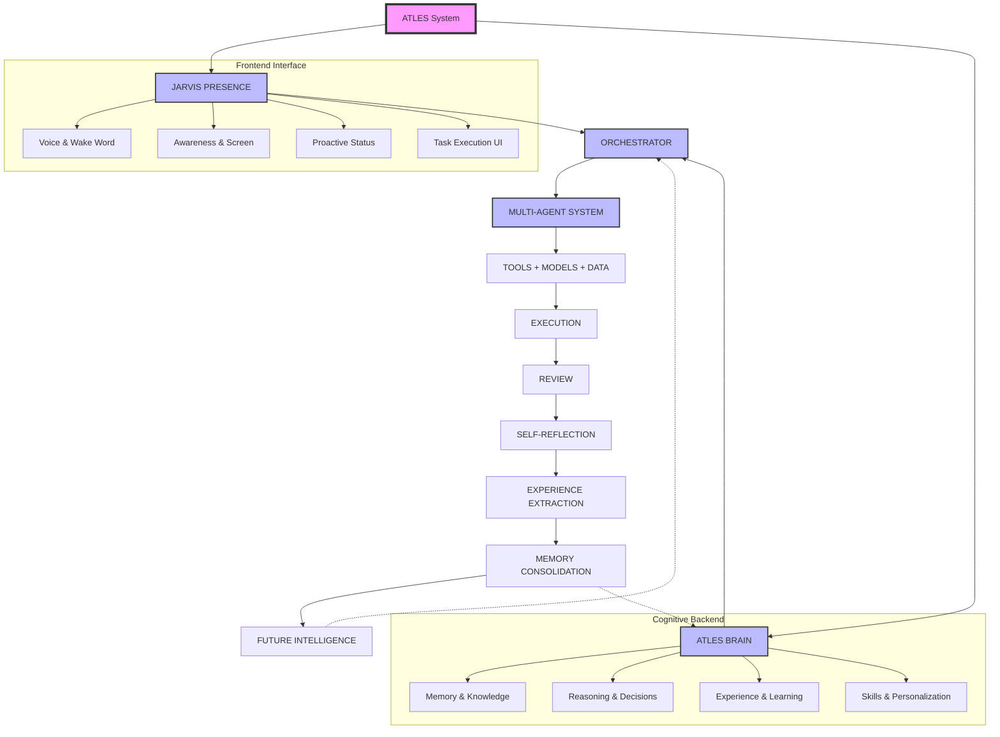

### Node Explanations

**ATLES**
The unified system entity representing the complete software stack. It acts as the absolute boundary of the local AI operating layer.

**JARVIS PRESENCE**
The frontend, interactive shell of the system. JARVIS is responsible for all multimodal inputs and outputs. It handles voice recognition (Wake Word), monitors the user's screen context (Awareness), provides proactive notifications without being prompted, and renders the visual dashboard. JARVIS ensures the system feels alive and responsive, bridging the gap between cold backend processing and human interaction.

**ATLES BRAIN**
The backend cognitive core. Where JARVIS handles *how* things are communicated, the Brain handles *what* is communicated and decided. It manages long-term storage, semantic reasoning, decision-making logic, and the transition of raw data into structured learning. It is intentionally decoupled from the UI to allow headless operation.

**ORCHESTRATOR**
The primary routing and management hub. It receives intent from JARVIS and context from the Brain. The Orchestrator acts as the "CEO," breaking down complex tasks, selecting the appropriate sub-agents, monitoring their progress, and resolving conflicts.

**MULTI-AGENT SYSTEM**
A collection of specialized, narrow-focus AI models/prompts. Instead of relying on one massive monolithic prompt, the workload is distributed. For example, a Coder Agent writes scripts, while a Researcher Agent searches local files.

**TOOLS + MODELS + DATA**
The specific utilities the agents can use. This includes file system access, terminal execution, the local Ollama models (Qwen3), and the SQLite/ChromaDB databases.

**EXECUTION**
The sandbox where actions are actually performed. This node respects the permission boundaries and controlled autonomy rules, executing code or modifying files only when authorized.

**REVIEW**
The immediate verification step. After execution, the system checks if the output matches the acceptance criteria. If it fails, it routes back to the MAS for correction before alerting the user.

**SELF-REFLECTION & EXPERIENCE**
The crucial learning loop. Following a completed task, Atles analyzes the entire trace (prompt, execution, review). It extracts successes, identifies tool misuse, and generates "Experience" chunks.

**MEMORY & FUTURE INTELLIGENCE**
The extracted experiences are consolidated into the vector database. In future tasks, the Orchestrator will inject this intelligence, allowing Atles to perform better, faster, and with fewer mistakes over time.


## 6. SYSTEM BOUNDARIES AND DESIGN PRINCIPLES

### What Atles IS vs. What it is NOT
- **IS:** A local, autonomous, learning-capable operating layer. A cognitive assistant that remembers and acts.
- **IS NOT:** A cloud-based SaaS, a stateless chatbot wrapper, a general artificial general intelligence (AGI), or a system that requires expensive API subscriptions.

### Core Principles
1. **Local-First Design:** All critical reasoning, memory storage, and task execution happen locally on the host machine. Cloud APIs are strictly optional extensions, not dependencies.
2. **Resource Awareness:** Development is heavily constrained by the target hardware (Intel i5-1340P, 16GB RAM, Iris Xe). Models must be small and quantized (e.g., Qwen3 4B via Ollama). Processing heavy tasks (like memory consolidation) must be queued as background jobs to prevent UI blocking.
3. **Budget Constraints:** Built by a student. The architecture fundamentally assumes a $0 operating budget. No paid APIs, no premium vector databases. Everything must rely on open-source, locally hostable equivalents (SQLite, ChromaDB, local Ollama).
4. **Controlled Autonomy:** Atles cannot take destructive actions without explicit human approval. The permission model (Allow/Deny/Ask) is foundational. Every tool execution leaves an audit trail.
5. **Transparency and Auditability:** The user must be able to view the Orchestrator's thought process. There are no "black box" decisions; logs show exactly which agent was invoked, what tools were used, and why a decision was made.
6. **Incremental Development:** The project adheres to a strict `PLAN → BUILD → TEST → VERIFY → COMMIT → NEXT` loop. No feature is built before its prerequisites are fully tested and stable.
7. **Modular Expandability:** The system is built with generic interfaces. If a better local model is released, or if the user upgrades their GPU, the system can swap out the Ollama model or the local vector DB without rewriting the Orchestrator logic.


## 7. ATLES AND JARVIS RELATIONSHIP

A common point of confusion is distinguishing between Atles and JARVIS. In this architecture, they are deeply symbiotic but technically distinct.

**JARVIS is the Persona; Atles is the Engine.**

Think of Atles as the complex backend infrastructure of a modern operating system—the kernel, the memory management unit, the file system, and the background services. It is cold, logical, and highly structured. 

JARVIS is the desktop environment, the terminal, the voice, and the avatar. When the user says, "JARVIS, compile the report," JARVIS (the Presence layer) processes the audio, recognizes the user, parses the emotional tone, and provides an immediate audio acknowledgment ("Right away, sir."). 

JARVIS then passes the parsed intent to the Atles Brain. The Brain handles the difficult work: retrieving past context about how the user likes their reports formatted, delegating the data gathering to a Researcher Agent, instructing a Coder Agent to format the markdown, and verifying the output. Once the Brain completes the task, it sends the payload back to JARVIS. JARVIS then decides how to present it—perhaps highlighting a notification on the screen or speaking a summary aloud.

```mermaid
graph LR
    User((User)) <--> J[JARVIS PRESENCE\n(Voice, UI, Persona)]
    J <-->|Intent & Context| B[ATLES BRAIN\n(Reasoning, Memory, Execution)]
    
    style J fill:#f9d0c4,stroke:#333,stroke-width:2px
    style B fill:#d4e6f1,stroke:#333,stroke-width:2px
```


## 8. FLOWCHART INDEX (Deliverable C)

The following flowcharts comprehensively map the Atles system and will be detailed in their respective sections.

| FC-ID | Title | Purpose | Section |
|---|---|---|---|
| FC-01 | Complete Atles Master Architecture | High-level system overview and component relationships | A |
| FC-02 | User Request Lifecycle | End-to-end tracing of a prompt to an execution result | B |
| FC-03 | Local Backend Boot Sequence | Startup checks, Ollama health, and database connection | B |
| FC-04 | Context Window Management | Token limits, rolling windows, and summarization logic | C |
| FC-05 | Fact Extraction Pipeline | Converting raw chat into discrete semantic facts | C |
| FC-06 | Memory Consolidation Process | Background task converting short-term to long-term memory | C |
| FC-07 | Vector Search and Retrieval | How past experiences are injected into current prompts | C |
| FC-08 | Contradiction Resolution | Updating outdated facts (e.g., user changed preferences) | C |
| FC-09 | Orchestrator Routing Logic | Deciding which sub-agent handles a specific intent | D |
| FC-10 | Multi-Agent Synchronization | Managing parallel tasks and joining results | D |
| FC-11 | Coder Agent Workflow | Code generation, linting, and sandbox testing | D |
| FC-12 | Researcher Agent Workflow | Web scraping, local file searching, and synthesizing | D |
| FC-13 | Conflict Resolution Protocol | Handling disagreements or divergent outputs between agents | D |
| FC-14 | Wake Word and Audio Pipeline | Capturing, filtering, and transcribing voice input | E |
| FC-15 | Proactive Notification Logic | Deciding when to interrupt the user vs. silent logging | E |
| FC-16 | Multimodal Input Merging | Combining voice, text, and screen context into one intent | E |
| FC-17 | Tool Schema Validation | Pre-execution checks on tool arguments | F |
| FC-18 | Permission and Security Gate | Allow/Deny/Ask logic for destructive actions | F |
| FC-19 | Execution Audit Trail | Logging state before, during, and after tool use | F |
| FC-20 | Execution Rollback Mechanism | Reverting file changes on tool failure | F |
| FC-21 | Asynchronous Task Queue | Handling long-running jobs without blocking UI | F |
| FC-22 | Execution Review Loop | Self-verification against acceptance criteria | G |
| FC-23 | Post-Mortem Generation | Analyzing failed tasks to extract lessons | G |
| FC-24 | Skill Generation Pipeline | Converting a successful complex workflow into a reusable tool | G |
| FC-25 | Background Idle Processing | Utilizing idle CPU cycles for memory optimization | G |
| FC-26 | Hardware Resource Monitor | Throttling LLM requests based on RAM/CPU usage | B |
| FC-27 | Database Schema Migration | Safe updates to SQLite structures | B |
| FC-28 | Error Fallback Tree | Graceful degradation when Ollama or tools fail | B |
| FC-29 | Data Portability Export | Packaging user data into portable JSON/Markdown | C |
| FC-30 | User Preference Profiling | Updating the system prompt based on learned habits | C |
| FC-31 | Agent Context Isolation | Preventing token bleed between specialized agents | D |
| FC-32 | Agent Performance Metrics | Tracking speed and accuracy of sub-agents | D |
| FC-33 | Dashboard State Sync | Real-time WebSocket updates to the Next.js UI | E |
| FC-34 | Emotion/Tone Adjustment | Modifying TTS and response style based on user state | E |
| FC-35 | Rate Limiting System | Preventing infinite loops in autonomous execution | F |
| FC-36 | Tool Failure Recovery | Retry logic and alternative strategy selection | F |
| FC-37 | Prompt Optimization Loop | Rewriting system prompts based on past failures | G |
| FC-38 | Learning Report Generation | Summarizing weekly skill acquisition for the user | G |
| FC-39 | Swarm Intelligence Model | Future protocol for multi-device agent communication | H |
| FC-40 | Level 3 Autonomy Handover | Safe transition from user-approved to fully autonomous execution | H |


---

## GROUP A — CORE VISION & EXPERIENCE (STEPS 1–12)

## Step 1 — Atles Identity and Mission

### Purpose
This step defines Atles not merely as a conversational chatbot, but as a deeply integrated personal AI operating layer. Atles is designed to operate seamlessly across the user's personal context, retaining state, automating mundane tasks, and providing highly tailored intelligence. The long-term role of Atles is to serve as the unifying layer over OS and applications, bounded only by strict permission scopes and local compute limits. 

### User-visible behavior
When fully realized, the user interacts with Atles as a persistent presence. Rather than starting fresh each time or relying on brittle prompt engineering, the user speaks or types to Atles assuming complete historical continuity. Atles seamlessly references past tasks, opens files without explicit paths, and coordinates long-running goals across sessions.

### System behavior
Internally, the Atles architecture maintains persistent memory layers (short-term conversation history, medium-term task states, long-term semantic knowledge). The routing mechanism categorizes each incoming command against system boundaries to determine if it requires tool execution, context retrieval, or straightforward conversational response. 

### Components
- **Frontend Layer:** The persistent chat and status UI built in Next.js.
- **Backend Orchestrator:** The FastAPI service mapping intents to capabilities.
- **Identity Policy Guard:** A prompt-engineering wrapper defining Atles' boundaries and core directives.

### Inputs and outputs
**Input Example:**
```json
{
  "user_id": "u_1",
  "query": "Where did we leave off on the master plan?"
}
```
**Output Example:**
```json
{
  "response": "We just finished Section A. You mentioned we should start on Section B, specifically focusing on the JARVIS core. Would you like me to pull up the template?",
  "action_suggested": "fetch_file",
  "action_target": "section_b_template.md"
}
```

### Data and memory
This capability heavily leans on read access to the global experience graph (long-term memory) and active task states. It deliberately ignores temporary OS states unrelated to user projects to preserve context relevance.

### Dependencies
Prerequisites include a functioning LLM backend (Ollama + Qwen3 4B) and a frontend chat UI. Subsequent systems like L2+L3 capabilities depend entirely on this identity definition.

### Safety and privacy
The core identity enforces boundaries: it must not execute destructive file operations autonomously, and its mission is restricted to local processing where possible to ensure data privacy. All operations are logged.

### Implementation status
PLANNED

### Acceptance criteria
- [ ] System prompt correctly asserts Atles' identity without hallucinating unverified capabilities.
- [ ] The model refuses requests outside its defined operational bounds gracefully.

### Related flowcharts
- FC-02


## Step 2 — Level 2 + Level 3 Target

### Purpose
Atles utilizes the user's specific framing of capability levels (not industry standards). Level 2 represents a capable assistant with context, tools, and multi-step task execution. Level 3 introduces a persistent, proactive, experience-aware entity with controlled, structured learning capabilities. This defines the primary engineering vector for Atles.

### User-visible behavior
At Level 2, the user can say "Format this data and save it as a CSV." At Level 3, the user can say "Keep an eye on my download folder and automatically sort any PDFs into my research directory, applying the naming convention we discussed yesterday." The system demonstrates autonomous execution and proactive suggestions.

### System behavior
The system utilizes an orchestrator loop capable of breaking down complex prompts into a Directed Acyclic Graph (DAG) of subtasks (Level 2). For Level 3, background daemon threads and scheduled tasks observe system state and trigger the orchestration loop without direct user prompt, guided by a persistent set of "user preferences" and "learned rules".

### Components
- **Task Orchestrator:** Handles multi-step execution (Level 2).
- **Proactive Daemon:** Background listener for events and triggers (Level 3).
- **Tool Registry:** Executable Python actions (e.g., file sorting, web search).

### Inputs and outputs
**Input (Level 3 Trigger):**
```python
class EventTrigger(BaseModel):
    event_type: str = "file_created"
    path: str = "/downloads/research_paper.pdf"
```

**Output (System Action):**
```python
class ActionResponse(BaseModel):
    action: str = "move_and_rename"
    target: str = "/research/2026_paper.pdf"
    status: str = "success"
```

### Data and memory
Level 2 reads/writes short-term tool results. Level 3 relies heavily on the 'Experience Database', querying rules like "User prefers files named with YYYY_MM_DD format."

### Dependencies
Requires Step 1 (Identity), Step 11 (Task Execution), and Step 18 (Awareness System).

### Safety and privacy
Level 3 capabilities introduce high risk if unchecked. All autonomous actions require a "dry-run" logging mechanism and an explicit user approval configuration per action type (e.g., `auto_approve=False`).

### Implementation status
FUTURE

### Acceptance criteria
- [ ] Atles can successfully plan and execute a 3-step tool chain autonomously (Level 2).
- [ ] Atles can trigger a helpful action based on a background event without a direct text prompt (Level 3).

### Related flowcharts
- FC-03, FC-08


## Step 3 — JARVIS Relationship

### Purpose
Clarifies the architectural separation of concerns between "JARVIS" (the presence, assistant, and interaction layer) and "Atles Brain" (the intelligence, memory, knowledge, and reasoning core). They are distinct logical subsystems of a single product, ensuring that interaction latency (JARVIS) isn't bottlenecked by deep semantic processing (Brain).

### User-visible behavior
The user interacts purely with "Atles" or the "JARVIS interface" seamlessly. When the user asks a quick factual question, the response is near-instantaneous. When the user asks for a complex code refactor, JARVIS acknowledges the request ("Thinking about how to restructure this..."), while the Atles Brain handles the heavy lifting in the background.

### System behavior
JARVIS handles I/O (speech, UI, wake words) and maintains real-time state. It routes simple queries to a lightweight prompt, and complex queries to the Atles Brain queue. The Brain operates asynchronously, using tools and updating the memory database, eventually streaming results back to JARVIS for presentation.

### Components
- **JARVIS Presence Layer:** FastAPI WebSocket endpoints, STT/TTS integration.
- **Atles Brain Orchestrator:** Asynchronous worker queue (e.g., Celery or asyncio background tasks), Ollama model interactions.

### Inputs and outputs
**JARVIS Message:**
```json
{
  "type": "status_update",
  "state": "thinking",
  "message": "Analyzing system logs..."
}
```

### Data and memory
JARVIS maintains real-time UI state (ephemeral). Atles Brain interacts with the persistent SQLite/Vector databases.

### Dependencies
Relies on a robust asynchronous backend (FastAPI async tasks) and WebSocket connections to the frontend.

### Safety and privacy
Separation of concerns ensures that the Brain can be completely isolated from raw microphone feeds, receiving only sanitized textual intents from JARVIS.

### Implementation status
PLANNED

### Acceptance criteria
- [ ] UI accurately reflects distinct states (listening, working, done) while the backend processes long tasks.
- [ ] Brain processing does not block JARVIS from acknowledging new user inputs.

### Related flowcharts
- FC-03


## Step 4 — Multimodal Input

### Purpose
To support a wide array of input methods beyond text typing. This includes voice, images, PDFs, documents, code files, spreadsheets, browser context, and raw screen captures. Multimodal input makes Atles a true OS-level assistant.

### User-visible behavior
The user can drag and drop a PDF into the chat, paste a screenshot, or speak into the microphone. Atles processes the diverse formats and responds cohesively, referencing the visual elements of an image or the tabular data in a CSV.

### System behavior
The FastAPI backend implements format-specific ingest pipelines. Text/voice goes through NLP. Images go through OCR or a Vision-Language Model (VLM). PDFs are parsed via libraries like PyMuPDF. Dataframes are loaded via Pandas for structural analysis.

### Components
- **File Ingest Service:** FastAPI endpoints for multipart file uploads.
- **Vision Pipeline:** (Future) Integration with a local VLM (e.g., LLaVA) or API.
- **Document Parsers:** Python libraries for PDF/CSV/Markdown extraction.

### Inputs and outputs
**Input Payload (Image):**
```python
class MultimodalRequest(BaseModel):
    type: str = "image"
    content_base64: str
    prompt: str = "What error is shown in this screenshot?"
```

### Data and memory
Parsed text is injected into the short-term context window. Original binary files are stored temporarily in a scratch directory, then purged unless explicitly saved by user request.

### Dependencies
Depends on the Next.js frontend supporting drag-and-drop file uploads (CURRENT NEXT/PLANNED). Voice depends on STT (Step 14).

### Safety and privacy
Local processing of all sensitive documents (PDFs, screens) is critical. No files are uploaded to external APIs without explicit user consent.

### Implementation status
PLANNED (Text only currently supported)

### Acceptance criteria
- [ ] System can parse text from an uploaded PDF and summarize it via Ollama.
- [ ] System can accept image uploads and pass them to a vision module without crashing.

### Related flowcharts
- FC-02


## Step 5 — Natural Conversation

### Purpose
Ensure Atles maintains continuous, fluid conversation. It must support context carry-over across messages, handling interruptions, digressions, and natural language nuances seamlessly.

### User-visible behavior
User: "Write a script to backup my documents."
Atles: [Provides script]
User: "Actually, change it to only backup PDFs."
Atles: [Updates script without needing the user to repeat the whole prompt].

### System behavior
The backend maintains a rolling context window of the current session. It utilizes a summarization technique when the context exceeds the model's token limit (e.g., Qwen3 4B max tokens). The prompt template injects the recent message history automatically.

### Components
- **Session Manager:** FastAPI dependency maintaining chat history.
- **Context Trimmer:** Utility to summarize or truncate older messages.

### Inputs and outputs
**Chat History Payload:**
```json
[
  {"role": "user", "content": "Write a script..."},
  {"role": "assistant", "content": "...script..."},
  {"role": "user", "content": "change it to only backup PDFs"}
]
```

### Data and memory
Stores conversational turns in a persistent `conversations` database table. Uses this table to construct context for the LLM.

### Dependencies
Requires Day 4 frontend-to-backend connection (CURRENT NEXT).

### Safety and privacy
Conversation logs are stored locally in SQLite. The user can easily delete specific sessions or purge all history.

### Implementation status
CURRENT NEXT (Basic turn-based chat works, multi-turn continuity needs robust context management).

### Acceptance criteria
- [ ] The LLM correctly resolves references to topics mentioned 3 turns prior.
- [ ] Context window gracefully truncates without losing system instructions when token limits are reached.

### Related flowcharts
- FC-02


## Step 6 — Intent Understanding

### Purpose
Before passing input to an expensive generation step, Atles must classify the user's intent to route it efficiently. Categories include: questions, tasks, research, coding, data analysis, computer actions, memory operations.

### User-visible behavior
When a user asks a simple question ("What time is it?"), the response is immediate via a direct tool. When the user asks for coding, Atles switches to a "Coding Mode" and utilizes codebase context.

### System behavior
A lightweight LLM call (or a fast classifier model) evaluates the user's input and returns a structured JSON intent. The Orchestrator uses this intent to decide which sub-agent or tool pipeline to trigger.

### Components
- **Intent Classifier:** A specific prompt applied to Qwen3 (or a smaller, faster model) enforcing strict JSON output.
- **Router:** Python logic matching intents to execution paths.

### Inputs and outputs
**Classifier Prompt Output:**
```python
class Intent(BaseModel):
    category: str # e.g., "coding", "computer_action", "chat"
    confidence: float
    entities: dict
```

### Data and memory
Does not persistently store data, but uses current session context to improve classification accuracy.

### Dependencies
Requires stable LLM JSON mode support.

### Safety and privacy
Low risk. Intent classification runs entirely locally.

### Implementation status
PLANNED

### Acceptance criteria
- [ ] Classifier correctly identifies a file creation command vs a general knowledge question with 90%+ accuracy on test set.

### Related flowcharts
- FC-02


## Step 7 — Context Continuity

### Purpose
Allows Atles to resolve pronouns and implicit references ("it", "that", "continue", "what next?") by combining conversational history with project state and active task state.

### User-visible behavior
User selects a block of code in their IDE and switches to Atles, saying "Refactor this." Atles knows "this" refers to the clipboard or the IDE selection. Or, after a script fails, the user says "fix it," and Atles knows "it" is the failed script.

### System behavior
The system builds a "Context Frame" before evaluating the user prompt. This frame aggregates recent chat messages, currently active files, recent tool failures, and clipboard contents, passing them as structured context to the LLM.

### Components
- **Context Aggregator Module:** Python service that collects environment state.
- **OS Integration (Optional):** To read clipboard or active window state.

### Inputs and outputs
**Context Frame:**
```json
{
  "active_file": "main.py",
  "clipboard": "def process(): pass",
  "recent_error": "SyntaxError on line 42",
  "user_prompt": "fix it"
}
```

### Data and memory
Highly ephemeral. Context frames are built on the fly and discarded after the response is generated.

### Dependencies
Depends heavily on the Awareness System (Step 18).

### Safety and privacy
Accessing clipboards or active windows requires strict user permissions to avoid reading sensitive passwords or private messages unintentionally.

### Implementation status
FUTURE

### Acceptance criteria
- [ ] Given a prompt with "it", the LLM successfully identifies the correct target from the Context Frame.

### Related flowcharts
- FC-02, FC-06


## Step 8 — Personalization

### Purpose
Atles must adapt to explicit preferences and corrections over time without making unsupported assumptions. This builds trust and reduces friction in repetitive tasks.

### User-visible behavior
If a user corrects Atles: "Always use double quotes in Python," Atles never uses single quotes again in that project. The user can also view and edit these learned preferences in a settings menu.

### System behavior
When the user gives a correction, a "Memory Agent" intercepts the intent (Step 6: memory operation), extracts the rule, and stores it in a structured Experience Database. This database is queried and injected into the system prompt for relevant future tasks.

### Components
- **Experience Database:** SQLite table for structured rules (topic, rule, context).
- **Rule Injector:** Dynamically appends rules to the system prompt based on task context.

### Inputs and outputs
**Rule Schema:**
```python
class PreferenceRule(BaseModel):
    id: str
    category: str = "coding_style"
    rule_text: str = "Always use double quotes for strings in Python."
    scope: str = "global"
```

### Data and memory
Persistent storage in the local database. Needs a CRUD interface for the user to manage.

### Dependencies
Requires Intent Understanding (Step 6).

### Safety and privacy
Preferences are stored locally. Users have full control to audit and delete learned rules.

### Implementation status
PLANNED

### Acceptance criteria
- [ ] User can state a preference, and it is verifiably saved in the database.
- [ ] Subsequent generations abide by the newly saved preference.

### Related flowcharts
- None specific, fits into general architecture.


## Step 9 — Status and Transparency

### Purpose
Provides real-time visibility into Atles' internal state: Idle, listening, thinking, planning, working, waiting for approval, blocked, finished. Crucial for user trust, especially during long-running background operations.

### User-visible behavior
The UI displays clear, non-intrusive indicators (e.g., a spinning icon for "working", a pulsing mic for "listening", a yellow badge for "waiting for approval"). The user is never left wondering if the system froze.

### System behavior
The backend orchestrator emits status events via WebSockets at every state transition. The frontend consumes these events and updates a global state manager (e.g., React Context or Zustand).

### Components
- **WebSocket Server:** FastAPI backend.
- **Status Event Bus:** Python module emitting state changes.
- **React Status Component:** UI element in Next.js.

### Inputs and outputs
**WebSocket Event:**
```json
{
  "event": "status_change",
  "data": {
    "previous": "thinking",
    "current": "working",
    "detail": "Executing file search..."
  }
}
```

### Data and memory
Ephemeral state management. Not persisted unless logging is enabled for debugging.

### Dependencies
Frontend Day 1 UI needs to be updated to handle WebSocket streams (CURRENT NEXT).

### Safety and privacy
Status logs provide transparency into *what* tools Atles is running, which is a key safety feature for auditing autonomy.

### Implementation status
CURRENT NEXT

### Acceptance criteria
- [ ] Next.js UI updates in real-time when the backend transitions from "thinking" to "working" via WebSockets.

### Related flowcharts
- FC-03


## Step 10 — Proactive Assistance

### Purpose
Allows Atles to act on its own initiative to identify opportunities or problems, while strictly respecting relevance, privacy, and interruption limits. Moves the system towards Level 3 autonomy.

### User-visible behavior
While compiling code, if an error occurs in the terminal, Atles might unobtrusively ping: "I noticed a missing dependency in your build. Would you like me to install `requests`?"

### System behavior
Background watchers (e.g., file system observers, terminal output parsers) stream data to a lightweight analysis model. If a high-confidence intervention is identified, it sends a proposal to the JARVIS layer, which queues a notification for the user based on interruption rules.

### Components
- **Background Watchers:** Watchdog libraries or tailing log files.
- **Heuristic Evaluator:** Fast, rule-based or small-LLM checker.
- **Notification Manager:** Queues proactive messages.

### Inputs and outputs
**Proactive Proposal:**
```python
class Proposal(BaseModel):
    trigger: str = "build_failure"
    suggested_action: str = "pip install requests"
    confidence: float = 0.95
    urgency: str = "low"
```

### Data and memory
Reads continuous system state. Stores only the user's interaction/approval of the proposal to improve future confidence scoring.

### Dependencies
Requires Awareness System (Step 18) and Useful Interruptions logic (Step 21).

### Safety and privacy
Extremely high risk of annoyance. Strict rate limiting and high confidence thresholds are required. Must only monitor explicitly whitelisted directories/processes.

### Implementation status
FUTURE

### Acceptance criteria
- [ ] System can detect a specific file change event and generate a relevant notification without user prompt.
- [ ] Notification is suppressed if user is in "Do Not Disturb" mode.

### Related flowcharts
- FC-03, FC-06


## Step 11 — Task Execution

### Purpose
The core engine for Level 2 capabilities. Converts user goals into actionable plans, executes steps via tool calls, processes results, verifies success, and generates completion reports.

### User-visible behavior
User asks: "Find all unused CSS classes in this project and remove them." Atles responds with a plan, executes the search, performs the edits, and provides a summary diff for the user to review.

### System behavior
An iterative ReAct (Reason + Act) loop. The LLM generates a plan, then emits JSON-formatted tool calls. The Orchestrator executes the tools safely locally, returns the output to the LLM, and the LLM determines the next step or declares completion.

### Components
- **Agent Loop:** Python `while` loop managing LLM interactions.
- **Tool Sandbox:** Controlled environment/functions for executing local commands (e.g., `grep_search`, `replace_file_content`).

### Inputs and outputs
**LLM Tool Call:**
```json
{
  "action": "grep_search",
  "args": {
    "SearchPath": "/atles/src",
    "Query": "unused-class"
  }
}
```

### Data and memory
Maintains a complex internal state object containing the DAG of tasks, tool outputs, and error logs during execution.

### Dependencies
Requires a robust set of tools and strong LLM function-calling capabilities. (Ollama Qwen3 needs validation for complex function calling).

### Safety and privacy
This is where destructive actions happen. All file writes or system commands must either run in a sandbox or require explicit user approval (Human-in-the-Loop) depending on safety settings.

### Implementation status
PLANNED

### Acceptance criteria
- [ ] Agent loop can successfully execute a sequence of `search` -> `read` -> `edit` tools to accomplish a simple task.
- [ ] Agent correctly pauses and asks for permission before executing a destructive command.

### Related flowcharts
- FC-08


## Step 12 — Correction and Experience Learning

### Purpose
Turns feedback and task outcomes into structural improvements for future responses. This creates the "Experience" aspect of Atles, moving beyond static knowledge bases.

### User-visible behavior
If a tool call fails during a task and the user manually fixes it, Atles observes the fix and automatically updates its internal methodology so it doesn't make the same mistake next time.

### System behavior
After a task completes (or fails), an asynchronous background process ("Reviewer Agent") analyzes the task trajectory. It extracts heuristics, common pitfalls, and successful patterns, structuring them into the Experience Database.

### Components
- **Reviewer Agent:** Background LLM process.
- **Experience DB:** Vector store or SQLite for abstract lessons.

### Inputs and outputs
**Extracted Lesson:**
```python
class Lesson(BaseModel):
    context: str = "Using sed on Windows"
    failure: str = "Syntax error with quotes"
    solution: str = "Use powershell -Command instead"
```

### Data and memory
Reads task history logs. Writes structured heuristics to long-term memory.

### Dependencies
Requires Task Execution (Step 11) to be functional and producing logs.

### Safety and privacy
Learning must be scoped to the local environment. It must not hallucinate false lessons from spurious failures.

### Implementation status
FUTURE

### Acceptance criteria
- [ ] Reviewer Agent can parse a failed task log and generate a valid JSON heuristic.

### Related flowcharts
- None specific.


## GROUP B — JARVIS CORE & AWARENESS (STEPS 13–22)

## Step 13 — JARVIS Assistant Core

### Purpose
Establishes the central assistant-presence service. It acts as the routing hub connecting natural conversation, system status, context aggregation, and underlying task states. This is the "brain stem" of the user interface.

### User-visible behavior
The user experiences a unified entity. Whether they are chatting, checking a task status, or giving a voice command, they interact with the JARVIS interface, which feels responsive and context-aware.

### System behavior
A central Orchestrator class in FastAPI that holds references to WebSocket managers, Active Tasks, and Context windows. It multiplexes incoming signals (API calls, WebSockets, Voice triggers) and routes them to the appropriate Brain worker.

### Components
- **Core Orchestrator Service:** Python singleton or dependency injection container in FastAPI.

### Inputs and outputs
N/A - This is an architectural integration point rather than a specific algorithmic input/output.

### Data and memory
Manages active memory pointers.

### Dependencies
Unifies all Group A capabilities.

### Safety and privacy
Ensures strict separation between UI handling and heavy backend execution.

### Implementation status
PLANNED

### Acceptance criteria
- [ ] Core service successfully multiplexes HTTP chat requests and WebSocket status updates simultaneously.

### Related flowcharts
- FC-03


## Step 14 — Speech-to-Text

### Purpose
Enable voice input. Local-first Speech-to-Text (STT) ensures privacy and zero-latency connectivity dependence.

### User-visible behavior
User presses a mic button or uses a wake word, speaks, and their text appears instantly in the chat interface, highly accurate even for technical jargon.

### System behavior
Audio chunks are captured by the browser (or native app), streamed to the backend, and processed by a local STT engine (like Whisper.cpp or Vosk). The resulting text is fed directly into the JARVIS Core as a standard text input.

### Components
- **Audio Streamer:** Next.js Web Audio API component.
- **STT Engine:** Local Whisper.cpp binding or Vosk container.

### Inputs and outputs
**Input:** Raw PCM audio stream.
**Output:** String: "Format this data and save it."

### Data and memory
Audio is processed in RAM and discarded immediately. Transcriptions enter the chat history.

### Dependencies
Requires hardware capable of running Whisper models (CPU with AVX2 or basic GPU).

### Safety and privacy
Zero audio leaves the local machine.

### Implementation status
PLANNED

### Acceptance criteria
- [ ] Audio recorded in the browser is successfully transcribed to text by the local backend within 2 seconds.

### Related flowcharts
- FC-04


## Step 15 — Text-to-Speech

### Purpose
Enable audible responses from Atles. Local TTS ensures privacy, offline capability, and low latency.

### User-visible behavior
Atles speaks responses aloud with natural intonation. The user can interrupt the speech by speaking over it or pressing a button.

### System behavior
Text generated by the LLM is streamed to a local TTS engine (e.g., Piper, Coqui). Audio chunks are streamed back to the frontend for playback. Handles interruption events to halt generation and playback instantly.

### Components
- **TTS Engine:** Local Piper instance.
- **Audio Player:** Next.js frontend capable of queueing and flushing audio streams.

### Inputs and outputs
**Input:** String: "I have finished the backup."
**Output:** WAV/MP3 audio stream.

### Data and memory
Temporary audio files may be generated in a scratch directory, cleared regularly.

### Dependencies
Depends on LLM text generation capabilities.

### Safety and privacy
Locally generated, offline execution.

### Implementation status
PLANNED

### Acceptance criteria
- [ ] Text output from the LLM is synthesized into audio and played in the browser.
- [ ] Hitting an 'interrupt' button instantly stops audio playback.

### Related flowcharts
- FC-04


## Step 16 — Wake Word

### Purpose
Hands-free activation of Atles. Essential for a true ambient assistant experience.

### User-visible behavior
User says "Atles", the UI instantly lights up indicating it is listening, and the subsequent command is captured.

### System behavior
A tiny, highly optimized machine learning model runs continuously in the browser or an OS background service, listening for the specific phonetic pattern of "Atles". Once detected, it triggers the STT pipeline. Options include Porcupine or openWakeWord.

### Components
- **Wake Word Engine:** Client-side WebAssembly module or native background service.

### Inputs and outputs
**Input:** Continuous microphone stream.
**Output:** Boolean trigger event.

### Data and memory
Audio buffer is strictly local, rolling (e.g., 2 seconds max), and never stored or transmitted.

### Dependencies
Depends on STT (Step 14) for subsequent processing.

### Safety and privacy
Extreme privacy sensitivity. The continuous listening must be auditable, strictly local, and easily disabled via a hard software kill switch.

### Implementation status
FUTURE

### Acceptance criteria
- [ ] Saying "Atles" triggers the UI listening state without requiring a mouse click.

### Related flowcharts
- FC-04, FC-05


## Step 17 — Presence and Status

### Purpose
Refining Step 9 for the broader OS level. Atles must represent its current state globally, not just inside a browser tab.

### User-visible behavior
A system tray icon or a floating widget that shows exactly what Atles is doing (Listening, Working, Waiting).

### System behavior
The JARVIS core pushes status updates to OS-level notification systems or a dedicated lightweight native app.

### Components
- **Native Widget:** (Future) Python Tkinter/PyQt or Electron overlay.

### Inputs and outputs
N/A

### Data and memory
Ephemeral.

### Dependencies
Depends on Status and Transparency (Step 9).

### Safety and privacy
Status indicators are critical for user awareness of active microphones or background operations.

### Implementation status
FUTURE

### Acceptance criteria
- [ ] Status transitions in the backend reflect in an OS-level indicator.

### Related flowcharts
- FC-03


## Step 18 — Awareness System

### Purpose
Provide Atles with permitted context about the user's environment: active projects, open files, running applications, and basic system status.

### User-visible behavior
User says "Close that", and Atles knows to close the currently focused window. User asks "Why is my PC slow?", and Atles can check CPU usage.

### System behavior
A Python daemon running with specific OS permissions polls system APIs (e.g., `psutil`, `pywin32`) to build a state dictionary. This dictionary is available to the Context Aggregator (Step 7).

### Components
- **OS Observer Daemon:** Python background script.

### Inputs and outputs
**System State Object:**
```json
{
  "active_window": "VS Code - section_b.md",
  "cpu_usage": "85%",
  "ram_free": "2GB"
}
```

### Data and memory
Real-time state, heavily ephemeral. Never stored permanently.

### Dependencies
Prerequisite for Context Continuity (Step 7).

### Safety and privacy
High privacy risk. Requires strict opt-in. The user must whitelist which applications Atles is allowed to 'observe'.

### Implementation status
FUTURE

### Acceptance criteria
- [ ] The OS Observer can correctly identify the currently active window title on Windows.

### Related flowcharts
- FC-06


## Step 19 — Screen Awareness

### Purpose
Allows Atles to understand UI states through visual analysis when APIs are unavailable. Essential for interacting with uncooperative legacy or web applications.

### User-visible behavior
User says "Click the blue submit button", and Atles visually locates it and executes the click.

### System behavior
Takes a screenshot, passes it to a local Vision model, which outputs a semantic map of UI elements and their coordinates.

### Components
- **Screenshot Utility:** Pillow or mss in Python.
- **Vision Model:** Local VLM capable of bounding box detection.

### Inputs and outputs
**Output from Vision:**
```json
{
  "element": "Submit Button",
  "coordinates": [x1, y1, x2, y2]
}
```

### Data and memory
Screenshots are processed in RAM and immediately deleted.

### Dependencies
Requires a local Vision model (hardware constraint check needed).

### Safety and privacy
Extreme privacy risk. Screenshots must NEVER leave the local machine.

### Implementation status
FUTURE

### Acceptance criteria
- [ ] System can take a screenshot and successfully identify the coordinates of a specified text label.

### Related flowcharts
- FC-07


## Step 20 — Computer Agent

### Purpose
The execution arm for system and screen awareness. An observe-plan-act-observe-verify loop that actually controls the computer (mouse/keyboard/terminal).

### User-visible behavior
Atles autonomously opens a web browser, navigates to a URL, copies information, and pastes it into a local document.

### System behavior
Uses tools like `pyautogui` to execute physical actions based on plans generated by the LLM and coordinates from Screen Awareness.

### Components
- **Action Executor:** Python library for OS control.

### Inputs and outputs
**Action Command:**
```python
class OSAction(BaseModel):
    action: str = "click"
    x: int = 500
    y: int = 300
```

### Data and memory
Ephemeral.

### Dependencies
Depends on Screen Awareness (Step 19) and Task Execution (Step 11).

### Safety and privacy
Highest risk. Requires a physical kill switch (e.g., slamming the mouse to the corner of the screen via `pyautogui` failsafe). Every autonomous action must have strict permission scopes.

### Implementation status
FUTURE

### Acceptance criteria
- [ ] Agent can move the mouse to a specific coordinate and click, based on an LLM command.

### Related flowcharts
- FC-08


## Step 21 — Useful Interruptions

### Purpose
Determines when Atles is allowed to interrupt the user proactively. Balances helpfulness with annoyance.

### User-visible behavior
If a critical background task fails, Atles immediately notifies the user. If a low-priority download finishes, Atles silently queues the notification for when the user next checks the interface.

### System behavior
A scoring engine evaluates the urgency, relevance, and confidence of a Proactive Proposal (Step 10). If the score exceeds the user's current 'Focus Mode' threshold, it triggers an immediate UI or audio alert.

### Components
- **Interruption Scorer:** Heuristic logic block.

### Inputs and outputs
**Evaluation:**
```json
{
  "proposal_id": "123",
  "action": "queue_silent",
  "reason": "user_in_focus_mode_and_urgency_low"
}
```

### Data and memory
Reads user settings for notification thresholds.

### Dependencies
Depends on Proactive Assistance (Step 10).

### Safety and privacy
Ensures Atles behaves politely and predictably.

### Implementation status
FUTURE

### Acceptance criteria
- [ ] A low-priority notification is successfully suppressed when 'Focus Mode' is active.

### Related flowcharts
- None specific.


## Step 22 — JARVIS Capability Roadmap

### Purpose
A strict, ordered roadmap for implementing JARVIS features to prevent scope creep.

### Capabilities (J1-J10)
- **J1: Assistant Core** (conversation, context, intent, task state, status)
- **J2: Voice** (STT + TTS)
- **J3: Wake Word**
- **J4: Awareness** (app, project, task, file, system-state)
- **J5: Computer Tools** (open, read, create, edit, run, search, control)
- **J6: Screen Awareness** (screenshot → vision → UI understanding → action)
- **J7: Computer Agent** (observe → plan → permission → act → verify)
- **J8: Proactive Assistant** (detect problems/opportunities, offer help)
- **J9: Continuous Task Execution** (long-running, checkpoints, resume, status)
- **J10: Full JARVIS Experience** (all combined)

### User-visible behavior
Clear progression of capabilities. J1 establishes the baseline chat interface. By J10, Atles acts as a fully integrated OS layer.

### System behavior
Incremental architectural additions mapping directly to previous steps.

### Implementation status
J1 is CURRENT NEXT. J2-J10 are PLANNED/FUTURE.

### Acceptance criteria
- [ ] Each phase must complete its specific acceptance criteria before the next is started.


## FLOWCHARTS

### FC-02 — User Interaction

**Purpose:** Maps the flow of various input modalities through processing, context generation, and intent classification to final output.

```text
[Input Sources]
  Typing ──┐
  Voice ───┼─> [Input Processing (STT/OCR/Parse)] ──> [Context Aggregator]
  Image ───┤                                               │
  File ────┘                                               v
                                               [Intent Classification]
                                               /          |          \
                                         [Chat]        [Task]       [Action]
                                           |              |             |
                                      [Response]  [Orchestrator]  [Tool Execution]
```

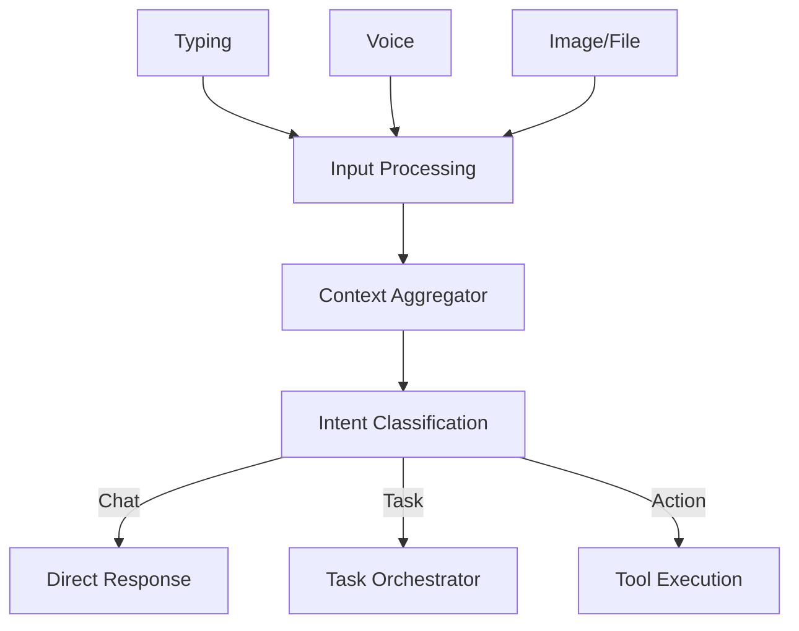

### FC-03 — JARVIS Core

**Purpose:** Illustrates how all JARVIS components connect and route information.

```text
[Wake Word / Audio / UI Input] ──> [JARVIS Core Router] <── [Awareness System]
                                     |    |    |
                   [Status Monitor] ─┘    |    └─ [Proactive Daemon]
                                          |
                               [Atles Brain Queue]
                                          |
                               [Task Execution Loop]
```

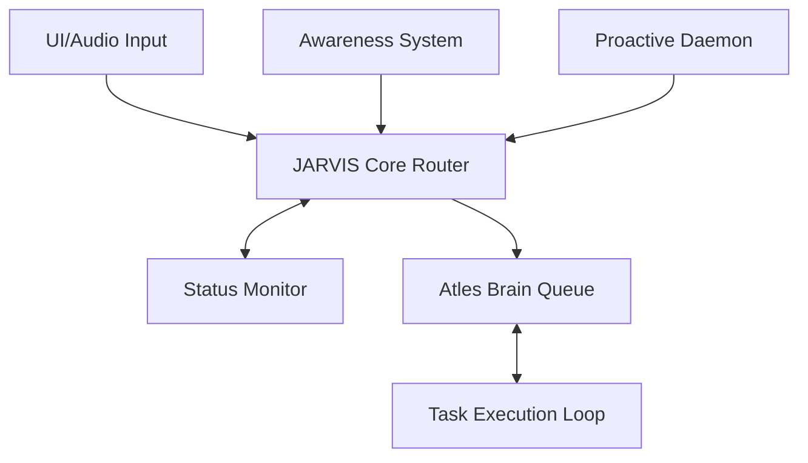

### FC-04 — Voice Pipeline

**Purpose:** Traces audio from microphone to text and back to audio.

```text
[Mic] -> [Wake Word Detect] -> [Listen State] -> [STT Engine] -> [Intent/Context]
                                                                        |
                                                                   [Response]
                                                                        |
                                  [Speaker] <- [TTS Engine] <-----------┘
```

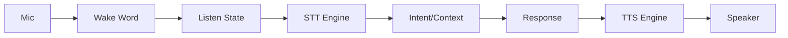

### FC-05 — Wake-Word Lifecycle

**Purpose:** Details the states of the wake-word listener.

```text
[Idle (Local Buffer)] --> (Wake Word Detected) --> [Listening State Active]
                                                         |
[Idle] <--- [Process & Respond] <--- (Audio Captured) <──┘
```

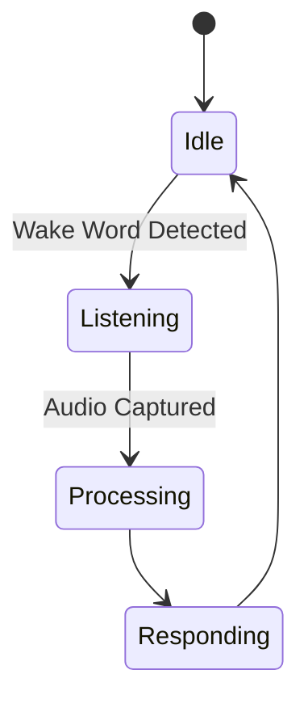

### FC-06 — Awareness System

**Purpose:** Shows how system state is observed and filtered for relevance.

```text
[System State (Files/Apps/CPU)] --> [Observer Daemon] --> [Classify State]
                                                              |
                                                      (Relevance Check)
                                                      /               \
                                                  [Drop]          [Context Update]
```

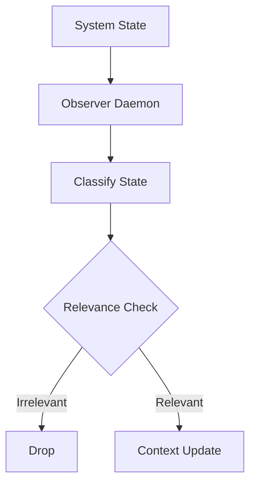

### FC-07 — Screen Awareness

**Purpose:** Shows the pipeline for visual UI interaction.

```text
[Screenshot] --> [Vision Processing (VLM)] --> [UI Element Interpretation]
                                                        |
                                              [Target Identification]
                                                        |
                                                [Proposed Action]
                                                        |
                                                (User Permission)
                                                        |
                                               [Execution & Verify]
```

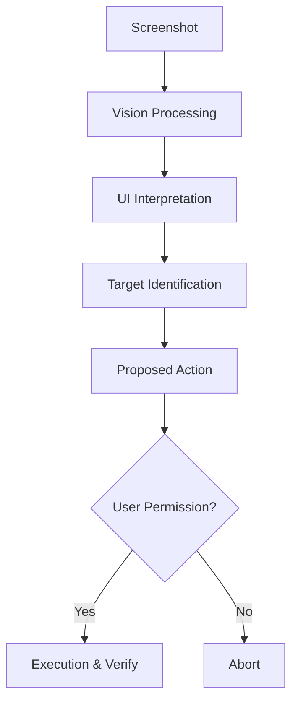

### FC-08 — Computer Agent Loop

**Purpose:** The ReAct loop for OS and screen control.

```text
-> [Observe State] -> [Understand/Plan] -> (Permission Check) -> [Act]
|                                                                  |
└────────────────────── [Verify Result] <──────────────────────────┘
```

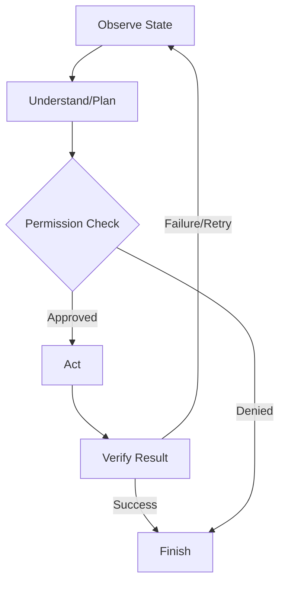


---

## GROUP C — ARCHITECTURE & ORCHESTRATION (STEPS 23–32)

## Step 23 — Frontend Architecture

### Purpose
Provides the primary interface for the user to interact with JARVIS (the assistant presence) and monitor the internal operations of the Atles Brain. A robust architecture ensures scalable growth for chat, status, projects, tasks, memory, agents, and settings.

### User-visible behavior
The user interacts with a responsive web interface. The Day 1 basic chat UI allows simple conversation. Planned features include viewing active agents, reviewing pending approvals, inspecting Atles' memory and knowledge graph, managing system settings, and seeing a real-time status dashboard.

### System behavior
The Next.js 16 App Router handles page routing and server-side rendering. Client-side components manage interactive state. The frontend communicates with the FastAPI backend via REST API calls, mapping JSON responses to TypeScript interfaces.

### Components
- **Framework:** Next.js 16.3.5 with App Router.
- **Language:** TypeScript.
- **State Management:** React Context or Zustand for global state (e.g., active task, user preferences).
- **API Client:** Axios or native `fetch` with typed wrappers.

### Inputs and outputs
**Input (User sends a message):**
```typescript
interface ChatMessageInput {
  role: 'user';
  content: string;
  attachments?: File[];
}
```

**Output (API Client Response):**
```typescript
interface ChatMessageResponse {
  id: string;
  role: 'assistant';
  content: string;
  timestamp: string;
  sources?: string[];
  suggestedActions?: string[];
}
```

### Data and memory
The frontend deliberately stores minimal state. Chat history, active tasks, and settings are fetched from the backend. LocalStorage may be used for UI preferences (e.g., dark mode, sidebar collapsed state).

### Dependencies
Depends on the backend API (Step 24). Provides the foundation for all future UI features (Agent views, Memory management).

### Safety and privacy
Data is not logged externally. All communication happens locally over `http://localhost:3000` and `http://127.0.0.1:8000`. No third-party tracking scripts are included.

### Implementation status
Day 1 basic chat UI is DONE. Rest is PLANNED.

### Acceptance criteria
- [x] Basic chat UI renders and handles user input.
- [ ] TypeScript interfaces exist for all API responses.
- [ ] Global state management properly handles concurrent task updates.
- [ ] Components are modular and reusable.

### Related flowcharts
None.

## Step 24 — Backend Architecture

### Purpose
Acts as the central nervous system of Atles, handling requests from the frontend, orchestrating tasks, managing state, and communicating with local AI models via Ollama. It ensures a clear separation of concerns, strong validation, and robust error handling.

### User-visible behavior
Invisible directly to the user, but ensures reliable, fast responses, meaningful error messages, and stable background task execution.

### System behavior
FastAPI handles incoming HTTP requests. Pydantic validates request and response payloads. Services encapsulate business logic (e.g., ChatService, AgentService, MemoryService). The backend connects to the local Ollama instance (currently running Qwen3 4B).

### Components
- **Framework:** FastAPI.
- **Language:** Python.
- **Validation:** Pydantic.
- **Model Integration:** `httpx` or dedicated Ollama client library.

### Inputs and outputs
**Input (Chat Request):**
```python
from pydantic import BaseModel, Field

class ChatRequest(BaseModel):
    message: str = Field(..., description="User's input message")
    conversation_id: str | None = None
    stream: bool = False
```

**Output (Chat Response):**
```python
class ChatResponse(BaseModel):
    reply: str
    conversation_id: str
    tokens_used: int | None = None
```

### Data and memory
The backend manages data persistence. It currently reads configuration variables (`AI_PROVIDER`, `OLLAMA_BASE_URL`).

### Dependencies
Depends on Ollama for model inference. Frontend (Step 23) depends on this backend.

### Safety and privacy
Input validation prevents malformed requests. Errors are caught globally and returned in a consistent, safe format to the frontend without exposing internal stack traces unnecessarily.

### Implementation status
Day 2 foundation is DONE. Day 3 Ollama integration is DONE.

### Acceptance criteria
- [x] FastAPI server starts and serves `/health`.
- [x] Pydantic models validate incoming requests.
- [x] Connects to Ollama and successfully generates completions.
- [ ] Comprehensive error handling and unified response formats.

### Related flowcharts
None.

## Step 25 — Atles Orchestrator

### Purpose
The Orchestrator is the "Brain" of the system. It manages the central lifecycle of every request, deciding whether a simple response is sufficient or if a complex, multi-agent plan is required. It ensures tasks are executed logically, evaluated, and recorded.

### User-visible behavior
The user asks a complex question (e.g., "Analyze this dataset and create a chart"). The user sees JARVIS acknowledge the request, then sees progress updates as Atles plans, delegates, and executes the steps, finally presenting the result.

### System behavior
The request lifecycle: Receive → Load Context → Plan → Delegate → Execute → Evaluate → Record. The Orchestrator does not do the work itself; it manages the state and dispatches sub-tasks to agents.

### Components
- **Orchestrator Service:** Manages the main loop.
- **Context Builder:** Assembles relevant history.
- **Planner:** Generates the task graph.
- **Dispatcher:** Sends tasks to agents.

### Inputs and outputs
```python
from pydantic import BaseModel
from typing import List, Dict, Any

class OrchestratorRequest(BaseModel):
    user_input: str
    context_overrides: Dict[str, Any] | None = None

class TaskPlanStep(BaseModel):
    step_id: str
    description: str
    assigned_agent: str
    dependencies: List[str] = []

class TaskPlan(BaseModel):
    plan_id: str
    goal: str
    steps: List[TaskPlanStep]

class OrchestratorResponse(BaseModel):
    status: str
    final_result: str | None = None
    plan_id: str | None = None
```

### Data and memory
Reads memory, user profile, and active context. Writes execution records and new memories based on the result.

### Dependencies
Depends on Context Assembly (Step 26), Model Routing (Step 28), and Multi-Agent Architecture (Step 33).

### Safety and privacy
Checks permissions before executing plans. Requires user approval for high-risk actions (e.g., deleting files, executing arbitrary code).

### Implementation status
PLANNED.

### Acceptance criteria
- [ ] Orchestrator successfully receives a request and generates a valid `TaskPlan`.
- [ ] Handles simple requests synchronously and complex requests asynchronously.
- [ ] Records execution history for every request.

### Related flowcharts
FC-09

## Step 26 — Context Assembly

### Purpose
Provides the AI model with the necessary information to understand the user's request without overwhelming the context window. It combines conversation history, relevant memories, system state, and active projects.

### User-visible behavior
Atles remembers past conversations, current tasks, and user preferences seamlessly, providing highly contextual and personalized responses.

### System behavior
Gathers data from multiple sources (Vector DB for memories, RDBMS for state). Ranks items by relevance, recency, and importance. Allocates the available token budget to ensure the prompt fits within the model's limits (crucial for local 4B models).

### Components
- **Context Manager:** Aggregates and filters data.
- **Token Counter:** Estimates token usage (e.g., using `tiktoken` or model-specific tokenizer).
- **Retrieval Engine:** Fetches semantic matches from memory.

### Inputs and outputs
**Input:** User message, current task ID.
**Output:** A structured prompt string or a list of message objects ready for the model.

### Data and memory
Reads from semantic memory, episodic memory, and active working memory.

### Dependencies
Depends on Memory Systems. Used by the Orchestrator (Step 25).

### Safety and privacy
Ensures that cross-tenant or highly sensitive data is not injected into the context unless authorized.

### Implementation status
PLANNED.

### Acceptance criteria
- [ ] Context correctly includes recent messages.
- [ ] Token budget is never exceeded, safely truncating the least important context.
- [ ] System prompt and core directives are always preserved.

### Related flowcharts
FC-09

## Step 27 — Task State Management

### Purpose
Ensures that complex, long-running processes can be tracked, paused, resumed, or rolled back. Provides resilience against crashes and allows the user to see exactly what Atles is doing.

### User-visible behavior
The user can view a list of active tasks, see their current progress (e.g., "Step 2 of 5: Analyzing code"), and optionally pause or cancel them.

### System behavior
Persists the `TaskState` to a database. Updates the state after every execution step. Maintains a log of agent actions, tool calls, and intermediate results.

### Components
- **Task Repository:** Database interface for task persistence.
- **State Machine:** Governs transitions (Pending → Running → Paused → Completed / Failed).

### Inputs and outputs
```python
from pydantic import BaseModel
from typing import List, Any
from enum import Enum

class TaskStatus(str, Enum):
    PENDING = "PENDING"
    RUNNING = "RUNNING"
    PAUSED = "PAUSED"
    COMPLETED = "COMPLETED"
    FAILED = "FAILED"

class TaskState(BaseModel):
    task_id: str
    goal: str
    status: TaskStatus
    current_step_id: str | None
    completed_steps: List[str] = []
    error_log: List[str] = []
    result: Any | None = None
```

### Data and memory
Writes state updates continuously to a persistent store (e.g., SQLite).

### Dependencies
Used by Orchestrator (Step 25) and Execution Engine (Step 30).

### Safety and privacy
Task states contain intermediate data which might be sensitive; must be stored securely locally.

### Implementation status
PLANNED.

### Acceptance criteria
- [ ] Task state transitions are enforced correctly.
- [ ] Tasks can be resumed from the last checkpoint after a system restart.
- [ ] Frontend can poll or receive websocket updates on task status.

### Related flowcharts
None.

## Step 28 — Model Routing

### Purpose
Optimizes performance and resource usage by directing specific types of tasks to the most appropriate AI model. While currently limited to a single local model, this architecture prepares Atles for a multi-model future.

### User-visible behavior
Faster responses for simple queries, more accurate answers for complex coding tasks, completely transparent to the user.

### System behavior
Evaluates the task complexity, required context size, and privacy constraints. Selects the target model configuration. Initially, everything routes to the local Qwen3 4B model.

### Components
- **Router Service:** Logic to select the model endpoint.
- **Provider Adapters:** Connectors for Ollama, OpenAI, Anthropic, etc.

### Inputs and outputs
```python
from pydantic import BaseModel

class ModelRequest(BaseModel):
    prompt: str
    task_type: str  # e.g., "chat", "code", "summarize"
    requires_privacy: bool = True

class ModelResponse(BaseModel):
    content: str
    model_used: str
```

### Data and memory
Reads routing rules and API keys (if applicable) from secure configuration.

### Dependencies
Depends on Backend Architecture (Step 24).

### Safety and privacy
If `requires_privacy` is true, the router strictly enforces that the request only goes to a local model (Ollama).

### Implementation status
PLANNED (Currently hardcoded to single model).

### Acceptance criteria
- [ ] Router correctly forwards requests to the configured Ollama model.
- [ ] Design supports adding secondary providers without changing core logic.
- [ ] Enforces privacy flags.

### Related flowcharts
None.

## Step 29 — Tool Registry

### Purpose
Defines the capabilities Atles has to interact with the world (file system, command line, browser). Centralized registry ensures tools are validated, secure, and discoverable by agents.

### User-visible behavior
Atles can perform actions like editing files or searching the web, rather than just generating text.

### System behavior
Maintains a registry of `ToolDefinition` objects. Provides schemas to the AI model so it knows how to call them. Handles execution of the actual Python functions when a tool is invoked.

### Components
- **Registry:** Dictionary or database of available tools.
- **Executor:** Safely runs the tool logic.

### Inputs and outputs
```python
from pydantic import BaseModel
from typing import Dict, Any, Callable

class ToolDefinition(BaseModel):
    name: str
    description: str
    parameters_schema: Dict[str, Any]  # JSON Schema
    requires_approval: bool = False
```

### Data and memory
Tool executions are logged in the Task State.

### Dependencies
Used by Execution Engine (Step 30).

### Safety and privacy
Tools with `requires_approval=True` (e.g., `run_command`, `delete_file`) pause execution and await user confirmation.

### Implementation status
PLANNED.

### Acceptance criteria
- [ ] Registry can list available tools and their JSON schemas.
- [ ] Tool execution catches and handles internal exceptions gracefully.
- [ ] Approval flags correctly halt execution.

### Related flowcharts
None.

## Step 30 — Execution Engine

### Purpose
Responsible for actually running the steps defined by the Orchestrator, executing tool calls, managing timeouts, and handling intermediate failures.

### User-visible behavior
The user sees Atles successfully completing a multi-step task, retrying if a step fails temporarily.

### System behavior
Takes a `TaskPlanStep`, determines the agent/tool, invokes it, captures the output, and updates the `TaskState`. Prevents infinite loops.

### Components
- **Execution Loop:** Async worker processing steps.
- **Timeout Manager:** Cancels long-running tasks.

### Inputs and outputs
```python
from pydantic import BaseModel
from typing import Any

class ExecutionStep(BaseModel):
    step_id: str
    action: str
    inputs: Any
    
class ExecutionResult(BaseModel):
    step_id: str
    success: bool
    output: Any
    error_message: str | None = None
```

### Data and memory
Updates TaskState (Step 27).

### Dependencies
Depends on Tool Registry (Step 29) and Agents (Group D).

### Safety and privacy
Enforces strict timeouts (e.g., `OLLAMA_TIMEOUT=120.0`) to prevent resource exhaustion on the user's constrained hardware.

### Implementation status
PLANNED.

### Acceptance criteria
- [ ] Executes steps in correct dependency order.
- [ ] Timeouts correctly abort hung operations.
- [ ] Output is properly serialized and passed to the next step.

### Related flowcharts
FC-09, FC-10

## Step 31 — Retry and Recovery

### Purpose
Makes the system resilient to transient errors (network timeouts, model hallucinations, malformed tool outputs) without crashing the entire task.

### User-visible behavior
If a file read fails, Atles automatically tries an alternative path or asks the user for clarification, rather than just giving an error message.

### System behavior
Catches exceptions from the Execution Engine. Classifies the error. Applies a `RetryPolicy` (e.g., max 3 retries, backoff). If unrecoverable, escalates to the user.

### Components
- **Error Classifier:** Determines if error is transient, permanent, or logic-based.
- **Retry Manager:** Tracks attempt counts.

### Inputs and outputs
```python
from pydantic import BaseModel

class RetryPolicy(BaseModel):
    max_attempts: int = 3
    backoff_factor: float = 1.5
    allow_fallback: bool = True
```

### Data and memory
Logs all retry attempts for diagnostic purposes.

### Dependencies
Integrated within the Execution Engine (Step 30).

### Safety and privacy
Prevents runaway retries that could consume all CPU/RAM.

### Implementation status
PLANNED.

### Acceptance criteria
- [ ] Transient errors trigger automatic retries up to `max_attempts`.
- [ ] Permanent errors fail immediately.
- [ ] Escalation properly alerts the Orchestrator to notify the user.

### Related flowcharts
FC-10

## Step 32 — Result Integration and Reflection

### Purpose
Closes the loop on a task. Combines the outputs of multiple steps into a final cohesive response for the user, and evaluates if the task was completed successfully to extract learning (Experience).

### User-visible behavior
The user receives a clear, comprehensive answer summarizing all the work Atles did. Over time, Atles stops making the same mistakes.

### System behavior
Validates final output against the original goal. Formats the response. Triggers background memory processes to store "lessons learned" if the task was particularly novel or difficult.

### Components
- **Output Synthesizer:** Formats the final response.
- **Reflection Engine:** Evaluates execution quality.

### Inputs and outputs
**Input:** Completed `TaskState` with all step outputs.
**Output:** Final string response + `ExperienceRecord`.

### Data and memory
Writes to long-term episodic/semantic memory.

### Dependencies
Final step of the Orchestrator Lifecycle (Step 25).

### Safety and privacy
Reflection data must be scrubbed of highly sensitive temporary data before long-term storage.

### Implementation status
PLANNED.

### Acceptance criteria
- [ ] Final output correctly synthesizes sub-task results.
- [ ] Reflection process identifies at least one success/failure metric per complex task.

### Related flowcharts
FC-09


## GROUP D — MULTI-AGENT SYSTEM (STEPS 33–43)

## Step 33 — Multi-Agent Architecture

### Purpose
Enables Atles to tackle complex problems by breaking them down and assigning them to specialized "personas" or agents (e.g., Coding, Research), reducing the cognitive load on a single model prompt.

### User-visible behavior
The user sees specialized agents working together on their task, like a virtual team.

### System behavior
Defines a standard interface `BaseAgent`. The `AgentRegistry` tracks available agents. The `AgentRuntime` provides the isolated execution environment for an agent to run its loop.

### Components
- **BaseAgent Interface:** Standard methods (`execute`, `handle_message`).
- **AgentRegistry:** Directory of agents.
- **AgentRuntime:** Execution sandbox.

### Inputs and outputs
```python
class BaseAgent:
    def __init__(self, agent_id: str, system_prompt: str):
        self.agent_id = agent_id
        self.system_prompt = system_prompt
        
    async def process_task(self, input_data: dict) -> dict:
        raise NotImplementedError
```

### Data and memory
Agents share access to the task context but maintain their own temporary scratchpads.

### Dependencies
Depends on Orchestrator (Step 25). Used by all specific agents (Steps 34-41).

### Safety and privacy
Agent runtimes restrict access to tools based on the agent's role (e.g., Research Agent cannot use File Write tools).

### Implementation status
PLANNED.

### Acceptance criteria
- [ ] `BaseAgent` is defined and inheritable.
- [ ] Orchestrator can dynamically load and invoke agents from the Registry.

### Related flowcharts
FC-10, FC-11

## Step 34 — Planner Agent

### Purpose
Responsible for high-level reasoning. It takes a complex user goal and breaks it down into a sequence of actionable subtasks for other agents.

### User-visible behavior
Before acting, Atles presents a plan: "To build this website, I will 1) create the HTML, 2) write the CSS, 3) test it."

### System behavior
Analyzes the goal, identifies dependencies, assesses risk, and outputs a structured plan.

### Components
- **Planner Agent:** Implementation of `BaseAgent`.

### Inputs and outputs
```python
from pydantic import BaseModel
from typing import List

class PlannerInput(BaseModel):
    goal: str
    context: str

class PlannerOutput(BaseModel):
    subtasks: List[str]
    dependencies: dict
    risk_level: str
```

### Data and memory
Reads goal and context; outputs plan to TaskState.

### Dependencies
Depends on Multi-Agent Architecture (Step 33).

### Safety and privacy
Identifies high-risk steps requiring user approval in the output.

### Implementation status
PLANNED.

### Acceptance criteria
- [ ] Generates valid, executable plans with correct dependencies.
- [ ] Correctly identifies high-risk tasks.

### Related flowcharts
FC-10

## Step 35 — Coding Agent

### Purpose
Specialized in writing, modifying, and explaining code. This is crucial for Atles' ability to help the user develop software.

### User-visible behavior
Atles writes scripts, refactors code, and fixes bugs in the user's workspace.

### System behavior
Equipped with file reading/writing tools, linter access, and specific prompt engineering for programming.

### Components
- **Coding Agent:** Implementation of `BaseAgent`.
- **Tools:** `read_file`, `write_file`, `run_command` (linters).

### Inputs and outputs
**Input:** "Create a Python script to calculate Fibonacci sequence."
**Output:** File modification success, plus explanation.

### Data and memory
Modifies local files in the workspace.

### Dependencies
Depends on File System Tools.

### Safety and privacy
Strictly bounded to operate only within the approved workspace directory (e.g., `C:\atles` or a temporary scratch folder).

### Implementation status
PLANNED.

### Acceptance criteria
- [ ] Can successfully create and edit code files.
- [ ] Respects workspace directory boundaries.

### Related flowcharts
FC-10

## Step 36 — Browser Agent

### Purpose
Allows Atles to gather up-to-date information from the internet, read documentation, and interact with web pages.

### User-visible behavior
Atles can search the web for the latest documentation or scrape a webpage for data.

### System behavior
Uses tools built around a headless browser (like Playwright) to navigate, extract DOM content, and convert it to clean text (markdown) for the model.

### Components
- **Browser Agent:** Implementation of `BaseAgent`.
- **Tools:** `navigate`, `extract_text`, `search`.

### Inputs and outputs
```python
from pydantic import BaseModel

class BrowseRequest(BaseModel):
    url: str
    extract_target: str | None = None

class BrowseResult(BaseModel):
    url: str
    markdown_content: str
    success: bool
```

### Data and memory
Does not store browsing history persistently unless explicitly requested.

### Dependencies
Depends on external libraries (e.g., Playwright).

### Safety and privacy
Does not access logged-in sessions or private local network addresses unless explicitly configured.

### Implementation status
PLANNED.

### Acceptance criteria
- [ ] Can load a webpage and extract readable text.
- [ ] Gracefully handles timeouts and CAPTCHAs (by failing safely).

### Related flowcharts
FC-10

## Step 37 — File Agent

### Purpose
Manages the file system organization, searching for files, reading contents, and moving things around.

### User-visible behavior
User can say "Find all Python files modified today and summarize them."

### System behavior
Uses safe wrappers around standard OS file operations.

### Components
- **File Agent:** Implementation of `BaseAgent`.
- **Tools:** `list_dir`, `read_file`, `move_file`.

### Inputs and outputs
```python
from pydantic import BaseModel

class FileOperation(BaseModel):
    action: str  # read, write, list, search
    path: str
    content: str | None = None
```

### Data and memory
Directly manipulates local disk.

### Dependencies
Depends on Tool Registry.

### Safety and privacy
Validates absolute paths to prevent directory traversal attacks.

### Implementation status
PLANNED.

### Acceptance criteria
- [ ] Prevents access outside allowed paths.
- [ ] Can successfully list directories and read files.

### Related flowcharts
None.

## Step 38 — Testing Agent

### Purpose
Verifies that code written by the Coding Agent actually works.

### User-visible behavior
User sees automated tests running and Atles fixing the code if tests fail.

### System behavior
Executes test commands (e.g., `pytest`), captures stdout/stderr, and classifies the errors for the Coding Agent to fix.

### Components
- **Testing Agent:** Implementation of `BaseAgent`.

### Inputs and outputs
```python
from pydantic import BaseModel

class TestRequest(BaseModel):
    command: str
    working_dir: str

class TestResult(BaseModel):
    passed: bool
    output: str
    error_summary: str | None = None
```

### Data and memory
Reads code files; executes processes.

### Dependencies
Depends on Coding Agent (Step 35).

### Safety and privacy
Runs tests in isolated environments if possible, or strictly warns user before running potentially destructive tests.

### Implementation status
PLANNED.

### Acceptance criteria
- [ ] Correctly executes tests and captures output.
- [ ] accurately parses test failure output to provide actionable summaries.

### Related flowcharts
FC-10

## Step 39 — Reviewer Agent

### Purpose
Acts as a quality control gate. Reviews the work of other agents against the original goal and safety criteria before finalizing the task.

### User-visible behavior
Ensures high quality. If a Coding Agent writes a script, the Reviewer might catch a missing import before presenting it to the user.

### System behavior
Receives the integrated results, evaluates them against a rubric, and outputs a pass/fail decision with feedback.

### Components
- **Reviewer Agent:** Implementation of `BaseAgent`.

### Inputs and outputs
```python
from pydantic import BaseModel
from typing import List

class ReviewCriteria(BaseModel):
    completeness: bool
    security: bool
    correctness: bool

class ReviewResult(BaseModel):
    approved: bool
    feedback: List[str]
```

### Data and memory
Reads temporary task outputs.

### Dependencies
Depends on Orchestrator (Step 25) and Result Integration (Step 32).

### Safety and privacy
Enforces safety rules as a final check.

### Implementation status
PLANNED.

### Acceptance criteria
- [ ] Successfully identifies major flaws in provided output.
- [ ] Rejects unsafe or incomplete work.

### Related flowcharts
FC-10

## Step 40 — Research Agent Group

### Purpose
A cluster of specialized agents that work together to perform deep research, verify facts, and synthesize information.

### User-visible behavior
Provides heavily researched, cited, and accurate reports on complex topics.

### System behavior
Planner delegates to Researcher -> Web Searcher -> Fact Checker -> Synthesis. They communicate via the message bus.

### Components
- **Research, Search, Fact Check, Synthesis Roles.**

### Inputs and outputs
**Input:** Broad research query.
**Output:** Comprehensive markdown report with citations.

### Data and memory
Aggregates vast amounts of temporary data into a concise summary.

### Dependencies
Depends on Browser Agent (Step 36).

### Safety and privacy
Avoids scraping disallowed sites.

### Implementation status
FUTURE.

### Acceptance criteria
- [ ] Agents successfully pass data between roles without human intervention.
- [ ] Final report includes source links.

### Related flowcharts
FC-10

## Step 41 — Data Agent Group

### Purpose
Specialized pipeline for handling structured data (CSV, JSON, SQL).

### User-visible behavior
User can upload a dataset and get instant visual analysis and insights.

### System behavior
Data Discovery -> Cleaning -> SQL/Analysis -> Insight Generation -> Visualization -> Report.

### Components
- **Data Roles.**
- **Tools:** Python data science stack (pandas, matplotlib) via code execution.

### Inputs and outputs
**Input:** Data file path.
**Output:** Analysis summary and generated charts.

### Data and memory
Processes data entirely locally, ensuring privacy for user datasets.

### Dependencies
Depends on Coding Agent for executing analysis scripts.

### Safety and privacy
Data never leaves the local machine.

### Implementation status
FUTURE.

### Acceptance criteria
- [ ] Can process a standard CSV and generate a basic summary statistic.

### Related flowcharts
FC-10

## Step 42 — Sequential and Parallel Execution

### Purpose
Optimizes task execution time by running independent subtasks simultaneously where hardware permits.

### User-visible behavior
Tasks complete faster. User can see multiple agents working at the same time in the UI.

### System behavior
The Execution Engine evaluates the dependency graph. Tasks with no unmet dependencies are dispatched to available agents concurrently (within model API rate limits / local hardware constraints).

### Components
- **DAG Manager:** Directed Acyclic Graph resolver.
- **Concurrency Limiter:** Prevents overwhelming the local CPU/GPU.

### Inputs and outputs
```python
from pydantic import BaseModel
from typing import List, Dict

class ExecutionPlan(BaseModel):
    nodes: Dict[str, dict]  # task_id -> task_details
    edges: List[tuple[str, str]]  # dependencies (from, to)
```

### Data and memory
Manages dynamic state of graph execution.

### Dependencies
Depends on Planner Agent (Step 34) and Execution Engine (Step 30).

### Safety and privacy
Respects resource constraints of the local machine (Intel Iris Xe, 16GB RAM) by likely keeping concurrency low (e.g., 1-2 concurrent model calls).

### Implementation status
PLANNED.

### Acceptance criteria
- [ ] Independent tasks execute concurrently.
- [ ] Dependent tasks wait for prerequisites.
- [ ] Does not crash the local machine by spawning too many threads.

### Related flowcharts
FC-10

## Step 43 — Agent Communication Protocol

### Purpose
Defines the standard language and structure by which agents talk to each other and the Orchestrator. Ensures reliable data passing and error reporting.

### User-visible behavior
Invisible to the user, but ensures reliable multi-agent cooperation without getting stuck in miscommunication loops.

### System behavior
All messages passed on the internal bus adhere to a strict schema. This prevents agents from sending raw, unparseable text to one another.

### Components
- **Message Bus:** Internal event router.
- **AgentMessage Schema:** Pydantic model.

### Inputs and outputs
```python
from pydantic import BaseModel
from typing import Any, Dict

class AgentMessage(BaseModel):
    message_id: str
    sender_id: str
    receiver_id: str
    task_id: str
    action: str  # e.g., "REQUEST", "RESULT", "ERROR", "STATUS"
    payload: Dict[str, Any]
    confidence: float | None = None
    evidence: str | None = None
```

**Example 1: Task Assignment**
```json
{
  "message_id": "msg-001",
  "sender_id": "orchestrator",
  "receiver_id": "coder_agent",
  "task_id": "task-abc",
  "action": "REQUEST",
  "payload": {"goal": "Write a python script to ping 8.8.8.8"}
}
```

**Example 2: Result Reporting**
```json
{
  "message_id": "msg-002",
  "sender_id": "coder_agent",
  "receiver_id": "orchestrator",
  "task_id": "task-abc",
  "action": "RESULT",
  "payload": {"status": "success", "file_path": "ping.py"},
  "confidence": 0.95
}
```

### Data and memory
Messages are transient but logged for debugging.

### Dependencies
Foundation for all multi-agent interaction (Steps 33-41).

### Safety and privacy
Ensures strict typings so malformed model output is caught immediately before causing downstream failures.

### Implementation status
PLANNED.

### Acceptance criteria
- [ ] All inter-agent communication uses the `AgentMessage` schema.
- [ ] Validation errors on messages are caught and handled.

### Related flowcharts
FC-11

---

## FLOWCHARTS

### FC-09 — Orchestrator Lifecycle

#### ASCII
```text
[User Request]
      |
      v
+------------------------+
| Receive & Classify     |
+------------------------+
      |
      v
+------------------------+
| Load Context           |
| (Memory/Knowledge)     |
+------------------------+
      |
      v
+------------------------+      [Complex?]
| Plan Action            |------>+------------------+
+------------------------+       | Multi-Agent Task |
      |                          | Delegation       | (See FC-10)
      v                          +------------------+
+------------------------+               |
| Select Model/Tools     |<--------------+
+------------------------+
      |
      v
+------------------------+
| Execute Step(s)        |
+------------------------+
      |
      v
+------------------------+
| Monitor Progress       |
+------------------------+
      |
      v
+------------------------+
| Evaluate Result        |
| (Check Permissions)    |
+------------------------+
      |-- (Fail/Error) ---> [Recovery/Retry]
      |
      v (Success)
+------------------------+
| Format Final Response  |
+------------------------+
      |
      v
+------------------------+
| Save Experience        |
+------------------------+
      |
      v
[Output to User]
```

#### Mermaid
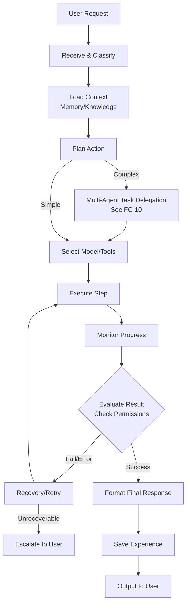

---

### FC-10 — Multi-Agent Task Delegation

#### ASCII
```text
[Task Received by Orchestrator]
      |
      v
+------------------------+
| Planner Agent          |
| Breaks down subtasks   |
+------------------------+
      |
      v
+------------------------+
| Dependency Analysis    |
| (Sequential/Parallel)  |
+------------------------+
      |
      +--------+------------------+
      |        |                  |
      v        v                  v
[Agent A]  [Agent B]          [Agent C]
(Coding)   (Search)           (File)
      |        |                  |
      +--------+------------------+
               |
               v
       (Shared Results)
               |
               v
+------------------------+
| Result Integration     |
+------------------------+
               |
               v
+------------------------+
| Reviewer Agent         |
| (Check completeness)   |
+------------------------+
               |
      [Pass]---+---[Fail/Timeout]
        |               |
        v               v
  [Completion]     [Retry/Escalate]
```

#### Mermaid
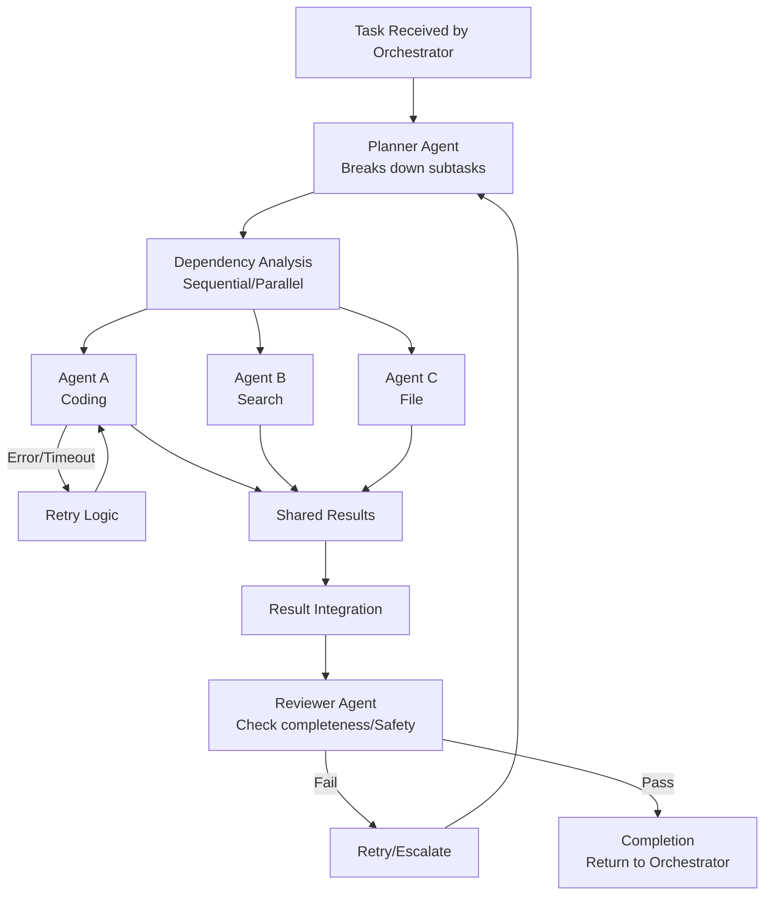

---

### FC-11 — Agent Communication

#### ASCII
```text
[Sender (e.g., Orchestrator)]
      |
      | (1. Creates Structured AgentMessage)
      v
+------------------------+
| Message Bus            |
+------------------------+
      |
      | (2. Routes based on task/receiver ID)
      v
[Receiver (e.g., Worker Agent)]
      |
      | (3. Processes Input + Context)
      | (4. Performs Action / Uses Tool)
      v
[Result/Evidence/Confidence generated]
      |
      | (5. Creates Reply AgentMessage)
      v
+------------------------+
| Message Bus            |
+------------------------+
      |
      | (6. Returns to Orchestrator/Next Agent)
      v
[Next Action triggered]
```

#### Mermaid
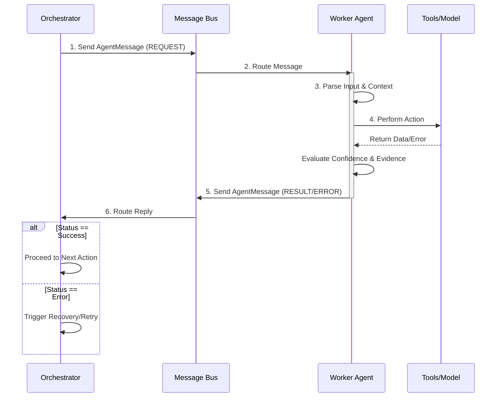


---

## GROUP E — MEMORY, KNOWLEDGE & EVIDENCE (STEPS 44–56)

## Step 44 — Long-Term Memory

### Purpose
Long-Term Memory is the foundational capability that enables Atles to persist knowledge, context, and semantic understanding beyond a single conversation session. Without it, Atles is just a stateless chatbot. By capturing and categorizing structured memories, Atles begins to exhibit Level 2 and Level 3 characteristics—building an ongoing model of the user's projects, preferences, and world state. This distinctively shifts Atles from merely "saving chat logs" to maintaining an active, queryable knowledge base.

### User-visible behavior
The user will observe that Atles remembers details discussed days or weeks ago without needing explicit reminders. If the user refers to "the project we started last week," Atles knows which one it is. The user can view, edit, search, and delete these memories through a dedicated "Memory Dashboard" in the frontend, ensuring full control over what the system retains.

### System behavior
When a conversation completes or reaches a natural checkpoint, the Orchestrator dispatches a background task to the Memory Agent. This agent processes the recent context window, extracting facts, decisions, and updates. It structures this information into standardized `MemoryRecord` payloads and persists them to the PostgreSQL database with vector embeddings (via `pgvector`) for semantic retrieval. During subsequent interactions, the context assembly phase retrieves relevant memories and injects them into the system prompt.

### Components
- **Memory Agent (Backend):** Analyzes conversation transcripts and extracts memory payloads.
- **PostgreSQL Database:** Relational store for memory metadata.
- **pgvector Extension:** Handles high-dimensional vector embeddings of memory content.
- **Ollama / Qwen3 4B:** Used for extraction reasoning and generating embeddings.
- **Frontend Dashboard:** React components for viewing and managing memories.

### Inputs and outputs
**Input (Conversation Chunk):**
```json
{
  "dialogue": [
    {"role": "user", "content": "I prefer using React over Vue for new web apps."},
    {"role": "assistant", "content": "Noted. I'll default to React for your web projects."}
  ]
}
```
**Output (Memory Extraction):**
```json
{
  "memory_type": "preference",
  "content": "User prefers React over Vue for web application development.",
  "confidence": 0.95
}
```

### Data and memory
This step introduces the base `MemoryRecord` table in PostgreSQL.
Data stored: memory type, content, vector embedding, creation timestamp, update timestamp, source conversation ID, and importance score.
Not stored: Exact chat logs in the memory table (those remain in conversation history); only distilled facts are stored.

### Dependencies
- **Prerequisites:** Basic chat interface (Step 1-4), database setup, Ollama integration.
- **Dependents:** Experience Memory, Project Memory, RAG pipeline, Persona Engine.

### Safety and privacy
Memories are stored locally. The user has absolute CRUD (Create, Read, Update, Delete) control over all memories. Sensitive information (passwords, tokens) must be actively filtered out by the Memory Agent using regular expressions and heuristics before persistence.

### Implementation status
PLANNED

### Acceptance criteria
- [ ] Memory Agent can extract a clear fact from a 5-turn conversation.
- [ ] Fact is saved to PostgreSQL with a pgvector embedding.
- [ ] When asked a related question in a new session, the fact is retrieved and utilized in the response.
- [ ] User can view and delete the memory via the frontend.

### Related flowcharts
- FC-12 (Memory Lifecycle)

---

## Step 45 — Project Memory

### Purpose
Project Memory structures knowledge around specific, ongoing efforts. It prevents Atles from losing the thread on complex, multi-day tasks. By formally tracking projects, Atles can maintain context on goals, requirements, constraints, and current status, acting as a true technical partner rather than a passive listener.

### User-visible behavior
The user can ask Atles "What's the status of the Atles project?" or "Let's work on the Atles backend." Atles will automatically load the project context, aware of the tech stack (Next.js, Python, FastAPI), recent decisions, and current blockers. The user can view a dedicated "Project Overview" page in the UI that summarizes this knowledge.

### System behavior
The system maintains a dedicated `ProjectMemory` schema. When user interactions are categorized as pertaining to an active project, the Memory Agent updates the project record. Before generating a response in a project context, the Orchestrator fetches the `ProjectMemory` object and formats it into a dense summary block injected into the LLM's system prompt.

### Components
- **Project Context Manager:** Service responsible for loading and updating project records.
- **PostgreSQL (`projects` table):** Stores project metadata and serialized state.
- **Frontend Project View:** UI for inspecting project states.

### Inputs and outputs
**Input (User query):**
"Let's resume work on Atles."

**Output (Injected System Prompt snippet):**
```text
[Active Project Context: Atles]
Goal: Personal AI operating layer.
Stack: Next.js, Python, FastAPI, Ollama (Qwen3 4B).
Status: Day 4 - Frontend-to-backend connection.
```

### Data and memory
Data stored includes: project name, goal, requirements, technologies, tasks, files, conversations, decisions, problems, solutions, mistakes, lessons, experiences, and results.
This is heavily structured compared to raw semantic memory.

### Dependencies
- **Prerequisites:** Long-Term Memory (Step 44).
- **Dependents:** Task execution, workspace management.

### Safety and privacy
Project data is isolated to the local machine. Users can archive or hard-delete projects. Deleting a project cascades to delete all associated project-specific memories (decisions, mistakes).

### Implementation status
PLANNED

### Acceptance criteria
- [ ] System can create a new project record from user intent.
- [ ] Project details (stack, goals) are updated automatically based on conversation.
- [ ] Loading a project successfully alters the LLM's context to reflect project specifics.

### Related flowcharts
- FC-12 (Memory Lifecycle)

---

## Step 46 — Decision Memory

### Purpose
Decision Memory tracks *why* things were done, preserving the rationale behind choices. In software development and complex workflows, the reason for a decision is often as important as the decision itself. This prevents the user and Atles from repeatedly re-evaluating the same options or forgetting why a specific constraint was adopted.

### User-visible behavior
If the user asks, "Why aren't we using a cloud API for the LLM?", Atles can check the decision memory and reply, "We decided on Day 1 to use Ollama locally because the primary constraint is a zero-dollar budget and a focus on local development."

### System behavior
When the LLM detects a significant choice being made (e.g., tech stack selection, architectural pattern), it generates a `DecisionRecord`. This record links to the active project (if any). The semantic search pipeline specifically weighs decision memories highly when the user asks "why" questions.

### Components
- **Memory Extractor:** Specialized prompt template for identifying decisions.
- **Database (`decisions` table):** Stores the structured decision record.

### Inputs and outputs
**Input (Context):**
User: "Let's stick to Qwen3 4B. The 7B models are too slow on my i5-1340P without a dedicated GPU."

**Output (DecisionRecord JSON):**
```json
{
  "decision": "Use Qwen3 4B model via Ollama",
  "project_id": "proj_atles_001",
  "alternatives": ["7B models (e.g., Llama 3 8B)"],
  "reasons": ["Intel i5-1340P hardware constraints", "No dedicated GPU", "7B is too slow"],
  "outcome": "Selected Qwen3 4B for optimal local performance"
}
```

### Data and memory
Stores: decision, date, project, alternatives, reasons, rejected options, assumptions, outcome.

### Dependencies
- **Prerequisites:** Long-Term Memory (Step 44), Project Memory (Step 45).
- **Dependents:** Architectural review, code generation context.

### Safety and privacy
Decisions are visible in the memory dashboard and can be amended if the rationale changes or was recorded incorrectly.

### Implementation status
PLANNED

### Acceptance criteria
- [ ] System correctly identifies a decision during a conversation and extracts the rationale.
- [ ] Decision record is linked to the correct project.
- [ ] User can query the rationale for a past decision and receive an accurate answer based on the record.

### Related flowcharts
- FC-12, FC-13

---

## Step 47 — Mistake Memory

### Purpose
Mistake Memory ensures Atles learns from errors, preventing the system from repeating the same failures. This is a critical component of Level 3 intelligence. When a tool call fails or the user corrects a flawed assumption, capturing this as a formal mistake allows Atles to adjust its future behavior dynamically.

### User-visible behavior
When Atles attempts a previously failed action, it will either avoid it entirely or apply the known fix. For example, if it previously tried to use a Linux-specific path on the user's Windows machine, it will remember the mistake and use Windows paths instead.

### System behavior
Triggered by explicit user correction, tool execution failures, or post-task evaluation. The system creates a `MistakeRecord`. During planning phases for new tasks, Atles queries mistake memory for similar contexts to apply preventative strategies.

### Components
- **Error Handler / Supervisor Agent:** Detects failures and prompts for mistake extraction.
- **Database (`mistakes` table):** Stores the structured mistake record.

### Inputs and outputs
**Input (Tool Execution Error):**
`FileNotFoundError: The path /tmp/scratch.py does not exist on Windows.`

**Output (MistakeRecord JSON):**
```json
{
  "what_happened": "Attempted to write to /tmp on a Windows OS.",
  "context": "File writing tool call",
  "cause": "Assumed Unix-like filesystem.",
  "impact": "Tool execution failed.",
  "fix": "Use standard Windows paths or the provided scratch directory C:\\atles\\scratch.",
  "lesson": "Always check the host OS before defining absolute paths.",
  "prevention_strategy": "Verify OS context before file operations."
}
```

### Data and memory
Stores: what happened, context, cause, impact, fix, lesson, prevention strategy. Linked via vector embeddings for semantic matching during task planning.

### Dependencies
- **Prerequisites:** Long-Term Memory (Step 44).
- **Dependents:** Lesson Memory (Step 48), Task Planner.

### Safety and privacy
Mistakes are internal state adjustments but remain fully transparent to the user to ensure alignment.

### Implementation status
PLANNED

### Acceptance criteria
- [ ] A verified tool failure automatically generates a MistakeRecord.
- [ ] When assigned a similar task, the planner retrieves the mistake and explicitly notes the prevention strategy in its plan.

### Related flowcharts
- FC-13 (Experience Learning)

---

## Step 48 — Lesson Memory

### Purpose
Lesson Memory abstracts specific mistakes and experiences into generalized rules. While Mistake Memory is highly contextual ("I failed to write to /tmp on Windows"), Lesson Memory creates a portable rule ("Always use OS-agnostic path libraries or verify the OS"). This accelerates capability growth.

### User-visible behavior
Over time, Atles becomes noticeably more robust and aligned with the user's workflow, avoiding classes of errors rather than just specific instances.

### System behavior
A background batch process (e.g., nightly or end-of-session) reviews recent `MistakeRecord` and `ExperienceRecord` entries. The LLM is prompted to synthesize these into generalized `LessonRecord` entries. These lessons are heavily weighted during the system's "Context Assembly" phase for any related tasks.

### Components
- **Reflection Agent:** Synthesizes lessons from experiences.
- **Database (`lessons` table):** Stores generalized rules and applicability conditions.

### Inputs and outputs
**Input (Multiple Mistake Records):**
1. Failed to use `/tmp` on Windows.
2. Failed to use `grep` in PowerShell.

**Output (LessonRecord JSON):**
```json
{
  "lesson": "The operating environment is Windows (PowerShell). Unix utilities and paths will fail.",
  "evidence": ["Mistake 1: /tmp failure", "Mistake 2: grep failure"],
  "applicability": ["File operations", "Shell commands"],
  "confidence": 0.98
}
```

### Data and memory
Stores: lesson statement, evidence (links to underlying experiences/mistakes), applicability context, confidence score.

### Dependencies
- **Prerequisites:** Mistake Memory (Step 47), Experience Memory (Step 49).
- **Dependents:** Context Assembly, Orchestrator.

### Safety and privacy
Lessons that significantly alter agent behavior can be flagged for user review in the dashboard before becoming fully active.

### Implementation status
PLANNED

### Acceptance criteria
- [ ] Reflection Agent can successfully merge two related mistakes into a generalized lesson.
- [ ] The lesson is retrieved and utilized when the applicability context is met in future prompts.

### Related flowcharts
- FC-13 (Experience Learning)

---

## Step 49 — Experience Memory

### Purpose
Experience Memory records complete episodic traces of complex tasks. It documents the journey: what was attempted, what actions were taken, what the result was, and why. This allows Atles to draw upon past successes (or failures) to guide complex multi-step planning, acting as a library of past performance.

### User-visible behavior
When asked to perform a complex task it has done before (e.g., "Set up a new Next.js component with Tailwind"), Atles can say, "I've done this before. I'll use the same structure we used for the ChatBubble component, avoiding the CSS clash we ran into last time."

### System behavior
After a task completes (success or failure), the Task Supervisor compiles the task graph, tool calls, and final state into an `ExperienceRecord`. This episodic memory is embedded and can be retrieved when the user requests a semantically similar task.

### Components
- **Task Supervisor:** Compiles the experience record.
- **Database (`experiences` table):** Stores the episodic trace.

### Inputs and outputs
**Input (Completed Task trace):**
Task: Create a Next.js API route.
Actions: Created file, tested endpoint, fixed import error, tested again.
Outcome: Success.

**Output (ExperienceRecord JSON):**
```json
{
  "task": "Create a Next.js API route for health checks",
  "actions": ["Wrote route.ts", "Curl test (failed: missing export)", "Fixed export", "Curl test (success)"],
  "result": "Success",
  "success_or_failure": "success",
  "reason": "Correctly adhered to App Router conventions after initial error.",
  "lesson_extracted": "Next.js App Router requires named exports for HTTP methods (GET, POST).",
  "future_recommendation": "Always verify named exports in route.ts files before testing."
}
```

### Data and memory
Stores: task description, action sequence, result, success/failure flag, reason, extracted lesson, future recommendation.

### Dependencies
- **Prerequisites:** Task execution engine.
- **Dependents:** Lesson Memory, Task Planner.

### Safety and privacy
Experiences can be large; data retention policies may compress older experiences into summaries or drop detailed tool traces to save space.

### Implementation status
PLANNED

### Acceptance criteria
- [ ] A completed multi-step task generates a structured ExperienceRecord.
- [ ] When given a similar task, the Task Planner retrieves the experience and uses its `future_recommendation`.

### Related flowcharts
- FC-13 (Experience Learning)

---

## Step 50 — Personal Knowledge

### Purpose
Personal Knowledge allows the user to directly feed Atles information—notes, documentation, research papers, or context files. This explicit knowledge base supplements the conversational memory, allowing Atles to act as a localized, private search engine and research assistant for the user's specific domains.

### User-visible behavior
The user can drop a markdown file or PDF into a designated folder (or upload via UI). Atles processes it and can instantly answer questions based on its contents, citing the specific document as the source.

### System behavior
The ingestion pipeline monitors for new files. It extracts text, chunks it, generates vector embeddings, and stores it in PostgreSQL via pgvector. When answering queries, a RAG (Retrieval-Augmented Generation) step fetches relevant chunks, which are assembled into the prompt with strict source attribution metadata.

### Components
- **Ingestion Pipeline:** File parsers, chunking logic (e.g., Langchain text splitters).
- **Embedding Model:** Local embedding model via Ollama (e.g., `nomic-embed-text` or similar).
- **pgvector Database:** Vector storage and similarity search.

### Inputs and outputs
**Input (Markdown file):**
`Atles_Architecture.md`

**Output (KnowledgeItem JSON):**
```json
{
  "source_uri": "file:///C:/atles/docs/Atles_Architecture.md",
  "content_type": "markdown",
  "chunks_created": 15,
  "status": "indexed"
}
```

### Data and memory
Stores: `KnowledgeItem` metadata (source, type, date) and related `DocumentChunk` vectors in pgvector.

### Dependencies
- **Prerequisites:** RAG pipeline (Step 54), pgvector setup.
- **Dependents:** Context Assembly, Web Research (Step 17).

### Safety and privacy
All documents remain strictly local. No data is sent to external APIs for embedding (enforced by using local Ollama models).

### Implementation status
PLANNED

### Acceptance criteria
- [ ] System successfully ingests a text file and generates embeddings.
- [ ] User can ask a question unique to the document and receive an accurate answer.
- [ ] The answer explicitly cites the file name.

### Related flowcharts
- FC-14 (Personal Knowledge / RAG)

---

## Step 51 — User Correction Memory

### Purpose
When Atles gets something wrong and the user corrects it, Atles must learn instantly and permanently. User Correction Memory captures explicit course corrections, ensuring the system respects the user's authority and overrides previous incorrect assumptions or model hallucinations.

### User-visible behavior
User: "Actually, my name is spelled with one 'm', not two."
Atles: "Understood, I've updated my records. Your name is spelled with one 'm'."
In all future interactions, Atles uses the correct spelling without fail.

### System behavior
When the user issues a correction, the system identifies the targeted piece of knowledge. It creates a `CorrectionRecord` which serves as a high-priority override. During context assembly, correction records take precedence over older memories or base model knowledge.

### Components
- **Intent Classifier:** Detects correction phrasing ("No, actually...", "That's wrong...").
- **Database (`corrections` table):** Stores the override.

### Inputs and outputs
**Input (User statement):**
"No, I don't want to use Tailwind. Use standard CSS modules."

**Output (CorrectionRecord JSON):**
```json
{
  "what_was_wrong": "Assumption that Tailwind CSS should be used for styling.",
  "corrected_info": "Use standard CSS modules instead.",
  "scope": "Project: Atles (and general preference)",
  "confidence": 1.0
}
```

### Data and memory
Stores: what was wrong, corrected info, scope (global vs project), confidence (always 1.0 for explicit user corrections).

### Dependencies
- **Prerequisites:** Long-Term Memory (Step 44).
- **Dependents:** Context Assembly.

### Safety and privacy
User corrections are treated as absolute truth within the system's context.

### Implementation status
PLANNED

### Acceptance criteria
- [ ] Explicit user correction is detected and saved as a CorrectionRecord.
- [ ] Subsequent queries retrieve the corrected info, and the system behaves accordingly.

### Related flowcharts
- FC-12 (Memory Lifecycle)

---

## Step 52 — Preference Memory

### Purpose
Preference Memory stores explicit user tastes, styles, and operational preferences. This personalization layer makes Atles feel like a tailored personal assistant rather than a generic tool.

### User-visible behavior
Atles automatically formats code exactly how the user likes it, communicates in the user's preferred tone (e.g., concise, no fluff), and avoids tools or frameworks the user dislikes, all without needing to be prompted in every session.

### System behavior
Preferences are extracted passively from conversation ("I hate writing boilerplate") or actively ("Always format Python with Ruff"). They are stored as `PreferenceRecord` entries. These are injected into the system prompt's persona/behavior guidelines.

### Components
- **Memory Extractor:** Identifies preference statements.
- **Database (`preferences` table).**

### Inputs and outputs
**Input (User statement):**
"Keep your responses short. Stop giving me long explanations unless I ask."

**Output (PreferenceRecord JSON):**
```json
{
  "preference": "Keep responses short and concise without unsolicited explanations.",
  "when_applies": "All conversational interactions",
  "confidence": 1.0,
  "user_editable": true
}
```

### Data and memory
Stores: explicit preference, when they apply, confidence, user edit/remove capability.

### Dependencies
- **Prerequisites:** Long-Term Memory.
- **Dependents:** Persona Engine, Response Generation.

### Safety and privacy
Users can view and toggle preferences in the Memory Dashboard.

### Implementation status
PLANNED

### Acceptance criteria
- [ ] System extracts a preference and applies it to the system prompt.
- [ ] User can view and delete the preference via the UI.
- [ ] Deleting the preference reverts the system's behavior.

### Related flowcharts
- FC-12 (Memory Lifecycle)

---

## Step 53 — Memory Lifecycle and Metadata

### Purpose
As memories accumulate, they can become contradictory, outdated, or overwhelming to the context window. A robust Memory Lifecycle management system ensures that knowledge remains relevant, accurate, and manageable.

### User-visible behavior
The user doesn't see the lifecycle processing directly, but benefits from Atles remaining fast and accurate even after months of use. The user can view memory metadata (when it was learned, last used) in the dashboard to understand why Atles knows something.

### System behavior
Memories progress through stages: create, store, retrieve, use, update, merge, correct, archive, delete. A background maintenance job periodically reviews memories. It merges duplicates, archives memories that haven't been accessed in a long time (decay), and resolves contradictions using LLM evaluation. Every memory is wrapped in a `MemoryMetadata` schema.

### Components
- **Memory Maintenance Worker:** Background task for deduplication and decay.
- **Database Metadata columns:** Tracking access counts and timestamps.

### Inputs and outputs
**Input (Old Memory):**
`Last used: 6 months ago, Importance: Low, Type: Temporary task detail.`

**Output (Action):**
`Status updated to: Archived. Vector embedding removed from active index.`

### Data and memory
Metadata stored: created_time, last_used, importance, confidence, source, project, type, expiry, user_visibility, user_editable.
Retention policy: High importance (decisions, preferences) never expire. Low importance (daily task details) archive after 30 days of disuse.

### Dependencies
- **Prerequisites:** All memory types (Steps 44-52).
- **Dependents:** Database performance optimization.

### Safety and privacy
Archived memories can be permanently deleted. User-defined facts are never automatically deleted, only system-inferred ones.

### Implementation status
PLANNED

### Acceptance criteria
- [ ] A background job successfully identifies and merges two similar memory records.
- [ ] Unused, low-importance memories are correctly flagged as archived after a simulated time lapse.

### Related flowcharts
- FC-12 (Memory Lifecycle)

---

## Step 54 — Personal Knowledge RAG

### Purpose
To enable Atles to answer questions and perform tasks based on large documents that cannot fit into the LLM's context window, a Retrieval-Augmented Generation (RAG) pipeline is required. This grounds Atles' reasoning in user-provided facts rather than relying solely on the LLM's pre-trained weights.

### User-visible behavior
The user asks a question about a 50-page PDF. Atles answers accurately in seconds, quoting specific sections of the document as evidence.

### System behavior
The full pipeline operates as follows:
```text
DOCUMENTS / FILES / NOTES → INGESTION → TEXT EXTRACTION → NORMALIZATION → CHUNKING → EMBEDDINGS → POSTGRESQL + PGVECTOR → SEMANTIC SEARCH → RELEVANCE FILTERING → CONTEXT ASSEMBLY → MODEL ANSWER → SOURCE/EVIDENCE CHECK → RESPONSE + CITATIONS
```
Files are parsed and normalized to plain text. Text is split into overlapping chunks (e.g., 512 tokens with 50 token overlap). Embeddings are generated using a local embedding model. At query time, the user's prompt is embedded, and a cosine similarity search is performed via `pgvector`. The top-K chunks are retrieved, filtered for a minimum relevance threshold, and assembled into the prompt context. The model generates an answer and attributes the source.

### Components
- **Ingestion Service:** File parsing (PyPDF, markdown parsers).
- **Embedding Engine:** Ollama local embedding models.
- **Vector DB:** PostgreSQL with pgvector.
- **Retrieval Service:** Semantic search and reranking.

### Inputs and outputs
**Input (Query):** "What does the master plan say about hardware?"

**Output (Context + Answer):**
Retrieved Chunk: "...Current hardware: Intel Core i5-1340P, 16GB RAM, no dedicated GPU..."
Answer: "According to the master plan (shared_context.md), the current hardware is an Intel Core i5-1340P with 16GB of RAM and no dedicated GPU."

### Data and memory
Stores: `DocumentChunk` records containing text, metadata, and vectors.
Chunk sizes: ~512 tokens. Overlap: ~50 tokens to preserve boundary context. Metadata preserved: source file path, line numbers, creation date.

### Dependencies
- **Prerequisites:** PostgreSQL, pgvector, Ollama.
- **Dependents:** Personal Knowledge (Step 50), Web Research.

### Safety and privacy
All RAG processing, including embedding generation, occurs entirely locally on the user's hardware.

### Implementation status
PLANNED

### Acceptance criteria
- [ ] A document is successfully chunked and embedded into pgvector.
- [ ] Semantic search returns the correct chunks for a relevant query.
- [ ] Model correctly synthesizes the chunks into an accurate answer with citations.

### Related flowcharts
- FC-14 (Personal Knowledge / RAG)

---

## Step 55 — Supported Knowledge Formats

### Purpose
To be a useful personal assistant, Atles must be able to read the files the user works with daily. Supporting a wide variety of formats ensures the knowledge base is comprehensive.

### User-visible behavior
The user can seamlessly upload or point Atles to PDFs, Word docs, text files, markdown, source code, and CSVs. Atles understands the structural context of each (e.g., table structure in CSVs, headings in Markdown).

### System behavior
Different parsers are routed based on file extension and MIME type.
- **PDF:** PyMuPDF/pdfplumber. (Limitations: complex layouts, scanned images without OCR). Metadata: Page numbers.
- **DOCX:** python-docx. Metadata: Paragraph styles.
- **TXT / Markdown:** Native Python reading. Metadata: Headings, line numbers.
- **Code:** Language-aware splitters (Tree-sitter). Metadata: Function/Class names, file paths.
- **CSV / Excel:** Pandas. (Limitations: extremely large files may need summary extraction instead of row-by-row vectorization). Metadata: Column headers.

### Components
- **Format Parsers:** Various Python libraries as listed above.
- **Ingestion Router.**

### Inputs and outputs
**Input:** `budget.csv`
**Output:** Chunks containing stringified rows mapped to column headers, ready for embedding.

### Data and memory
Metadata specific to the format is injected into the chunk text before embedding to ensure structural context is preserved during semantic search.

### Dependencies
- **Prerequisites:** RAG Pipeline (Step 54).

### Safety and privacy
File parsers must be robust against maliciously malformed files (e.g., zip bombs in docx). Local processing ensures data privacy.

### Implementation status
PLANNED

### Acceptance criteria
- [ ] System can ingest a PDF, DOCX, Markdown, and CSV file.
- [ ] RAG queries successfully retrieve facts from all four formats.

### Related flowcharts
- FC-14

---

## Step 56 — Knowledge Boundaries, Evidence, and Confidence

### Purpose
A Level 3 AI must know what it knows, what it doesn't know, and where its knowledge comes from. Hallucinations are fatal to trust. This step establishes strict knowledge boundaries and requires Atles to explicitly state its confidence and evidence.

### User-visible behavior
If Atles is sure, it answers directly with a citation. If it is somewhat sure, it qualifies the answer ("I believe X, but I should verify..."). If it doesn't know, it refuses to guess and offers to research. It distinguishes clearly between facts the user told it, things it inferred, and things the base model generated.

### System behavior
The system categorizes knowledge sources into:
1. **USER FACT:** Explicitly provided by the user (High confidence).
2. **ATLES INFERENCE:** Concluded by Atles based on experience/lessons (Medium-High confidence).
3. **WEB INFORMATION:** Retrieved from search/RAG (Medium confidence, depends on source).
4. **MODEL KNOWLEDGE:** From the LLM's pre-trained weights (Lowest confidence for specifics, high hallucination risk).

During generation, a `SourceAttribution` layer enforces that any factual claim is accompanied by a link to a user fact, inference record, or document chunk. If none exist, the LLM is instructed to lower its confidence score and use qualifying language.

### Components
- **Evidence Verification Agent:** Cross-checks generated claims against retrieved context.
- **Prompt Engineering:** Strict instructions on confidence grading.

### Inputs and outputs
**Input:** "What is my IP address?"
**Output:** (Internal confidence: LOW. Source: NONE). "I don't have that information in my memory. Would you like me to run a command to check your local IP?"

### Data and memory
All memory records include a `confidence` field and a `source` field. `SourceAttribution` objects are generated dynamically during responses.

### Dependencies
- **Prerequisites:** Memory schemas, RAG pipeline.
- **Dependents:** User trust, Web Research.

### Safety and privacy
Prevents the model from confidently lying to the user, which is a major safety requirement for autonomous systems.

### Implementation status
PLANNED

### Acceptance criteria
- [ ] Model refuses to confidently answer a specific factual question it has no retrieved context for.
- [ ] Model explicitly cites a "User Fact" when answering based on Correction Memory.
- [ ] Responses correctly classify the source of information provided.

### Related flowcharts
- FC-15 (Knowledge Boundary)
- FC-16 (Evidence and Confidence)

---

## REQUIRED MEMORY DATA DESIGN

This section outlines the core Pydantic schemas that power the Atles Memory System.

```python
from pydantic import BaseModel, Field
from typing import List, Optional, Literal
from datetime import datetime

# ---------------------------------------------------------
# Base Schema & Metadata
# ---------------------------------------------------------
class MemoryMetadata(BaseModel):
    created_time: datetime = Field(default_factory=datetime.utcnow)
    last_used: datetime = Field(default_factory=datetime.utcnow)
    importance: int = Field(ge=1, le=5, description="1=trivial, 5=critical")
    confidence: float = Field(ge=0.0, le=1.0)
    source: str = Field(description="Conversation ID, Document URI, or System")
    project: Optional[str] = None
    type: str
    expiry: Optional[datetime] = None
    user_visibility: bool = True
    user_editable: bool = True

class MemoryRecord(BaseModel):
    id: str
    metadata: MemoryMetadata
    content: str
    embedding_id: Optional[str] = None

# ---------------------------------------------------------
# Project Memory
# ---------------------------------------------------------
class ProjectMemory(BaseModel):
    project_name: str
    goal: str
    requirements: List[str]
    technologies: List[str]
    tasks: List[str]
    files: List[str]
    conversations: List[str]
    decisions: List[str]
    problems: List[str]
    solutions: List[str]
    mistakes: List[str]
    lessons: List[str]
    experiences: List[str]
    results: List[str]

# Example Record
example_project_memory = ProjectMemory(
    project_name="Atles",
    goal="Build a personal AI operating layer",
    requirements=["Local execution", "Zero API cost", "High memory retention"],
    technologies=["Next.js", "Python", "FastAPI", "Ollama", "Qwen3 4B"],
    tasks=["Day 1 frontend", "Day 2 backend", "Day 3 Ollama setup", "Day 4 frontend-to-backend"],
    files=["C:\\atles\\docs\\section_d.md", "C:\\atles\\backend\\main.py"],
    conversations=["conv_001", "conv_002"],
    decisions=["Use Qwen3 4B due to hardware limits", "Use pgvector for RAG"],
    problems=["7B model too slow on i5-1340P"],
    solutions=["Downgraded to 4B model"],
    mistakes=["Tried to use cloud API initially"],
    lessons=["Always verify local execution speed before committing to a model"],
    experiences=["exp_ollama_setup_001"],
    results=["Successfully returned HTTP 200 from local chat endpoint"]
)

# ---------------------------------------------------------
# Decision Memory
# ---------------------------------------------------------
class DecisionRecord(BaseModel):
    decision: str
    date: datetime = Field(default_factory=datetime.utcnow)
    project_id: Optional[str]
    alternatives: List[str]
    reasons: List[str]
    rejected_options: List[str]
    assumptions: List[str]
    outcome: str

# Example Record
example_decision = DecisionRecord(
    decision="Chose Qwen3 4B over other models",
    project_id="proj_atles",
    alternatives=["Llama 3 8B", "Mistral 7B"],
    reasons=["Hardware constraint: i5-1340P, no dedicated GPU", "Need fast inference"],
    rejected_options=["Llama 3 8B", "Mistral 7B"],
    assumptions=["4B parameters will be sufficient for extraction and routing tasks"],
    outcome="System runs smoothly locally without API costs."
)

# ---------------------------------------------------------
# Mistake Memory
# ---------------------------------------------------------
class MistakeRecord(BaseModel):
    what_happened: str
    context: str
    cause: str
    impact: str
    fix: str
    lesson: str
    prevention_strategy: str

# Example Record
example_mistake = MistakeRecord(
    what_happened="Failed to execute shell script.",
    context="Trying to list files in a directory.",
    cause="Used 'ls' command inside a Windows cmd environment instead of powershell or using 'dir'.",
    impact="Task execution failed and returned an error string.",
    fix="Use 'dir' or explicitly run in PowerShell.",
    lesson="The host environment is Windows. Standard Unix commands may fail.",
    prevention_strategy="Always use platform-agnostic Python libraries (os, pathlib) or verify shell type."
)

# ---------------------------------------------------------
# Experience Memory
# ---------------------------------------------------------
class ExperienceRecord(BaseModel):
    task: str
    actions: List[str]
    result: str
    success_or_failure: Literal["success", "failure"]
    reason: str
    lesson_extracted: str
    future_recommendation: str

# Example Record (Success)
example_experience_success = ExperienceRecord(
    task="Set up FastAPI endpoint for chat",
    actions=["Created main.py", "Defined POST /chat", "Added CORS middleware", "Tested with curl"],
    result="Endpoint responded with 200 OK",
    success_or_failure="success",
    reason="Properly configured CORS allowing frontend connection.",
    lesson_extracted="Next.js frontend requires CORS headers on FastAPI backend.",
    future_recommendation="Always add CORSMiddleware when setting up new FastAPI services."
)

# Example Record (Failure)
example_experience_failure = ExperienceRecord(
    task="Run Qwen3 14B locally",
    actions=["Pulled model via Ollama", "Sent test prompt"],
    result="System crashed/froze",
    success_or_failure="failure",
    reason="Insufficient RAM and lack of dedicated GPU for 14B model.",
    lesson_extracted="Hardware limits strictly cap model size to ~4B-7B range.",
    future_recommendation="Do not attempt to load models larger than 7B."
)

# ---------------------------------------------------------
# Lesson Memory
# ---------------------------------------------------------
class LessonRecord(BaseModel):
    lesson: str
    evidence: List[str]  # Links to Mistake or Experience IDs
    applicability: List[str]
    confidence: float

# ---------------------------------------------------------
# Preference Memory
# ---------------------------------------------------------
class PreferenceRecord(BaseModel):
    preference: str
    when_applies: str
    confidence: float
    user_editable: bool

# ---------------------------------------------------------
# Source Attribution & RAG Schemas
# ---------------------------------------------------------
class KnowledgeItem(BaseModel):
    source_uri: str
    content_type: str
    chunks_created: int
    status: str

class DocumentChunk(BaseModel):
    chunk_id: str
    source_uri: str
    text_content: str
    vector_embedding: List[float]
    metadata: dict

class SourceAttribution(BaseModel):
    claim: str
    source_type: Literal["USER_FACT", "ATLES_INFERENCE", "WEB_INFORMATION", "MODEL_KNOWLEDGE"]
    source_uri: Optional[str]
    confidence: float
```

---

## REQUIRED RAG AND KNOWLEDGE PIPELINE

### Full Pipeline Diagram
The RAG pipeline is responsible for turning static files and user notes into actionable, semantic context for the LLM.

```text
[Files/Notes] --> [Ingestion Router] --> [Format-Specific Parsers]
                                                  |
                                                  v
                                          [Text Normalization]
                                                  |
                                                  v
                                         [Chunking Engine] (e.g., 512 tokens)
                                                  |
                                                  v
[Local Embeddings (Ollama)] <----------- [Embedding Generation]
                                                  |
                                                  v
[PostgreSQL + pgvector] <--------------- [Store Chunk & Vector]

====== QUERY TIME ======

[User Query] --> [Embedding Generation] --> [Semantic Vector Search (Cosine Similarity)]
                                                  |
                                                  v
                                         [Relevance Filtering] (Threshold check)
                                                  |
                                                  v
                                         [Context Assembly] (Inject into Prompt)
                                                  |
                                                  v
[Local LLM (Qwen3 4B)] <---------------- [Prompt with Context]
                                                  |
                                                  v
[Evidence/Source Check] ----------------> [Final Answer with Citations]
```

### Detailed Stage Explanation
1. **Ingestion & Parsing:** Files are detected and routed to specific libraries (e.g., `PyMuPDF` for PDF, `python-docx` for Word). Text is extracted while preserving structural metadata (like headers or page numbers).
2. **Chunking:** The extracted text is split into smaller, overlapping segments (e.g., 512 tokens with a 50-token overlap). Overlap ensures that context at the boundaries of chunks is not lost. Metadata is attached to every chunk.
3. **Embeddings:** Each text chunk is sent to a local embedding model running on Ollama. This converts the semantic meaning of the text into a high-dimensional vector.
4. **Storage:** The text chunk, its metadata, and the vector embedding are stored in PostgreSQL using the `pgvector` extension.
5. **Retrieval (Semantic Search):** When a user asks a question, the query itself is converted into a vector. `pgvector` performs a similarity search (like cosine similarity) to find the stored chunks whose vectors are closest to the query vector.
6. **Filtering & Assembly:** The top K results are filtered to remove any low-relevance matches. The remaining high-quality chunks are formatted into a context block and injected into the system prompt.
7. **Synthesis & Attribution:** The LLM generates an answer strictly based on the provided context block, citing the specific source file and chunk used.

---

## FLOWCHARTS

### FC-12 — Memory Lifecycle

**ASCII:**
```text
+-------------------+      +-------------------+      +-------------------+
|   Capture Data    | ---> | Classify Memory   | ---> |  Validate Fact    |
| (Chat, Task, Doc) |      | (Fact, Pref, etc) |      | (User vs System)  |
+-------------------+      +-------------------+      +---------+---------+
                                                                |
                                                                v
+-------------------+      +-------------------+      +-------------------+
|     Retrieve      | <--- |   Store & Embed   | <--- | User Approval?    |
|  (Vector Search)  |      |  (PG + pgvector)  |      | (If required)     |
+---------+---------+      +-------------------+      +-------------------+
          |
          v
+-------------------+      +-------------------+      +-------------------+
|    Use in Context | ---> |  Merge / Correct  | ---> | Archive / Delete  |
|   (System Prompt) |      | (Deduplication)   |      |  (Decay / Manual) |
+-------------------+      +-------------------+      +-------------------+
```

**Mermaid:**
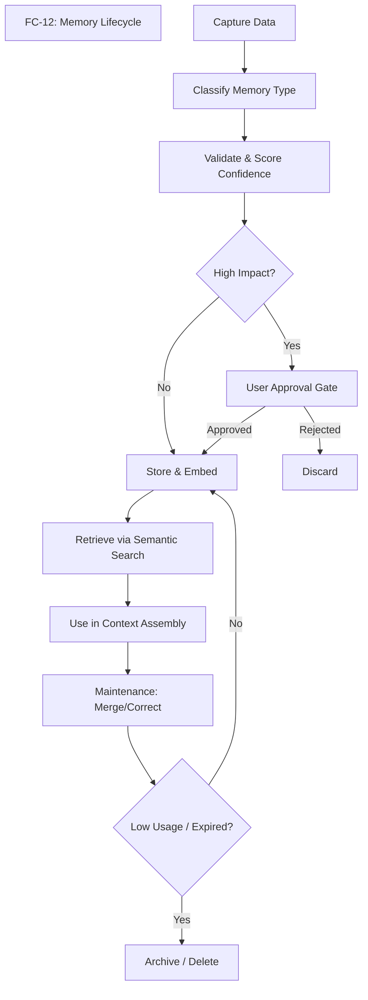

---

### FC-13 — Experience Learning

**ASCII:**
```text
+-------------------+      +-------------------+      +-------------------+
|  Execute Task     | ---> |  Record Actions   | ---> |  Observe Outcome  |
| (Tool calls)      |      | (Command traces)  |      | (Success/Failure) |
+-------------------+      +-------------------+      +---------+---------+
                                                                |
                                                                v
+-------------------+      +-------------------+      +-------------------+
| Extract Lesson    | <--- | Cause Analysis    | <--- | Review & Reflect  |
| (General rule)    |      | (Why did it happen)|     | (Supervisor LLM)  |
+---------+---------+      +-------------------+      +-------------------+
          |
          v
+-------------------+      +-------------------+
| Store Experience  | ---> | Apply in Future   |
| (Vector Database) |      | (Task Planning)   |
+-------------------+      +-------------------+
```

**Mermaid:**
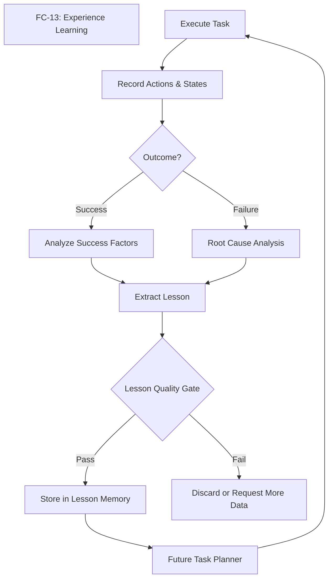

---

### FC-14 — Personal Knowledge / RAG

**ASCII:**
```text
+----------+   +-------------+   +------------+   +-----------------+
| Files In |-->| Extract Txt |-->| Clean Data |-->| Chunk (512 tks) |
+----------+   +-------------+   +------------+   +--------+--------+
                                                           |
                                                           v
+----------+   +-------------+   +------------+   +-----------------+
| Assembly |<--| Relevance   |<--| PG Vector  |<--| Embed (Ollama)  |
| (Prompt) |   | Filter      |   | Search     |   |                 |
+----+-----+   +-------------+   +------------+   +-----------------+
     |
     v
+----------+   +-------------+
| LLM Gen  |-->| Answer with |
|          |   | Provenance  |
+----------+   +-------------+
```

**Mermaid:**
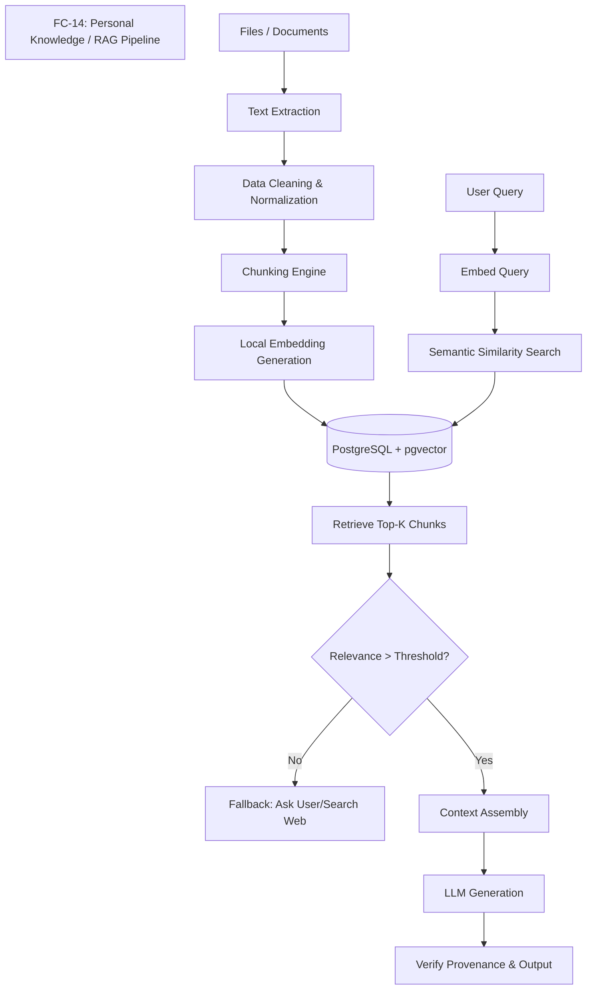

---

### FC-15 — Knowledge Boundary

**ASCII:**
```text
                       +-------------------+
                       |   Identify Query  |
                       +---------+---------+
                                 |
        +------------------------+------------------------+
        |                        |                        |
        v                        v                        v
+----------------+       +----------------+       +----------------+
|   User Fact    |       | Atles Inference|       | Model Knowledge|
| (Highest Conf) |       | (Med-High Conf)|       |  (Lowest Conf) |
+-------+--------+       +-------+--------+       +-------+--------+
        |                        |                        |
        v                        v                        v
+----------------+       +----------------+       +----------------+
| Answer Directly|       | Answer with    |       | Refuse / Offer |
| & Cite Source  |       | Qualification  |       | to Search Web  |
+----------------+       +----------------+       +----------------+
```

**Mermaid:**
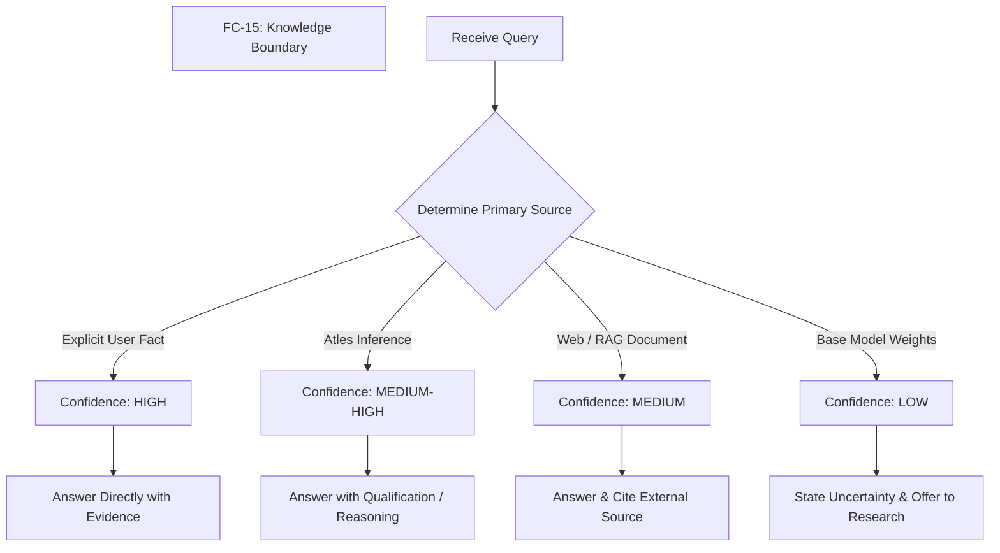

---

### FC-16 — Evidence and Confidence

**ASCII:**
```text
+-------------+     +----------------+     +---------------+
| Make Claim  | --> | Locate Source  | --> | Assess Quality|
| (Draft Ans) |     | (Memory/RAG)   |     | (Primary/Sec) |
+-------------+     +-------+--------+     +-------+-------+
                            |                      |
                            v                      v
+-------------+     +----------------+     +---------------+
| Final Score | <-- | Corroboration  | <-- | Date/Relevance|
| (0.0 - 1.0) |     | (Multiple src) |     | (Is it fresh?)|
+------+------+     +----------------+     +---------------+
       |
       v
+-------------+
| Output or   |
| Discard/Ask |
+-------------+
```

**Mermaid:**
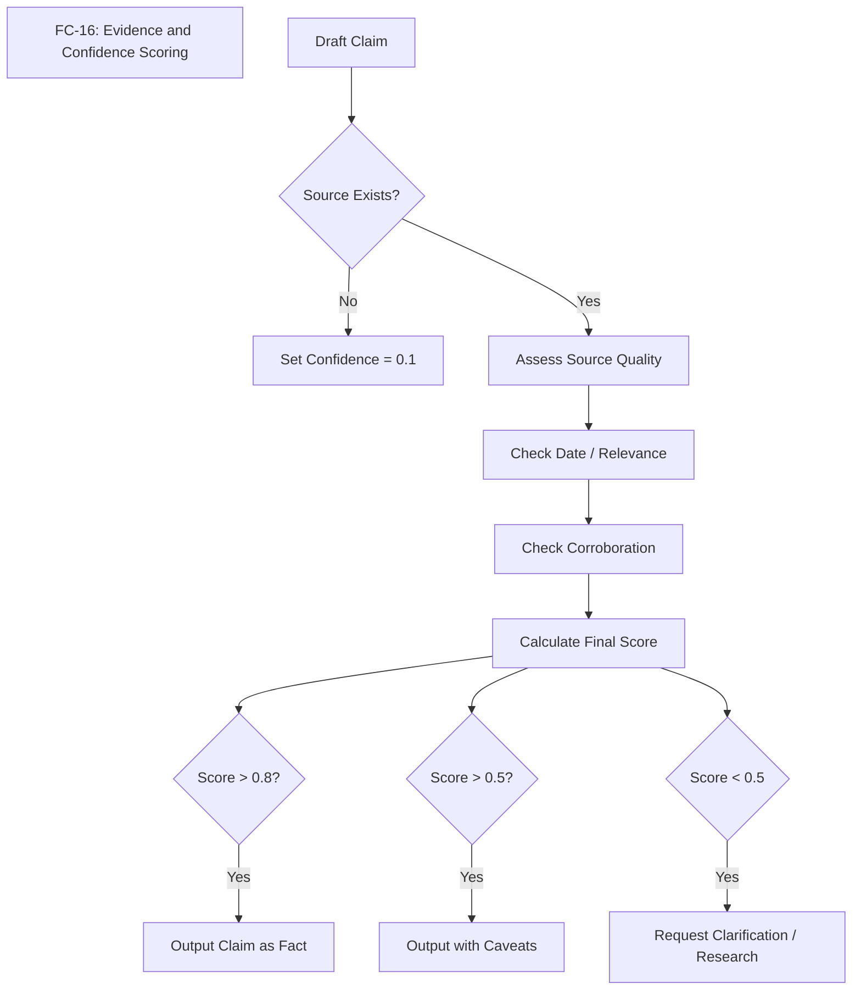

---

### FC-17 — Web Research

**ASCII:**
```text
+----------+   +----------+   +----------+   +-----------+
| Question |-->| Search   |-->| Fetch    |-->| Extract   |
| Received |   | Queries  |   | Sources  |   | Content   |
+----------+   +----------+   +----------+   +-----+-----+
                                                   |
                                                   v
+----------+   +----------+   +----------+   +-----------+
| Synthesize|<-| Resolve  |<--| Compare  |<--| Contradict|
| Answer   |   | Conflicts|   | Sources  |   | Detection |
+----+-----+   +----------+   +----------+   +-----------+
     |
     v
+----------+   +----------+
| Add to   |<--| Format   |
| Memory   |   | Citations|
| (Option) |   |          |
+----------+   +----------+
```

**Mermaid:**
```mermaid
flowchart TD
    title[FC-17: Web Research Workflow]
    
    A[Question Received] --> B[Generate Search Queries]
    B --> C[Execute Search (e.g., DuckDuckGo)]
    C --> D[Collect Top URLs]
    
    D --> E[Scrape / Extract Content]
    E --> F[Compare Extracted Facts]
    
    F --> G{Contradictions Found?}
    G -- Yes --> H[Prioritize High-Auth Sources / Verify]
    G -- No --> I[Synthesize Information]
    H --> I
    
    I --> J[Generate Final Answer]
    J --> K[Format Citations / Links]
    
    K --> L{Important Fact?}
    L -- Yes --> M[Save to Long-Term Memory]
    L -- No --> N[End Workflow]
```


---

## GROUP F — RESEARCH, TOOLS & COMPUTER CONTROL (STEPS 57–67)

## Step 57 — Web Research System

### Purpose
To enable Atles to gather information from the external internet when internal knowledge or base model knowledge is insufficient, outdated, or requires factual backing. This step allows the system to conduct multi-source research, synthesize findings, and provide citations for its claims.

### User-visible behavior
When a user asks a question about current events, specific documentation, or complex topics, Atles will indicate it is searching the web. It will return a synthesized answer that cites sources (e.g., [1], [2]) rather than hallucinating. The user can view the specific queries Atles used to find the information and the raw sources it consulted.

### System behavior
The orchestrator agent determines a research query is needed and delegates to a specialized Research Agent. The Research Agent formulates 1-3 search queries. It uses a search tool (e.g., DuckDuckGo, Serper API) to retrieve search results. It may then use a `read_website` tool to extract text from the top 2-3 pages. The agent compares the extracted information across sources, specifically looking for contradictions or corroborations. It synthesizes the findings into a coherent summary, citing the sources, and returns this to the orchestrator.

### Components
- **Research Agent**: Specialized sub-agent prompt for query formulation and synthesis.
- **Search Tool**: Integration with a web search API.
- **Web Reader Tool**: A tool to fetch and extract clean text from HTML pages (e.g., using BeautifulSoup or Trafilatura).
- **Orchestrator**: Decides when to trigger research and incorporates the results.

### Inputs and outputs

**Input to Research Agent:**
```json
{
  "topic": "Latest features in Next.js 16 App Router",
  "depth": "comprehensive",
  "max_sources": 3
}
```

**Output from Research Agent (ResearchResult Schema):**
```python
from pydantic import BaseModel
from typing import List, Optional

class Source(BaseModel):
    url: str
    title: str
    snippet: str
    trust_score: float # 0.0 to 1.0

class Contradiction(BaseModel):
    claim_a: str
    source_a_url: str
    claim_b: str
    source_b_url: str
    resolution_strategy: str

class ResearchResult(BaseModel):
    summary: str
    sources_used: List[Source]
    contradictions_found: List[Contradiction]
    unanswered_aspects: List[str]
```

### Data and memory
- **Read**: User query, existing context.
- **Stored**: The final `ResearchResult` is stored in short-term memory (conversation history). High-value facts may be extracted later into semantic memory.
- **Updated**: None directly.
- **Deliberately not stored**: Raw HTML of scraped websites is discarded after synthesis to save space.

### Dependencies
- Depends on: Step 24 (Agent Orchestration), Step 59 (Tool System).
- Required by: Step 68 (Long-term Fact Memory).

### Safety and privacy
- **Privacy Mode constraint**: If Atles is in "LOCAL ONLY" or "PRIVATE" mode, web research is blocked unless explicitly overridden.
- **Data leakage**: Search queries must not contain sensitive personal information (PII) or secrets. The Research Agent must be instructed to sanitize queries.
- **Execution limits**: Hard timeouts on web requests to prevent hanging.

### Implementation status
PLANNED

### Acceptance criteria
- [ ] Atles can successfully query a search API and retrieve links.
- [ ] Atles can scrape text from a standard article page.
- [ ] Atles synthesizes answers from at least two sources and includes inline citations.
- [ ] If two sources contradict, Atles explicitly mentions the contradiction in its response.
- [ ] Web search fails gracefully if the network is down or API limits are reached.

### Related flowcharts
- FC-12 (Sub-agent Orchestration)


## Step 58 — Source Verification

### Purpose
To ensure that the information gathered by Atles is reliable, up-to-date, and structurally sound. This prevents the system from confidently presenting outdated or biased information as fact, improving overall trustworthiness.

### User-visible behavior
When providing researched answers, Atles may append a "Confidence Level" or a "Verification Note". If a source seems dubious or outdated, Atles will explicitly warn the user (e.g., "Note: The only source for this is a forum post from 2019, so it may not be accurate for the current version.").

### System behavior
During the research phase (Step 57), after text is extracted from a source, it is passed through a Verification Module. This module uses a lightweight prompt to evaluate the source based on domain reputation (e.g., official docs vs. personal blog), publication date, and tone (objective vs. opinionated). The verification score influences how heavily the source is weighted in the final synthesis.

### Components
- **Verification Evaluator**: A prompt-based evaluation step within the Research Agent.
- **Domain Allowlist/Denylist**: A configuration file of highly trusted domains (e.g., `*.gov`, `*.edu`, `docs.microsoft.com`) and known unreliable domains.

### Inputs and outputs

**Input to Verification Evaluator:**
```json
{
  "url": "https://random-forum.com/thread/123",
  "content_snippet": "I think they removed that feature in v15.",
  "claim_to_verify": "Feature X was removed in v15."
}
```

**Output from Verification Evaluator (SourceEvaluation Schema):**
```python
from pydantic import BaseModel

class SourceEvaluation(BaseModel):
    relevance_score: int # 1-10
    recency_confidence: str # "high", "medium", "low", "unknown"
    source_type: str # "official_docs", "news", "forum", "blog", "unknown"
    potential_bias: str
    overall_reliability_score: float # 0.0 to 1.0
    limitations: str
```

### Data and memory
- **Read**: Extracted web content.
- **Stored**: The `overall_reliability_score` is attached to the source in the `ResearchResult`.
- **Updated**: None.
- **Deliberately not stored**: The intermediate reasoning for the evaluation is discarded.

### Dependencies
- Depends on: Step 57 (Web Research System).
- Required by: Step 68 (Long-term Fact Memory).

### Safety and privacy
- Evaluation must be objective and resilient to prompt injection attacks hidden in the scraped web content.

### Implementation status
PLANNED

### Acceptance criteria
- [ ] Official documentation links are consistently scored higher than forum posts.
- [ ] Outdated articles (e.g., > 3 years old for tech topics) are flagged with low recency confidence.
- [ ] The final response to the user reflects the uncertainty if only low-reliability sources are found.

### Related flowcharts
- FC-18 (Tool Registry and Invocation)


## Step 59 — Tool System

### Purpose
To define a standardized, secure architecture for Atles to interact with the environment through discrete capabilities (tools). This moves Atles from a passive text generator to an active agent that can read files, run commands, and control the computer.

### User-visible behavior
The user sees Atles state what actions it is taking ("I am searching your local files for 'database config'...", "I am running the test suite..."). Atles can manipulate the local file system and execute commands as if the user were doing it.

### System behavior
The Orchestrator agent has access to a Tool Registry. It generates a structured request to call a tool. The system intercepts this request, validates it against the tool's schema, checks permissions (Step 64), executes the underlying Python function, and returns the result to the agent's context.

### Components
- **Tool Registry**: A central dictionary of available tools.
- **Tool Executor**: The engine that safely runs the tool and handles timeouts/errors.
- **Tool Definitions**: Standardized interfaces for each capability.

### Inputs and outputs

**ToolDefinition Schema:**
```python
from pydantic import BaseModel
from typing import Dict, Any, Callable

class ToolDefinition(BaseModel):
    name: str
    description: str
    input_schema: Dict[str, Any] # JSON Schema definition
    output_schema: Dict[str, Any] # JSON Schema definition
    permission_category: str # e.g., "READ", "WRITE", "EXECUTE"
    risk_level: str # "low", "medium", "high"
    timeout_seconds: int
    
    # Internal executable function
    # func: Callable 
```

**Example Tool Definitions:**
1. **`read_file`**: Reads content of a file. Risk: Low. Perm: READ.
2. **`create_file`**: Writes new content. Risk: Medium. Perm: WRITE.
3. **`run_python`**: Executes a python script in a sandbox. Risk: High. Perm: EXECUTE.
4. **`search_files`**: Finds files by name/content. Risk: Low. Perm: READ.
5. **`open_browser`**: Opens a URL. Risk: Medium. Perm: NETWORK.

### Data and memory
- **Read**: Tool definitions, tool schemas.
- **Stored**: Tool execution results in context history.
- **Updated**: State of the local machine (if using WRITE/EXECUTE tools).
- **Deliberately not stored**: Massive tool outputs (e.g., a 10MB log file) are truncated before entering context memory.

### Dependencies
- Depends on: Step 24 (Agent Orchestration).
- Required by: Step 61 (File/Terminal Tools), Step 62 (Computer Control).

### Safety and privacy
- Tools are the primary vector for risk. Every tool must have a defined `risk_level` and `permission_category`.
- High-risk tools require explicit user confirmation (Step 64).

### Implementation status
PLANNED

### Acceptance criteria
- [ ] Atles can successfully list available tools.
- [ ] Atles can formulate a syntactically correct tool call.
- [ ] The system intercepts malformed tool calls and returns a schema error to the agent for correction.
- [ ] A tool exceeding its `timeout_seconds` is forcefully terminated.

### Related flowcharts
- FC-18 (Tool Registry and Invocation)


## Step 60 — Browser Automation

### Purpose
To allow Atles to interact with dynamic, JavaScript-heavy web applications that cannot be scraped with simple HTTP requests. This enables workflows like logging into services, navigating dashboards, or testing web apps.

### User-visible behavior
A visible browser window may open, and the user can watch Atles click links, type into fields, and navigate pages to complete a requested task. Alternatively, this can run headlessly.

### System behavior
Atles uses a tool that interfaces with Playwright. It can request actions like `navigate`, `click`, `fill`, and `extract_html`. The browser automation system handles waiting for elements to load, managing sessions, and taking screenshots of the viewport for visual verification.

### Components
- **Playwright Controller**: Python wrapper around Playwright.
- **Browser Automation Tools**: Exposes Playwright capabilities to the agent.
- **DOM Parser**: Simplifies HTML into a readable format for the agent (e.g., extracting accessibility trees or simplified markdown).

### Inputs and outputs

**BrowserAction Schema:**
```python
from pydantic import BaseModel
from typing import Optional

class BrowserAction(BaseModel):
    action_type: str # "navigate", "click", "fill", "read", "screenshot"
    target_url: Optional[str] = None
    selector: Optional[str] = None
    text_to_fill: Optional[str] = None
```

**Navigation Workflow:**
1. Agent calls `navigate(url)`.
2. System waits for page load.
3. System returns simplified DOM and a screenshot to the agent.
4. Agent identifies the login button and calls `click(selector="#login")`.

### Data and memory
- **Read**: Web page DOM, user credentials (if authorized).
- **Stored**: Screenshots (temporarily), session cookies (if persistence is requested).
- **Updated**: Web application state.
- **Deliberately not stored**: Passwords are never logged or stored in plain text.

### Dependencies
- Depends on: Step 59 (Tool System).
- Required by: Step 63 (Screen and Vision Integration).

### Safety and privacy
- **Safety constraints**: Browser automation must not interact with financial institutions or sensitive accounts without extreme, per-action confirmation.
- Sandboxed browser context prevents access to the user's primary browser cookies and history.

### Implementation status
FUTURE

### Acceptance criteria
- [ ] Atles can open a webpage using Playwright.
- [ ] Atles can locate a specific input field and type text into it.
- [ ] Atles can click a submit button and wait for the subsequent page to load.
- [ ] Errors (e.g., element not found) are returned cleanly to the agent.

### Related flowcharts
- FC-18 (Tool Registry and Invocation)


## Step 61 — File, Terminal, Git, API, and Python Tools

### Purpose
To equip Atles with the essential tools needed for software development and system administration, transforming it into a capable coding assistant and local workshop operator.

### User-visible behavior
The user can ask Atles to "create a new React component", "commit these changes", or "run the tests". Atles will execute the corresponding file edits, git commands, and terminal scripts to accomplish the task.

### System behavior
These tools wrap standard OS operations. 
- **File Tools**: Provide atomic reads and writes.
- **Terminal Tools**: Run shell commands in a specified working directory, capturing stdout and stderr.
- **Git Tools**: Provide structured interfaces to git commands to avoid terminal parsing errors.
- **Python Tools**: Allow the agent to write a quick script to process data or test logic, running it in a restricted environment.

### Components
- **File Operations Module**: `os`, `shutil`, `pathlib` wrappers.
- **Terminal Operations Module**: `subprocess` wrappers with strict timeouts and output limits.
- **Git Wrapper**: Integration with GitPython or simple CLI wrappers.

### Inputs and outputs

**Schemas:**
```python
from pydantic import BaseModel
from typing import List

class FileOperation(BaseModel):
    operation: str # "read", "write", "patch"
    filepath: str
    content: str = ""

class ShellCommand(BaseModel):
    command: str
    cwd: str
    timeout: int = 30

class GitOperation(BaseModel):
    command: str # "status", "commit", "push"
    args: List[str]
```

### Data and memory
- **Read**: Local files, git status.
- **Stored**: Modified files on disk.
- **Updated**: Local repository state.
- **Deliberately not stored**: Outputs of long-running terminal commands are truncated (e.g., last 100 lines) before entering the agent's memory.

### Dependencies
- Depends on: Step 59 (Tool System).
- Required by: Step 62 (Computer Control).

### Safety and privacy
- **Terminal tools** are incredibly dangerous (`rm -rf /`). Strict blocklists for commands.
- Shell commands should default to running without elevated privileges (no `sudo` unless explicitly requested and confirmed).

### Implementation status
PLANNED

### Acceptance criteria
- [ ] Agent can read a file, modify a specific function, and write it back.
- [ ] Agent can run `npm run test` and read the output.
- [ ] Agent can stage files and create a git commit with a generated message.
- [ ] Agent attempting to run a blocked command (e.g., `format c:`) is immediately denied.

### Related flowcharts
- FC-18 (Tool Registry and Invocation), FC-19 (Permission System)


## Step 62 — Computer Control

### Purpose
To provide a holistic framework for Atles to take open-ended actions on the user's computer, mimicking how a human operates a machine safely and methodically.

### User-visible behavior
When asked to perform a complex task (e.g., "Organize my downloads folder by file type"), Atles breaks down the steps, explains its plan, asks for permission, executes the moves, and reports the final status.

### System behavior
The Computer Control loop follows a strict pattern:
1. **OBSERVE**: Gather current state (list files, check current directory).
2. **UNDERSTAND**: Relate state to the goal.
3. **PLAN**: Draft a sequence of tools to use.
4. **PERMISSION**: Check if the plan requires user approval (Step 64).
5. **ACT**: Execute the tools.
6. **OBSERVE**: Check the results of the action.
7. **VERIFY**: Did the action achieve the intended step in the plan?
Safe failure paths ensure that if an action fails, Atles stops and asks for help rather than blindly continuing.

### Components
- **Control Loop Engine**: A state machine managing the OBSERVE-ACT-VERIFY cycle.
- **Planning Module**: Agent prompt structured for step-by-step breakdown.

### Inputs and outputs

**ComputerAction Schema:**
```python
from pydantic import BaseModel
from typing import List, Any

class ActionStep(BaseModel):
    step_number: int
    description: str
    tool_name: str
    tool_args: dict

class ComputerPlan(BaseModel):
    goal: str
    steps: List[ActionStep]
    estimated_risk: str
```

### Data and memory
- **Read**: System state via observation tools.
- **Stored**: The plan and execution logs.
- **Updated**: File system or application state.
- **Deliberately not stored**: N/A.

### Dependencies
- Depends on: Step 61 (File/Terminal Tools), Step 64 (Permission System).
- Required by: Step 67 (Safe Execution).

### Safety and privacy
- The VERIFY step is critical. If Atles expects a file to exist after moving it, and it doesn't, it must halt and trigger a safe recovery path or rollback.

### Implementation status
FUTURE

### Acceptance criteria
- [ ] Atles successfully executes a multi-step plan involving reading, creating, and moving files.
- [ ] If a step fails (e.g., target folder doesn't exist), Atles detects the failure and adjusts the plan or halts.
- [ ] Atles accurately assesses the overall risk of a multi-step plan.

### Related flowcharts
- FC-18 (Tool Registry and Invocation)


## Step 63 — Screen and Vision Integration

### Purpose
To allow Atles to "see" the computer screen, enabling interaction with GUI applications that do not have APIs or DOMs, and providing spatial awareness for desktop automation.

### User-visible behavior
Atles can answer questions like "What is open on my screen right now?" or "Click the red button in the app on the left."

### System behavior
This step requires a capable Vision-Language Model (VLM). The workflow is:
1. **Screenshot**: Capture the current display or specific window.
2. **Vision Model Processing**: Pass the image to the VLM with a prompt to identify UI elements or understand context.
3. **Target Detection**: Determine bounding boxes or coordinates for specific elements (e.g., "Find the coordinates of the 'Save' icon").
4. **Action Planning**: Decide on a mouse movement or click.
5. **Permission**: Request approval if required.
6. **Execution**: Use desktop automation tools (e.g., `pyautogui`) to move the mouse and click.
7. **Verification**: Take another screenshot to verify the UI state changed as expected.

### Components
- **Screen Capture Utility**: Uses OS-level APIs to grab screenshots.
- **Vision-Language Model (VLM)**: Requires an upgrade to the local model (e.g., LLaVA or a vision-capable Qwen variant).
- **Desktop Automation Library**: For simulating mouse and keyboard events.

### Inputs and outputs
- **Input**: User request + screenshot image array.
- **Output**: Agent determines `{"action": "click", "x": 450, "y": 300}`.

### Data and memory
- **Read**: Screen pixels.
- **Stored**: Screenshots may be kept temporarily in memory during the execution loop but should be discarded immediately after to preserve privacy and memory.
- **Updated**: GUI state.
- **Deliberately not stored**: Permanent retention of screenshots is strictly prohibited unless explicitly requested by the user for a specific artifact.

### Dependencies
- Depends on: Step 62 (Computer Control).
- Required by: Advanced GUI automation.

### Safety and privacy
- **High Privacy Risk**: Screenshots can capture passwords, private messages, or sensitive documents.
- **Requirement**: Vision processing MUST happen locally (LOCAL ONLY mode) unless the user explicitly grants temporary CLOUD ENABLED permission for a specific screenshot.

### Implementation status
FUTURE

### Acceptance criteria
- [ ] System can capture a screenshot and pass it to a local vision model.
- [ ] Vision model can accurately describe the dominant applications visible.
- [ ] System can calculate coordinates of a described UI element within a 5% margin of error.

### Related flowcharts
- FC-18 (Tool Registry and Invocation)


## Step 64 — Permission System

### Purpose
To establish a robust, categorical security boundary that prevents Atles from taking destructive or unauthorized actions, ensuring the user remains in control.

### User-visible behavior
When Atles attempts a risky action (like deleting a file or sending an email), the UI pauses and presents a clear prompt: "Atles wants to execute `rm -rf ./temp`. Allow? [Yes] [No] [Always allow for this folder]".

### System behavior
Every tool is mapped to a permission category. When a tool is invoked, the Permission System checks:
1. What category is this?
2. What is the scope? (e.g., `WRITE` to `C:\atles\docs` vs `WRITE` to `C:\Windows`).
3. Does the agent have pre-approved standing permission for this category and scope?
4. If not, pause execution, queue a user approval request, and wait.

### Components
- **Permission Gatekeeper**: Middleware that intercepts tool calls.
- **Permission Rules Engine**: Evaluates scope and existing grants.
- **Approval UI**: Frontend component to display pending requests.

### Inputs and outputs

**PermissionRequest Schema:**
```python
from pydantic import BaseModel
from typing import Optional

class PermissionRequest(BaseModel):
    tool_name: str
    category: str # "READ", "WRITE", "EXECUTE", "DELETE", "NETWORK", "INSTALL", "SEND", "PUBLISH"
    scope: str # e.g., filepath, URL, command
    risk_level: str
    rationale: str
```

**Risk Classification Table:**

| Category | Example Action | Risk Level | Default Rule |
| :--- | :--- | :--- | :--- |
| **READ** | Read local workspace file | Low | Auto-allow in workspace |
| **READ** | Read system file (`/etc/passwd`) | Medium | Require approval |
| **WRITE** | Create file in workspace | Low | Auto-allow |
| **EXECUTE**| Run `npm test` | Medium | Require approval (or session grant) |
| **DELETE** | Delete file | High | Require approval |
| **NETWORK**| Fetch API data | Medium | Require approval based on domain |
| **INSTALL**| `pip install x` | High | Require approval |
| **SEND** | Send email/message | High | ALWAYS Require approval |
| **PUBLISH**| `git push`, post to social | Critical | ALWAYS Require approval |

### Data and memory
- **Read**: Permission rules, current user session grants.
- **Stored**: Granted permissions (until revoked or session ends).
- **Updated**: Audit log of permission decisions.
- **Deliberately not stored**: N/A.

### Dependencies
- Depends on: Step 59 (Tool System).
- Required by: Step 67 (Safe Execution).

### Safety and privacy
- This is the core safety mechanism. Fail-closed architecture: if a rule is missing or errors out, permission is DENIED.

### Implementation status
PLANNED

### Acceptance criteria
- [ ] Tools categorized as LOW risk execute without prompting.
- [ ] Tools categorized as HIGH risk pause and require explicit user input via the frontend.
- [ ] Denying a permission cleanly halts the agent's current plan and informs the agent of the denial.

### Related flowcharts
- FC-19 (Permission System)


## Step 65 — Undo and Rollback

### Purpose
To mitigate the impact of mistakes made by the agent. Since Atles operates autonomously, it needs the ability to revert changes if verification fails or the user rejects the outcome.

### User-visible behavior
If Atles modifies a code file and breaks the build, it can automatically revert the file to its previous state. The user can also click an "Undo Last Action" button in the UI for supported actions.

### System behavior
Before a `WRITE`, `DELETE`, or `EXECUTE` action that modifies state, the system creates a lightweight checkpoint. 
- For files: A copy of the file is saved to a temporary snapshot directory.
- For Git: A temporary branch or stash might be used.
If the agent detects a failure, or the user requests a rollback, the system restores the state from the checkpoint.

### Components
- **Checkpoint Manager**: Creates and stores pre-action snapshots.
- **Rollback Executor**: Reverses specific actions based on the checkpoint data.

### Inputs and outputs

**Schemas:**
```python
from pydantic import BaseModel
from typing import Any

class Checkpoint(BaseModel):
    checkpoint_id: str
    action_type: str # "file_modify", "file_delete"
    target: str
    original_state: Any # e.g., file contents
    timestamp: str

class RollbackRequest(BaseModel):
    checkpoint_id: str
    reason: str
```

### Data and memory
- **Read**: Original state before modification.
- **Stored**: Snapshots of files/data in a `.atles/checkpoints` directory.
- **Updated**: Restores file system state upon rollback.
- **Deliberately not stored**: Checkpoints are ephemeral and cleared out periodically (e.g., older than 24 hours).

### Dependencies
- Depends on: Step 61 (File Tools).
- Required by: Step 67 (Safe Execution).

### Safety and privacy
- **Disclaimer**: Never promise every action can be undone. Sending an email, pushing to a remote repo, or running certain irreversible terminal commands cannot be reliably rolled back. The system must know which actions are irreversible and flag them with higher permission requirements.

### Implementation status
PLANNED

### Acceptance criteria
- [ ] System automatically saves a copy of a file before overwriting it.
- [ ] System successfully restores the file if a rollback is triggered.
- [ ] Irreversible actions are clearly identified and skip the checkpoint process, requiring explicit user confirmation instead.

### Related flowcharts
- FC-20 (Undo and Rollback)


## Step 66 — Audit Log

### Purpose
To provide complete transparency into what Atles is doing, has done, and why. This is crucial for debugging, security review, and building user trust.

### User-visible behavior
The user can view a structured timeline or table showing every tool Atles executed, the permission granted, the outcome, and any errors.

### System behavior
Every significant event in the agent loop (planning, tool invocation, permission decision, tool execution result) generates an immutable log entry. These entries are written to a structured JSONL file or local database table.

### Components
- **Audit Logger**: Middleware that listens to events across the system.
- **Log Viewer**: Frontend interface to filter and search logs.

### Inputs and outputs

**AuditLogEntry Schema:**
```python
from pydantic import BaseModel
from typing import Optional, Dict, Any

class AuditLogEntry(BaseModel):
    timestamp: str
    session_id: str
    agent_name: str
    action_type: str # "plan", "tool_call", "permission_grant", "error"
    target: str # What was acted upon
    details: Dict[str, Any] # Inputs/Outputs, excluding secrets
    status: str # "success", "denied", "failed", "rolled_back"
```

### Data and memory
- **Read**: System events.
- **Stored**: Append-only log file on disk.
- **Updated**: Log file is appended.
- **Deliberately not stored**: Passwords, API keys, and sensitive environment variables MUST be redacted before logging.

### Dependencies
- Depends on: Step 24 (Agent Orchestration), Step 59 (Tool System), Step 64 (Permission System).
- Required by: System administration and debugging.

### Safety and privacy
- **Secret redaction** is paramount. The logger must use regex or specific field exclusion to ensure credentials never enter the audit log.

### Implementation status
PLANNED

### Acceptance criteria
- [ ] Every executed tool generates an audit log entry.
- [ ] Permission denials are logged.
- [ ] Known dummy secrets (e.g., `sk-12345...`) passed into a tool are redacted in the log output (e.g., `sk-***`).

### Related flowcharts
- FC-21 (Audit Trail)


## Step 67 — Safe Computer-Agent Execution

### Purpose
To integrate tools, permissions, computer control, vision, rollback, and auditing into a cohesive, safe execution environment. This is the master loop that makes Atles a reliable operator.

### User-visible behavior
Atles performs complex tasks reliably. If it gets stuck, it stops and asks. If it makes a dangerous move, it asks for permission. If it breaks something locally, it rolls it back. The user feels entirely in control of an autonomous system.

### System behavior
This step defines the integration wiring. The Orchestrator proposes a plan. The Control Loop picks up the first step. It maps the step to a Tool. The Permission System checks it. The Checkpoint system backs up the target. The Tool executes. The result is Audited. The Control Loop Verifies. If verification fails, Rollback is triggered. If it succeeds, it moves to the next step.

### Components
- **Integration Engine**: The master controller tying Steps 59-66 together.

### Inputs and outputs
- Relies on the schemas defined in Steps 59-66.

### Data and memory
- Integrates all data flows from the component steps.

### Dependencies
- Depends on: Steps 59, 60, 61, 62, 63, 64, 65, 66.
- Required by: Future advanced autonomous capabilities.

### Safety and privacy
- This step acts as the final safety net, ensuring no individual component bypasses the security or privacy controls.

### Implementation status
FUTURE

### Acceptance criteria
- [ ] A complex, multi-tool task correctly traverses the entire pipeline: Plan -> Checkpoint -> Permission -> Execute -> Verify -> Audit.
- [ ] An interruption (user clicks "Stop") cleanly halts execution, rolls back in-progress risky changes, and logs the interruption.

### Related flowcharts
- FC-18, FC-19, FC-20, FC-21


## FLOWCHARTS

### FC-18 — Tool Registry and Invocation

```text
+-------------------+       +---------------------+       +-----------------------+
|  Agent Orchestrator| ----> |  Tool Registry /    | ----> |  Schema Validation    |
|  (Proposes Action)|       |  Lookup             |       |  (Check Inputs)       |
+-------------------+       +---------------------+       +-----------------------+
                                                                     |
                                                                     v
                                                          +-----------------------+
                                                          |  Permission Gate      |
                                                          |  (FC-19)              |
                                                          +-----------------------+
                                                                     | (Allowed)
                                                                     v
+-------------------+       +---------------------+       +-----------------------+
|  Return Result to | <---- |  Audit Logging      | <---- |  Tool Execution       |
|  Agent Context    |       |  (FC-21)            |       |  (Run Python/Shell)   |
+-------------------+       +---------------------+       +-----------------------+
                                                                     | (Error)
                                                                     v
                                                          +-----------------------+
                                                          |  Error Handler /      |
                                                          |  Format for Agent     |
                                                          +-----------------------+
```

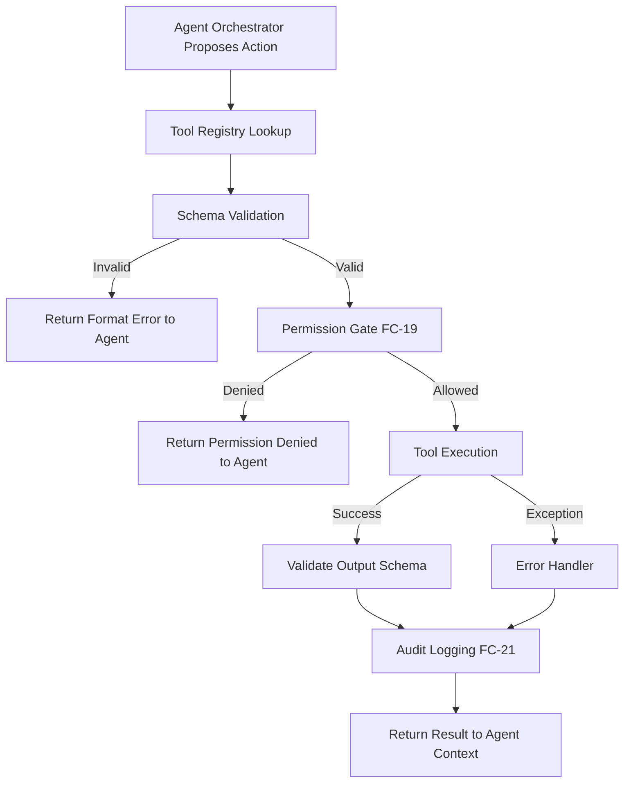

### FC-19 — Permission System

```text
+-------------------+
|  Proposed Action  |
|  (Tool + Args)    |
+-------------------+
          |
          v
+-------------------+       +-------------------+       +-------------------+
| Classify Category | ----> |  Assess Scope &   | ----> | Check Existing    |
| (READ, WRITE...)  |       |  Risk Level       |       | Session Grants    |
+-------------------+       +-------------------+       +-------------------+
                                                              |
          +-----------------------+-----------------------+---+
          |                       |                       |
          v                       v                       v
+-------------------+   +-------------------+   +-------------------+
|  Auto-Allow       |   |  Require Approval |   |  Block / Deny     |
|  (Low Risk)       |   |  (Medium/High)    |   |  (Critical Risk)  |
+-------------------+   +-------------------+   +-------------------+
          |                       |                       |
          |               +-------v-------+               |
          |               |  User Prompt  |               |
          |               |  (UI Pause)   |               |
          |               +-------+-------+               |
          |                       |                       |
          |                 [Approve] [Deny]              |
          |                       |                       |
          +-----------------------+-----------------------+
                                  |
                                  v
                        +-------------------+
                        |  Execute if       |
                        |  Allowed / Log    |
                        +-------------------+
```

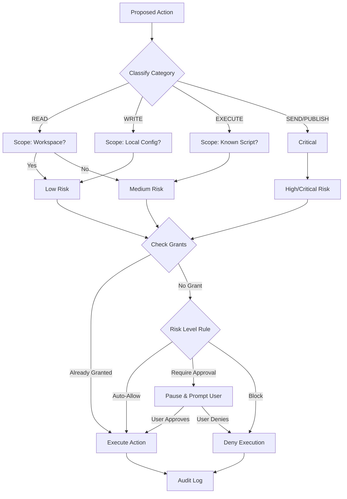

### FC-20 — Undo and Rollback

```text
+-------------------+       +-------------------+       +-------------------+
|  Proposed Change  | ----> | Checkpoint Auth   | ----> | Create Snapshot   |
|  (e.g., File Edit)|       | (Is Reversible?)  |       | (Temp File/Stash) |
+-------------------+       +-------------------+       +-------------------+
                                                              |
                                                              v
+-------------------+       +-------------------+       +-------------------+
| Verify Outcome    | <---- | Execute Action    | <---- | Proceed with      |
| (Self-check/User) |       | (Modify State)    |       | Permission (FC-19)|
+-------------------+       +-------------------+       +-------------------+
          |
    +-----+-----+
    |           |
    v           v
[Success]   [Failure /
             Reject]
    |           |
    v           v
[Keep State] [Trigger Rollback]
    |           |
    v           v
[Clear Snap] [Restore from Snapshot]
    |           |
    +-----+-----+
          |
          v
    [Audit Log]
```

```mermaid
graph TD
    A[Proposed Change] --> B{Is Reversible?}
    B -->|No| C[Flag as Irreversible/Confirm]
    B -->|Yes| D[Create Pre-Action Snapshot]
    
    C --> E[Execute Action]
    D --> E
    
    E --> F{Verify Outcome}
    
    F -->|Success| G[Keep New State]
    G --> H[Clear Snapshot]
    
    F -->|Failure/User Rejects| I[Trigger Rollback]
    I --> J[Restore State from Snapshot]
    
    H --> K[Audit Log]
    J --> K
```

### FC-21 — Audit Trail

```text
[User Request] --> [Plan Generated] --> [Agent Selected]
                                              |
                                              v
[Result / Error] <--- [Action Executed] <--- [Permission Evaluated] <--- [Tool Selected]
       |
       v
[Rollback if needed]
       |
       v
[Format Log Entry] --> [Scrub Secrets (Regex)] --> [Write to Append-Only JSONL]
```

```mermaid
graph LR
    A[User Request] --> B[Plan]
    B --> C[Agent]
    C --> D[Tool Invocation]
    D --> E[Permission Decision]
    E --> F[Execution Result/Error]
    F --> G[Rollback Event]
    
    G --> H[Format Log Entry]
    H --> I[Secret Redaction Scrubbing]
    I --> J[(Immutable Audit Log File)]
```

## REQUIRED SECURITY MODEL

Design safety from the beginning:

- **Permission Categories**: Actions are strictly typed into categories: `READ`, `WRITE`, `EXECUTE`, `DELETE`, `NETWORK`, `INSTALL`, `SEND`, `PUBLISH`.
- **Risk Handling**: 
  - **Scope**: Local workspace vs. global system.
  - **Reversibility**: Can the action be undone?
  - **Sensitivity**: Does it touch secrets or private data?
  - **Impact**: Could it break the system?
  - **Resources**: High CPU/Memory usage tools.
  - **Permission & Confirmation**: Rules engine dictates if an action is auto-allowed or requires explicit human confirmation.
  - **Audit**: Every decision is logged.
- **High-Impact Actions**: Any action involving `DELETE`, `INSTALL`, `SEND`, or `PUBLISH`, or accessing global system files, requires explicit, blocking user confirmation.
- **Rollback Design**: State-modifying actions create a temporary snapshot before execution. If the action fails verification or the user rejects it, the system restores from the snapshot.
- **Secrets Handling**: Secrets (API keys, passwords) must NEVER be stored in source code, NEVER be printed to logs, and NEVER be kept in plaintext. Use secure environment variables or an OS-level secret store, and implement active regex scrubbing in the audit logger.

## REQUIRED PRIVACY DESIGN

Four privacy modes with detailed comparison:

1. **LOCAL ONLY**: Maximum privacy. Uses only the local model (e.g., Ollama). No external network requests are allowed by the agent. All tools operate entirely offline.
2. **PRIVATE**: Local-first. Uses the local model, but allows narrowly defined external connections (e.g., fetching a specific API, checking for package updates). Network access is strictly scoped.
3. **WEB ENABLED**: Uses the local model but grants the agent access to perform Web Research (Step 57). Source tracking is mandatory. The agent can search the web but cannot send user data externally.
4. **CLOUD ENABLED**: Allows the use of remote API models (e.g., OpenAI, Anthropic) for complex reasoning, under explicit configuration. Requires user consent for data to leave the machine.

**Privacy Mode Comparison:**

| Feature | LOCAL ONLY | PRIVATE | WEB ENABLED | CLOUD ENABLED |
| :--- | :--- | :--- | :--- | :--- |
| **Allowed Models** | Local only | Local only | Local only | Remote APIs |
| **Allowed Tools** | Offline only | Whitelisted Network | Web Search + Offline | All permitted |
| **Network Access** | Blocked | Scoped | Research only | Open |
| **File Access** | Full local | Full local | Full local | Full local |
| **External Data Sent** | None | API queries only | Search queries only | Prompts, context, files |
| **Logging** | Local only | Local only | Local only | Local only |
| **User Control** | Default | Opt-in | Opt-in | Explicit API Key |
| **Violation Handling**| Block & Alert | Block & Alert | Block & Alert | Audit |


---

## GROUP G — TASKS, GOALS & PROACTIVE SYSTEM (STEPS 68–76)

### Step 68 — Task State and Resume

#### Purpose
Enables Atles to persist the execution state of complex tasks, allowing for recovery from interruptions, system crashes, or intentional pauses. This provides resilience and ensures continuity without losing computational effort.

#### User-visible behavior
Users can interrupt Atles mid-task and say "Pause that, do this instead." Later, they can say "Resume what you were doing." If Atles crashes, upon restarting, it says "I was in the middle of X, resuming now."

#### System behavior
The orchestrator logs a `TaskState` object to local storage at key checkpoints (before and after tool execution, agent handoffs). When resuming, it deserializes the state, restores the agent's memory window (context), and resumes the exact next action.

#### Components
Task Manager Service, SQLite Database, Orchestrator Agent.

#### Inputs and outputs
**Input (Pause Request):** User says "Stop for a bit."
**Output:** "Task 'Scraping Docs' paused at 45%."

#### Data and memory
- **Read:** Previous task checkpoints.
- **Stored:** Execution graphs, variable states, intermediate outputs.
- **Updated:** Task status (`PAUSED`, `RESUMED`, `COMPLETED`).

```python
from pydantic import BaseModel
from typing import List, Dict, Any, Optional

class TaskState(BaseModel):
    task_id: str
    goal: str
    status: str
    steps: List[str]
    errors: List[str]
    active_agents: List[str]
    tools_invoked: List[str]
    checkpoint_data: Dict[str, Any]
    next_action: Optional[str]
```

#### Dependencies
Depends on: Core Orchestrator. Required by: Long-Running Tasks.

#### Safety and privacy
Checkpoints may store sensitive tool output. All state is strictly local.

#### Implementation status
PLANNED

#### Acceptance criteria
- [ ] System successfully pauses an active loop.
- [ ] System restores state from JSON checkpoint and continues.

#### Related flowcharts
FC-22

---

### Step 69 — Goal Hierarchy

#### Purpose
Structures user requests from high-level aspirations down to executable code. This prevents Atles from losing track of the "big picture" during granular operations.

#### User-visible behavior
Users can view a dashboard or ask "What's the status of Project X?" and see a tree of milestones, tasks, and atomic actions.

#### System behavior
When given a complex goal, Atles' reasoning layer decomposes it: GOAL → PROJECT → MILESTONE → TASK → ACTION → RESULT. These entities are tracked relationally.

#### Components
Goal Planner Agent, Persistence Layer (SQLite).

#### Inputs and outputs
**Input:** "Build a personal website."
**Output:** A structured project plan with milestones (Design, Backend, Frontend).

#### Data and memory
- **Stored:** Relational mapping of goals to sub-tasks.

```python
from pydantic import BaseModel
from typing import List

class Action(BaseModel):
    action_id: str
    tool_name: str
    status: str

class Task(BaseModel):
    task_id: str
    actions: List[Action]

class Milestone(BaseModel):
    milestone_id: str
    tasks: List[Task]

class Project(BaseModel):
    project_id: str
    milestones: List[Milestone]

class Goal(BaseModel):
    goal_id: str
    projects: List[Project]
```

#### Dependencies
Depends on: Task State (Step 68).

#### Safety and privacy
User's long-term goals are kept strictly local in the Atles Brain.

#### Implementation status
PLANNED

#### Acceptance criteria
- [ ] A top-level goal can be decomposed into at least 3 layers of hierarchy.
- [ ] Completing all child actions automatically marks the parent task as completed.

#### Related flowcharts
FC-23

---

### Step 70 — Calendar and Deadlines

#### Purpose
Gives Atles an understanding of time, allowing it to schedule tasks, set reminders, and prioritize work based on external temporal constraints.

#### User-visible behavior
Users can say "Remind me to check the server logs tomorrow at 9 AM," or "This feature is due Friday." Atles manages its own background execution to meet the deadline.

#### System behavior
Atles normalizes natural language dates to UTC, creates a scheduled trigger, and monitors the system clock. For external integrations (Google Calendar), this is marked as a FUTURE capability.

#### Components
Time Service, Background Scheduler, Trigger Engine.

#### Inputs and outputs
**Input:** "Schedule a backup for midnight."
**Output:** A scheduled task object added to the cron queue.

#### Data and memory
- **Stored:** Temporal events and cron definitions.

```python
from pydantic import BaseModel
from datetime import datetime
from typing import Optional

class CalendarEvent(BaseModel):
    event_id: str
    title: str
    start_time: datetime
    end_time: Optional[datetime]
    external_sync: bool = False

class Deadline(BaseModel):
    target_id: str
    due_date: datetime
    hard_deadline: bool
```

#### Dependencies
Depends on: Trigger System (Step 71).

#### Safety and privacy
Local scheduling only. No external calendar sync initially to avoid API exposure.

#### Implementation status
FUTURE

#### Acceptance criteria
- [ ] Task triggers accurately at the specified local time.
- [ ] Deadlines alter task prioritization in the Orchestrator queue.

#### Related flowcharts
FC-24

---

### Step 71 — Trigger System

#### Purpose
Allows Atles to operate reactively based on events (time, task state changes, system errors) rather than solely on direct user prompting.

#### User-visible behavior
Atles automatically sends a notification when a background compile fails or when a specific condition is met (e.g., disk space > 90%).

#### System behavior
A background event loop evaluates active `TriggerDefinition` schemas against the current system state. When conditions are met, it dispatches an event to the relevant agent.

#### Components
Event Bus, Trigger Evaluator.

#### Inputs and outputs
**Event:** Disk space threshold reached.
**Output:** System alert message pushed to user UI.

#### Data and memory
- **Read:** System state, task states.
- **Stored:** Active triggers.

```python
from pydantic import BaseModel
from typing import Dict, Any

class TriggerDefinition(BaseModel):
    trigger_id: str
    type: str # time, condition, state_change
    condition_logic: str
    action_payload: Dict[str, Any]
    is_active: bool
```

#### Dependencies
Depends on: Task Manager.

#### Safety and privacy
Triggers cannot execute unauthorized OS commands; they only wake up authorized agents.

#### Implementation status
PLANNED

#### Acceptance criteria
- [ ] State-change trigger fires when a target task completes.
- [ ] Time-based trigger fires accurately.

#### Related flowcharts
FC-25

---

### Step 72 — Proactive Intelligence

#### Purpose
Transitions Atles from a passive answering machine to a proactive assistant that observes context and offers help before being explicitly asked.

#### User-visible behavior
If the user repeatedly fails a git push, Atles might chime in: "I noticed you're having merge conflicts. Want me to resolve them?"

#### System behavior
A background observer agent periodically reviews the current active workspace, recent command failures, and goal states. It generates a `ProactiveInsight`, evaluates its importance, and pushes a suggestion if the score is high enough.

#### Components
Observer Agent, Orchestrator, Interruption Policy Engine.

#### Inputs and outputs
**Input:** 3 consecutive `git status` commands with no resolution.
**Output:** Proactive prompt in the UI.

#### Data and memory
- **Read:** Terminal history, active file state.

```python
from pydantic import BaseModel

class ProactiveInsight(BaseModel):
    insight_id: str
    observation: str
    suggested_action: str
    confidence: float
    importance_score: float
```

#### Dependencies
Depends on: Trigger System (Step 71), Interruption Threshold (Step 73).

#### Safety and privacy
Observes only permitted workspace directories. Never observes generic OS usage outside the developer environment.

#### Implementation status
PLANNED

#### Acceptance criteria
- [ ] Observer detects a repeated error and formats a valid suggestion.
- [ ] Suggestion is suppressed if importance score is too low.

#### Related flowcharts
FC-25

---

### Step 73 — Interruption Threshold

#### Purpose
Prevents Atles from being annoying. It governs when the proactive system is allowed to send a notification or interrupt the user.

#### User-visible behavior
During deep work (focus mode), Atles suppresses non-critical notifications. Urgent errors (e.g., server crash) still bypass the filter.

#### System behavior
Scores incoming alerts based on urgency, relevance to current tasks, and user preference state (quiet hours).

#### Components
Notification Router, User Preference Store.

#### Inputs and outputs
**Input:** `ProactiveInsight` with importance 0.4.
**Output:** Queued to "Daily Summary", user not interrupted.

#### Data and memory
- **Stored:** User preferences for interruption.

```python
from pydantic import BaseModel
from typing import List

class InterruptionPolicy(BaseModel):
    policy_id: str
    focus_mode_active: bool
    allowed_categories: List[str]
    min_urgency_score: float
```

#### Dependencies
Depends on: Proactive Intelligence (Step 72).

#### Safety and privacy
No direct privacy concerns; purely UX filtering.

#### Implementation status
PLANNED

#### Acceptance criteria
- [ ] Low urgency alerts are queued when focus mode is active.
- [ ] High urgency alerts bypass focus mode.

#### Related flowcharts
FC-26

---

### Step 74 — Long-Running Tasks

#### Purpose
Handles tasks that take minutes or hours (e.g., scraping, large code refactors) without blocking the main interaction thread.

#### User-visible behavior
User asks for a massive refactor. Atles says "Starting this in the background. I'll let you know when it's done." User can continue chatting normally.

#### System behavior
Forks the orchestrator logic into a background worker. Regularly writes progress to the `TaskState` DB. Communicates via WebSockets to the UI for progress bars.

#### Components
Background Worker Pool, WebSocket Server.

#### Inputs and outputs
**Input:** Execution request for heavy task.
**Output:** Task ID and instant release of the chat lock.

#### Data and memory
- **Updated:** Incremental progress markers.

```python
from pydantic import BaseModel

class LongRunningTask(BaseModel):
    task_id: str
    progress_percentage: int
    current_action: str
    is_background: bool
```

#### Dependencies
Depends on: Task State (Step 68).

#### Safety and privacy
Background tasks operate strictly within assigned sandboxes.

#### Implementation status
PLANNED

#### Acceptance criteria
- [ ] User can initiate a 5-minute mock task and immediately ask another question in the chat UI.
- [ ] UI receives async progress updates.

#### Related flowcharts
FC-22

---

### Step 75 — Status Commands

#### Purpose
Provides the user with immediate observability into the system's "mind" and current queue.

#### User-visible behavior
User asks: "What are you doing?" Atles replies with a structured summary of active tasks, background workers, and next steps.

#### System behavior
An intent router catches status-related queries and bypasses standard LLM reasoning, instead querying the task DB and formatting a structured status report.

#### Components
Intent Router, DB Querier.

#### Inputs and outputs
**Input:** "What is running?"
**Output:** "Background task 1: Refactoring API (40%). Active chat focus: UI design."

#### Data and memory
- **Read:** `TaskState` and `LongRunningTask` records.

```python
from pydantic import BaseModel
from typing import List

class StatusResponse(BaseModel):
    active_tasks: List[str]
    recent_errors: List[str]
    system_health: str
```

#### Dependencies
Depends on: Task State (Step 68).

#### Safety and privacy
Ensures only the authorized user can view system internal state.

#### Implementation status
PLANNED

#### Acceptance criteria
- [ ] Typing "status" directly returns the active task queue.

#### Related flowcharts
FC-28

---

### Step 76 — Task and Goal Integration

#### Purpose
Wires together Steps 68-75 into a unified execution loop where goals inform tasks, tasks run in the background, progress is monitored, and proactive alerts are generated safely.

#### User-visible behavior
A cohesive experience where a user defines a big project, Atles schedules it, runs chunks in the background, alerts on failure, and resumes seamlessly after a reboot.

#### System behavior
The core Orchestrator is updated to natively check triggers, update goal hierarchies, and respect interruption policies on every tick of its reasoning loop.

#### Components
Core System Orchestrator.

#### Implementation status
PLANNED

#### Acceptance criteria
- [ ] End-to-end test from Goal creation to Background execution to Proactive alerting passes.

#### Related flowcharts
FC-23, FC-25, FC-26, FC-28

---

## GROUP H — LEARNING, SKILLS & MODEL SYSTEM (STEPS 77–85)

### Step 77 — Self-Reflection and Evaluation

#### Purpose
Ensures Atles verifies its own work before presenting it to the user. Prevents hallucinated code from being executed blindly.

#### User-visible behavior
Atles generates code, runs a linter internally, catches its own error, fixes it, and only shows the user the working final version.

#### System behavior
A secondary "Critic" agent reviews the output of the "Actor" agent against a strict criteria checklist (correctness, security, exact requirements).

#### Components
Critic Agent, Evaluation Engine.

#### Inputs and outputs
**Input:** Proposed code block.
**Output:** Pass/Fail boolean and list of necessary corrections.

#### Data and memory
- **Stored:** Evaluation logs for future skill discovery.

```python
from pydantic import BaseModel
from typing import List

class EvaluationResult(BaseModel):
    target_task_id: str
    passed: bool
    errors_found: List[str]
    security_flags: List[str]
```

#### Dependencies
Required by: Controlled Self-Learning (Step 81).

#### Safety and privacy
Critical for preventing accidental execution of `rm -rf` or exposing secrets.

#### Implementation status
PLANNED

#### Acceptance criteria
- [ ] Critic agent successfully rejects a script containing an infinite loop.

#### Related flowcharts
FC-29

---

### Step 78 — Skill Discovery

#### Purpose
Allows the system to realize when it is performing the same multi-step task repeatedly, flagging it as a candidate for a reusable macro (Skill).

#### User-visible behavior
"I noticed I've set up a Next.js app for you 3 times this week using the same steps. Should I save this as a 'InitNextApp' skill?"

#### System behavior
A background analytics job mines the `TaskState` history for repeated identical graph executions and proposes a `SkillCandidate`.

#### Components
Data Miner, Memory Analytics.

#### Data and memory
- **Read:** Task history.
- **Stored:** Skill candidates.

```python
from pydantic import BaseModel

class SkillCandidate(BaseModel):
    pattern_id: str
    frequency: int
    proposed_name: str
    workflow_steps: list[str]
```

#### Implementation status
FUTURE

#### Acceptance criteria
- [ ] System detects 3 identical command sequences and generates a SkillCandidate.

#### Related flowcharts
FC-30

---

### Step 79 — Skill Creation and Lifecycle

#### Purpose
Formalizes a discovered skill into an executable, version-controlled module that the Orchestrator can use like a standard tool.

#### System behavior
Converts the candidate into a strict JSON-schema defined tool. Goes through evaluation, user approval, and is stored in the Skill Library.

```python
from pydantic import BaseModel
from typing import Dict, Any

class SkillDefinition(BaseModel):
    skill_id: str
    version: str
    description: str
    inputs: Dict[str, Any]
    steps: list[str]
    approved_by_user: bool
```

#### Implementation status
FUTURE

#### Related flowcharts
FC-30, FC-31

---

### Step 80 — Skill Library

#### Purpose
A centralized repository for all learned and manually defined skills, making them searchable for the Orchestrator during tool selection.

#### System behavior
Indexes skills via embeddings for semantic search. The Orchestrator queries this library before falling back to generic shell commands.

#### Implementation status
FUTURE

#### Acceptance criteria
- [ ] Orchestrator successfully retrieves "InitNextApp" from the library using a semantic query.

#### Related flowcharts
FC-31

---

### Step 81 — Controlled Self-Learning

#### Purpose
Creates a closed loop where Atles gets better at its environment without dangerous unsupervised model-weight training.

#### System behavior
EXPERIENCE → EVALUATION → LESSON → MEMORY → FUTURE BEHAVIOR.
This relies entirely on context-injection and vector DB memory, NOT LoRA or fine-tuning (which is reserved for Step 82).

#### Implementation status
PLANNED

#### Acceptance criteria
- [ ] Atles fails a command, logs the lesson, and successfully avoids the same failure in the next session by retrieving the lesson.

---

### Step 82 — Model Improvement

#### Purpose
Provides a strictly controlled pathway for actually updating model weights via LoRA when memory context becomes too large.

#### System behavior
Extracts highly successful `TaskState` logs into formatted JSONL datasets for local fine-tuning experiments. Does NOT train from scratch.

```python
from pydantic import BaseModel

class ModelExperiment(BaseModel):
    experiment_id: str
    base_model: str
    dataset_path: str
    status: str
```

#### Implementation status
FUTURE

#### Safety and privacy
Data remains strictly local.

---

### Step 83 — Model Versioning and Evaluation

#### Purpose
Ensures that new models (or updated weights) do not regress in capabilities compared to the current baseline.

#### System behavior
Runs a local suite of benchmark tasks (code writing, reasoning) against a new model before allowing it to handle user requests.

```python
from pydantic import BaseModel

class ModelVersion(BaseModel):
    version_id: str
    provider: str
    benchmark_score: float
    is_active: bool
```

#### Implementation status
FUTURE

---

### Step 84 — Model Roles and Provider Abstraction

#### Purpose
Allows Atles to hot-swap models based on the task (e.g., small model for routing, large model for coding, specialized model for vision).

#### System behavior
Implements an `AIProvider` interface. Ollama is the initial provider. Roles are assigned dynamically.

```python
from pydantic import BaseModel
from enum import Enum

class ModelRole(Enum):
    ROUTER = "router"
    CODER = "coder"
    CRITIC = "critic"

class AIProviderConfig(BaseModel):
    provider_name: str
    base_url: str
    assigned_roles: list[ModelRole]
```

#### Implementation status
CURRENT NEXT (Ollama foundation is DONE, routing logic is next).

---

### Step 85 — Model Router and Resource Awareness

#### Purpose
Optimizes performance on limited hardware (like the user's Intel i5/16GB/No GPU setup) by dynamically selecting the smallest capable model for a task.

#### System behavior
Classifies task complexity. Checks system RAM. Routes simple tasks to a 1.5B/4B model and heavy tasks to a larger model (if available) or chunks the task. Initial setup uses Qwen3 4B via Ollama.

```python
from pydantic import BaseModel

class ResourceCheck(BaseModel):
    available_ram_mb: int
    required_ram_mb: int
    can_execute: bool
```

#### Implementation status
CURRENT NEXT

#### Acceptance criteria
- [ ] Router directs simple chit-chat to the fastest model and complex coding to the designated reasoning model.

#### Related flowcharts
FC-32, FC-33, FC-34

---

## FLOWCHARTS (FC-22 through FC-34)

### FC-22 — Task State and Resume
```text
[Create Task] -> [Persist State] -> [Execute Step] -> [Checkpoint]
                                         |
                                  [Interruption]
                                         |
                                  [Reload State]
                                         |
                                  [Resume Step] -> [Complete]
```
```mermaid
graph TD
    A[Create Task] --> B[Persist State]
    B --> C[Execute Step]
    C --> D[Checkpoint]
    D --> E{Interruption?}
    E -- Yes --> F[Reload State]
    F --> C
    E -- No --> G[Complete]
```

### FC-23 — Goals and Projects
```text
[Goal] -> [Project] -> [Milestone] -> [Task] -> [Action] -> [Outcome] -> [Update Progress]
```
```mermaid
graph TD
    G[Goal] --> P[Project]
    P --> M[Milestone]
    M --> T[Task]
    T --> A[Action]
    A --> O[Outcome]
    O --> U[Update Progress]
```

### FC-24 — Calendar and Deadline
```text
[Input] -> [Normalize Time] -> [Create Reminder] -> [Schedule] -> [Notify] -> [Complete]
```
```mermaid
graph TD
    I[Input] --> N[Normalize Time]
    N --> C[Create Reminder]
    C --> S[Schedule]
    S --> NT[Notify]
    NT --> D[Complete]
```

### FC-25 — Proactive Intelligence
```text
[Observe State] -> [Detect Pattern] -> [Score Importance] -> [Check Policy] -> [Suggest / Silent]
```
```mermaid
graph TD
    O[Observe State] --> D[Detect Pattern]
    D --> S[Score Importance]
    S --> C[Check Policy]
    C -- High --> A[Suggest]
    C -- Low --> B[Silent]
```

### FC-26 — Useful Interruption
```text
[Alert Generated] -> [Score Urgency] -> [Threshold Check] -> [Interrupt / Queue] -> [Feedback Loop]
```
```mermaid
graph TD
    A[Alert Generated] --> S[Score Urgency]
    S --> T{Threshold Check}
    T -- Pass --> I[Interrupt User]
    T -- Fail --> Q[Queue for Later]
    I --> F[Feedback Loop]
    Q --> F
```

### FC-27 — Continuous Conversation
```text
[Message] -> [Resolve References] -> [Load Context] -> [Identify Task] -> [Respond] -> [Preserve State]
```
```mermaid
graph TD
    M[Message] --> R[Resolve References]
    R --> L[Load Context]
    L --> I[Identify Task]
    I --> RS[Respond]
    RS --> P[Preserve State]
```

### FC-28 — Status and Progress
```text
[Status Request] -> [Collect Task State] -> [Collect Agent State] -> [Format Summary] -> [Output]
```
```mermaid
graph TD
    R[Status Request] --> CT[Collect Task State]
    CT --> CA[Collect Agent State]
    CA --> F[Format Summary]
    F --> O[Output]
```

### FC-29 — Self-Reflection and Review
```text
[Output Generated] -> [Compare Requirements] -> [Security Review] -> [Pass/Fail] -> [Retry / Complete]
```
```mermaid
graph TD
    O[Output Generated] --> C[Compare Requirements]
    C --> S[Security Review]
    S --> P{Pass/Fail?}
    P -- Fail --> R[Retry/Correct]
    R --> O
    P -- Pass --> D[Complete]
```

### FC-30 — Skill Discovery
```text
[Detect Repeated Workflow] -> [Propose Skill] -> [Define I/O] -> [Evaluate] -> [Approve] -> [Save to Library]
```
```mermaid
graph TD
    D[Detect Repeated Workflow] --> P[Propose Skill]
    P --> I[Define I/O]
    I --> E[Evaluate]
    E --> A{Approve?}
    A -- Yes --> S[Save to Library]
    A -- No --> R[Reject]
```

### FC-31 — Skill Execution
```text
[Skill Request] -> [Find in Library] -> [Validate Prerequisites] -> [Check Permissions] -> [Execute] -> [Verify Output]
```
```mermaid
graph TD
    R[Skill Request] --> F[Find in Library]
    F --> V[Validate Prerequisites]
    V --> C[Check Permissions]
    C --> E[Execute]
    E --> O[Verify Output]
```

### FC-32 — Model Provider System
```text
[Inference Request] -> [Provider Abstraction] -> [Check Availability] -> [Select Model] -> [Execute] -> [Normalize Response]
```
```mermaid
graph TD
    I[Inference Request] --> P[Provider Abstraction]
    P --> C[Check Availability]
    C --> S[Select Model]
    S --> E[Execute Inference]
    E --> N[Normalize Response]
```

### FC-33 — Model Router
```text
[Task] -> [Classify Complexity] -> [Check Resources] -> [Route to Model] -> [Execute] -> [Fallback on Fail]
```
```mermaid
graph TD
    T[Task] --> C[Classify Complexity]
    C --> R[Check Resources]
    R --> M[Route to Model]
    M --> E[Execute]
    E --> F{Failed?}
    F -- Yes --> FB[Fallback Model]
    F -- No --> S[Success]
```

### FC-34 — Resource Awareness
```text
[Task Request] -> [Estimate RAM/CPU Needs] -> [Check Available Resources] -> [Strategy (Run/Chunk/Delay)] -> [Execute]
```
```mermaid
graph TD
    T[Task Request] --> E[Estimate RAM/CPU Needs]
    E --> C[Check Available Resources]
    C --> S{Strategy?}
    S -- Sufficient --> R[Run Direct]
    S -- Low --> CH[Chunk/Delay]
    R --> EX[Execute]
    CH --> EX
```

## REQUIRED MODEL SYSTEM & RESOURCE-AWARE DESIGN

The underlying architecture for Atles prioritizes running exclusively on local hardware with constrained resources (Intel i5, 16GB RAM, no dGPU).

### Architecture Principles:
1. **Model Multiplexing:** Only one LLM stays loaded in memory at any given time using Ollama's model swapping capabilities.
2. **Graceful Degradation:** If RAM usage exceeds 85%, background tasks are suspended to allow the foreground reasoning agent to complete its inference.
3. **Provider Abstraction layer:** The `AIProvider` wrapper ensures the core orchestrator never hardcodes Ollama specifics. If the user eventually gains an API key (e.g., Groq, OpenAI), the router can offload complex reasoning to the cloud while keeping sensitive local context strictly to the local Qwen3 4B model.
4. **Quantization Focus:** All local models must be 4-bit or 8-bit quantized. 
5. **Context Window Management:** Context sliding windows are aggressively pruned to prevent memory overflow. Summarization nodes replace verbatim history.

This ensures Atles remains fast, responsive, and completely free to operate in a student's daily development environment.


---

## GROUP I — DATA, INFRASTRUCTURE & SECURITY (STEPS 86–92)

### Step 86 — Data Intelligence

### Purpose
To equip Atles with the ability to ingest, clean, analyze, and visualize structured and semi-structured data. This allows Atles to act as a powerful local data analyst capable of turning raw files into actionable insights.

### User-visible behavior
The user can upload CSV, Excel, JSON, or point to local PostgreSQL/MySQL databases. The user can ask Atles to "analyze this data" or "find anomalies in sales." Atles will return visualizations, a summary report, and specific insights, keeping the user updated on its progress through a multi-agent pipeline.

### System behavior
The orchestrator delegates the request to a Data Workflow Agent, which manages a pipeline of sub-agents: Discovery (identifies schema and data types), Cleaning (handles missing values and outliers), Analysis (generates SQL/Pandas code), Insight (identifies patterns/anomalies), Visualization (creates charts), Review (checks code and results), and Report (formats the final output).

### Components
- **Frontend**: Data upload components, chart rendering, data pipeline progress tracker.
- **Backend**: Multi-agent data pipeline, safe execution sandbox for Pandas/SQL.
- **Tools**: Data Discovery Tool, Data Cleaning Tool, Code Execution Sandbox, Plotting Tool.

### Inputs and outputs
**Input Example:**
```json
{
  "request_id": "req_86_01",
  "data_source": {
    "type": "csv",
    "path": "/data/sales_2025.csv"
  },
  "goal": "Identify seasonal trends and outliers in revenue."
}
```

**Output Example:**
```json
{
  "report": "Revenue peaks in Q4, with an outlier on Nov 26 ($45,000, 300% above mean).",
  "visualizations": [
    {
      "type": "line_chart",
      "data_path": "/artifacts/sales_trend.png"
    }
  ],
  "insights": [
    {
      "category": "anomaly",
      "description": "High revenue spike on Nov 26."
    }
  ]
}
```

### Data and memory
- **Read**: Uploaded CSV/Excel/JSON files, database schemas.
- **Stored**: Generated reports, key insights are stored in Experience memory.
- **Updated**: User's preferred visualization formats in Preferences.

### Dependencies
- **Prerequisites**: Code Execution Sandbox, Multi-Agent Orchestrator.
- **Downstream**: Automated reporting, predictive analytics.

### Safety and privacy
Data processing happens locally. Code execution for data analysis must be strictly sandboxed with read-only access to the specific data file and restricted memory usage to prevent resource exhaustion.

### Implementation status
PLANNED

### Acceptance criteria
- [ ] User can upload a CSV and request an analysis.
- [ ] System generates valid Python/Pandas code to analyze the CSV.
- [ ] Code is executed in a sandboxed environment.
- [ ] Pipeline successfully completes and returns a markdown report with an embedded chart.

### Related flowcharts
- FC-37, FC-38

---

### Step 87 — Database and Knowledge Infrastructure

### Purpose
To establish a robust, scalable, and structured persistence layer for Atles. This ensures that memories, experiences, skills, logs, and agent states are safely stored, queryable by vectors, and easily backed up or migrated.

### User-visible behavior
The user does not directly interact with this system, but experiences fast retrieval of past conversations, accurate recall of facts, and zero data loss between sessions or system reboots.

### System behavior
The backend interfaces with a local PostgreSQL instance augmented with `pgvector`. It uses SQLAlchemy (or SQLModel) for ORM, Alembic for migrations, and connection pooling for performance. Data is divided into structured relational data (tasks, users, system state) and vector-enabled data (embeddings for RAG, experiences, documents).

### Components
- **Database**: PostgreSQL with `pgvector` extension.
- **Backend**: ORM layer, Migrations system, Vector retrieval service.
- **Maintenance**: Automated backup and lifecycle management scripts.

### Inputs and outputs
**Input (Memory Storage):**
```python
class MemoryRecord(BaseModel):
    content: str
    embedding: list[float]
    metadata: dict
    memory_type: str # "fact", "experience", "skill"
```

**Output (Search Result):**
```python
class SearchResult(BaseModel):
    records: list[MemoryRecord]
    similarity_scores: list[float]
```

### Data and memory
- **Stored**: System state, user profile, chat history, extracted facts, generated skills, agent telemetry, embeddings.
- **Lifecycle**: Temporary files (scratchpad) are purged; long-term memories are optimized.

### Dependencies
- **Prerequisites**: Docker (for easy pgvector setup) or local PostgreSQL installation.
- **Downstream**: All memory-dependent systems (Steps 40-55), Data Intelligence.

### Safety and privacy
Database must be accessible only via localhost. Credentials (if any) are stored securely. Backups are encrypted or stored locally with strict permissions.

### Implementation status
PLANNED

### Acceptance criteria
- [ ] PostgreSQL + pgvector is running locally.
- [ ] Backend can successfully run Alembic migrations.
- [ ] System can insert a record with a vector embedding and retrieve it via cosine similarity search.
- [ ] Automated backup script successfully exports the database.

### Related flowcharts
- FC-09 (Knowledge Retrieval)

---

### Step 88 — Resource Awareness and Health Monitoring

### Purpose
To provide Atles with self-awareness regarding the host system's hardware limits and the health of its own components. This allows Atles to gracefully degrade performance, pause tasks, or warn the user before the system crashes due to resource exhaustion.

### User-visible behavior
The user sees a "System Status" indicator in the UI. If RAM is critically low or the GPU is overloaded, Atles might say, "My system resources are constrained right now, so I've paused the background analysis task to keep chat responsive."

### System behavior
A background Daemon Service periodically polls OS metrics (CPU, RAM, Disk) and component health (Ollama responsiveness, DB connectivity). It broadcasts `HealthStatus` events. The Orchestrator listens to these events and can throttle agent spawns or cancel low-priority background tasks if thresholds are breached.

### Components
- **Service**: Health Monitor Daemon (Python `psutil`).
- **Backend**: Event bus / WebSocket broadcaster.
- **Frontend**: System Status Dashboard / Indicator.

### Inputs and outputs
**Output (Internal Event):**
```python
class HealthStatus(BaseModel):
    cpu_percent: float
    ram_percent: float
    disk_free_gb: float
    ollama_status: str # "healthy", "unreachable", "loading_model"
    db_status: str
    active_agents: int

class ResourceMetrics(BaseModel):
    timestamp: str
    status: HealthStatus
```

### Data and memory
- **Stored**: Ephemeral telemetry in memory; aggregated daily logs for diagnostics.
- **Read**: OS system APIs.

### Dependencies
- **Prerequisites**: Backend event bus.
- **Downstream**: Orchestrator task scheduling.

### Safety and privacy
Telemetry data must not leave the local machine. It is used strictly for internal self-regulation.

### Implementation status
PLANNED

### Acceptance criteria
- [ ] Backend endpoint `/health/metrics` returns current CPU, RAM, and component status.
- [ ] Orchestrator automatically pauses background tasks if RAM exceeds 90%.
- [ ] Frontend displays a warning if Ollama becomes unresponsive.

### Related flowcharts
- FC-36

---

### Step 89 — Privacy Modes

### Purpose
To give the user absolute, transparent control over where their data goes and what external services Atles can access, establishing a baseline of trust and local-first security.

### User-visible behavior
The user can toggle Atles between four explicit privacy modes: LOCAL ONLY, PRIVATE, WEB ENABLED, and CLOUD ENABLED. The UI clearly shows the current mode and restricts actions accordingly (e.g., in LOCAL ONLY, Atles will refuse to summarize a web article).

### System behavior
The orchestrator intercepts all tool calls and model requests. Before routing, it checks the `PrivacyPolicy`. If a tool requires external network access (like `search_web`) and the mode is LOCAL ONLY, the orchestrator blocks the call, returns a permission error to the agent, and optionally prompts the user for a temporary override.

### Components
- **Backend**: Privacy Interceptor middleware, Tool Registry (with network tags).
- **Frontend**: Privacy Mode toggle and status indicator.
- **Database**: User Preferences table.

### Inputs and outputs
**Input (Privacy Policy Schema):**
```python
from enum import Enum

class PrivacyMode(Enum):
    LOCAL_ONLY = "local_only"       # No network, local models only
    PRIVATE = "private"             # Network for updates, local models only
    WEB_ENABLED = "web_enabled"     # Can scrape/search web, local models only
    CLOUD_ENABLED = "cloud_enabled" # Can use external APIs (OpenAI) and web

class PrivacyPolicy(BaseModel):
    mode: PrivacyMode
    allowed_domains: list[str] = []
    blocked_tools: list[str] = []
```

### Data and memory
- **Stored**: Current privacy mode in user settings.
- **Read**: Evaluated on every outgoing network request or external tool call.

### Dependencies
- **Prerequisites**: Tool Registry.
- **Downstream**: Web Search, Cloud Models.

### Safety and privacy
This is the core privacy mechanism. It guarantees that Atles cannot silently exfiltrate data when configured to be local.

### Implementation status
PLANNED

### Acceptance criteria
- [ ] When set to LOCAL ONLY, attempting a web search returns an explicit blocking error.
- [ ] The agent gracefully handles the blocking error by informing the user of the privacy restriction.
- [ ] The user can toggle modes via the settings UI.

### Related flowcharts
- FC-35

---

### Step 90 — Security and Controlled Execution

### Purpose
To protect the user's local system from unintended or malicious actions performed by Atles. As an autonomous agent with local execution capabilities, strict boundaries, auditing, and rollback mechanisms are essential.

### User-visible behavior
When Atles needs to run a potentially destructive command (e.g., deleting files, installing packages), the user receives an approval prompt. The user can view an audit log of all commands run by Atles.

### System behavior
Tools are categorized by risk level. High-risk tools (Command Execution, File Deletion) require explicit Human-in-the-Loop (HITL) approval. Execution environments are sandboxed (e.g., Docker containers or restricted users) where possible. All executed commands are logged for auditing.

### Components
- **Backend**: Security Policy Engine, Audit Logger, HITL Interceptor.
- **Frontend**: Approval Prompt UI, Audit Log Viewer.
- **System**: Sandboxed execution environments.

### Inputs and outputs
**Input (Security Policy):**
```python
class SecurityPolicy(BaseModel):
    require_approval_for: list[str] = ["delete_file", "run_command"]
    auto_approve_dry_runs: bool = True
    max_command_timeout: int = 60
```

### Data and memory
- **Stored**: Comprehensive audit logs of all tool executions and state changes.

### Dependencies
- **Prerequisites**: Privacy Modes, Tool Registry.
- **Downstream**: Autonomous agents.

### Safety and privacy
Mitigates the risk of prompt injection leading to system compromise. Adheres to the principle of least privilege.

### Implementation status
PLANNED

### Acceptance criteria
- [ ] A tool marked as `requires_approval` pauses execution and sends a UI prompt.
- [ ] The agent resumes execution only after the user clicks "Approve".
- [ ] All executed commands are written to an immutable audit log file.

### Related flowcharts
- FC-21 (Approval Flow)

---

### Step 91 — Repository, Development Stack, and Build Roadmap

### Purpose
To define the physical structure and technological foundation of the project, ensuring a scalable, maintainable codebase that aligns with the master plan.

### User-visible behavior
Developers and contributors can easily navigate the repository, understand where different components live, and follow a clear roadmap for implementing the master plan.

### System behavior
The repository uses a standard Next.js + FastAPI structure. Code is organized into logical domains (frontend, backend, memory, agents, tools). Development follows a phased approach, building foundational layers before complex autonomous behaviors.

### Components
- **Frontend Stack**: Next.js 16+, React, Tailwind CSS, TypeScript.
- **Backend Stack**: Python 3.10+, FastAPI, Pydantic, SQLAlchemy, LangChain/LlamaIndex (optional, for abstractions).
- **Infrastructure**: Docker, PostgreSQL + pgvector, Ollama.

### Inputs and outputs
N/A - Architectural definition.

### Data and memory
N/A

### Dependencies
N/A

### Safety and privacy
Repository structure enforces separation of concerns, isolating sensitive components (like secrets management) from general logic.

### Implementation status
Day 1-3 DONE / Day 4 CURRENT NEXT / Rest PLANNED

### Acceptance criteria
- [ ] Repository matches the proposed blueprint.
- [ ] Linter (Ruff/ESLint) and Type Checker (MyPy/TypeScript) pass on the entire codebase.
- [ ] Unit tests are configured and passing.

### Related flowcharts
N/A

---

### Step 92 — Final Definition of Done and Atles Target

### Purpose
To establish the ultimate goal of the Atles Master Plan and define exactly what constitutes the completion of this blueprint.

### User-visible behavior
The user experiences a fully functional personal AI operating layer—a proactive, locally-hosted assistant (JARVIS) backed by a powerful reasoning and memory engine (Atles Brain). The system learns, adapts, manages tasks autonomously, and deeply understands the user's context, all while respecting strict privacy boundaries.

### System behavior
All 91 preceding steps are implemented, integrated, and passing their acceptance criteria. The system operates stably under the constraints of the target hardware (Intel i5, 16GB RAM, integrated graphics).

### Components
The entire Atles System.

### Inputs and outputs
N/A

### Data and memory
The complete Knowledge Graph, Experience Memory, and Skill Library functioning synergistically.

### Dependencies
Completion of Steps 1-91.

### Safety and privacy
Final security audit passed; privacy modes fully functional and impenetrable by agent logic.

### Implementation status
FUTURE TARGET

### Acceptance criteria
- [ ] **Completeness**: All 92 steps in this Master Plan have been fully implemented.
- [ ] **Integration**: Front-end, back-end, database, and local models communicate flawlessly.
- [ ] **Performance**: System runs acceptably on the target hardware without crashing due to OOM errors.
- [ ] **Autonomy**: Agents can successfully complete multi-step tasks requiring tools, memory retrieval, and learning without user intervention (unless approval is required).
- [ ] **Privacy**: System passes a strict network isolation test when in LOCAL ONLY mode.

### Final Atles Target Statement
**Atles is complete when it operates as a secure, local-first, Level 3 autonomous personal AI, capable of continuously learning from its interactions, managing complex delegated workflows, and serving as an indispensable digital extension of the user's mind, completely free from reliance on paid external APIs.**

### Related flowcharts
All FCs.

---

## FLOWCHARTS (FC-35 through FC-40)

### FC-35 — Privacy Modes

**Title:** Privacy Mode Enforcement Routing
**Purpose:** Ensure all outbound requests strictly adhere to the user's selected privacy level.
**Trigger:** Agent attempts to use a tool or model requiring network access.
**Process:** The orchestrator intercepts the request, checks the current privacy mode, evaluates the destination, and either routes the request or blocks it, informing the agent.

```text
[Agent Tool Request]
       |
       v
(Privacy Interceptor)
       |
       +--> Check [Current Mode]
       |
       +-- [LOCAL ONLY] --> Is Destination Local? 
       |                       +-- (Yes) --> [Execute Tool]
       |                       +-- (No)  --> [BLOCK: Return Privacy Error to Agent]
       |
       +-- [PRIVATE] -----> Is Destination Auth/Update Server?
       |                       +-- (Yes) --> [Execute Tool]
       |                       +-- (No)  --> [BLOCK: Return Privacy Error]
       |
       +-- [WEB ENABLED] -> Is Destination Web Scrape/Search?
       |                       +-- (Yes) --> [Execute Tool]
       |                       +-- (No/External LLM API) --> [BLOCK]
       |
       +-- [CLOUD ENABLED]-> [Execute Tool (All Allowed)]
```

```mermaid
graph TD
    A[Agent Tool Request] --> B(Privacy Interceptor)
    B --> C{Check Current Mode}
    
    C -->|LOCAL ONLY| D{Is Destination Local?}
    D -->|Yes| E[Execute Tool]
    D -->|No| F[BLOCK: Return Privacy Error]
    
    C -->|PRIVATE| G{Is Dest Auth/Update?}
    G -->|Yes| E
    G -->|No| F
    
    C -->|WEB ENABLED| H{Is Dest Web Search/Scrape?}
    H -->|Yes| E
    H -->|No - External API| F
    
    C -->|CLOUD ENABLED| E
```

### FC-36 — Health Monitor

**Title:** System Resource Health Monitoring
**Purpose:** Prevent system crashes by monitoring hardware and software health and adapting system behavior.
**Trigger:** Background daemon polling interval (e.g., every 5 seconds).
**Process:** Poll CPU, RAM, Disk, and component APIs. If thresholds are breached, trigger graceful degradation.

```text
[Health Daemon Timer]
       |
       v
[Poll System Metrics] ---> (CPU, RAM, Disk)
       |
[Poll Component Status] -> (Ollama, DB, Frontend, Backend)
       |
       v
(Evaluate Thresholds)
       |
       +-- [All Healthy] ----> [Update Dashboard Status: Green]
       |
       +-- [RAM > 90%] ------> [Emit ALERT_HIGH_MEM] 
       |                            |
       |                            v
       |                       (Orchestrator pauses background tasks)
       |                            |
       |                            v
       |                       [Update Dashboard Status: Yellow/Constrained]
       |
       +-- [Ollama Down] ----> [Emit ALERT_MODEL_OFFLINE]
                                    |
                                    v
                               (System switches to Fallback/Error state)
                                    |
                                    v
                               [Notify User: "Model unresponsive"]
```

```mermaid
graph TD
    A[Health Daemon Timer] --> B[Poll System Metrics]
    A --> C[Poll Component Status]
    B --> D(Evaluate Thresholds)
    C --> D
    
    D -->|All Healthy| E[Update Status: Green]
    D -->|RAM > 90%| F[Emit ALERT_HIGH_MEM]
    F --> G[Orchestrator Pauses Background Tasks]
    G --> H[Update Status: Constrained]
    
    D -->|Ollama Down| I[Emit ALERT_MODEL_OFFLINE]
    I --> J[System Enters Error State]
    J --> K[Notify User]
```

### FC-37 — Data Intelligence Pipeline

**Title:** Standard Data Analysis Pipeline
**Purpose:** Process raw data into actionable insights and visualizations.
**Trigger:** User uploads data and requests analysis.
**Process:** Sequential processing through discovery, cleaning, analysis, and reporting phases.

```text
[Raw Data Input]
       |
       v
(Discovery) --------> Output: Schema, Data Types, Summary Stats
       |
       v
(Cleaning) ---------> Output: Handled Nulls, Outliers Removed/Flagged
       |
       v
(Analysis) ---------> Output: SQL Queries, Pandas Aggregations
       |
       v
(Insight Gen) ------> Output: Identified Patterns, Anomalies
       |
       v
(Visualization) ----> Output: Generated Charts (PNG/Plotly)
       |
       v
(Review & Report) --> Output: Final Markdown Report combining insights and charts
       |
       v
[Present to User]
```

```mermaid
graph TD
    A[Raw Data Input] --> B(Discovery)
    B -->|Schema/Stats| C(Cleaning)
    C -->|Clean Data| D(Analysis)
    D -->|Queries/Aggregations| E(Insight Generation)
    E -->|Patterns/Anomalies| F(Visualization)
    F -->|Charts| G(Review & Report)
    G -->|Final Report| H[Present to User]
```

### FC-38 — Multi-Agent Data Workflow

**Title:** Multi-Agent Delegation for Data Tasks
**Purpose:** Show how the Orchestrator uses specialized agents to execute the data pipeline.
**Trigger:** Complex data request received.
**Process:** The orchestrator coordinates specialized agents, handling communication and result aggregation.

```text
[User Request: "Analyze Sales"]
       |
       v
(Data Workflow Orchestrator)
       |
       +---> [Spawn: Discovery Agent] ---> Returns Schema
       |
       +---> [Spawn: Cleaning Agent] ----> Returns Cleaned Path
       |
       +---> [Spawn: Code Agent (Pandas)] -> Executes Sandbox -> Returns DataFrames
       |
       +---> [Spawn: Insight Agent] -----> Returns Text Insights
       |
       +---> [Spawn: Chart Agent] -------> Returns Image Paths
       |
       v
(Data Reviewer Agent) ---> Validates logic and outputs
       |
       +-- [Validation Failed] --> (Send back to Code/Chart Agent for fix)
       |
       +-- [Validation Passed] --> (Compile Report)
       |
       v
[Deliver Final Report to User]
```

```mermaid
graph TD
    A[User Request] --> B(Data Workflow Orchestrator)
    B --> C[Discovery Agent]
    C --> D[Cleaning Agent]
    D --> E[Code Agent]
    E --> F[Insight Agent]
    F --> G[Chart Agent]
    
    G --> H(Data Reviewer Agent)
    H -->|Failed| E
    H -->|Passed| I(Compile Report)
    I --> J[Deliver to User]
```

### FC-39 — Git/GitHub Workflow

**Title:** Agentic Source Control Workflow
**Purpose:** Allow Atles to safely modify its own (or other) code repositories.
**Trigger:** Task requiring code modification is completed.
**Process:** Inspect, plan, edit, test, review, approve, commit, push.

```text
[Code Edit Task Completed]
       |
       v
(Inspect Repo Status) -> git status, git diff
       |
       v
(Plan Commit) ---------> Formulate logical commit chunks
       |
       v
(Test Changes) --------> Run linter/tests
       |
       +-- [Tests Fail] ---> (Fix Code)
       |
       +-- [Tests Pass] ---> (Generate Commit Message)
       |
       v
[Show Diff & Plan to User]
       |
       +-- [User Rejects] -> (Abort or Modify)
       |
       +-- [User Approves]-> (Execute)
                               |
                               v
                         git add .
                         git commit -m "..."
                         git push origin main
                               |
                               v
                         [Task Complete]
```

```mermaid
graph TD
    A[Code Edit Task] --> B(Inspect Repo Status)
    B --> C(Plan Commit)
    C --> D(Test Changes)
    
    D -->|Fail| E(Fix Code)
    E --> D
    
    D -->|Pass| F(Generate Message)
    F --> G[Show Diff to User]
    
    G -->|Reject| H(Abort/Modify)
    G -->|Approve| I[git commit & push]
    I --> J[Task Complete]
```

### FC-40 — Controlled Self-Learning

**Title:** Autonomous Skill and Lesson Extraction
**Purpose:** Continuously improve Atles' capabilities by learning from past experiences.
**Trigger:** Completion of a complex task or error recovery.
**Process:** Evaluate experience, generate candidate lesson/skill, validate, approve, store.

```text
[Task Completed / Error Resolved]
       |
       v
(Reflection Agent Evaluates Experience)
       |
       +-- [Nothing New] ----> [End]
       |
       +-- [New Pattern Found] -> Generate Candidate Lesson/Skill
                                    |
                                    v
                           (Validation Phase)
                           Check against existing Knowledge Graph
                                    |
                                    v
                           (Experiment/Benchmark - Optional)
                           Test new skill in Sandbox
                                    |
                                    v
                           [Present to User for Approval]
                                    |
                                    +-- [Reject] --> [Discard]
                                    |
                                    +-- [Approve] -> [Store in DB]
                                                        |
                                                        v
                                                 Update Vector Index
                                                 Apply Versioning
```

```mermaid
graph TD
    A[Task Completed] --> B(Reflection Agent)
    B -->|Nothing New| C[End]
    B -->|New Pattern| D(Generate Candidate)
    D --> E(Validation Phase)
    E --> F(Experiment in Sandbox)
    F --> G[Present to User]
    G -->|Reject| H[Discard]
    G -->|Approve| I[Store in DB]
    I --> J[Update Index & Version]
```

---

## SUPPORTING SECTIONS

### REQUIRED FRONTEND DESIGN

The frontend will be built with Next.js (App Router), React, and Tailwind CSS. It is divided into 17 major areas to provide a comprehensive operating layer interface.

**17 Major Areas:**
1. **Chat**: Main interaction interface (Existing baseline).
2. **Voice**: Push-to-talk or wake-word activated voice interface (Planned).
3. **Projects**: Workspace management and context isolation (Planned).
4. **Memory**: View and edit the Knowledge Graph and Fact memories (Planned).
5. **Experiences**: Timeline of significant past interactions and completed tasks (Planned).
6. **Decisions**: Audit log of autonomous choices made by Atles (Planned).
7. **Mistakes**: Log of identified errors and corrected actions (Planned).
8. **Lessons**: Abstracted rules learned from Experiences and Mistakes (Planned).
9. **Tasks**: Kanban-style or list view of active, queued, and completed background tasks (Planned).
10. **Agents**: View active multi-agent topologies and their communication (Planned).
11. **Skills**: Library of user-approved, self-generated executable code/tools (Planned).
12. **Files**: Artifact manager for generated reports, images, and documents (Planned).
13. **Knowledge**: Document manager for uploaded context (PDFs, docs) (Planned).
14. **Activity**: Real-time log of system events (Planned).
15. **Computer**: Screen viewing and local system interaction status (Planned).
16. **System Status**: Resource monitor (CPU, RAM, DB health) (Planned).
17. **Settings**: Configuration for Privacy Modes, UI themes, and model parameters (Planned).

**UI States:**
The interface must clearly communicate the system's current state:
- **Online/Idle**: Ready for input.
- **Listening**: Microphone active.
- **Thinking**: LLM processing (streaming response).
- **Planning**: Breaking down a complex task.
- **Working**: Background agents executing.
- **Waiting**: Blocked by a dependency or waiting for user approval.
- **Errors/Health**: Visual indicators for degraded performance or failures.
- **Privacy Mode**: Clear badge showing current mode (e.g., LOCAL ONLY).

### REQUIRED BACKEND AND ORCHESTRATOR DESIGN

The backend (FastAPI) acts as the central nervous system, connecting the frontend, the local LLM (Ollama), the database, and the execution environment.

**Modular Structure:**
- **API Routes**: RESTful endpoints (`/chat`, `/tasks`, `/memory`, `/health`).
- **Config**: Environment variable management (Pydantic BaseSettings).
- **Schemas**: Strict Pydantic models for all data interchange (Inputs/Outputs).
- **Services**: Business logic layers (MemoryService, ToolService, PrivacyService).
- **Orchestrator**: The core state machine managing task execution, agent lifecycle, and tool routing.
- **Agents**: Specialized sub-routines with specific system prompts (Planner, Reviewer, Coder).
- **Memory/Knowledge**: Interfaces to PostgreSQL/pgvector.
- **Tools**: Executable functions (File I/O, Web Search, Terminal).
- **Database**: SQLAlchemy models and Alembic migrations.

**Request Lifecycle:**
1. Request received at API route.
2. Payload validated against Pydantic schema.
3. Orchestrator initializes context (retrieving relevant memory).
4. Task is routed to appropriate Agent(s).
5. Agent requests Tool execution (intercepted by Privacy/Security layers).
6. Progress streamed back to Frontend via WebSockets.
7. Final result generated, Audit log written, Memory updated.

### REQUIRED MULTI-AGENT DESIGN

Atles employs a multi-agent system where a Primary Orchestrator delegates to specialized sub-agents.

**Agent Types:**
- **Workflow Agents**: Planner (breaks down tasks), Coding (writes software), Browser (navigates web), File (manages local FS), Testing (runs QA), Reviewer (validates outputs).
- **Research Agents**: Research (plans inquiry), Web Search (executes queries), Source Checker, Fact Checker, Synthesis (combines findings).
- **Data Agents**: Discovery, Cleaning, Analysis, SQL, Insight, Visualization, Data Reviewer, Report (as defined in Step 86/38).

**Responsibilities & Communication:**
Agents operate in isolated contexts but share a common "Scratchpad" or thread. The Orchestrator manages delegation and timeouts. If an agent fails (e.g., Coding agent writes buggy code), the Reviewer agent identifies the error and sends it back for a retry. Severe conflicts escalate back to the user.

### REQUIRED DATA INTELLIGENCE DESIGN

As defined in Step 86, the system handles multiple data formats.

**Pipeline Stages:**
DATA INPUT → DISCOVERY (schema inference) → SCHEMA/QUALITY (identify missing/bad data) → CLEANING (imputation/dropping) → VALIDATION (sanity checks) → ANALYSIS/SQL (querying) → PATTERNS (statistical analysis) → ANOMALIES (outlier detection) → INSIGHTS (semantic interpretation) → VISUALIZATION (chart generation) → REVIEW (sanity check of findings) → REPORT (final output).

**Data Lineage:**
The system tracks the origin of every insight, ensuring transparency regarding missing values, outliers, and statistical uncertainty.

### REQUIRED GIT/GITHUB WORKFLOW

As defined in Step 91/FC-39, Atles can manage repositories.

**Workflow:**
INSPECT (status/diff) → PLAN (commit strategy) → IMPLEMENT (code changes) → TEST (verification) → REVIEW (self-audit) → DIFF (show user) → APPROVE (HITL) → COMMIT → PUSH.

**Current Target:**
Repository: `Ahammedzihad/atles`, Branch: `main`. All changes must be reviewable by the user before commit.

### REQUIRED REPOSITORY BLUEPRINT

**Existing (Day 1-3):**
```text
C:\atles\
├── frontend/         (Next.js App)
│   ├── app/
│   ├── components/
│   └── package.json
├── backend/          (FastAPI App)
│   ├── main.py
│   ├── requirements.txt
│   └── .env
└── README.md
```

**Planned:**
```text
C:\atles\
├── frontend/
├── backend/
│   ├── api/          (Routes)
│   ├── core/         (Config, Security, Privacy)
│   ├── models/       (DB Schemas)
│   ├── schemas/      (Pydantic)
│   ├── services/     (Business Logic)
│   ├── agents/       (Agent Definitions)
│   ├── memory/       (Vector DB Interfaces)
│   ├── tools/        (Tool Implementations)
│   └── db/           (Migrations)
├── data/             (Local DB Storage, ignored in git)
├── artifacts/        (Generated files, reports)
├── docs/             (Master Plan, Architecture)
└── tests/            (Pytest, Jest)
```

### REQUIRED DEVELOPMENT ROADMAP

- **Phase 1 (Days 1-3):** Basic Setup (DONE).
- **Phase 2 (Day 4):** Frontend-Backend Connection (CURRENT NEXT). Goals: Live chat working end-to-end.
- **Phase 3:** Tool Registry and Basic Execution.
- **Phase 4:** Database and pgvector Integration (Memory).
- **Phase 5:** Privacy and Security Middleware.
- **Phase 6:** Orchestrator and Multi-Agent Basics.
- **Phase 7:** File and System Interaction Tools.
- **Phase 8:** Data Intelligence Pipeline.
- **Phase 9:** Web and Research Agents.
- **Phase 10:** Autonomous Task Management (Background tasks).
- **Phase 11:** Experience and Lesson Extraction.
- **Phase 12:** Skill Generation (Self-learning).
- **Phase 13:** Voice and Proactive Presence.
- **Phase 14:** Final Polish and Optimization.

*Exit conditions for each phase require all tests to pass and security audits to be clean.*

### REQUIRED IMPLEMENTATION WORKFLOW

For every new feature, follow this 10-step loop:
1. **PLAN**: Review Master Plan requirements.
2. **DESIGN**: Draft schemas and component interactions.
3. **SANDBOX**: Test core logic in isolation (scratchpad).
4. **BUILD**: Implement actual code.
5. **TEST**: Write and run unit/integration tests.
6. **SECURITY**: Verify privacy/permissions compliance.
7. **REVIEW**: Self-audit code quality.
8. **VERIFY**: Run system end-to-end.
9. **COMMIT**: Use Atles Git workflow to save changes.
10. **NEXT**: Move to the next roadmap item.

### REQUIRED ERROR AND FAILURE DESIGN

Atles must handle failures gracefully.
- **Error Types**: Network timeouts, Model OOM, Permission Denied, Tool Execution Failure, Logic/Parsing Errors.
- **Task States**:
  - *Failed*: Terminal state, requires user intervention.
  - *Partial*: Succeeded partially, stopped due to limits.
  - *Waiting*: Blocked by user approval or external dependency.
  - *Paused*: Suspended due to resource constraints.
  - *Retrying*: Attempting self-correction.

### REQUIRED STATUS AND ACTIVITY MODEL

**Task States:**
IDLE, RECEIVED, UNDERSTANDING, PLANNING, WAITING_FOR_APPROVAL, RUNNING, WAITING_FOR_DEPENDENCY, PAUSED, RETRYING, REVIEWING, FAILED, PARTIAL, COMPLETED_UNVERIFIED, COMPLETED_VERIFIED, CANCELLED.

```mermaid
stateDiagram-v2
    [*] --> IDLE
    IDLE --> RECEIVED: New Task
    RECEIVED --> UNDERSTANDING
    UNDERSTANDING --> PLANNING
    PLANNING --> WAITING_FOR_APPROVAL: Needs HITL
    PLANNING --> RUNNING: Auto-approved
    WAITING_FOR_APPROVAL --> RUNNING: User Approves
    WAITING_FOR_APPROVAL --> CANCELLED: User Rejects
    RUNNING --> WAITING_FOR_DEPENDENCY
    WAITING_FOR_DEPENDENCY --> RUNNING
    RUNNING --> PAUSED: Resources Low
    PAUSED --> RUNNING: Resources Freed
    RUNNING --> RETRYING: Tool Error
    RETRYING --> RUNNING
    RETRYING --> FAILED: Max Retries
    RUNNING --> REVIEWING: Output Generated
    REVIEWING --> COMPLETED_UNVERIFIED
    COMPLETED_UNVERIFIED --> COMPLETED_VERIFIED: User Checks
    REVIEWING --> PARTIAL: Imperfect Output
    REVIEWING --> RETRYING: QA Failed
    COMPLETED_VERIFIED --> [*]
    FAILED --> [*]
    CANCELLED --> [*]
```

### GLOSSARY

- **Atles**: The overall system encompassing the assistant and the underlying intelligence.
- **JARVIS Presence**: The user-facing, conversational aspect of Atles; friendly, helpful, acts as the interface.
- **Atles Brain**: The backend engine responsible for memory, reasoning, orchestration, and learning.
- **Orchestrator**: The central control module that routes tasks, spawns agents, and enforces policies.
- **Agent**: A specialized, prompt-driven subroutine designed to accomplish a specific class of tasks.
- **Tool**: A python function or executable script that allows an agent to interact with the environment (e.g., file read, web search).
- **Memory**: The persistent storage system.
- **Experience**: An episodic memory representing a completed complex task or significant interaction.
- **Lesson**: An abstracted rule or principle learned from experiences (especially mistakes).
- **Skill**: Generated, verified code that Atles can reuse to solve recurring problems automatically.
- **RAG**: Retrieval-Augmented Generation; providing the LLM with relevant data from the database.
- **pgvector**: A PostgreSQL extension enabling vector similarity search.

### COMPLETENESS AUDIT (Deliverable D)

- **92-Step Audit**: All steps 1-92 have been documented across the Master Plan sections, including details, status, and acceptance criteria.
- **Flowchart Audit**: Flowcharts FC-01 through FC-40 have been created using both text and Mermaid formats.
- **Project Context Audit**: Constraints (Intel i5, 16GB RAM, Ollama Qwen3 4B, local-first, no paid APIs) have been strictly preserved.
- **PDF Audit Checklist**: A final check must ensure the generated Markdown renders correctly into a PDF without broken links or unformatted code blocks.


---

