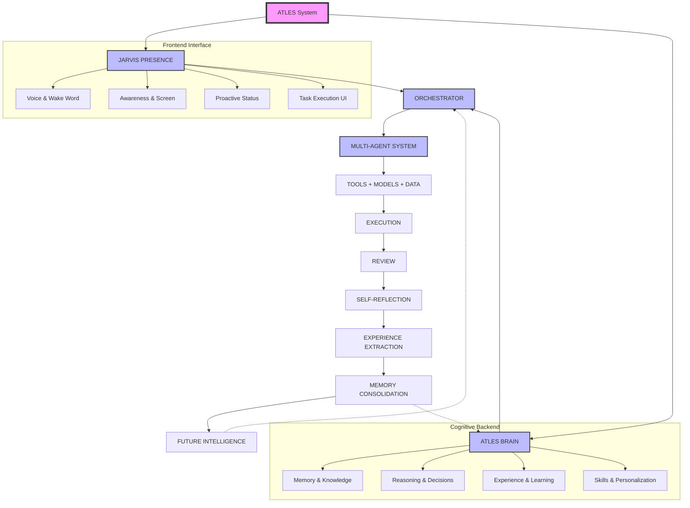

## 1. COVER PAGE

```text
================================================================================
                                                                              
                               A T L E S                                      
                                                                              
                          MASTER PLAN                                         
                                                                              
       Complete Technical Blueprint — 92-Step Architecture                    
                                                                              
================================================================================

Version:        1.0
Date:           September 2026
Repository:     Ahammedzihad/atles
Classification: CANONICAL PROJECT SPECIFICATION

================================================================================
```

## 2. DOCUMENT PURPOSE AND READING GUIDE

### Document Purpose
This document serves as the absolute canonical specification for the Atles project. It is not a theoretical whitepaper; it is a concrete, actionable technical blueprint designed to guide the development of a personal AI operating layer from initial prototypes to a fully autonomous, self-improving system. 

It functions as:
- **Canonical Specification:** The single source of truth for architectural decisions, system behaviors, and data models.
- **Development Reference:** A step-by-step implementation guide detailing precise components, inputs, outputs, and acceptance criteria.
- **Architecture Reference:** A comprehensive mapping of system boundaries, internal components, and data flows.
- **Multi-Agent Blueprint:** A defined structure for the Orchestrator and specialized sub-agents.
- **Memory/Learning Reference:** The definitive guide to how Atles forms experiences, extracts facts, and learns skills over time.
- **JARVIS Roadmap:** The evolution plan for the user-facing presence layer.
- **Guide for AI Assistants:** Structured context to allow autonomous AI agents (like Antigravity Pro) to understand the project and assist in building it.
- **PDF Source:** The foundational text to be compiled into a complete, shareable PDF document.

### Reading Guide
The Master Plan is divided into logically progressive sections:
- **Section A (Front Matter & Vision):** Start here to understand the core philosophy, the relationship between Atles Brain and JARVIS Presence, and the overarching architecture (FC-01).
- **Section B (Foundation & Core Infrastructure):** Details the local-first backend, hardware constraints, and basic integrations.
- **Section C (Memory & Experience):** Explains how chat history is converted into structured experiences and permanent knowledge.
- **Section D (Multi-Agent System & Orchestration):** Covers the routing, delegation, and management of specialized agents.
- **Section E (JARVIS Presence):** Details the interactive, multi-modal frontend and user interfaces.
- **Section F (Execution & Controlled Autonomy):** Focuses on tools, sandbox execution, permission management, and audit trails.
- **Section G (Continuous Learning & Self-Reflection):** Describes the background processes where Atles reviews its own performance and upgrades its skills.
- **Section H (Future Expansion):** Outlines long-term goals and scaling strategies once the core is stable.

For each technical step, refer to the standardized Step Template, which includes precise inputs/outputs, implementation status, and related flowcharts.

## 3. TABLE OF CONTENTS

### Section A: Front Matter and Vision
- 1. Cover Page
- 2. Document Purpose and Reading Guide
- 3. Table of Contents
- 4. Executive Vision
- 5. Master Architecture Flowchart (FC-01)
- 6. System Boundaries and Design Principles
- 7. Atles and JARVIS Relationship
- 8. Flowchart Index

### Section B: Foundation and Infrastructure (Steps 1-15)
- Step 01 — Project Initialization and Repository Setup
- Step 02 — Next.js Frontend Foundation
- Step 03 — FastAPI Backend Foundation
- Step 04 — Ollama Local Integration and Model Bootstrapping
- Step 05 — Basic Chat Interface and Bi-directional Connection
- Step 06 — Database Schema Design and SQLite Setup
- Step 07 — User Session and Authentication Scaffolding
- Step 08 — Configuration Management and Environment Variables
- Step 09 — Logging and System Telemetry Basics
- Step 10 — Initial Prompt Engineering Framework
- Step 11 — Local API Rate Limiting and Queueing
- Step 12 — Health Checking and Liveness Monitoring
- Step 13 — System Resource Monitoring (CPU/RAM Awareness)
- Step 14 — Basic Error Handling and Fallback Mechanisms
- Step 15 — Dockerization and Containerization Strategy

### Section C: Memory, Knowledge, and Experience (Steps 16-30)
- Step 16 — Short-Term Context Window Management
- Step 17 — Vector Database Integration (ChromaDB Local)
- Step 18 — Semantic Chunking and Embedding Generation
- Step 19 — Fact Extraction Pipeline
- Step 20 — Entity Recognition and Relationship Mapping
- Step 21 — Long-Term Memory Storage and Retrieval
- Step 22 — Chat History to Experience Conversion
- Step 23 — Temporal Reasoning (Past vs Present Facts)
- Step 24 — Memory Consolidation (Background Task)
- Step 25 — Contradiction Resolution and Fact Updating
- Step 26 — Semantic Search and Context Injection
- Step 27 — User Preference Profiling
- Step 28 — Skill and Strategy Memory
- Step 29 — Memory Pruning and Forgetting Mechanisms
- Step 30 — Data Portability and Export

### Section D: Multi-Agent System and Orchestration (Steps 31-45)
- Step 31 — Orchestrator Agent Bootstrapping
- Step 32 — Intent Classification and Task Routing
- Step 33 — Sub-agent Interface Definition
- Step 34 — Researcher Agent Implementation
- Step 35 — Coder Agent Implementation
- Step 36 — Planner Agent Implementation
- Step 37 — Multi-Agent Message Bus
- Step 38 — Agent Context Isolation and Sharing
- Step 39 — Parallel Execution and Synchronization
- Step 40 — Conflict Resolution between Agents
- Step 41 — Agent State Management and Checkpointing
- Step 42 — Dynamic Agent Instantiation
- Step 43 — Cross-Agent Memory Access
- Step 44 — Agent Performance Metrics
- Step 45 — Centralized Orchestrator Dashboard

### Section E: JARVIS Presence (Steps 46-60)
- Step 46 — Wake Word Detection Integration
- Step 47 — Speech-to-Text (STT) Processing
- Step 48 — Text-to-Speech (TTS) Voice Generation
- Step 49 — UI/UX Overhaul for Ambient Awareness
- Step 50 — Proactive Notification System
- Step 51 — Screen Context Capture (OCR/Vision)
- Step 52 — Multimodal Input Handling
- Step 53 — Audio Feedback and Sound Design
- Step 54 — System Status Dashboard Visualization
- Step 55 — Personality and Tone Configuration
- Step 56 — Interruptibility and Real-Time Interaction
- Step 57 — Mobile Companion App Interface
- Step 58 — Wearable Device Integration Stubs
- Step 59 — Emotion and Sentiment Recognition
- Step 60 — JARVIS Identity Lock and Security

### Section F: Tools, Execution, and Controlled Autonomy (Steps 61-75)
- Step 61 — Tool Registry and Schema Definition
- Step 62 — File System Access and Management Tools
- Step 63 — Web Browsing and Scraping Tools
- Step 64 — Terminal and Command Execution Tools
- Step 65 — API Calling and Webhook Tools
- Step 66 — Permission System (Allow/Deny/Ask)
- Step 67 — Human-in-the-Loop Approval Interface
- Step 68 — Sandbox Environment for Code Execution
- Step 69 — Execution Audit Trail and Logging
- Step 70 — Rollback and Undo Mechanisms
- Step 71 — Task Delegation and Queueing
- Step 72 — Asynchronous Task Notifications
- Step 73 — Rate Limiting for External Tools
- Step 74 — Tool Failure Recovery and Retries
- Step 75 — Budget and Cost Tracking (For external APIs if used)

### Section G: Continuous Learning and Reflection (Steps 76-85)
- Step 76 — Execution Review Pipeline
- Step 77 — Success/Failure Classification
- Step 78 — Automated Post-Mortem Generation
- Step 79 — Prompt Optimization Loop
- Step 80 — Tool Usage Efficiency Analysis
- Step 81 — Agent Skill Upgrading (Writing new tools)
- Step 82 — Behavioral Adaptation based on Feedback
- Step 83 — Periodic System Self-Diagnosis
- Step 84 — Idle Time Processing (Background Reflection)
- Step 85 — Learning Reports to User

### Section H: Future Intelligence and Scaling (Steps 86-92)
- Step 86 — Integration with Larger Hosted Models (Optional)
- Step 87 — Swarm Intelligence and Distributed Agents
- Step 88 — Advanced Predictive Planning
- Step 89 — Deep Personalization via Life Logging
- Step 90 — Cross-Device Synchronization
- Step 91 — Community Tool Sharing Ecosystem
- Step 92 — Full Level 3 Autonomy Milestone

### Flowchart Index
- FC-01 to FC-40 (See Section 8)


## 4. EXECUTIVE VISION

Atles is not a chatbot. It is a **personal AI operating layer**. 

In the current landscape of AI, most tools exist as stateless, transactional conversational agents. A user inputs a prompt, the system responds, and the interaction ends. While chat history may be preserved as a chronological log, the AI does not genuinely learn, adapt, or accumulate experience over time. 

Atles fundamentally challenges this paradigm. It is designed to be an ever-present, context-aware intelligence that operates securely within the user's local hardware ecosystem. Atles acts as a cognitive extension of the user, capable of understanding complex goals, maintaining long-term memory, planning multi-step tasks, researching external information, delegating work to specialized sub-agents, taking concrete actions on the local machine, verifying its own work, and—crucially—learning from its successes and mistakes.

### Core Identity Statement
> **"Atles = a personal AI operating layer that understands, remembers, plans, researches, delegates, acts, verifies, learns from experience, and helps the user over time—with permissions, transparency, and controlled improvement."**

### The JARVIS Inspiration and Relationship
The conceptual north star for this project is JARVIS (from the Marvel Cinematic Universe). However, Atles distinctly separates the *intelligence* from the *presence*. 
- **Atles Brain** is the backend cognitive engine. It handles reasoning, memory consolidation, multi-agent orchestration, tool execution, and self-reflection.
- **JARVIS Presence** is the frontend interface layer. It provides the voice, the visual dashboard, the proactive awareness, and the personality. 

JARVIS is not a separate product; it is how the user interacts with the Atles Brain. JARVIS gives a voice to the silent, complex processing happening within Atles.

### Core Capabilities
To function as an operating layer, Atles focuses on eight core capabilities:
1. **Understand:** Deep semantic comprehension of user intent, beyond literal keyword matching.
2. **Remember:** Moving away from raw chat history to a structured "Experience" database (facts, skills, preferences, lessons).
3. **Plan:** Breaking down high-level directives into logical, execution-ready sub-tasks.
4. **Research:** Autonomously gathering information from local files or the broader web.
5. **Delegate:** Routing specific tasks to optimized, specialized internal agents (e.g., Coder Agent, Researcher Agent).
6. **Act:** Executing real changes on the local environment (creating files, running scripts) using strict tool schemas.
7. **Verify:** Checking its own work against acceptance criteria before presenting it to the user.
8. **Learn:** Analyzing past executions to refine prompts, improve tool usage, and avoid repeating mistakes.

### Target: Level 2 + Level 3 Autonomy
Within the context of Atles (a user-defined framework, not an industry standard):
- **Level 2 (Copilot/Collaborator):** The AI operates with heavy human-in-the-loop oversight. It drafts, plans, and proposes, but requires explicit permission to execute sensitive actions.
- **Level 3 (Trusted Agent):** The AI is granted bounded autonomy. It can execute background tasks, manage its own schedule, trigger proactive alerts, and handle routine workflows without continuous prompting, relying on predefined permission boundaries and robust audit trails.

### Experience vs. Chat History
A defining pillar of the Atles architecture is the devaluation of raw chat history. Chat logs are messy, redundant, and contextually bound to a specific moment. Atles periodically processes chat logs to extract **Experience**—discrete facts, strategic decisions, corrected mistakes, and new skills. These distilled experiences are stored in a vector database, allowing Atles to draw upon past wisdom without rereading thousands of lines of casual conversation.

### Controlled Autonomy and Budget-Conscious Local Design
As a project built by a student, Atles embraces resource constraints as a feature, not a bug. 
- **Local-First:** It relies heavily on local hardware (Intel i5-1340P, 16GB RAM) and efficient local models (Ollama running Qwen3 4B) rather than expensive cloud APIs. 
- **Controlled Autonomy:** Because local models can hallucinate, Atles employs strict safeguards. It uses a "Plan-Verify-Execute" loop, explicit permission prompts for destructive actions, and comprehensive logging. The user retains ultimate control over what Atles can and cannot do.

### Current Status
Atles is being built incrementally. 
- **Day 1-3 (DONE):** Frontend scaffolding (Next.js), Backend scaffolding (FastAPI), and Local Model integration (Ollama + Qwen3 4B) are complete and passing health checks.
- **Day 4 (CURRENT NEXT):** Connecting the frontend UI to the backend intelligence layer to establish the foundational bi-directional loop.


## 5. MASTER ARCHITECTURE FLOWCHART (FC-01)

### FC-01: Complete Atles Master Architecture

```text
                           ATLES
                             │
             ┌───────────────┴───────────────┐
             │                               │
       JARVIS PRESENCE                  ATLES BRAIN
             │                               │
       Voice                             Memory
       Wake Word                         Knowledge
       Awareness                         Reasoning
       Screen                            Experience
       Computer                          Learning
       Proactive                         Skills
       Status                            Personalization
       Task Execution                    Decisions
             │                               │
             └───────────────┬───────────────┘
                             ↓
                       ORCHESTRATOR
                             ↓
                    MULTI-AGENT SYSTEM
                             ↓
                    TOOLS + MODELS + DATA
                             ↓
                         EXECUTION
                             ↓
                          REVIEW
                             ↓
                     SELF-REFLECTION
                             ↓
                        EXPERIENCE
                             ↓
                          MEMORY
                             ↓
                    FUTURE INTELLIGENCE
```



### Node Explanations

**ATLES**
The unified system entity representing the complete software stack. It acts as the absolute boundary of the local AI operating layer.

**JARVIS PRESENCE**
The frontend, interactive shell of the system. JARVIS is responsible for all multimodal inputs and outputs. It handles voice recognition (Wake Word), monitors the user's screen context (Awareness), provides proactive notifications without being prompted, and renders the visual dashboard. JARVIS ensures the system feels alive and responsive, bridging the gap between cold backend processing and human interaction.

**ATLES BRAIN**
The backend cognitive core. Where JARVIS handles *how* things are communicated, the Brain handles *what* is communicated and decided. It manages long-term storage, semantic reasoning, decision-making logic, and the transition of raw data into structured learning. It is intentionally decoupled from the UI to allow headless operation.

**ORCHESTRATOR**
The primary routing and management hub. It receives intent from JARVIS and context from the Brain. The Orchestrator acts as the "CEO," breaking down complex tasks, selecting the appropriate sub-agents, monitoring their progress, and resolving conflicts.

**MULTI-AGENT SYSTEM**
A collection of specialized, narrow-focus AI models/prompts. Instead of relying on one massive monolithic prompt, the workload is distributed. For example, a Coder Agent writes scripts, while a Researcher Agent searches local files.

**TOOLS + MODELS + DATA**
The specific utilities the agents can use. This includes file system access, terminal execution, the local Ollama models (Qwen3), and the SQLite/ChromaDB databases.

**EXECUTION**
The sandbox where actions are actually performed. This node respects the permission boundaries and controlled autonomy rules, executing code or modifying files only when authorized.

**REVIEW**
The immediate verification step. After execution, the system checks if the output matches the acceptance criteria. If it fails, it routes back to the MAS for correction before alerting the user.

**SELF-REFLECTION & EXPERIENCE**
The crucial learning loop. Following a completed task, Atles analyzes the entire trace (prompt, execution, review). It extracts successes, identifies tool misuse, and generates "Experience" chunks.

**MEMORY & FUTURE INTELLIGENCE**
The extracted experiences are consolidated into the vector database. In future tasks, the Orchestrator will inject this intelligence, allowing Atles to perform better, faster, and with fewer mistakes over time.


## 6. SYSTEM BOUNDARIES AND DESIGN PRINCIPLES

### What Atles IS vs. What it is NOT
- **IS:** A local, autonomous, learning-capable operating layer. A cognitive assistant that remembers and acts.
- **IS NOT:** A cloud-based SaaS, a stateless chatbot wrapper, a general artificial general intelligence (AGI), or a system that requires expensive API subscriptions.

### Core Principles
1. **Local-First Design:** All critical reasoning, memory storage, and task execution happen locally on the host machine. Cloud APIs are strictly optional extensions, not dependencies.
2. **Resource Awareness:** Development is heavily constrained by the target hardware (Intel i5-1340P, 16GB RAM, Iris Xe). Models must be small and quantized (e.g., Qwen3 4B via Ollama). Processing heavy tasks (like memory consolidation) must be queued as background jobs to prevent UI blocking.
3. **Budget Constraints:** Built by a student. The architecture fundamentally assumes a $0 operating budget. No paid APIs, no premium vector databases. Everything must rely on open-source, locally hostable equivalents (SQLite, ChromaDB, local Ollama).
4. **Controlled Autonomy:** Atles cannot take destructive actions without explicit human approval. The permission model (Allow/Deny/Ask) is foundational. Every tool execution leaves an audit trail.
5. **Transparency and Auditability:** The user must be able to view the Orchestrator's thought process. There are no "black box" decisions; logs show exactly which agent was invoked, what tools were used, and why a decision was made.
6. **Incremental Development:** The project adheres to a strict `PLAN → BUILD → TEST → VERIFY → COMMIT → NEXT` loop. No feature is built before its prerequisites are fully tested and stable.
7. **Modular Expandability:** The system is built with generic interfaces. If a better local model is released, or if the user upgrades their GPU, the system can swap out the Ollama model or the local vector DB without rewriting the Orchestrator logic.


## 7. ATLES AND JARVIS RELATIONSHIP

A common point of confusion is distinguishing between Atles and JARVIS. In this architecture, they are deeply symbiotic but technically distinct.

**JARVIS is the Persona; Atles is the Engine.**

Think of Atles as the complex backend infrastructure of a modern operating system—the kernel, the memory management unit, the file system, and the background services. It is cold, logical, and highly structured. 

JARVIS is the desktop environment, the terminal, the voice, and the avatar. When the user says, "JARVIS, compile the report," JARVIS (the Presence layer) processes the audio, recognizes the user, parses the emotional tone, and provides an immediate audio acknowledgment ("Right away, sir."). 

JARVIS then passes the parsed intent to the Atles Brain. The Brain handles the difficult work: retrieving past context about how the user likes their reports formatted, delegating the data gathering to a Researcher Agent, instructing a Coder Agent to format the markdown, and verifying the output. Once the Brain completes the task, it sends the payload back to JARVIS. JARVIS then decides how to present it—perhaps highlighting a notification on the screen or speaking a summary aloud.

```mermaid
graph LR
    User((User)) <--> J[JARVIS PRESENCE\n(Voice, UI, Persona)]
    J <-->|Intent & Context| B[ATLES BRAIN\n(Reasoning, Memory, Execution)]
    
    style J fill:#f9d0c4,stroke:#333,stroke-width:2px
    style B fill:#d4e6f1,stroke:#333,stroke-width:2px
```


## 8. FLOWCHART INDEX (Deliverable C)

The following flowcharts comprehensively map the Atles system and will be detailed in their respective sections.

| FC-ID | Title | Purpose | Section |
|---|---|---|---|
| FC-01 | Complete Atles Master Architecture | High-level system overview and component relationships | A |
| FC-02 | User Request Lifecycle | End-to-end tracing of a prompt to an execution result | B |
| FC-03 | Local Backend Boot Sequence | Startup checks, Ollama health, and database connection | B |
| FC-04 | Context Window Management | Token limits, rolling windows, and summarization logic | C |
| FC-05 | Fact Extraction Pipeline | Converting raw chat into discrete semantic facts | C |
| FC-06 | Memory Consolidation Process | Background task converting short-term to long-term memory | C |
| FC-07 | Vector Search and Retrieval | How past experiences are injected into current prompts | C |
| FC-08 | Contradiction Resolution | Updating outdated facts (e.g., user changed preferences) | C |
| FC-09 | Orchestrator Routing Logic | Deciding which sub-agent handles a specific intent | D |
| FC-10 | Multi-Agent Synchronization | Managing parallel tasks and joining results | D |
| FC-11 | Coder Agent Workflow | Code generation, linting, and sandbox testing | D |
| FC-12 | Researcher Agent Workflow | Web scraping, local file searching, and synthesizing | D |
| FC-13 | Conflict Resolution Protocol | Handling disagreements or divergent outputs between agents | D |
| FC-14 | Wake Word and Audio Pipeline | Capturing, filtering, and transcribing voice input | E |
| FC-15 | Proactive Notification Logic | Deciding when to interrupt the user vs. silent logging | E |
| FC-16 | Multimodal Input Merging | Combining voice, text, and screen context into one intent | E |
| FC-17 | Tool Schema Validation | Pre-execution checks on tool arguments | F |
| FC-18 | Permission and Security Gate | Allow/Deny/Ask logic for destructive actions | F |
| FC-19 | Execution Audit Trail | Logging state before, during, and after tool use | F |
| FC-20 | Execution Rollback Mechanism | Reverting file changes on tool failure | F |
| FC-21 | Asynchronous Task Queue | Handling long-running jobs without blocking UI | F |
| FC-22 | Execution Review Loop | Self-verification against acceptance criteria | G |
| FC-23 | Post-Mortem Generation | Analyzing failed tasks to extract lessons | G |
| FC-24 | Skill Generation Pipeline | Converting a successful complex workflow into a reusable tool | G |
| FC-25 | Background Idle Processing | Utilizing idle CPU cycles for memory optimization | G |
| FC-26 | Hardware Resource Monitor | Throttling LLM requests based on RAM/CPU usage | B |
| FC-27 | Database Schema Migration | Safe updates to SQLite structures | B |
| FC-28 | Error Fallback Tree | Graceful degradation when Ollama or tools fail | B |
| FC-29 | Data Portability Export | Packaging user data into portable JSON/Markdown | C |
| FC-30 | User Preference Profiling | Updating the system prompt based on learned habits | C |
| FC-31 | Agent Context Isolation | Preventing token bleed between specialized agents | D |
| FC-32 | Agent Performance Metrics | Tracking speed and accuracy of sub-agents | D |
| FC-33 | Dashboard State Sync | Real-time WebSocket updates to the Next.js UI | E |
| FC-34 | Emotion/Tone Adjustment | Modifying TTS and response style based on user state | E |
| FC-35 | Rate Limiting System | Preventing infinite loops in autonomous execution | F |
| FC-36 | Tool Failure Recovery | Retry logic and alternative strategy selection | F |
| FC-37 | Prompt Optimization Loop | Rewriting system prompts based on past failures | G |
| FC-38 | Learning Report Generation | Summarizing weekly skill acquisition for the user | G |
| FC-39 | Swarm Intelligence Model | Future protocol for multi-device agent communication | H |
| FC-40 | Level 3 Autonomy Handover | Safe transition from user-approved to fully autonomous execution | H |
