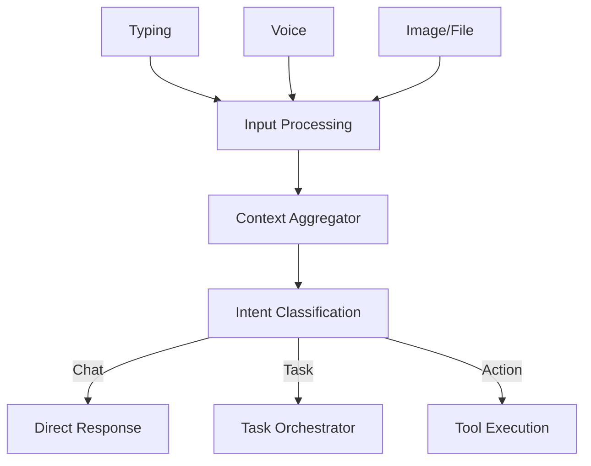
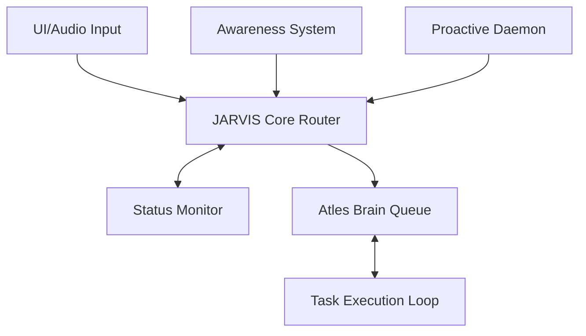
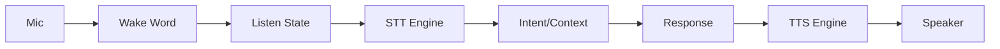
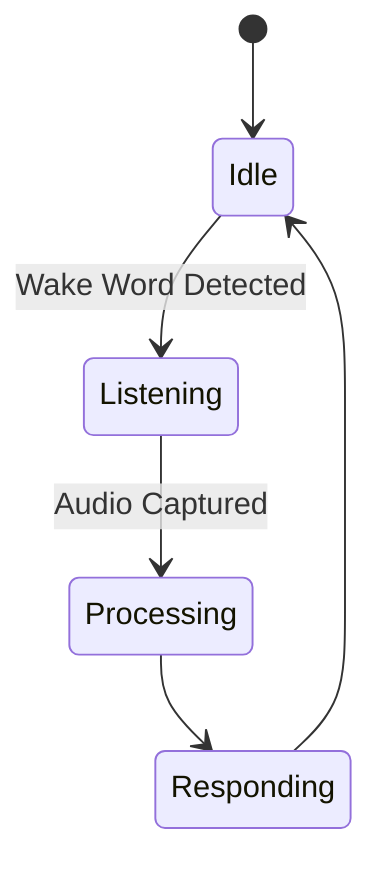
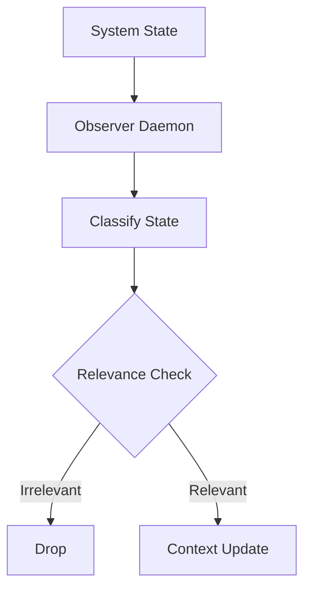
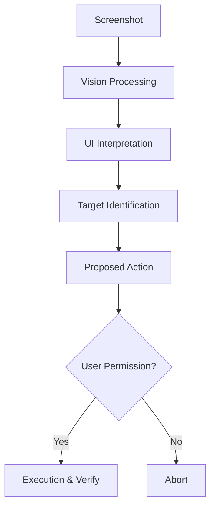
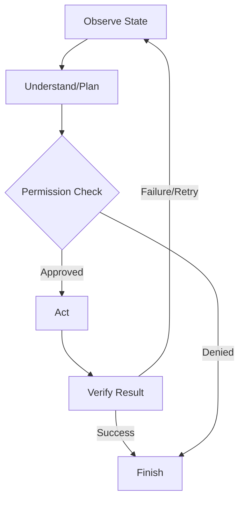

## GROUP A — CORE VISION & EXPERIENCE (STEPS 1–12)

## Step 1 — Atles Identity and Mission

### Purpose
This step defines Atles not merely as a conversational chatbot, but as a deeply integrated personal AI operating layer. Atles is designed to operate seamlessly across the user's personal context, retaining state, automating mundane tasks, and providing highly tailored intelligence. The long-term role of Atles is to serve as the unifying layer over OS and applications, bounded only by strict permission scopes and local compute limits. 

### User-visible behavior
When fully realized, the user interacts with Atles as a persistent presence. Rather than starting fresh each time or relying on brittle prompt engineering, the user speaks or types to Atles assuming complete historical continuity. Atles seamlessly references past tasks, opens files without explicit paths, and coordinates long-running goals across sessions.

### System behavior
Internally, the Atles architecture maintains persistent memory layers (short-term conversation history, medium-term task states, long-term semantic knowledge). The routing mechanism categorizes each incoming command against system boundaries to determine if it requires tool execution, context retrieval, or straightforward conversational response. 

### Components
- **Frontend Layer:** The persistent chat and status UI built in Next.js.
- **Backend Orchestrator:** The FastAPI service mapping intents to capabilities.
- **Identity Policy Guard:** A prompt-engineering wrapper defining Atles' boundaries and core directives.

### Inputs and outputs
**Input Example:**
```json
{
  "user_id": "u_1",
  "query": "Where did we leave off on the master plan?"
}
```
**Output Example:**
```json
{
  "response": "We just finished Section A. You mentioned we should start on Section B, specifically focusing on the JARVIS core. Would you like me to pull up the template?",
  "action_suggested": "fetch_file",
  "action_target": "section_b_template.md"
}
```

### Data and memory
This capability heavily leans on read access to the global experience graph (long-term memory) and active task states. It deliberately ignores temporary OS states unrelated to user projects to preserve context relevance.

### Dependencies
Prerequisites include a functioning LLM backend (Ollama + Qwen3 4B) and a frontend chat UI. Subsequent systems like L2+L3 capabilities depend entirely on this identity definition.

### Safety and privacy
The core identity enforces boundaries: it must not execute destructive file operations autonomously, and its mission is restricted to local processing where possible to ensure data privacy. All operations are logged.

### Implementation status
PLANNED

### Acceptance criteria
- [ ] System prompt correctly asserts Atles' identity without hallucinating unverified capabilities.
- [ ] The model refuses requests outside its defined operational bounds gracefully.

### Related flowcharts
- FC-02


## Step 2 — Level 2 + Level 3 Target

### Purpose
Atles utilizes the user's specific framing of capability levels (not industry standards). Level 2 represents a capable assistant with context, tools, and multi-step task execution. Level 3 introduces a persistent, proactive, experience-aware entity with controlled, structured learning capabilities. This defines the primary engineering vector for Atles.

### User-visible behavior
At Level 2, the user can say "Format this data and save it as a CSV." At Level 3, the user can say "Keep an eye on my download folder and automatically sort any PDFs into my research directory, applying the naming convention we discussed yesterday." The system demonstrates autonomous execution and proactive suggestions.

### System behavior
The system utilizes an orchestrator loop capable of breaking down complex prompts into a Directed Acyclic Graph (DAG) of subtasks (Level 2). For Level 3, background daemon threads and scheduled tasks observe system state and trigger the orchestration loop without direct user prompt, guided by a persistent set of "user preferences" and "learned rules".

### Components
- **Task Orchestrator:** Handles multi-step execution (Level 2).
- **Proactive Daemon:** Background listener for events and triggers (Level 3).
- **Tool Registry:** Executable Python actions (e.g., file sorting, web search).

### Inputs and outputs
**Input (Level 3 Trigger):**
```python
class EventTrigger(BaseModel):
    event_type: str = "file_created"
    path: str = "/downloads/research_paper.pdf"
```

**Output (System Action):**
```python
class ActionResponse(BaseModel):
    action: str = "move_and_rename"
    target: str = "/research/2026_paper.pdf"
    status: str = "success"
```

### Data and memory
Level 2 reads/writes short-term tool results. Level 3 relies heavily on the 'Experience Database', querying rules like "User prefers files named with YYYY_MM_DD format."

### Dependencies
Requires Step 1 (Identity), Step 11 (Task Execution), and Step 18 (Awareness System).

### Safety and privacy
Level 3 capabilities introduce high risk if unchecked. All autonomous actions require a "dry-run" logging mechanism and an explicit user approval configuration per action type (e.g., `auto_approve=False`).

### Implementation status
FUTURE

### Acceptance criteria
- [ ] Atles can successfully plan and execute a 3-step tool chain autonomously (Level 2).
- [ ] Atles can trigger a helpful action based on a background event without a direct text prompt (Level 3).

### Related flowcharts
- FC-03, FC-08


## Step 3 — JARVIS Relationship

### Purpose
Clarifies the architectural separation of concerns between "JARVIS" (the presence, assistant, and interaction layer) and "Atles Brain" (the intelligence, memory, knowledge, and reasoning core). They are distinct logical subsystems of a single product, ensuring that interaction latency (JARVIS) isn't bottlenecked by deep semantic processing (Brain).

### User-visible behavior
The user interacts purely with "Atles" or the "JARVIS interface" seamlessly. When the user asks a quick factual question, the response is near-instantaneous. When the user asks for a complex code refactor, JARVIS acknowledges the request ("Thinking about how to restructure this..."), while the Atles Brain handles the heavy lifting in the background.

### System behavior
JARVIS handles I/O (speech, UI, wake words) and maintains real-time state. It routes simple queries to a lightweight prompt, and complex queries to the Atles Brain queue. The Brain operates asynchronously, using tools and updating the memory database, eventually streaming results back to JARVIS for presentation.

### Components
- **JARVIS Presence Layer:** FastAPI WebSocket endpoints, STT/TTS integration.
- **Atles Brain Orchestrator:** Asynchronous worker queue (e.g., Celery or asyncio background tasks), Ollama model interactions.

### Inputs and outputs
**JARVIS Message:**
```json
{
  "type": "status_update",
  "state": "thinking",
  "message": "Analyzing system logs..."
}
```

### Data and memory
JARVIS maintains real-time UI state (ephemeral). Atles Brain interacts with the persistent SQLite/Vector databases.

### Dependencies
Relies on a robust asynchronous backend (FastAPI async tasks) and WebSocket connections to the frontend.

### Safety and privacy
Separation of concerns ensures that the Brain can be completely isolated from raw microphone feeds, receiving only sanitized textual intents from JARVIS.

### Implementation status
PLANNED

### Acceptance criteria
- [ ] UI accurately reflects distinct states (listening, working, done) while the backend processes long tasks.
- [ ] Brain processing does not block JARVIS from acknowledging new user inputs.

### Related flowcharts
- FC-03


## Step 4 — Multimodal Input

### Purpose
To support a wide array of input methods beyond text typing. This includes voice, images, PDFs, documents, code files, spreadsheets, browser context, and raw screen captures. Multimodal input makes Atles a true OS-level assistant.

### User-visible behavior
The user can drag and drop a PDF into the chat, paste a screenshot, or speak into the microphone. Atles processes the diverse formats and responds cohesively, referencing the visual elements of an image or the tabular data in a CSV.

### System behavior
The FastAPI backend implements format-specific ingest pipelines. Text/voice goes through NLP. Images go through OCR or a Vision-Language Model (VLM). PDFs are parsed via libraries like PyMuPDF. Dataframes are loaded via Pandas for structural analysis.

### Components
- **File Ingest Service:** FastAPI endpoints for multipart file uploads.
- **Vision Pipeline:** (Future) Integration with a local VLM (e.g., LLaVA) or API.
- **Document Parsers:** Python libraries for PDF/CSV/Markdown extraction.

### Inputs and outputs
**Input Payload (Image):**
```python
class MultimodalRequest(BaseModel):
    type: str = "image"
    content_base64: str
    prompt: str = "What error is shown in this screenshot?"
```

### Data and memory
Parsed text is injected into the short-term context window. Original binary files are stored temporarily in a scratch directory, then purged unless explicitly saved by user request.

### Dependencies
Depends on the Next.js frontend supporting drag-and-drop file uploads (CURRENT NEXT/PLANNED). Voice depends on STT (Step 14).

### Safety and privacy
Local processing of all sensitive documents (PDFs, screens) is critical. No files are uploaded to external APIs without explicit user consent.

### Implementation status
PLANNED (Text only currently supported)

### Acceptance criteria
- [ ] System can parse text from an uploaded PDF and summarize it via Ollama.
- [ ] System can accept image uploads and pass them to a vision module without crashing.

### Related flowcharts
- FC-02


## Step 5 — Natural Conversation

### Purpose
Ensure Atles maintains continuous, fluid conversation. It must support context carry-over across messages, handling interruptions, digressions, and natural language nuances seamlessly.

### User-visible behavior
User: "Write a script to backup my documents."
Atles: [Provides script]
User: "Actually, change it to only backup PDFs."
Atles: [Updates script without needing the user to repeat the whole prompt].

### System behavior
The backend maintains a rolling context window of the current session. It utilizes a summarization technique when the context exceeds the model's token limit (e.g., Qwen3 4B max tokens). The prompt template injects the recent message history automatically.

### Components
- **Session Manager:** FastAPI dependency maintaining chat history.
- **Context Trimmer:** Utility to summarize or truncate older messages.

### Inputs and outputs
**Chat History Payload:**
```json
[
  {"role": "user", "content": "Write a script..."},
  {"role": "assistant", "content": "...script..."},
  {"role": "user", "content": "change it to only backup PDFs"}
]
```

### Data and memory
Stores conversational turns in a persistent `conversations` database table. Uses this table to construct context for the LLM.

### Dependencies
Requires Day 4 frontend-to-backend connection (CURRENT NEXT).

### Safety and privacy
Conversation logs are stored locally in SQLite. The user can easily delete specific sessions or purge all history.

### Implementation status
CURRENT NEXT (Basic turn-based chat works, multi-turn continuity needs robust context management).

### Acceptance criteria
- [ ] The LLM correctly resolves references to topics mentioned 3 turns prior.
- [ ] Context window gracefully truncates without losing system instructions when token limits are reached.

### Related flowcharts
- FC-02


## Step 6 — Intent Understanding

### Purpose
Before passing input to an expensive generation step, Atles must classify the user's intent to route it efficiently. Categories include: questions, tasks, research, coding, data analysis, computer actions, memory operations.

### User-visible behavior
When a user asks a simple question ("What time is it?"), the response is immediate via a direct tool. When the user asks for coding, Atles switches to a "Coding Mode" and utilizes codebase context.

### System behavior
A lightweight LLM call (or a fast classifier model) evaluates the user's input and returns a structured JSON intent. The Orchestrator uses this intent to decide which sub-agent or tool pipeline to trigger.

### Components
- **Intent Classifier:** A specific prompt applied to Qwen3 (or a smaller, faster model) enforcing strict JSON output.
- **Router:** Python logic matching intents to execution paths.

### Inputs and outputs
**Classifier Prompt Output:**
```python
class Intent(BaseModel):
    category: str # e.g., "coding", "computer_action", "chat"
    confidence: float
    entities: dict
```

### Data and memory
Does not persistently store data, but uses current session context to improve classification accuracy.

### Dependencies
Requires stable LLM JSON mode support.

### Safety and privacy
Low risk. Intent classification runs entirely locally.

### Implementation status
PLANNED

### Acceptance criteria
- [ ] Classifier correctly identifies a file creation command vs a general knowledge question with 90%+ accuracy on test set.

### Related flowcharts
- FC-02


## Step 7 — Context Continuity

### Purpose
Allows Atles to resolve pronouns and implicit references ("it", "that", "continue", "what next?") by combining conversational history with project state and active task state.

### User-visible behavior
User selects a block of code in their IDE and switches to Atles, saying "Refactor this." Atles knows "this" refers to the clipboard or the IDE selection. Or, after a script fails, the user says "fix it," and Atles knows "it" is the failed script.

### System behavior
The system builds a "Context Frame" before evaluating the user prompt. This frame aggregates recent chat messages, currently active files, recent tool failures, and clipboard contents, passing them as structured context to the LLM.

### Components
- **Context Aggregator Module:** Python service that collects environment state.
- **OS Integration (Optional):** To read clipboard or active window state.

### Inputs and outputs
**Context Frame:**
```json
{
  "active_file": "main.py",
  "clipboard": "def process(): pass",
  "recent_error": "SyntaxError on line 42",
  "user_prompt": "fix it"
}
```

### Data and memory
Highly ephemeral. Context frames are built on the fly and discarded after the response is generated.

### Dependencies
Depends heavily on the Awareness System (Step 18).

### Safety and privacy
Accessing clipboards or active windows requires strict user permissions to avoid reading sensitive passwords or private messages unintentionally.

### Implementation status
FUTURE

### Acceptance criteria
- [ ] Given a prompt with "it", the LLM successfully identifies the correct target from the Context Frame.

### Related flowcharts
- FC-02, FC-06


## Step 8 — Personalization

### Purpose
Atles must adapt to explicit preferences and corrections over time without making unsupported assumptions. This builds trust and reduces friction in repetitive tasks.

### User-visible behavior
If a user corrects Atles: "Always use double quotes in Python," Atles never uses single quotes again in that project. The user can also view and edit these learned preferences in a settings menu.

### System behavior
When the user gives a correction, a "Memory Agent" intercepts the intent (Step 6: memory operation), extracts the rule, and stores it in a structured Experience Database. This database is queried and injected into the system prompt for relevant future tasks.

### Components
- **Experience Database:** SQLite table for structured rules (topic, rule, context).
- **Rule Injector:** Dynamically appends rules to the system prompt based on task context.

### Inputs and outputs
**Rule Schema:**
```python
class PreferenceRule(BaseModel):
    id: str
    category: str = "coding_style"
    rule_text: str = "Always use double quotes for strings in Python."
    scope: str = "global"
```

### Data and memory
Persistent storage in the local database. Needs a CRUD interface for the user to manage.

### Dependencies
Requires Intent Understanding (Step 6).

### Safety and privacy
Preferences are stored locally. Users have full control to audit and delete learned rules.

### Implementation status
PLANNED

### Acceptance criteria
- [ ] User can state a preference, and it is verifiably saved in the database.
- [ ] Subsequent generations abide by the newly saved preference.

### Related flowcharts
- None specific, fits into general architecture.


## Step 9 — Status and Transparency

### Purpose
Provides real-time visibility into Atles' internal state: Idle, listening, thinking, planning, working, waiting for approval, blocked, finished. Crucial for user trust, especially during long-running background operations.

### User-visible behavior
The UI displays clear, non-intrusive indicators (e.g., a spinning icon for "working", a pulsing mic for "listening", a yellow badge for "waiting for approval"). The user is never left wondering if the system froze.

### System behavior
The backend orchestrator emits status events via WebSockets at every state transition. The frontend consumes these events and updates a global state manager (e.g., React Context or Zustand).

### Components
- **WebSocket Server:** FastAPI backend.
- **Status Event Bus:** Python module emitting state changes.
- **React Status Component:** UI element in Next.js.

### Inputs and outputs
**WebSocket Event:**
```json
{
  "event": "status_change",
  "data": {
    "previous": "thinking",
    "current": "working",
    "detail": "Executing file search..."
  }
}
```

### Data and memory
Ephemeral state management. Not persisted unless logging is enabled for debugging.

### Dependencies
Frontend Day 1 UI needs to be updated to handle WebSocket streams (CURRENT NEXT).

### Safety and privacy
Status logs provide transparency into *what* tools Atles is running, which is a key safety feature for auditing autonomy.

### Implementation status
CURRENT NEXT

### Acceptance criteria
- [ ] Next.js UI updates in real-time when the backend transitions from "thinking" to "working" via WebSockets.

### Related flowcharts
- FC-03


## Step 10 — Proactive Assistance

### Purpose
Allows Atles to act on its own initiative to identify opportunities or problems, while strictly respecting relevance, privacy, and interruption limits. Moves the system towards Level 3 autonomy.

### User-visible behavior
While compiling code, if an error occurs in the terminal, Atles might unobtrusively ping: "I noticed a missing dependency in your build. Would you like me to install `requests`?"

### System behavior
Background watchers (e.g., file system observers, terminal output parsers) stream data to a lightweight analysis model. If a high-confidence intervention is identified, it sends a proposal to the JARVIS layer, which queues a notification for the user based on interruption rules.

### Components
- **Background Watchers:** Watchdog libraries or tailing log files.
- **Heuristic Evaluator:** Fast, rule-based or small-LLM checker.
- **Notification Manager:** Queues proactive messages.

### Inputs and outputs
**Proactive Proposal:**
```python
class Proposal(BaseModel):
    trigger: str = "build_failure"
    suggested_action: str = "pip install requests"
    confidence: float = 0.95
    urgency: str = "low"
```

### Data and memory
Reads continuous system state. Stores only the user's interaction/approval of the proposal to improve future confidence scoring.

### Dependencies
Requires Awareness System (Step 18) and Useful Interruptions logic (Step 21).

### Safety and privacy
Extremely high risk of annoyance. Strict rate limiting and high confidence thresholds are required. Must only monitor explicitly whitelisted directories/processes.

### Implementation status
FUTURE

### Acceptance criteria
- [ ] System can detect a specific file change event and generate a relevant notification without user prompt.
- [ ] Notification is suppressed if user is in "Do Not Disturb" mode.

### Related flowcharts
- FC-03, FC-06


## Step 11 — Task Execution

### Purpose
The core engine for Level 2 capabilities. Converts user goals into actionable plans, executes steps via tool calls, processes results, verifies success, and generates completion reports.

### User-visible behavior
User asks: "Find all unused CSS classes in this project and remove them." Atles responds with a plan, executes the search, performs the edits, and provides a summary diff for the user to review.

### System behavior
An iterative ReAct (Reason + Act) loop. The LLM generates a plan, then emits JSON-formatted tool calls. The Orchestrator executes the tools safely locally, returns the output to the LLM, and the LLM determines the next step or declares completion.

### Components
- **Agent Loop:** Python `while` loop managing LLM interactions.
- **Tool Sandbox:** Controlled environment/functions for executing local commands (e.g., `grep_search`, `replace_file_content`).

### Inputs and outputs
**LLM Tool Call:**
```json
{
  "action": "grep_search",
  "args": {
    "SearchPath": "/atles/src",
    "Query": "unused-class"
  }
}
```

### Data and memory
Maintains a complex internal state object containing the DAG of tasks, tool outputs, and error logs during execution.

### Dependencies
Requires a robust set of tools and strong LLM function-calling capabilities. (Ollama Qwen3 needs validation for complex function calling).

### Safety and privacy
This is where destructive actions happen. All file writes or system commands must either run in a sandbox or require explicit user approval (Human-in-the-Loop) depending on safety settings.

### Implementation status
PLANNED

### Acceptance criteria
- [ ] Agent loop can successfully execute a sequence of `search` -> `read` -> `edit` tools to accomplish a simple task.
- [ ] Agent correctly pauses and asks for permission before executing a destructive command.

### Related flowcharts
- FC-08


## Step 12 — Correction and Experience Learning

### Purpose
Turns feedback and task outcomes into structural improvements for future responses. This creates the "Experience" aspect of Atles, moving beyond static knowledge bases.

### User-visible behavior
If a tool call fails during a task and the user manually fixes it, Atles observes the fix and automatically updates its internal methodology so it doesn't make the same mistake next time.

### System behavior
After a task completes (or fails), an asynchronous background process ("Reviewer Agent") analyzes the task trajectory. It extracts heuristics, common pitfalls, and successful patterns, structuring them into the Experience Database.

### Components
- **Reviewer Agent:** Background LLM process.
- **Experience DB:** Vector store or SQLite for abstract lessons.

### Inputs and outputs
**Extracted Lesson:**
```python
class Lesson(BaseModel):
    context: str = "Using sed on Windows"
    failure: str = "Syntax error with quotes"
    solution: str = "Use powershell -Command instead"
```

### Data and memory
Reads task history logs. Writes structured heuristics to long-term memory.

### Dependencies
Requires Task Execution (Step 11) to be functional and producing logs.

### Safety and privacy
Learning must be scoped to the local environment. It must not hallucinate false lessons from spurious failures.

### Implementation status
FUTURE

### Acceptance criteria
- [ ] Reviewer Agent can parse a failed task log and generate a valid JSON heuristic.

### Related flowcharts
- None specific.


## GROUP B — JARVIS CORE & AWARENESS (STEPS 13–22)

## Step 13 — JARVIS Assistant Core

### Purpose
Establishes the central assistant-presence service. It acts as the routing hub connecting natural conversation, system status, context aggregation, and underlying task states. This is the "brain stem" of the user interface.

### User-visible behavior
The user experiences a unified entity. Whether they are chatting, checking a task status, or giving a voice command, they interact with the JARVIS interface, which feels responsive and context-aware.

### System behavior
A central Orchestrator class in FastAPI that holds references to WebSocket managers, Active Tasks, and Context windows. It multiplexes incoming signals (API calls, WebSockets, Voice triggers) and routes them to the appropriate Brain worker.

### Components
- **Core Orchestrator Service:** Python singleton or dependency injection container in FastAPI.

### Inputs and outputs
N/A - This is an architectural integration point rather than a specific algorithmic input/output.

### Data and memory
Manages active memory pointers.

### Dependencies
Unifies all Group A capabilities.

### Safety and privacy
Ensures strict separation between UI handling and heavy backend execution.

### Implementation status
PLANNED

### Acceptance criteria
- [ ] Core service successfully multiplexes HTTP chat requests and WebSocket status updates simultaneously.

### Related flowcharts
- FC-03


## Step 14 — Speech-to-Text

### Purpose
Enable voice input. Local-first Speech-to-Text (STT) ensures privacy and zero-latency connectivity dependence.

### User-visible behavior
User presses a mic button or uses a wake word, speaks, and their text appears instantly in the chat interface, highly accurate even for technical jargon.

### System behavior
Audio chunks are captured by the browser (or native app), streamed to the backend, and processed by a local STT engine (like Whisper.cpp or Vosk). The resulting text is fed directly into the JARVIS Core as a standard text input.

### Components
- **Audio Streamer:** Next.js Web Audio API component.
- **STT Engine:** Local Whisper.cpp binding or Vosk container.

### Inputs and outputs
**Input:** Raw PCM audio stream.
**Output:** String: "Format this data and save it."

### Data and memory
Audio is processed in RAM and discarded immediately. Transcriptions enter the chat history.

### Dependencies
Requires hardware capable of running Whisper models (CPU with AVX2 or basic GPU).

### Safety and privacy
Zero audio leaves the local machine.

### Implementation status
PLANNED

### Acceptance criteria
- [ ] Audio recorded in the browser is successfully transcribed to text by the local backend within 2 seconds.

### Related flowcharts
- FC-04


## Step 15 — Text-to-Speech

### Purpose
Enable audible responses from Atles. Local TTS ensures privacy, offline capability, and low latency.

### User-visible behavior
Atles speaks responses aloud with natural intonation. The user can interrupt the speech by speaking over it or pressing a button.

### System behavior
Text generated by the LLM is streamed to a local TTS engine (e.g., Piper, Coqui). Audio chunks are streamed back to the frontend for playback. Handles interruption events to halt generation and playback instantly.

### Components
- **TTS Engine:** Local Piper instance.
- **Audio Player:** Next.js frontend capable of queueing and flushing audio streams.

### Inputs and outputs
**Input:** String: "I have finished the backup."
**Output:** WAV/MP3 audio stream.

### Data and memory
Temporary audio files may be generated in a scratch directory, cleared regularly.

### Dependencies
Depends on LLM text generation capabilities.

### Safety and privacy
Locally generated, offline execution.

### Implementation status
PLANNED

### Acceptance criteria
- [ ] Text output from the LLM is synthesized into audio and played in the browser.
- [ ] Hitting an 'interrupt' button instantly stops audio playback.

### Related flowcharts
- FC-04


## Step 16 — Wake Word

### Purpose
Hands-free activation of Atles. Essential for a true ambient assistant experience.

### User-visible behavior
User says "Atles", the UI instantly lights up indicating it is listening, and the subsequent command is captured.

### System behavior
A tiny, highly optimized machine learning model runs continuously in the browser or an OS background service, listening for the specific phonetic pattern of "Atles". Once detected, it triggers the STT pipeline. Options include Porcupine or openWakeWord.

### Components
- **Wake Word Engine:** Client-side WebAssembly module or native background service.

### Inputs and outputs
**Input:** Continuous microphone stream.
**Output:** Boolean trigger event.

### Data and memory
Audio buffer is strictly local, rolling (e.g., 2 seconds max), and never stored or transmitted.

### Dependencies
Depends on STT (Step 14) for subsequent processing.

### Safety and privacy
Extreme privacy sensitivity. The continuous listening must be auditable, strictly local, and easily disabled via a hard software kill switch.

### Implementation status
FUTURE

### Acceptance criteria
- [ ] Saying "Atles" triggers the UI listening state without requiring a mouse click.

### Related flowcharts
- FC-04, FC-05


## Step 17 — Presence and Status

### Purpose
Refining Step 9 for the broader OS level. Atles must represent its current state globally, not just inside a browser tab.

### User-visible behavior
A system tray icon or a floating widget that shows exactly what Atles is doing (Listening, Working, Waiting).

### System behavior
The JARVIS core pushes status updates to OS-level notification systems or a dedicated lightweight native app.

### Components
- **Native Widget:** (Future) Python Tkinter/PyQt or Electron overlay.

### Inputs and outputs
N/A

### Data and memory
Ephemeral.

### Dependencies
Depends on Status and Transparency (Step 9).

### Safety and privacy
Status indicators are critical for user awareness of active microphones or background operations.

### Implementation status
FUTURE

### Acceptance criteria
- [ ] Status transitions in the backend reflect in an OS-level indicator.

### Related flowcharts
- FC-03


## Step 18 — Awareness System

### Purpose
Provide Atles with permitted context about the user's environment: active projects, open files, running applications, and basic system status.

### User-visible behavior
User says "Close that", and Atles knows to close the currently focused window. User asks "Why is my PC slow?", and Atles can check CPU usage.

### System behavior
A Python daemon running with specific OS permissions polls system APIs (e.g., `psutil`, `pywin32`) to build a state dictionary. This dictionary is available to the Context Aggregator (Step 7).

### Components
- **OS Observer Daemon:** Python background script.

### Inputs and outputs
**System State Object:**
```json
{
  "active_window": "VS Code - section_b.md",
  "cpu_usage": "85%",
  "ram_free": "2GB"
}
```

### Data and memory
Real-time state, heavily ephemeral. Never stored permanently.

### Dependencies
Prerequisite for Context Continuity (Step 7).

### Safety and privacy
High privacy risk. Requires strict opt-in. The user must whitelist which applications Atles is allowed to 'observe'.

### Implementation status
FUTURE

### Acceptance criteria
- [ ] The OS Observer can correctly identify the currently active window title on Windows.

### Related flowcharts
- FC-06


## Step 19 — Screen Awareness

### Purpose
Allows Atles to understand UI states through visual analysis when APIs are unavailable. Essential for interacting with uncooperative legacy or web applications.

### User-visible behavior
User says "Click the blue submit button", and Atles visually locates it and executes the click.

### System behavior
Takes a screenshot, passes it to a local Vision model, which outputs a semantic map of UI elements and their coordinates.

### Components
- **Screenshot Utility:** Pillow or mss in Python.
- **Vision Model:** Local VLM capable of bounding box detection.

### Inputs and outputs
**Output from Vision:**
```json
{
  "element": "Submit Button",
  "coordinates": [x1, y1, x2, y2]
}
```

### Data and memory
Screenshots are processed in RAM and immediately deleted.

### Dependencies
Requires a local Vision model (hardware constraint check needed).

### Safety and privacy
Extreme privacy risk. Screenshots must NEVER leave the local machine.

### Implementation status
FUTURE

### Acceptance criteria
- [ ] System can take a screenshot and successfully identify the coordinates of a specified text label.

### Related flowcharts
- FC-07


## Step 20 — Computer Agent

### Purpose
The execution arm for system and screen awareness. An observe-plan-act-observe-verify loop that actually controls the computer (mouse/keyboard/terminal).

### User-visible behavior
Atles autonomously opens a web browser, navigates to a URL, copies information, and pastes it into a local document.

### System behavior
Uses tools like `pyautogui` to execute physical actions based on plans generated by the LLM and coordinates from Screen Awareness.

### Components
- **Action Executor:** Python library for OS control.

### Inputs and outputs
**Action Command:**
```python
class OSAction(BaseModel):
    action: str = "click"
    x: int = 500
    y: int = 300
```

### Data and memory
Ephemeral.

### Dependencies
Depends on Screen Awareness (Step 19) and Task Execution (Step 11).

### Safety and privacy
Highest risk. Requires a physical kill switch (e.g., slamming the mouse to the corner of the screen via `pyautogui` failsafe). Every autonomous action must have strict permission scopes.

### Implementation status
FUTURE

### Acceptance criteria
- [ ] Agent can move the mouse to a specific coordinate and click, based on an LLM command.

### Related flowcharts
- FC-08


## Step 21 — Useful Interruptions

### Purpose
Determines when Atles is allowed to interrupt the user proactively. Balances helpfulness with annoyance.

### User-visible behavior
If a critical background task fails, Atles immediately notifies the user. If a low-priority download finishes, Atles silently queues the notification for when the user next checks the interface.

### System behavior
A scoring engine evaluates the urgency, relevance, and confidence of a Proactive Proposal (Step 10). If the score exceeds the user's current 'Focus Mode' threshold, it triggers an immediate UI or audio alert.

### Components
- **Interruption Scorer:** Heuristic logic block.

### Inputs and outputs
**Evaluation:**
```json
{
  "proposal_id": "123",
  "action": "queue_silent",
  "reason": "user_in_focus_mode_and_urgency_low"
}
```

### Data and memory
Reads user settings for notification thresholds.

### Dependencies
Depends on Proactive Assistance (Step 10).

### Safety and privacy
Ensures Atles behaves politely and predictably.

### Implementation status
FUTURE

### Acceptance criteria
- [ ] A low-priority notification is successfully suppressed when 'Focus Mode' is active.

### Related flowcharts
- None specific.


## Step 22 — JARVIS Capability Roadmap

### Purpose
A strict, ordered roadmap for implementing JARVIS features to prevent scope creep.

### Capabilities (J1-J10)
- **J1: Assistant Core** (conversation, context, intent, task state, status)
- **J2: Voice** (STT + TTS)
- **J3: Wake Word**
- **J4: Awareness** (app, project, task, file, system-state)
- **J5: Computer Tools** (open, read, create, edit, run, search, control)
- **J6: Screen Awareness** (screenshot → vision → UI understanding → action)
- **J7: Computer Agent** (observe → plan → permission → act → verify)
- **J8: Proactive Assistant** (detect problems/opportunities, offer help)
- **J9: Continuous Task Execution** (long-running, checkpoints, resume, status)
- **J10: Full JARVIS Experience** (all combined)

### User-visible behavior
Clear progression of capabilities. J1 establishes the baseline chat interface. By J10, Atles acts as a fully integrated OS layer.

### System behavior
Incremental architectural additions mapping directly to previous steps.

### Implementation status
J1 is CURRENT NEXT. J2-J10 are PLANNED/FUTURE.

### Acceptance criteria
- [ ] Each phase must complete its specific acceptance criteria before the next is started.


## FLOWCHARTS

### FC-02 — User Interaction

**Purpose:** Maps the flow of various input modalities through processing, context generation, and intent classification to final output.

```text
[Input Sources]
  Typing ──┐
  Voice ───┼─> [Input Processing (STT/OCR/Parse)] ──> [Context Aggregator]
  Image ───┤                                               │
  File ────┘                                               v
                                               [Intent Classification]
                                               /          |          \
                                         [Chat]        [Task]       [Action]
                                           |              |             |
                                      [Response]  [Orchestrator]  [Tool Execution]
```



### FC-03 — JARVIS Core

**Purpose:** Illustrates how all JARVIS components connect and route information.

```text
[Wake Word / Audio / UI Input] ──> [JARVIS Core Router] <── [Awareness System]
                                     |    |    |
                   [Status Monitor] ─┘    |    └─ [Proactive Daemon]
                                          |
                               [Atles Brain Queue]
                                          |
                               [Task Execution Loop]
```



### FC-04 — Voice Pipeline

**Purpose:** Traces audio from microphone to text and back to audio.

```text
[Mic] -> [Wake Word Detect] -> [Listen State] -> [STT Engine] -> [Intent/Context]
                                                                        |
                                                                   [Response]
                                                                        |
                                  [Speaker] <- [TTS Engine] <-----------┘
```



### FC-05 — Wake-Word Lifecycle

**Purpose:** Details the states of the wake-word listener.

```text
[Idle (Local Buffer)] --> (Wake Word Detected) --> [Listening State Active]
                                                         |
[Idle] <--- [Process & Respond] <--- (Audio Captured) <──┘
```



### FC-06 — Awareness System

**Purpose:** Shows how system state is observed and filtered for relevance.

```text
[System State (Files/Apps/CPU)] --> [Observer Daemon] --> [Classify State]
                                                              |
                                                      (Relevance Check)
                                                      /               \
                                                  [Drop]          [Context Update]
```



### FC-07 — Screen Awareness

**Purpose:** Shows the pipeline for visual UI interaction.

```text
[Screenshot] --> [Vision Processing (VLM)] --> [UI Element Interpretation]
                                                        |
                                              [Target Identification]
                                                        |
                                                [Proposed Action]
                                                        |
                                                (User Permission)
                                                        |
                                               [Execution & Verify]
```



### FC-08 — Computer Agent Loop

**Purpose:** The ReAct loop for OS and screen control.

```text
-> [Observe State] -> [Understand/Plan] -> (Permission Check) -> [Act]
|                                                                  |
└────────────────────── [Verify Result] <──────────────────────────┘
```


