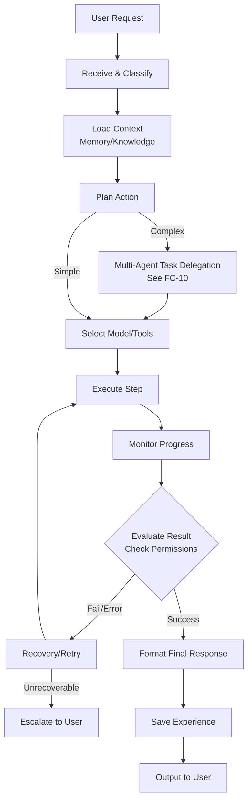
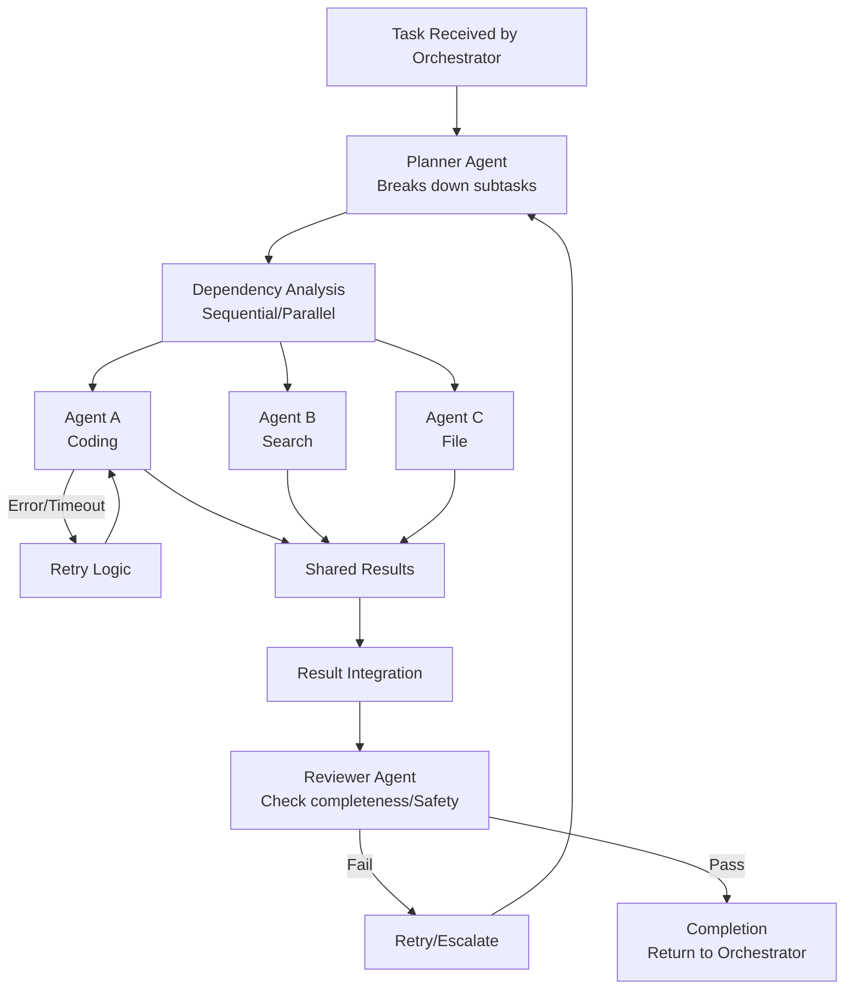
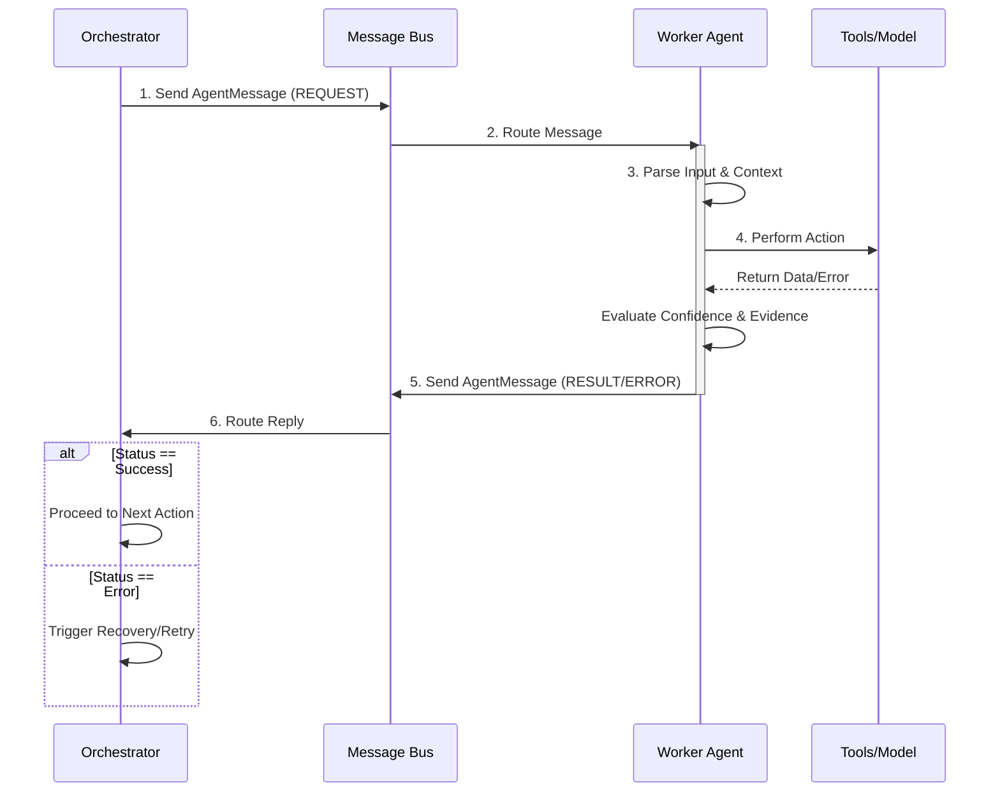

## GROUP C — ARCHITECTURE & ORCHESTRATION (STEPS 23–32)

## Step 23 — Frontend Architecture

### Purpose
Provides the primary interface for the user to interact with JARVIS (the assistant presence) and monitor the internal operations of the Atles Brain. A robust architecture ensures scalable growth for chat, status, projects, tasks, memory, agents, and settings.

### User-visible behavior
The user interacts with a responsive web interface. The Day 1 basic chat UI allows simple conversation. Planned features include viewing active agents, reviewing pending approvals, inspecting Atles' memory and knowledge graph, managing system settings, and seeing a real-time status dashboard.

### System behavior
The Next.js 16 App Router handles page routing and server-side rendering. Client-side components manage interactive state. The frontend communicates with the FastAPI backend via REST API calls, mapping JSON responses to TypeScript interfaces.

### Components
- **Framework:** Next.js 16.3.5 with App Router.
- **Language:** TypeScript.
- **State Management:** React Context or Zustand for global state (e.g., active task, user preferences).
- **API Client:** Axios or native `fetch` with typed wrappers.

### Inputs and outputs
**Input (User sends a message):**
```typescript
interface ChatMessageInput {
  role: 'user';
  content: string;
  attachments?: File[];
}
```

**Output (API Client Response):**
```typescript
interface ChatMessageResponse {
  id: string;
  role: 'assistant';
  content: string;
  timestamp: string;
  sources?: string[];
  suggestedActions?: string[];
}
```

### Data and memory
The frontend deliberately stores minimal state. Chat history, active tasks, and settings are fetched from the backend. LocalStorage may be used for UI preferences (e.g., dark mode, sidebar collapsed state).

### Dependencies
Depends on the backend API (Step 24). Provides the foundation for all future UI features (Agent views, Memory management).

### Safety and privacy
Data is not logged externally. All communication happens locally over `http://localhost:3000` and `http://127.0.0.1:8000`. No third-party tracking scripts are included.

### Implementation status
Day 1 basic chat UI is DONE. Rest is PLANNED.

### Acceptance criteria
- [x] Basic chat UI renders and handles user input.
- [ ] TypeScript interfaces exist for all API responses.
- [ ] Global state management properly handles concurrent task updates.
- [ ] Components are modular and reusable.

### Related flowcharts
None.

## Step 24 — Backend Architecture

### Purpose
Acts as the central nervous system of Atles, handling requests from the frontend, orchestrating tasks, managing state, and communicating with local AI models via Ollama. It ensures a clear separation of concerns, strong validation, and robust error handling.

### User-visible behavior
Invisible directly to the user, but ensures reliable, fast responses, meaningful error messages, and stable background task execution.

### System behavior
FastAPI handles incoming HTTP requests. Pydantic validates request and response payloads. Services encapsulate business logic (e.g., ChatService, AgentService, MemoryService). The backend connects to the local Ollama instance (currently running Qwen3 4B).

### Components
- **Framework:** FastAPI.
- **Language:** Python.
- **Validation:** Pydantic.
- **Model Integration:** `httpx` or dedicated Ollama client library.

### Inputs and outputs
**Input (Chat Request):**
```python
from pydantic import BaseModel, Field

class ChatRequest(BaseModel):
    message: str = Field(..., description="User's input message")
    conversation_id: str | None = None
    stream: bool = False
```

**Output (Chat Response):**
```python
class ChatResponse(BaseModel):
    reply: str
    conversation_id: str
    tokens_used: int | None = None
```

### Data and memory
The backend manages data persistence. It currently reads configuration variables (`AI_PROVIDER`, `OLLAMA_BASE_URL`).

### Dependencies
Depends on Ollama for model inference. Frontend (Step 23) depends on this backend.

### Safety and privacy
Input validation prevents malformed requests. Errors are caught globally and returned in a consistent, safe format to the frontend without exposing internal stack traces unnecessarily.

### Implementation status
Day 2 foundation is DONE. Day 3 Ollama integration is DONE.

### Acceptance criteria
- [x] FastAPI server starts and serves `/health`.
- [x] Pydantic models validate incoming requests.
- [x] Connects to Ollama and successfully generates completions.
- [ ] Comprehensive error handling and unified response formats.

### Related flowcharts
None.

## Step 25 — Atles Orchestrator

### Purpose
The Orchestrator is the "Brain" of the system. It manages the central lifecycle of every request, deciding whether a simple response is sufficient or if a complex, multi-agent plan is required. It ensures tasks are executed logically, evaluated, and recorded.

### User-visible behavior
The user asks a complex question (e.g., "Analyze this dataset and create a chart"). The user sees JARVIS acknowledge the request, then sees progress updates as Atles plans, delegates, and executes the steps, finally presenting the result.

### System behavior
The request lifecycle: Receive → Load Context → Plan → Delegate → Execute → Evaluate → Record. The Orchestrator does not do the work itself; it manages the state and dispatches sub-tasks to agents.

### Components
- **Orchestrator Service:** Manages the main loop.
- **Context Builder:** Assembles relevant history.
- **Planner:** Generates the task graph.
- **Dispatcher:** Sends tasks to agents.

### Inputs and outputs
```python
from pydantic import BaseModel
from typing import List, Dict, Any

class OrchestratorRequest(BaseModel):
    user_input: str
    context_overrides: Dict[str, Any] | None = None

class TaskPlanStep(BaseModel):
    step_id: str
    description: str
    assigned_agent: str
    dependencies: List[str] = []

class TaskPlan(BaseModel):
    plan_id: str
    goal: str
    steps: List[TaskPlanStep]

class OrchestratorResponse(BaseModel):
    status: str
    final_result: str | None = None
    plan_id: str | None = None
```

### Data and memory
Reads memory, user profile, and active context. Writes execution records and new memories based on the result.

### Dependencies
Depends on Context Assembly (Step 26), Model Routing (Step 28), and Multi-Agent Architecture (Step 33).

### Safety and privacy
Checks permissions before executing plans. Requires user approval for high-risk actions (e.g., deleting files, executing arbitrary code).

### Implementation status
PLANNED.

### Acceptance criteria
- [ ] Orchestrator successfully receives a request and generates a valid `TaskPlan`.
- [ ] Handles simple requests synchronously and complex requests asynchronously.
- [ ] Records execution history for every request.

### Related flowcharts
FC-09

## Step 26 — Context Assembly

### Purpose
Provides the AI model with the necessary information to understand the user's request without overwhelming the context window. It combines conversation history, relevant memories, system state, and active projects.

### User-visible behavior
Atles remembers past conversations, current tasks, and user preferences seamlessly, providing highly contextual and personalized responses.

### System behavior
Gathers data from multiple sources (Vector DB for memories, RDBMS for state). Ranks items by relevance, recency, and importance. Allocates the available token budget to ensure the prompt fits within the model's limits (crucial for local 4B models).

### Components
- **Context Manager:** Aggregates and filters data.
- **Token Counter:** Estimates token usage (e.g., using `tiktoken` or model-specific tokenizer).
- **Retrieval Engine:** Fetches semantic matches from memory.

### Inputs and outputs
**Input:** User message, current task ID.
**Output:** A structured prompt string or a list of message objects ready for the model.

### Data and memory
Reads from semantic memory, episodic memory, and active working memory.

### Dependencies
Depends on Memory Systems. Used by the Orchestrator (Step 25).

### Safety and privacy
Ensures that cross-tenant or highly sensitive data is not injected into the context unless authorized.

### Implementation status
PLANNED.

### Acceptance criteria
- [ ] Context correctly includes recent messages.
- [ ] Token budget is never exceeded, safely truncating the least important context.
- [ ] System prompt and core directives are always preserved.

### Related flowcharts
FC-09

## Step 27 — Task State Management

### Purpose
Ensures that complex, long-running processes can be tracked, paused, resumed, or rolled back. Provides resilience against crashes and allows the user to see exactly what Atles is doing.

### User-visible behavior
The user can view a list of active tasks, see their current progress (e.g., "Step 2 of 5: Analyzing code"), and optionally pause or cancel them.

### System behavior
Persists the `TaskState` to a database. Updates the state after every execution step. Maintains a log of agent actions, tool calls, and intermediate results.

### Components
- **Task Repository:** Database interface for task persistence.
- **State Machine:** Governs transitions (Pending → Running → Paused → Completed / Failed).

### Inputs and outputs
```python
from pydantic import BaseModel
from typing import List, Any
from enum import Enum

class TaskStatus(str, Enum):
    PENDING = "PENDING"
    RUNNING = "RUNNING"
    PAUSED = "PAUSED"
    COMPLETED = "COMPLETED"
    FAILED = "FAILED"

class TaskState(BaseModel):
    task_id: str
    goal: str
    status: TaskStatus
    current_step_id: str | None
    completed_steps: List[str] = []
    error_log: List[str] = []
    result: Any | None = None
```

### Data and memory
Writes state updates continuously to a persistent store (e.g., SQLite).

### Dependencies
Used by Orchestrator (Step 25) and Execution Engine (Step 30).

### Safety and privacy
Task states contain intermediate data which might be sensitive; must be stored securely locally.

### Implementation status
PLANNED.

### Acceptance criteria
- [ ] Task state transitions are enforced correctly.
- [ ] Tasks can be resumed from the last checkpoint after a system restart.
- [ ] Frontend can poll or receive websocket updates on task status.

### Related flowcharts
None.

## Step 28 — Model Routing

### Purpose
Optimizes performance and resource usage by directing specific types of tasks to the most appropriate AI model. While currently limited to a single local model, this architecture prepares Atles for a multi-model future.

### User-visible behavior
Faster responses for simple queries, more accurate answers for complex coding tasks, completely transparent to the user.

### System behavior
Evaluates the task complexity, required context size, and privacy constraints. Selects the target model configuration. Initially, everything routes to the local Qwen3 4B model.

### Components
- **Router Service:** Logic to select the model endpoint.
- **Provider Adapters:** Connectors for Ollama, OpenAI, Anthropic, etc.

### Inputs and outputs
```python
from pydantic import BaseModel

class ModelRequest(BaseModel):
    prompt: str
    task_type: str  # e.g., "chat", "code", "summarize"
    requires_privacy: bool = True

class ModelResponse(BaseModel):
    content: str
    model_used: str
```

### Data and memory
Reads routing rules and API keys (if applicable) from secure configuration.

### Dependencies
Depends on Backend Architecture (Step 24).

### Safety and privacy
If `requires_privacy` is true, the router strictly enforces that the request only goes to a local model (Ollama).

### Implementation status
PLANNED (Currently hardcoded to single model).

### Acceptance criteria
- [ ] Router correctly forwards requests to the configured Ollama model.
- [ ] Design supports adding secondary providers without changing core logic.
- [ ] Enforces privacy flags.

### Related flowcharts
None.

## Step 29 — Tool Registry

### Purpose
Defines the capabilities Atles has to interact with the world (file system, command line, browser). Centralized registry ensures tools are validated, secure, and discoverable by agents.

### User-visible behavior
Atles can perform actions like editing files or searching the web, rather than just generating text.

### System behavior
Maintains a registry of `ToolDefinition` objects. Provides schemas to the AI model so it knows how to call them. Handles execution of the actual Python functions when a tool is invoked.

### Components
- **Registry:** Dictionary or database of available tools.
- **Executor:** Safely runs the tool logic.

### Inputs and outputs
```python
from pydantic import BaseModel
from typing import Dict, Any, Callable

class ToolDefinition(BaseModel):
    name: str
    description: str
    parameters_schema: Dict[str, Any]  # JSON Schema
    requires_approval: bool = False
```

### Data and memory
Tool executions are logged in the Task State.

### Dependencies
Used by Execution Engine (Step 30).

### Safety and privacy
Tools with `requires_approval=True` (e.g., `run_command`, `delete_file`) pause execution and await user confirmation.

### Implementation status
PLANNED.

### Acceptance criteria
- [ ] Registry can list available tools and their JSON schemas.
- [ ] Tool execution catches and handles internal exceptions gracefully.
- [ ] Approval flags correctly halt execution.

### Related flowcharts
None.

## Step 30 — Execution Engine

### Purpose
Responsible for actually running the steps defined by the Orchestrator, executing tool calls, managing timeouts, and handling intermediate failures.

### User-visible behavior
The user sees Atles successfully completing a multi-step task, retrying if a step fails temporarily.

### System behavior
Takes a `TaskPlanStep`, determines the agent/tool, invokes it, captures the output, and updates the `TaskState`. Prevents infinite loops.

### Components
- **Execution Loop:** Async worker processing steps.
- **Timeout Manager:** Cancels long-running tasks.

### Inputs and outputs
```python
from pydantic import BaseModel
from typing import Any

class ExecutionStep(BaseModel):
    step_id: str
    action: str
    inputs: Any
    
class ExecutionResult(BaseModel):
    step_id: str
    success: bool
    output: Any
    error_message: str | None = None
```

### Data and memory
Updates TaskState (Step 27).

### Dependencies
Depends on Tool Registry (Step 29) and Agents (Group D).

### Safety and privacy
Enforces strict timeouts (e.g., `OLLAMA_TIMEOUT=120.0`) to prevent resource exhaustion on the user's constrained hardware.

### Implementation status
PLANNED.

### Acceptance criteria
- [ ] Executes steps in correct dependency order.
- [ ] Timeouts correctly abort hung operations.
- [ ] Output is properly serialized and passed to the next step.

### Related flowcharts
FC-09, FC-10

## Step 31 — Retry and Recovery

### Purpose
Makes the system resilient to transient errors (network timeouts, model hallucinations, malformed tool outputs) without crashing the entire task.

### User-visible behavior
If a file read fails, Atles automatically tries an alternative path or asks the user for clarification, rather than just giving an error message.

### System behavior
Catches exceptions from the Execution Engine. Classifies the error. Applies a `RetryPolicy` (e.g., max 3 retries, backoff). If unrecoverable, escalates to the user.

### Components
- **Error Classifier:** Determines if error is transient, permanent, or logic-based.
- **Retry Manager:** Tracks attempt counts.

### Inputs and outputs
```python
from pydantic import BaseModel

class RetryPolicy(BaseModel):
    max_attempts: int = 3
    backoff_factor: float = 1.5
    allow_fallback: bool = True
```

### Data and memory
Logs all retry attempts for diagnostic purposes.

### Dependencies
Integrated within the Execution Engine (Step 30).

### Safety and privacy
Prevents runaway retries that could consume all CPU/RAM.

### Implementation status
PLANNED.

### Acceptance criteria
- [ ] Transient errors trigger automatic retries up to `max_attempts`.
- [ ] Permanent errors fail immediately.
- [ ] Escalation properly alerts the Orchestrator to notify the user.

### Related flowcharts
FC-10

## Step 32 — Result Integration and Reflection

### Purpose
Closes the loop on a task. Combines the outputs of multiple steps into a final cohesive response for the user, and evaluates if the task was completed successfully to extract learning (Experience).

### User-visible behavior
The user receives a clear, comprehensive answer summarizing all the work Atles did. Over time, Atles stops making the same mistakes.

### System behavior
Validates final output against the original goal. Formats the response. Triggers background memory processes to store "lessons learned" if the task was particularly novel or difficult.

### Components
- **Output Synthesizer:** Formats the final response.
- **Reflection Engine:** Evaluates execution quality.

### Inputs and outputs
**Input:** Completed `TaskState` with all step outputs.
**Output:** Final string response + `ExperienceRecord`.

### Data and memory
Writes to long-term episodic/semantic memory.

### Dependencies
Final step of the Orchestrator Lifecycle (Step 25).

### Safety and privacy
Reflection data must be scrubbed of highly sensitive temporary data before long-term storage.

### Implementation status
PLANNED.

### Acceptance criteria
- [ ] Final output correctly synthesizes sub-task results.
- [ ] Reflection process identifies at least one success/failure metric per complex task.

### Related flowcharts
FC-09


## GROUP D — MULTI-AGENT SYSTEM (STEPS 33–43)

## Step 33 — Multi-Agent Architecture

### Purpose
Enables Atles to tackle complex problems by breaking them down and assigning them to specialized "personas" or agents (e.g., Coding, Research), reducing the cognitive load on a single model prompt.

### User-visible behavior
The user sees specialized agents working together on their task, like a virtual team.

### System behavior
Defines a standard interface `BaseAgent`. The `AgentRegistry` tracks available agents. The `AgentRuntime` provides the isolated execution environment for an agent to run its loop.

### Components
- **BaseAgent Interface:** Standard methods (`execute`, `handle_message`).
- **AgentRegistry:** Directory of agents.
- **AgentRuntime:** Execution sandbox.

### Inputs and outputs
```python
class BaseAgent:
    def __init__(self, agent_id: str, system_prompt: str):
        self.agent_id = agent_id
        self.system_prompt = system_prompt
        
    async def process_task(self, input_data: dict) -> dict:
        raise NotImplementedError
```

### Data and memory
Agents share access to the task context but maintain their own temporary scratchpads.

### Dependencies
Depends on Orchestrator (Step 25). Used by all specific agents (Steps 34-41).

### Safety and privacy
Agent runtimes restrict access to tools based on the agent's role (e.g., Research Agent cannot use File Write tools).

### Implementation status
PLANNED.

### Acceptance criteria
- [ ] `BaseAgent` is defined and inheritable.
- [ ] Orchestrator can dynamically load and invoke agents from the Registry.

### Related flowcharts
FC-10, FC-11

## Step 34 — Planner Agent

### Purpose
Responsible for high-level reasoning. It takes a complex user goal and breaks it down into a sequence of actionable subtasks for other agents.

### User-visible behavior
Before acting, Atles presents a plan: "To build this website, I will 1) create the HTML, 2) write the CSS, 3) test it."

### System behavior
Analyzes the goal, identifies dependencies, assesses risk, and outputs a structured plan.

### Components
- **Planner Agent:** Implementation of `BaseAgent`.

### Inputs and outputs
```python
from pydantic import BaseModel
from typing import List

class PlannerInput(BaseModel):
    goal: str
    context: str

class PlannerOutput(BaseModel):
    subtasks: List[str]
    dependencies: dict
    risk_level: str
```

### Data and memory
Reads goal and context; outputs plan to TaskState.

### Dependencies
Depends on Multi-Agent Architecture (Step 33).

### Safety and privacy
Identifies high-risk steps requiring user approval in the output.

### Implementation status
PLANNED.

### Acceptance criteria
- [ ] Generates valid, executable plans with correct dependencies.
- [ ] Correctly identifies high-risk tasks.

### Related flowcharts
FC-10

## Step 35 — Coding Agent

### Purpose
Specialized in writing, modifying, and explaining code. This is crucial for Atles' ability to help the user develop software.

### User-visible behavior
Atles writes scripts, refactors code, and fixes bugs in the user's workspace.

### System behavior
Equipped with file reading/writing tools, linter access, and specific prompt engineering for programming.

### Components
- **Coding Agent:** Implementation of `BaseAgent`.
- **Tools:** `read_file`, `write_file`, `run_command` (linters).

### Inputs and outputs
**Input:** "Create a Python script to calculate Fibonacci sequence."
**Output:** File modification success, plus explanation.

### Data and memory
Modifies local files in the workspace.

### Dependencies
Depends on File System Tools.

### Safety and privacy
Strictly bounded to operate only within the approved workspace directory (e.g., `C:\atles` or a temporary scratch folder).

### Implementation status
PLANNED.

### Acceptance criteria
- [ ] Can successfully create and edit code files.
- [ ] Respects workspace directory boundaries.

### Related flowcharts
FC-10

## Step 36 — Browser Agent

### Purpose
Allows Atles to gather up-to-date information from the internet, read documentation, and interact with web pages.

### User-visible behavior
Atles can search the web for the latest documentation or scrape a webpage for data.

### System behavior
Uses tools built around a headless browser (like Playwright) to navigate, extract DOM content, and convert it to clean text (markdown) for the model.

### Components
- **Browser Agent:** Implementation of `BaseAgent`.
- **Tools:** `navigate`, `extract_text`, `search`.

### Inputs and outputs
```python
from pydantic import BaseModel

class BrowseRequest(BaseModel):
    url: str
    extract_target: str | None = None

class BrowseResult(BaseModel):
    url: str
    markdown_content: str
    success: bool
```

### Data and memory
Does not store browsing history persistently unless explicitly requested.

### Dependencies
Depends on external libraries (e.g., Playwright).

### Safety and privacy
Does not access logged-in sessions or private local network addresses unless explicitly configured.

### Implementation status
PLANNED.

### Acceptance criteria
- [ ] Can load a webpage and extract readable text.
- [ ] Gracefully handles timeouts and CAPTCHAs (by failing safely).

### Related flowcharts
FC-10

## Step 37 — File Agent

### Purpose
Manages the file system organization, searching for files, reading contents, and moving things around.

### User-visible behavior
User can say "Find all Python files modified today and summarize them."

### System behavior
Uses safe wrappers around standard OS file operations.

### Components
- **File Agent:** Implementation of `BaseAgent`.
- **Tools:** `list_dir`, `read_file`, `move_file`.

### Inputs and outputs
```python
from pydantic import BaseModel

class FileOperation(BaseModel):
    action: str  # read, write, list, search
    path: str
    content: str | None = None
```

### Data and memory
Directly manipulates local disk.

### Dependencies
Depends on Tool Registry.

### Safety and privacy
Validates absolute paths to prevent directory traversal attacks.

### Implementation status
PLANNED.

### Acceptance criteria
- [ ] Prevents access outside allowed paths.
- [ ] Can successfully list directories and read files.

### Related flowcharts
None.

## Step 38 — Testing Agent

### Purpose
Verifies that code written by the Coding Agent actually works.

### User-visible behavior
User sees automated tests running and Atles fixing the code if tests fail.

### System behavior
Executes test commands (e.g., `pytest`), captures stdout/stderr, and classifies the errors for the Coding Agent to fix.

### Components
- **Testing Agent:** Implementation of `BaseAgent`.

### Inputs and outputs
```python
from pydantic import BaseModel

class TestRequest(BaseModel):
    command: str
    working_dir: str

class TestResult(BaseModel):
    passed: bool
    output: str
    error_summary: str | None = None
```

### Data and memory
Reads code files; executes processes.

### Dependencies
Depends on Coding Agent (Step 35).

### Safety and privacy
Runs tests in isolated environments if possible, or strictly warns user before running potentially destructive tests.

### Implementation status
PLANNED.

### Acceptance criteria
- [ ] Correctly executes tests and captures output.
- [ ] accurately parses test failure output to provide actionable summaries.

### Related flowcharts
FC-10

## Step 39 — Reviewer Agent

### Purpose
Acts as a quality control gate. Reviews the work of other agents against the original goal and safety criteria before finalizing the task.

### User-visible behavior
Ensures high quality. If a Coding Agent writes a script, the Reviewer might catch a missing import before presenting it to the user.

### System behavior
Receives the integrated results, evaluates them against a rubric, and outputs a pass/fail decision with feedback.

### Components
- **Reviewer Agent:** Implementation of `BaseAgent`.

### Inputs and outputs
```python
from pydantic import BaseModel
from typing import List

class ReviewCriteria(BaseModel):
    completeness: bool
    security: bool
    correctness: bool

class ReviewResult(BaseModel):
    approved: bool
    feedback: List[str]
```

### Data and memory
Reads temporary task outputs.

### Dependencies
Depends on Orchestrator (Step 25) and Result Integration (Step 32).

### Safety and privacy
Enforces safety rules as a final check.

### Implementation status
PLANNED.

### Acceptance criteria
- [ ] Successfully identifies major flaws in provided output.
- [ ] Rejects unsafe or incomplete work.

### Related flowcharts
FC-10

## Step 40 — Research Agent Group

### Purpose
A cluster of specialized agents that work together to perform deep research, verify facts, and synthesize information.

### User-visible behavior
Provides heavily researched, cited, and accurate reports on complex topics.

### System behavior
Planner delegates to Researcher -> Web Searcher -> Fact Checker -> Synthesis. They communicate via the message bus.

### Components
- **Research, Search, Fact Check, Synthesis Roles.**

### Inputs and outputs
**Input:** Broad research query.
**Output:** Comprehensive markdown report with citations.

### Data and memory
Aggregates vast amounts of temporary data into a concise summary.

### Dependencies
Depends on Browser Agent (Step 36).

### Safety and privacy
Avoids scraping disallowed sites.

### Implementation status
FUTURE.

### Acceptance criteria
- [ ] Agents successfully pass data between roles without human intervention.
- [ ] Final report includes source links.

### Related flowcharts
FC-10

## Step 41 — Data Agent Group

### Purpose
Specialized pipeline for handling structured data (CSV, JSON, SQL).

### User-visible behavior
User can upload a dataset and get instant visual analysis and insights.

### System behavior
Data Discovery -> Cleaning -> SQL/Analysis -> Insight Generation -> Visualization -> Report.

### Components
- **Data Roles.**
- **Tools:** Python data science stack (pandas, matplotlib) via code execution.

### Inputs and outputs
**Input:** Data file path.
**Output:** Analysis summary and generated charts.

### Data and memory
Processes data entirely locally, ensuring privacy for user datasets.

### Dependencies
Depends on Coding Agent for executing analysis scripts.

### Safety and privacy
Data never leaves the local machine.

### Implementation status
FUTURE.

### Acceptance criteria
- [ ] Can process a standard CSV and generate a basic summary statistic.

### Related flowcharts
FC-10

## Step 42 — Sequential and Parallel Execution

### Purpose
Optimizes task execution time by running independent subtasks simultaneously where hardware permits.

### User-visible behavior
Tasks complete faster. User can see multiple agents working at the same time in the UI.

### System behavior
The Execution Engine evaluates the dependency graph. Tasks with no unmet dependencies are dispatched to available agents concurrently (within model API rate limits / local hardware constraints).

### Components
- **DAG Manager:** Directed Acyclic Graph resolver.
- **Concurrency Limiter:** Prevents overwhelming the local CPU/GPU.

### Inputs and outputs
```python
from pydantic import BaseModel
from typing import List, Dict

class ExecutionPlan(BaseModel):
    nodes: Dict[str, dict]  # task_id -> task_details
    edges: List[tuple[str, str]]  # dependencies (from, to)
```

### Data and memory
Manages dynamic state of graph execution.

### Dependencies
Depends on Planner Agent (Step 34) and Execution Engine (Step 30).

### Safety and privacy
Respects resource constraints of the local machine (Intel Iris Xe, 16GB RAM) by likely keeping concurrency low (e.g., 1-2 concurrent model calls).

### Implementation status
PLANNED.

### Acceptance criteria
- [ ] Independent tasks execute concurrently.
- [ ] Dependent tasks wait for prerequisites.
- [ ] Does not crash the local machine by spawning too many threads.

### Related flowcharts
FC-10

## Step 43 — Agent Communication Protocol

### Purpose
Defines the standard language and structure by which agents talk to each other and the Orchestrator. Ensures reliable data passing and error reporting.

### User-visible behavior
Invisible to the user, but ensures reliable multi-agent cooperation without getting stuck in miscommunication loops.

### System behavior
All messages passed on the internal bus adhere to a strict schema. This prevents agents from sending raw, unparseable text to one another.

### Components
- **Message Bus:** Internal event router.
- **AgentMessage Schema:** Pydantic model.

### Inputs and outputs
```python
from pydantic import BaseModel
from typing import Any, Dict

class AgentMessage(BaseModel):
    message_id: str
    sender_id: str
    receiver_id: str
    task_id: str
    action: str  # e.g., "REQUEST", "RESULT", "ERROR", "STATUS"
    payload: Dict[str, Any]
    confidence: float | None = None
    evidence: str | None = None
```

**Example 1: Task Assignment**
```json
{
  "message_id": "msg-001",
  "sender_id": "orchestrator",
  "receiver_id": "coder_agent",
  "task_id": "task-abc",
  "action": "REQUEST",
  "payload": {"goal": "Write a python script to ping 8.8.8.8"}
}
```

**Example 2: Result Reporting**
```json
{
  "message_id": "msg-002",
  "sender_id": "coder_agent",
  "receiver_id": "orchestrator",
  "task_id": "task-abc",
  "action": "RESULT",
  "payload": {"status": "success", "file_path": "ping.py"},
  "confidence": 0.95
}
```

### Data and memory
Messages are transient but logged for debugging.

### Dependencies
Foundation for all multi-agent interaction (Steps 33-41).

### Safety and privacy
Ensures strict typings so malformed model output is caught immediately before causing downstream failures.

### Implementation status
PLANNED.

### Acceptance criteria
- [ ] All inter-agent communication uses the `AgentMessage` schema.
- [ ] Validation errors on messages are caught and handled.

### Related flowcharts
FC-11

---

## FLOWCHARTS

### FC-09 — Orchestrator Lifecycle

#### ASCII
```text
[User Request]
      |
      v
+------------------------+
| Receive & Classify     |
+------------------------+
      |
      v
+------------------------+
| Load Context           |
| (Memory/Knowledge)     |
+------------------------+
      |
      v
+------------------------+      [Complex?]
| Plan Action            |------>+------------------+
+------------------------+       | Multi-Agent Task |
      |                          | Delegation       | (See FC-10)
      v                          +------------------+
+------------------------+               |
| Select Model/Tools     |<--------------+
+------------------------+
      |
      v
+------------------------+
| Execute Step(s)        |
+------------------------+
      |
      v
+------------------------+
| Monitor Progress       |
+------------------------+
      |
      v
+------------------------+
| Evaluate Result        |
| (Check Permissions)    |
+------------------------+
      |-- (Fail/Error) ---> [Recovery/Retry]
      |
      v (Success)
+------------------------+
| Format Final Response  |
+------------------------+
      |
      v
+------------------------+
| Save Experience        |
+------------------------+
      |
      v
[Output to User]
```

#### Mermaid


---

### FC-10 — Multi-Agent Task Delegation

#### ASCII
```text
[Task Received by Orchestrator]
      |
      v
+------------------------+
| Planner Agent          |
| Breaks down subtasks   |
+------------------------+
      |
      v
+------------------------+
| Dependency Analysis    |
| (Sequential/Parallel)  |
+------------------------+
      |
      +--------+------------------+
      |        |                  |
      v        v                  v
[Agent A]  [Agent B]          [Agent C]
(Coding)   (Search)           (File)
      |        |                  |
      +--------+------------------+
               |
               v
       (Shared Results)
               |
               v
+------------------------+
| Result Integration     |
+------------------------+
               |
               v
+------------------------+
| Reviewer Agent         |
| (Check completeness)   |
+------------------------+
               |
      [Pass]---+---[Fail/Timeout]
        |               |
        v               v
  [Completion]     [Retry/Escalate]
```

#### Mermaid


---

### FC-11 — Agent Communication

#### ASCII
```text
[Sender (e.g., Orchestrator)]
      |
      | (1. Creates Structured AgentMessage)
      v
+------------------------+
| Message Bus            |
+------------------------+
      |
      | (2. Routes based on task/receiver ID)
      v
[Receiver (e.g., Worker Agent)]
      |
      | (3. Processes Input + Context)
      | (4. Performs Action / Uses Tool)
      v
[Result/Evidence/Confidence generated]
      |
      | (5. Creates Reply AgentMessage)
      v
+------------------------+
| Message Bus            |
+------------------------+
      |
      | (6. Returns to Orchestrator/Next Agent)
      v
[Next Action triggered]
```

#### Mermaid

