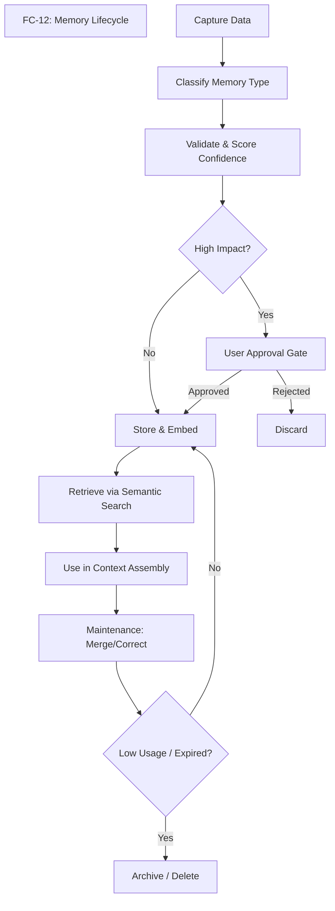
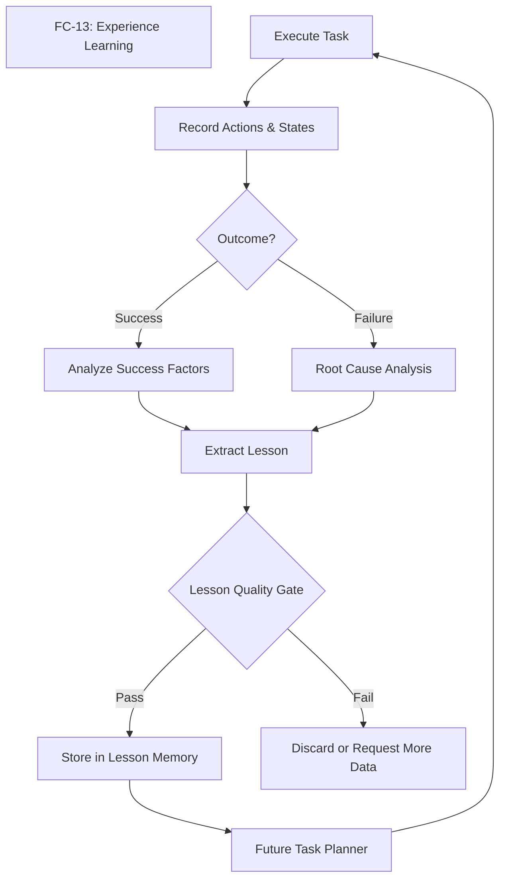
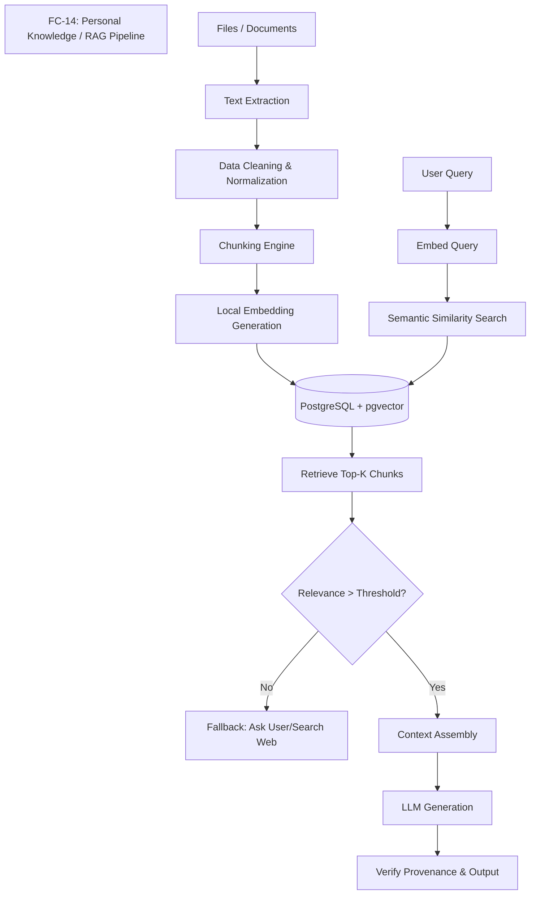
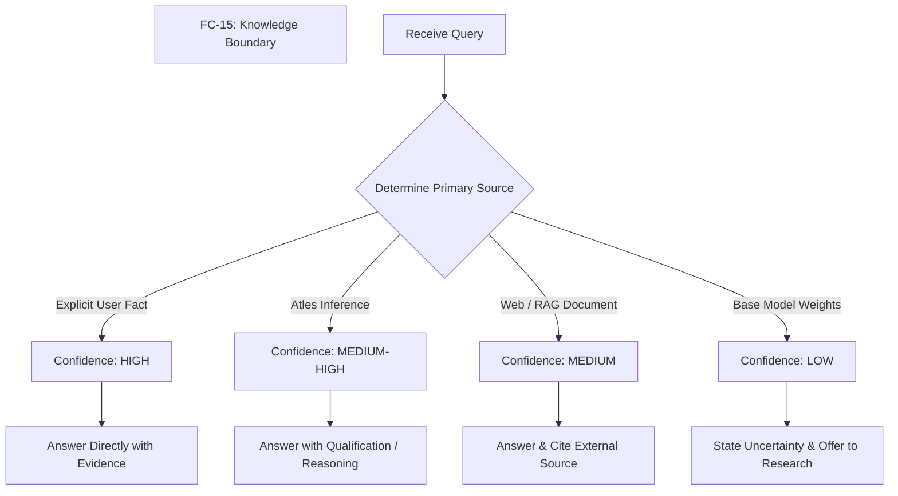
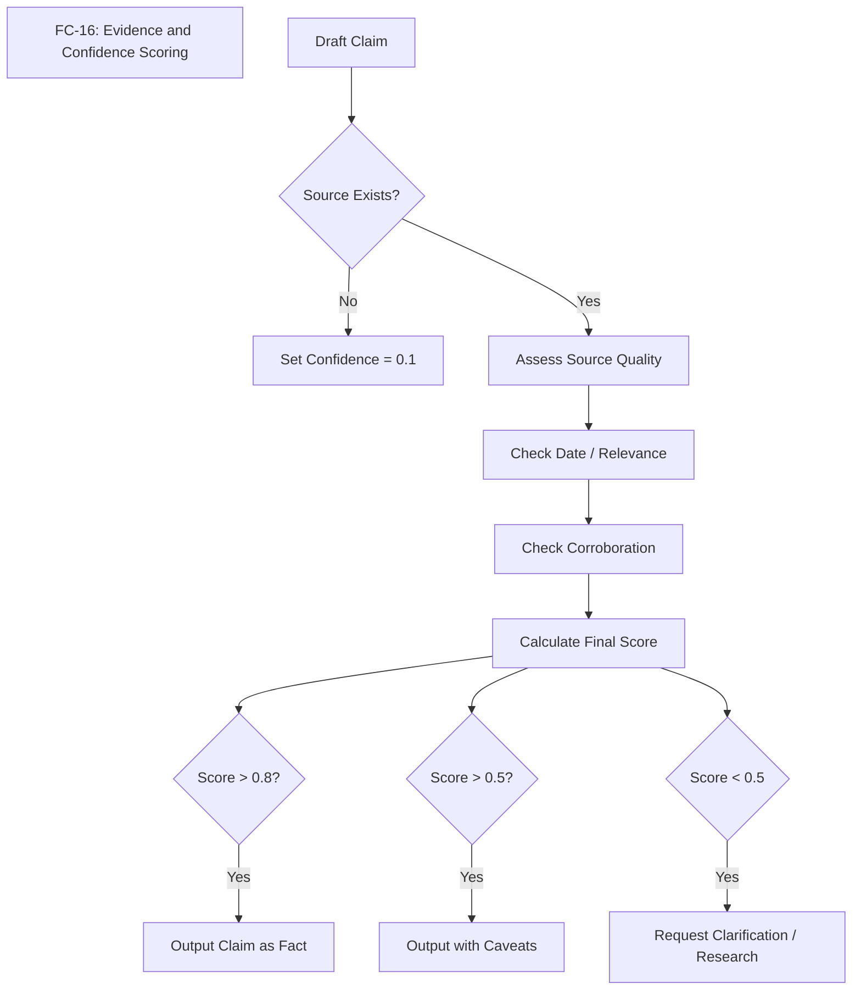

## GROUP E — MEMORY, KNOWLEDGE & EVIDENCE (STEPS 44–56)

## Step 44 — Long-Term Memory

### Purpose
Long-Term Memory is the foundational capability that enables Atles to persist knowledge, context, and semantic understanding beyond a single conversation session. Without it, Atles is just a stateless chatbot. By capturing and categorizing structured memories, Atles begins to exhibit Level 2 and Level 3 characteristics—building an ongoing model of the user's projects, preferences, and world state. This distinctively shifts Atles from merely "saving chat logs" to maintaining an active, queryable knowledge base.

### User-visible behavior
The user will observe that Atles remembers details discussed days or weeks ago without needing explicit reminders. If the user refers to "the project we started last week," Atles knows which one it is. The user can view, edit, search, and delete these memories through a dedicated "Memory Dashboard" in the frontend, ensuring full control over what the system retains.

### System behavior
When a conversation completes or reaches a natural checkpoint, the Orchestrator dispatches a background task to the Memory Agent. This agent processes the recent context window, extracting facts, decisions, and updates. It structures this information into standardized `MemoryRecord` payloads and persists them to the PostgreSQL database with vector embeddings (via `pgvector`) for semantic retrieval. During subsequent interactions, the context assembly phase retrieves relevant memories and injects them into the system prompt.

### Components
- **Memory Agent (Backend):** Analyzes conversation transcripts and extracts memory payloads.
- **PostgreSQL Database:** Relational store for memory metadata.
- **pgvector Extension:** Handles high-dimensional vector embeddings of memory content.
- **Ollama / Qwen3 4B:** Used for extraction reasoning and generating embeddings.
- **Frontend Dashboard:** React components for viewing and managing memories.

### Inputs and outputs
**Input (Conversation Chunk):**
```json
{
  "dialogue": [
    {"role": "user", "content": "I prefer using React over Vue for new web apps."},
    {"role": "assistant", "content": "Noted. I'll default to React for your web projects."}
  ]
}
```
**Output (Memory Extraction):**
```json
{
  "memory_type": "preference",
  "content": "User prefers React over Vue for web application development.",
  "confidence": 0.95
}
```

### Data and memory
This step introduces the base `MemoryRecord` table in PostgreSQL.
Data stored: memory type, content, vector embedding, creation timestamp, update timestamp, source conversation ID, and importance score.
Not stored: Exact chat logs in the memory table (those remain in conversation history); only distilled facts are stored.

### Dependencies
- **Prerequisites:** Basic chat interface (Step 1-4), database setup, Ollama integration.
- **Dependents:** Experience Memory, Project Memory, RAG pipeline, Persona Engine.

### Safety and privacy
Memories are stored locally. The user has absolute CRUD (Create, Read, Update, Delete) control over all memories. Sensitive information (passwords, tokens) must be actively filtered out by the Memory Agent using regular expressions and heuristics before persistence.

### Implementation status
PLANNED

### Acceptance criteria
- [ ] Memory Agent can extract a clear fact from a 5-turn conversation.
- [ ] Fact is saved to PostgreSQL with a pgvector embedding.
- [ ] When asked a related question in a new session, the fact is retrieved and utilized in the response.
- [ ] User can view and delete the memory via the frontend.

### Related flowcharts
- FC-12 (Memory Lifecycle)

---

## Step 45 — Project Memory

### Purpose
Project Memory structures knowledge around specific, ongoing efforts. It prevents Atles from losing the thread on complex, multi-day tasks. By formally tracking projects, Atles can maintain context on goals, requirements, constraints, and current status, acting as a true technical partner rather than a passive listener.

### User-visible behavior
The user can ask Atles "What's the status of the Atles project?" or "Let's work on the Atles backend." Atles will automatically load the project context, aware of the tech stack (Next.js, Python, FastAPI), recent decisions, and current blockers. The user can view a dedicated "Project Overview" page in the UI that summarizes this knowledge.

### System behavior
The system maintains a dedicated `ProjectMemory` schema. When user interactions are categorized as pertaining to an active project, the Memory Agent updates the project record. Before generating a response in a project context, the Orchestrator fetches the `ProjectMemory` object and formats it into a dense summary block injected into the LLM's system prompt.

### Components
- **Project Context Manager:** Service responsible for loading and updating project records.
- **PostgreSQL (`projects` table):** Stores project metadata and serialized state.
- **Frontend Project View:** UI for inspecting project states.

### Inputs and outputs
**Input (User query):**
"Let's resume work on Atles."

**Output (Injected System Prompt snippet):**
```text
[Active Project Context: Atles]
Goal: Personal AI operating layer.
Stack: Next.js, Python, FastAPI, Ollama (Qwen3 4B).
Status: Day 4 - Frontend-to-backend connection.
```

### Data and memory
Data stored includes: project name, goal, requirements, technologies, tasks, files, conversations, decisions, problems, solutions, mistakes, lessons, experiences, and results.
This is heavily structured compared to raw semantic memory.

### Dependencies
- **Prerequisites:** Long-Term Memory (Step 44).
- **Dependents:** Task execution, workspace management.

### Safety and privacy
Project data is isolated to the local machine. Users can archive or hard-delete projects. Deleting a project cascades to delete all associated project-specific memories (decisions, mistakes).

### Implementation status
PLANNED

### Acceptance criteria
- [ ] System can create a new project record from user intent.
- [ ] Project details (stack, goals) are updated automatically based on conversation.
- [ ] Loading a project successfully alters the LLM's context to reflect project specifics.

### Related flowcharts
- FC-12 (Memory Lifecycle)

---

## Step 46 — Decision Memory

### Purpose
Decision Memory tracks *why* things were done, preserving the rationale behind choices. In software development and complex workflows, the reason for a decision is often as important as the decision itself. This prevents the user and Atles from repeatedly re-evaluating the same options or forgetting why a specific constraint was adopted.

### User-visible behavior
If the user asks, "Why aren't we using a cloud API for the LLM?", Atles can check the decision memory and reply, "We decided on Day 1 to use Ollama locally because the primary constraint is a zero-dollar budget and a focus on local development."

### System behavior
When the LLM detects a significant choice being made (e.g., tech stack selection, architectural pattern), it generates a `DecisionRecord`. This record links to the active project (if any). The semantic search pipeline specifically weighs decision memories highly when the user asks "why" questions.

### Components
- **Memory Extractor:** Specialized prompt template for identifying decisions.
- **Database (`decisions` table):** Stores the structured decision record.

### Inputs and outputs
**Input (Context):**
User: "Let's stick to Qwen3 4B. The 7B models are too slow on my i5-1340P without a dedicated GPU."

**Output (DecisionRecord JSON):**
```json
{
  "decision": "Use Qwen3 4B model via Ollama",
  "project_id": "proj_atles_001",
  "alternatives": ["7B models (e.g., Llama 3 8B)"],
  "reasons": ["Intel i5-1340P hardware constraints", "No dedicated GPU", "7B is too slow"],
  "outcome": "Selected Qwen3 4B for optimal local performance"
}
```

### Data and memory
Stores: decision, date, project, alternatives, reasons, rejected options, assumptions, outcome.

### Dependencies
- **Prerequisites:** Long-Term Memory (Step 44), Project Memory (Step 45).
- **Dependents:** Architectural review, code generation context.

### Safety and privacy
Decisions are visible in the memory dashboard and can be amended if the rationale changes or was recorded incorrectly.

### Implementation status
PLANNED

### Acceptance criteria
- [ ] System correctly identifies a decision during a conversation and extracts the rationale.
- [ ] Decision record is linked to the correct project.
- [ ] User can query the rationale for a past decision and receive an accurate answer based on the record.

### Related flowcharts
- FC-12, FC-13

---

## Step 47 — Mistake Memory

### Purpose
Mistake Memory ensures Atles learns from errors, preventing the system from repeating the same failures. This is a critical component of Level 3 intelligence. When a tool call fails or the user corrects a flawed assumption, capturing this as a formal mistake allows Atles to adjust its future behavior dynamically.

### User-visible behavior
When Atles attempts a previously failed action, it will either avoid it entirely or apply the known fix. For example, if it previously tried to use a Linux-specific path on the user's Windows machine, it will remember the mistake and use Windows paths instead.

### System behavior
Triggered by explicit user correction, tool execution failures, or post-task evaluation. The system creates a `MistakeRecord`. During planning phases for new tasks, Atles queries mistake memory for similar contexts to apply preventative strategies.

### Components
- **Error Handler / Supervisor Agent:** Detects failures and prompts for mistake extraction.
- **Database (`mistakes` table):** Stores the structured mistake record.

### Inputs and outputs
**Input (Tool Execution Error):**
`FileNotFoundError: The path /tmp/scratch.py does not exist on Windows.`

**Output (MistakeRecord JSON):**
```json
{
  "what_happened": "Attempted to write to /tmp on a Windows OS.",
  "context": "File writing tool call",
  "cause": "Assumed Unix-like filesystem.",
  "impact": "Tool execution failed.",
  "fix": "Use standard Windows paths or the provided scratch directory C:\\atles\\scratch.",
  "lesson": "Always check the host OS before defining absolute paths.",
  "prevention_strategy": "Verify OS context before file operations."
}
```

### Data and memory
Stores: what happened, context, cause, impact, fix, lesson, prevention strategy. Linked via vector embeddings for semantic matching during task planning.

### Dependencies
- **Prerequisites:** Long-Term Memory (Step 44).
- **Dependents:** Lesson Memory (Step 48), Task Planner.

### Safety and privacy
Mistakes are internal state adjustments but remain fully transparent to the user to ensure alignment.

### Implementation status
PLANNED

### Acceptance criteria
- [ ] A verified tool failure automatically generates a MistakeRecord.
- [ ] When assigned a similar task, the planner retrieves the mistake and explicitly notes the prevention strategy in its plan.

### Related flowcharts
- FC-13 (Experience Learning)

---

## Step 48 — Lesson Memory

### Purpose
Lesson Memory abstracts specific mistakes and experiences into generalized rules. While Mistake Memory is highly contextual ("I failed to write to /tmp on Windows"), Lesson Memory creates a portable rule ("Always use OS-agnostic path libraries or verify the OS"). This accelerates capability growth.

### User-visible behavior
Over time, Atles becomes noticeably more robust and aligned with the user's workflow, avoiding classes of errors rather than just specific instances.

### System behavior
A background batch process (e.g., nightly or end-of-session) reviews recent `MistakeRecord` and `ExperienceRecord` entries. The LLM is prompted to synthesize these into generalized `LessonRecord` entries. These lessons are heavily weighted during the system's "Context Assembly" phase for any related tasks.

### Components
- **Reflection Agent:** Synthesizes lessons from experiences.
- **Database (`lessons` table):** Stores generalized rules and applicability conditions.

### Inputs and outputs
**Input (Multiple Mistake Records):**
1. Failed to use `/tmp` on Windows.
2. Failed to use `grep` in PowerShell.

**Output (LessonRecord JSON):**
```json
{
  "lesson": "The operating environment is Windows (PowerShell). Unix utilities and paths will fail.",
  "evidence": ["Mistake 1: /tmp failure", "Mistake 2: grep failure"],
  "applicability": ["File operations", "Shell commands"],
  "confidence": 0.98
}
```

### Data and memory
Stores: lesson statement, evidence (links to underlying experiences/mistakes), applicability context, confidence score.

### Dependencies
- **Prerequisites:** Mistake Memory (Step 47), Experience Memory (Step 49).
- **Dependents:** Context Assembly, Orchestrator.

### Safety and privacy
Lessons that significantly alter agent behavior can be flagged for user review in the dashboard before becoming fully active.

### Implementation status
PLANNED

### Acceptance criteria
- [ ] Reflection Agent can successfully merge two related mistakes into a generalized lesson.
- [ ] The lesson is retrieved and utilized when the applicability context is met in future prompts.

### Related flowcharts
- FC-13 (Experience Learning)

---

## Step 49 — Experience Memory

### Purpose
Experience Memory records complete episodic traces of complex tasks. It documents the journey: what was attempted, what actions were taken, what the result was, and why. This allows Atles to draw upon past successes (or failures) to guide complex multi-step planning, acting as a library of past performance.

### User-visible behavior
When asked to perform a complex task it has done before (e.g., "Set up a new Next.js component with Tailwind"), Atles can say, "I've done this before. I'll use the same structure we used for the ChatBubble component, avoiding the CSS clash we ran into last time."

### System behavior
After a task completes (success or failure), the Task Supervisor compiles the task graph, tool calls, and final state into an `ExperienceRecord`. This episodic memory is embedded and can be retrieved when the user requests a semantically similar task.

### Components
- **Task Supervisor:** Compiles the experience record.
- **Database (`experiences` table):** Stores the episodic trace.

### Inputs and outputs
**Input (Completed Task trace):**
Task: Create a Next.js API route.
Actions: Created file, tested endpoint, fixed import error, tested again.
Outcome: Success.

**Output (ExperienceRecord JSON):**
```json
{
  "task": "Create a Next.js API route for health checks",
  "actions": ["Wrote route.ts", "Curl test (failed: missing export)", "Fixed export", "Curl test (success)"],
  "result": "Success",
  "success_or_failure": "success",
  "reason": "Correctly adhered to App Router conventions after initial error.",
  "lesson_extracted": "Next.js App Router requires named exports for HTTP methods (GET, POST).",
  "future_recommendation": "Always verify named exports in route.ts files before testing."
}
```

### Data and memory
Stores: task description, action sequence, result, success/failure flag, reason, extracted lesson, future recommendation.

### Dependencies
- **Prerequisites:** Task execution engine.
- **Dependents:** Lesson Memory, Task Planner.

### Safety and privacy
Experiences can be large; data retention policies may compress older experiences into summaries or drop detailed tool traces to save space.

### Implementation status
PLANNED

### Acceptance criteria
- [ ] A completed multi-step task generates a structured ExperienceRecord.
- [ ] When given a similar task, the Task Planner retrieves the experience and uses its `future_recommendation`.

### Related flowcharts
- FC-13 (Experience Learning)

---

## Step 50 — Personal Knowledge

### Purpose
Personal Knowledge allows the user to directly feed Atles information—notes, documentation, research papers, or context files. This explicit knowledge base supplements the conversational memory, allowing Atles to act as a localized, private search engine and research assistant for the user's specific domains.

### User-visible behavior
The user can drop a markdown file or PDF into a designated folder (or upload via UI). Atles processes it and can instantly answer questions based on its contents, citing the specific document as the source.

### System behavior
The ingestion pipeline monitors for new files. It extracts text, chunks it, generates vector embeddings, and stores it in PostgreSQL via pgvector. When answering queries, a RAG (Retrieval-Augmented Generation) step fetches relevant chunks, which are assembled into the prompt with strict source attribution metadata.

### Components
- **Ingestion Pipeline:** File parsers, chunking logic (e.g., Langchain text splitters).
- **Embedding Model:** Local embedding model via Ollama (e.g., `nomic-embed-text` or similar).
- **pgvector Database:** Vector storage and similarity search.

### Inputs and outputs
**Input (Markdown file):**
`Atles_Architecture.md`

**Output (KnowledgeItem JSON):**
```json
{
  "source_uri": "file:///C:/atles/docs/Atles_Architecture.md",
  "content_type": "markdown",
  "chunks_created": 15,
  "status": "indexed"
}
```

### Data and memory
Stores: `KnowledgeItem` metadata (source, type, date) and related `DocumentChunk` vectors in pgvector.

### Dependencies
- **Prerequisites:** RAG pipeline (Step 54), pgvector setup.
- **Dependents:** Context Assembly, Web Research (Step 17).

### Safety and privacy
All documents remain strictly local. No data is sent to external APIs for embedding (enforced by using local Ollama models).

### Implementation status
PLANNED

### Acceptance criteria
- [ ] System successfully ingests a text file and generates embeddings.
- [ ] User can ask a question unique to the document and receive an accurate answer.
- [ ] The answer explicitly cites the file name.

### Related flowcharts
- FC-14 (Personal Knowledge / RAG)

---

## Step 51 — User Correction Memory

### Purpose
When Atles gets something wrong and the user corrects it, Atles must learn instantly and permanently. User Correction Memory captures explicit course corrections, ensuring the system respects the user's authority and overrides previous incorrect assumptions or model hallucinations.

### User-visible behavior
User: "Actually, my name is spelled with one 'm', not two."
Atles: "Understood, I've updated my records. Your name is spelled with one 'm'."
In all future interactions, Atles uses the correct spelling without fail.

### System behavior
When the user issues a correction, the system identifies the targeted piece of knowledge. It creates a `CorrectionRecord` which serves as a high-priority override. During context assembly, correction records take precedence over older memories or base model knowledge.

### Components
- **Intent Classifier:** Detects correction phrasing ("No, actually...", "That's wrong...").
- **Database (`corrections` table):** Stores the override.

### Inputs and outputs
**Input (User statement):**
"No, I don't want to use Tailwind. Use standard CSS modules."

**Output (CorrectionRecord JSON):**
```json
{
  "what_was_wrong": "Assumption that Tailwind CSS should be used for styling.",
  "corrected_info": "Use standard CSS modules instead.",
  "scope": "Project: Atles (and general preference)",
  "confidence": 1.0
}
```

### Data and memory
Stores: what was wrong, corrected info, scope (global vs project), confidence (always 1.0 for explicit user corrections).

### Dependencies
- **Prerequisites:** Long-Term Memory (Step 44).
- **Dependents:** Context Assembly.

### Safety and privacy
User corrections are treated as absolute truth within the system's context.

### Implementation status
PLANNED

### Acceptance criteria
- [ ] Explicit user correction is detected and saved as a CorrectionRecord.
- [ ] Subsequent queries retrieve the corrected info, and the system behaves accordingly.

### Related flowcharts
- FC-12 (Memory Lifecycle)

---

## Step 52 — Preference Memory

### Purpose
Preference Memory stores explicit user tastes, styles, and operational preferences. This personalization layer makes Atles feel like a tailored personal assistant rather than a generic tool.

### User-visible behavior
Atles automatically formats code exactly how the user likes it, communicates in the user's preferred tone (e.g., concise, no fluff), and avoids tools or frameworks the user dislikes, all without needing to be prompted in every session.

### System behavior
Preferences are extracted passively from conversation ("I hate writing boilerplate") or actively ("Always format Python with Ruff"). They are stored as `PreferenceRecord` entries. These are injected into the system prompt's persona/behavior guidelines.

### Components
- **Memory Extractor:** Identifies preference statements.
- **Database (`preferences` table).**

### Inputs and outputs
**Input (User statement):**
"Keep your responses short. Stop giving me long explanations unless I ask."

**Output (PreferenceRecord JSON):**
```json
{
  "preference": "Keep responses short and concise without unsolicited explanations.",
  "when_applies": "All conversational interactions",
  "confidence": 1.0,
  "user_editable": true
}
```

### Data and memory
Stores: explicit preference, when they apply, confidence, user edit/remove capability.

### Dependencies
- **Prerequisites:** Long-Term Memory.
- **Dependents:** Persona Engine, Response Generation.

### Safety and privacy
Users can view and toggle preferences in the Memory Dashboard.

### Implementation status
PLANNED

### Acceptance criteria
- [ ] System extracts a preference and applies it to the system prompt.
- [ ] User can view and delete the preference via the UI.
- [ ] Deleting the preference reverts the system's behavior.

### Related flowcharts
- FC-12 (Memory Lifecycle)

---

## Step 53 — Memory Lifecycle and Metadata

### Purpose
As memories accumulate, they can become contradictory, outdated, or overwhelming to the context window. A robust Memory Lifecycle management system ensures that knowledge remains relevant, accurate, and manageable.

### User-visible behavior
The user doesn't see the lifecycle processing directly, but benefits from Atles remaining fast and accurate even after months of use. The user can view memory metadata (when it was learned, last used) in the dashboard to understand why Atles knows something.

### System behavior
Memories progress through stages: create, store, retrieve, use, update, merge, correct, archive, delete. A background maintenance job periodically reviews memories. It merges duplicates, archives memories that haven't been accessed in a long time (decay), and resolves contradictions using LLM evaluation. Every memory is wrapped in a `MemoryMetadata` schema.

### Components
- **Memory Maintenance Worker:** Background task for deduplication and decay.
- **Database Metadata columns:** Tracking access counts and timestamps.

### Inputs and outputs
**Input (Old Memory):**
`Last used: 6 months ago, Importance: Low, Type: Temporary task detail.`

**Output (Action):**
`Status updated to: Archived. Vector embedding removed from active index.`

### Data and memory
Metadata stored: created_time, last_used, importance, confidence, source, project, type, expiry, user_visibility, user_editable.
Retention policy: High importance (decisions, preferences) never expire. Low importance (daily task details) archive after 30 days of disuse.

### Dependencies
- **Prerequisites:** All memory types (Steps 44-52).
- **Dependents:** Database performance optimization.

### Safety and privacy
Archived memories can be permanently deleted. User-defined facts are never automatically deleted, only system-inferred ones.

### Implementation status
PLANNED

### Acceptance criteria
- [ ] A background job successfully identifies and merges two similar memory records.
- [ ] Unused, low-importance memories are correctly flagged as archived after a simulated time lapse.

### Related flowcharts
- FC-12 (Memory Lifecycle)

---

## Step 54 — Personal Knowledge RAG

### Purpose
To enable Atles to answer questions and perform tasks based on large documents that cannot fit into the LLM's context window, a Retrieval-Augmented Generation (RAG) pipeline is required. This grounds Atles' reasoning in user-provided facts rather than relying solely on the LLM's pre-trained weights.

### User-visible behavior
The user asks a question about a 50-page PDF. Atles answers accurately in seconds, quoting specific sections of the document as evidence.

### System behavior
The full pipeline operates as follows:
```text
DOCUMENTS / FILES / NOTES → INGESTION → TEXT EXTRACTION → NORMALIZATION → CHUNKING → EMBEDDINGS → POSTGRESQL + PGVECTOR → SEMANTIC SEARCH → RELEVANCE FILTERING → CONTEXT ASSEMBLY → MODEL ANSWER → SOURCE/EVIDENCE CHECK → RESPONSE + CITATIONS
```
Files are parsed and normalized to plain text. Text is split into overlapping chunks (e.g., 512 tokens with 50 token overlap). Embeddings are generated using a local embedding model. At query time, the user's prompt is embedded, and a cosine similarity search is performed via `pgvector`. The top-K chunks are retrieved, filtered for a minimum relevance threshold, and assembled into the prompt context. The model generates an answer and attributes the source.

### Components
- **Ingestion Service:** File parsing (PyPDF, markdown parsers).
- **Embedding Engine:** Ollama local embedding models.
- **Vector DB:** PostgreSQL with pgvector.
- **Retrieval Service:** Semantic search and reranking.

### Inputs and outputs
**Input (Query):** "What does the master plan say about hardware?"

**Output (Context + Answer):**
Retrieved Chunk: "...Current hardware: Intel Core i5-1340P, 16GB RAM, no dedicated GPU..."
Answer: "According to the master plan (shared_context.md), the current hardware is an Intel Core i5-1340P with 16GB of RAM and no dedicated GPU."

### Data and memory
Stores: `DocumentChunk` records containing text, metadata, and vectors.
Chunk sizes: ~512 tokens. Overlap: ~50 tokens to preserve boundary context. Metadata preserved: source file path, line numbers, creation date.

### Dependencies
- **Prerequisites:** PostgreSQL, pgvector, Ollama.
- **Dependents:** Personal Knowledge (Step 50), Web Research.

### Safety and privacy
All RAG processing, including embedding generation, occurs entirely locally on the user's hardware.

### Implementation status
PLANNED

### Acceptance criteria
- [ ] A document is successfully chunked and embedded into pgvector.
- [ ] Semantic search returns the correct chunks for a relevant query.
- [ ] Model correctly synthesizes the chunks into an accurate answer with citations.

### Related flowcharts
- FC-14 (Personal Knowledge / RAG)

---

## Step 55 — Supported Knowledge Formats

### Purpose
To be a useful personal assistant, Atles must be able to read the files the user works with daily. Supporting a wide variety of formats ensures the knowledge base is comprehensive.

### User-visible behavior
The user can seamlessly upload or point Atles to PDFs, Word docs, text files, markdown, source code, and CSVs. Atles understands the structural context of each (e.g., table structure in CSVs, headings in Markdown).

### System behavior
Different parsers are routed based on file extension and MIME type.
- **PDF:** PyMuPDF/pdfplumber. (Limitations: complex layouts, scanned images without OCR). Metadata: Page numbers.
- **DOCX:** python-docx. Metadata: Paragraph styles.
- **TXT / Markdown:** Native Python reading. Metadata: Headings, line numbers.
- **Code:** Language-aware splitters (Tree-sitter). Metadata: Function/Class names, file paths.
- **CSV / Excel:** Pandas. (Limitations: extremely large files may need summary extraction instead of row-by-row vectorization). Metadata: Column headers.

### Components
- **Format Parsers:** Various Python libraries as listed above.
- **Ingestion Router.**

### Inputs and outputs
**Input:** `budget.csv`
**Output:** Chunks containing stringified rows mapped to column headers, ready for embedding.

### Data and memory
Metadata specific to the format is injected into the chunk text before embedding to ensure structural context is preserved during semantic search.

### Dependencies
- **Prerequisites:** RAG Pipeline (Step 54).

### Safety and privacy
File parsers must be robust against maliciously malformed files (e.g., zip bombs in docx). Local processing ensures data privacy.

### Implementation status
PLANNED

### Acceptance criteria
- [ ] System can ingest a PDF, DOCX, Markdown, and CSV file.
- [ ] RAG queries successfully retrieve facts from all four formats.

### Related flowcharts
- FC-14

---

## Step 56 — Knowledge Boundaries, Evidence, and Confidence

### Purpose
A Level 3 AI must know what it knows, what it doesn't know, and where its knowledge comes from. Hallucinations are fatal to trust. This step establishes strict knowledge boundaries and requires Atles to explicitly state its confidence and evidence.

### User-visible behavior
If Atles is sure, it answers directly with a citation. If it is somewhat sure, it qualifies the answer ("I believe X, but I should verify..."). If it doesn't know, it refuses to guess and offers to research. It distinguishes clearly between facts the user told it, things it inferred, and things the base model generated.

### System behavior
The system categorizes knowledge sources into:
1. **USER FACT:** Explicitly provided by the user (High confidence).
2. **ATLES INFERENCE:** Concluded by Atles based on experience/lessons (Medium-High confidence).
3. **WEB INFORMATION:** Retrieved from search/RAG (Medium confidence, depends on source).
4. **MODEL KNOWLEDGE:** From the LLM's pre-trained weights (Lowest confidence for specifics, high hallucination risk).

During generation, a `SourceAttribution` layer enforces that any factual claim is accompanied by a link to a user fact, inference record, or document chunk. If none exist, the LLM is instructed to lower its confidence score and use qualifying language.

### Components
- **Evidence Verification Agent:** Cross-checks generated claims against retrieved context.
- **Prompt Engineering:** Strict instructions on confidence grading.

### Inputs and outputs
**Input:** "What is my IP address?"
**Output:** (Internal confidence: LOW. Source: NONE). "I don't have that information in my memory. Would you like me to run a command to check your local IP?"

### Data and memory
All memory records include a `confidence` field and a `source` field. `SourceAttribution` objects are generated dynamically during responses.

### Dependencies
- **Prerequisites:** Memory schemas, RAG pipeline.
- **Dependents:** User trust, Web Research.

### Safety and privacy
Prevents the model from confidently lying to the user, which is a major safety requirement for autonomous systems.

### Implementation status
PLANNED

### Acceptance criteria
- [ ] Model refuses to confidently answer a specific factual question it has no retrieved context for.
- [ ] Model explicitly cites a "User Fact" when answering based on Correction Memory.
- [ ] Responses correctly classify the source of information provided.

### Related flowcharts
- FC-15 (Knowledge Boundary)
- FC-16 (Evidence and Confidence)

---

## REQUIRED MEMORY DATA DESIGN

This section outlines the core Pydantic schemas that power the Atles Memory System.

```python
from pydantic import BaseModel, Field
from typing import List, Optional, Literal
from datetime import datetime

# ---------------------------------------------------------
# Base Schema & Metadata
# ---------------------------------------------------------
class MemoryMetadata(BaseModel):
    created_time: datetime = Field(default_factory=datetime.utcnow)
    last_used: datetime = Field(default_factory=datetime.utcnow)
    importance: int = Field(ge=1, le=5, description="1=trivial, 5=critical")
    confidence: float = Field(ge=0.0, le=1.0)
    source: str = Field(description="Conversation ID, Document URI, or System")
    project: Optional[str] = None
    type: str
    expiry: Optional[datetime] = None
    user_visibility: bool = True
    user_editable: bool = True

class MemoryRecord(BaseModel):
    id: str
    metadata: MemoryMetadata
    content: str
    embedding_id: Optional[str] = None

# ---------------------------------------------------------
# Project Memory
# ---------------------------------------------------------
class ProjectMemory(BaseModel):
    project_name: str
    goal: str
    requirements: List[str]
    technologies: List[str]
    tasks: List[str]
    files: List[str]
    conversations: List[str]
    decisions: List[str]
    problems: List[str]
    solutions: List[str]
    mistakes: List[str]
    lessons: List[str]
    experiences: List[str]
    results: List[str]

# Example Record
example_project_memory = ProjectMemory(
    project_name="Atles",
    goal="Build a personal AI operating layer",
    requirements=["Local execution", "Zero API cost", "High memory retention"],
    technologies=["Next.js", "Python", "FastAPI", "Ollama", "Qwen3 4B"],
    tasks=["Day 1 frontend", "Day 2 backend", "Day 3 Ollama setup", "Day 4 frontend-to-backend"],
    files=["C:\\atles\\docs\\section_d.md", "C:\\atles\\backend\\main.py"],
    conversations=["conv_001", "conv_002"],
    decisions=["Use Qwen3 4B due to hardware limits", "Use pgvector for RAG"],
    problems=["7B model too slow on i5-1340P"],
    solutions=["Downgraded to 4B model"],
    mistakes=["Tried to use cloud API initially"],
    lessons=["Always verify local execution speed before committing to a model"],
    experiences=["exp_ollama_setup_001"],
    results=["Successfully returned HTTP 200 from local chat endpoint"]
)

# ---------------------------------------------------------
# Decision Memory
# ---------------------------------------------------------
class DecisionRecord(BaseModel):
    decision: str
    date: datetime = Field(default_factory=datetime.utcnow)
    project_id: Optional[str]
    alternatives: List[str]
    reasons: List[str]
    rejected_options: List[str]
    assumptions: List[str]
    outcome: str

# Example Record
example_decision = DecisionRecord(
    decision="Chose Qwen3 4B over other models",
    project_id="proj_atles",
    alternatives=["Llama 3 8B", "Mistral 7B"],
    reasons=["Hardware constraint: i5-1340P, no dedicated GPU", "Need fast inference"],
    rejected_options=["Llama 3 8B", "Mistral 7B"],
    assumptions=["4B parameters will be sufficient for extraction and routing tasks"],
    outcome="System runs smoothly locally without API costs."
)

# ---------------------------------------------------------
# Mistake Memory
# ---------------------------------------------------------
class MistakeRecord(BaseModel):
    what_happened: str
    context: str
    cause: str
    impact: str
    fix: str
    lesson: str
    prevention_strategy: str

# Example Record
example_mistake = MistakeRecord(
    what_happened="Failed to execute shell script.",
    context="Trying to list files in a directory.",
    cause="Used 'ls' command inside a Windows cmd environment instead of powershell or using 'dir'.",
    impact="Task execution failed and returned an error string.",
    fix="Use 'dir' or explicitly run in PowerShell.",
    lesson="The host environment is Windows. Standard Unix commands may fail.",
    prevention_strategy="Always use platform-agnostic Python libraries (os, pathlib) or verify shell type."
)

# ---------------------------------------------------------
# Experience Memory
# ---------------------------------------------------------
class ExperienceRecord(BaseModel):
    task: str
    actions: List[str]
    result: str
    success_or_failure: Literal["success", "failure"]
    reason: str
    lesson_extracted: str
    future_recommendation: str

# Example Record (Success)
example_experience_success = ExperienceRecord(
    task="Set up FastAPI endpoint for chat",
    actions=["Created main.py", "Defined POST /chat", "Added CORS middleware", "Tested with curl"],
    result="Endpoint responded with 200 OK",
    success_or_failure="success",
    reason="Properly configured CORS allowing frontend connection.",
    lesson_extracted="Next.js frontend requires CORS headers on FastAPI backend.",
    future_recommendation="Always add CORSMiddleware when setting up new FastAPI services."
)

# Example Record (Failure)
example_experience_failure = ExperienceRecord(
    task="Run Qwen3 14B locally",
    actions=["Pulled model via Ollama", "Sent test prompt"],
    result="System crashed/froze",
    success_or_failure="failure",
    reason="Insufficient RAM and lack of dedicated GPU for 14B model.",
    lesson_extracted="Hardware limits strictly cap model size to ~4B-7B range.",
    future_recommendation="Do not attempt to load models larger than 7B."
)

# ---------------------------------------------------------
# Lesson Memory
# ---------------------------------------------------------
class LessonRecord(BaseModel):
    lesson: str
    evidence: List[str]  # Links to Mistake or Experience IDs
    applicability: List[str]
    confidence: float

# ---------------------------------------------------------
# Preference Memory
# ---------------------------------------------------------
class PreferenceRecord(BaseModel):
    preference: str
    when_applies: str
    confidence: float
    user_editable: bool

# ---------------------------------------------------------
# Source Attribution & RAG Schemas
# ---------------------------------------------------------
class KnowledgeItem(BaseModel):
    source_uri: str
    content_type: str
    chunks_created: int
    status: str

class DocumentChunk(BaseModel):
    chunk_id: str
    source_uri: str
    text_content: str
    vector_embedding: List[float]
    metadata: dict

class SourceAttribution(BaseModel):
    claim: str
    source_type: Literal["USER_FACT", "ATLES_INFERENCE", "WEB_INFORMATION", "MODEL_KNOWLEDGE"]
    source_uri: Optional[str]
    confidence: float
```

---

## REQUIRED RAG AND KNOWLEDGE PIPELINE

### Full Pipeline Diagram
The RAG pipeline is responsible for turning static files and user notes into actionable, semantic context for the LLM.

```text
[Files/Notes] --> [Ingestion Router] --> [Format-Specific Parsers]
                                                  |
                                                  v
                                          [Text Normalization]
                                                  |
                                                  v
                                         [Chunking Engine] (e.g., 512 tokens)
                                                  |
                                                  v
[Local Embeddings (Ollama)] <----------- [Embedding Generation]
                                                  |
                                                  v
[PostgreSQL + pgvector] <--------------- [Store Chunk & Vector]

====== QUERY TIME ======

[User Query] --> [Embedding Generation] --> [Semantic Vector Search (Cosine Similarity)]
                                                  |
                                                  v
                                         [Relevance Filtering] (Threshold check)
                                                  |
                                                  v
                                         [Context Assembly] (Inject into Prompt)
                                                  |
                                                  v
[Local LLM (Qwen3 4B)] <---------------- [Prompt with Context]
                                                  |
                                                  v
[Evidence/Source Check] ----------------> [Final Answer with Citations]
```

### Detailed Stage Explanation
1. **Ingestion & Parsing:** Files are detected and routed to specific libraries (e.g., `PyMuPDF` for PDF, `python-docx` for Word). Text is extracted while preserving structural metadata (like headers or page numbers).
2. **Chunking:** The extracted text is split into smaller, overlapping segments (e.g., 512 tokens with a 50-token overlap). Overlap ensures that context at the boundaries of chunks is not lost. Metadata is attached to every chunk.
3. **Embeddings:** Each text chunk is sent to a local embedding model running on Ollama. This converts the semantic meaning of the text into a high-dimensional vector.
4. **Storage:** The text chunk, its metadata, and the vector embedding are stored in PostgreSQL using the `pgvector` extension.
5. **Retrieval (Semantic Search):** When a user asks a question, the query itself is converted into a vector. `pgvector` performs a similarity search (like cosine similarity) to find the stored chunks whose vectors are closest to the query vector.
6. **Filtering & Assembly:** The top K results are filtered to remove any low-relevance matches. The remaining high-quality chunks are formatted into a context block and injected into the system prompt.
7. **Synthesis & Attribution:** The LLM generates an answer strictly based on the provided context block, citing the specific source file and chunk used.

---

## FLOWCHARTS

### FC-12 — Memory Lifecycle

**ASCII:**
```text
+-------------------+      +-------------------+      +-------------------+
|   Capture Data    | ---> | Classify Memory   | ---> |  Validate Fact    |
| (Chat, Task, Doc) |      | (Fact, Pref, etc) |      | (User vs System)  |
+-------------------+      +-------------------+      +---------+---------+
                                                                |
                                                                v
+-------------------+      +-------------------+      +-------------------+
|     Retrieve      | <--- |   Store & Embed   | <--- | User Approval?    |
|  (Vector Search)  |      |  (PG + pgvector)  |      | (If required)     |
+---------+---------+      +-------------------+      +-------------------+
          |
          v
+-------------------+      +-------------------+      +-------------------+
|    Use in Context | ---> |  Merge / Correct  | ---> | Archive / Delete  |
|   (System Prompt) |      | (Deduplication)   |      |  (Decay / Manual) |
+-------------------+      +-------------------+      +-------------------+
```

**Mermaid:**


---

### FC-13 — Experience Learning

**ASCII:**
```text
+-------------------+      +-------------------+      +-------------------+
|  Execute Task     | ---> |  Record Actions   | ---> |  Observe Outcome  |
| (Tool calls)      |      | (Command traces)  |      | (Success/Failure) |
+-------------------+      +-------------------+      +---------+---------+
                                                                |
                                                                v
+-------------------+      +-------------------+      +-------------------+
| Extract Lesson    | <--- | Cause Analysis    | <--- | Review & Reflect  |
| (General rule)    |      | (Why did it happen)|     | (Supervisor LLM)  |
+---------+---------+      +-------------------+      +-------------------+
          |
          v
+-------------------+      +-------------------+
| Store Experience  | ---> | Apply in Future   |
| (Vector Database) |      | (Task Planning)   |
+-------------------+      +-------------------+
```

**Mermaid:**


---

### FC-14 — Personal Knowledge / RAG

**ASCII:**
```text
+----------+   +-------------+   +------------+   +-----------------+
| Files In |-->| Extract Txt |-->| Clean Data |-->| Chunk (512 tks) |
+----------+   +-------------+   +------------+   +--------+--------+
                                                           |
                                                           v
+----------+   +-------------+   +------------+   +-----------------+
| Assembly |<--| Relevance   |<--| PG Vector  |<--| Embed (Ollama)  |
| (Prompt) |   | Filter      |   | Search     |   |                 |
+----+-----+   +-------------+   +------------+   +-----------------+
     |
     v
+----------+   +-------------+
| LLM Gen  |-->| Answer with |
|          |   | Provenance  |
+----------+   +-------------+
```

**Mermaid:**


---

### FC-15 — Knowledge Boundary

**ASCII:**
```text
                       +-------------------+
                       |   Identify Query  |
                       +---------+---------+
                                 |
        +------------------------+------------------------+
        |                        |                        |
        v                        v                        v
+----------------+       +----------------+       +----------------+
|   User Fact    |       | Atles Inference|       | Model Knowledge|
| (Highest Conf) |       | (Med-High Conf)|       |  (Lowest Conf) |
+-------+--------+       +-------+--------+       +-------+--------+
        |                        |                        |
        v                        v                        v
+----------------+       +----------------+       +----------------+
| Answer Directly|       | Answer with    |       | Refuse / Offer |
| & Cite Source  |       | Qualification  |       | to Search Web  |
+----------------+       +----------------+       +----------------+
```

**Mermaid:**


---

### FC-16 — Evidence and Confidence

**ASCII:**
```text
+-------------+     +----------------+     +---------------+
| Make Claim  | --> | Locate Source  | --> | Assess Quality|
| (Draft Ans) |     | (Memory/RAG)   |     | (Primary/Sec) |
+-------------+     +-------+--------+     +-------+-------+
                            |                      |
                            v                      v
+-------------+     +----------------+     +---------------+
| Final Score | <-- | Corroboration  | <-- | Date/Relevance|
| (0.0 - 1.0) |     | (Multiple src) |     | (Is it fresh?)|
+------+------+     +----------------+     +---------------+
       |
       v
+-------------+
| Output or   |
| Discard/Ask |
+-------------+
```

**Mermaid:**


---

### FC-17 — Web Research

**ASCII:**
```text
+----------+   +----------+   +----------+   +-----------+
| Question |-->| Search   |-->| Fetch    |-->| Extract   |
| Received |   | Queries  |   | Sources  |   | Content   |
+----------+   +----------+   +----------+   +-----+-----+
                                                   |
                                                   v
+----------+   +----------+   +----------+   +-----------+
| Synthesize|<-| Resolve  |<--| Compare  |<--| Contradict|
| Answer   |   | Conflicts|   | Sources  |   | Detection |
+----+-----+   +----------+   +----------+   +-----------+
     |
     v
+----------+   +----------+
| Add to   |<--| Format   |
| Memory   |   | Citations|
| (Option) |   |          |
+----------+   +----------+
```

**Mermaid:**
```mermaid
flowchart TD
    title[FC-17: Web Research Workflow]
    
    A[Question Received] --> B[Generate Search Queries]
    B --> C[Execute Search (e.g., DuckDuckGo)]
    C --> D[Collect Top URLs]
    
    D --> E[Scrape / Extract Content]
    E --> F[Compare Extracted Facts]
    
    F --> G{Contradictions Found?}
    G -- Yes --> H[Prioritize High-Auth Sources / Verify]
    G -- No --> I[Synthesize Information]
    H --> I
    
    I --> J[Generate Final Answer]
    J --> K[Format Citations / Links]
    
    K --> L{Important Fact?}
    L -- Yes --> M[Save to Long-Term Memory]
    L -- No --> N[End Workflow]
```
