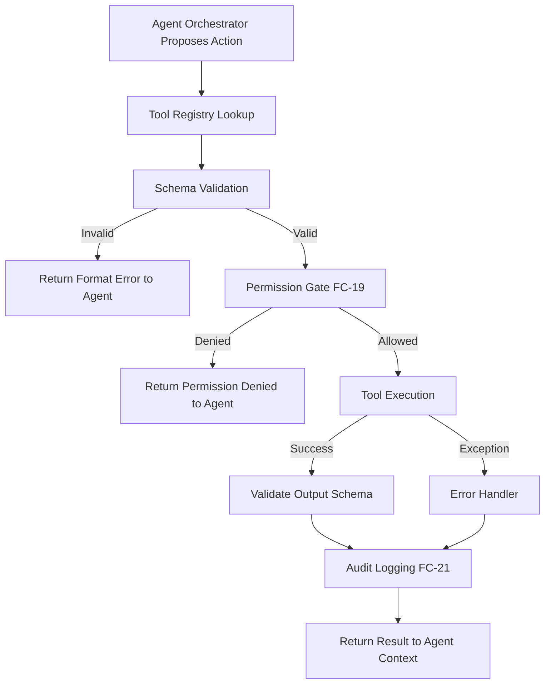
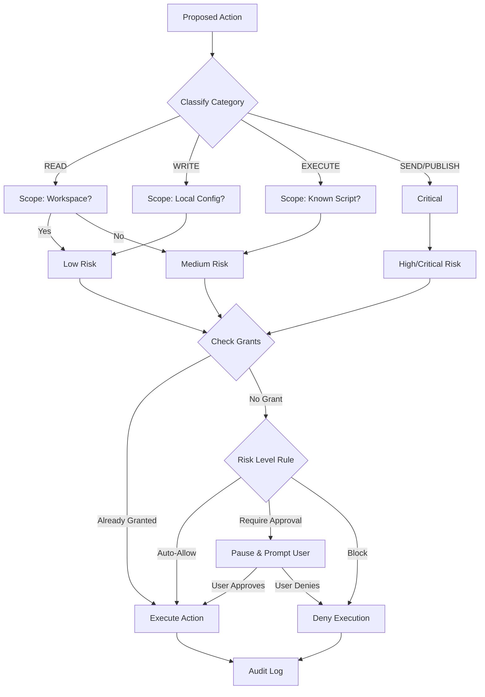
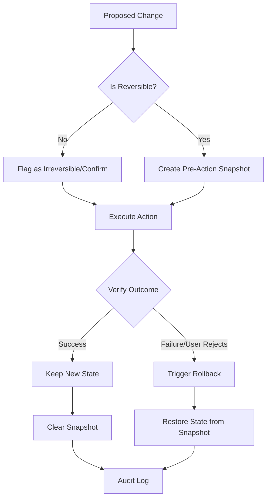
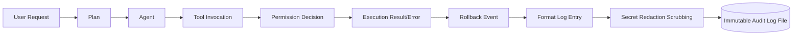

## GROUP F — RESEARCH, TOOLS & COMPUTER CONTROL (STEPS 57–67)

## Step 57 — Web Research System

### Purpose
To enable Atles to gather information from the external internet when internal knowledge or base model knowledge is insufficient, outdated, or requires factual backing. This step allows the system to conduct multi-source research, synthesize findings, and provide citations for its claims.

### User-visible behavior
When a user asks a question about current events, specific documentation, or complex topics, Atles will indicate it is searching the web. It will return a synthesized answer that cites sources (e.g., [1], [2]) rather than hallucinating. The user can view the specific queries Atles used to find the information and the raw sources it consulted.

### System behavior
The orchestrator agent determines a research query is needed and delegates to a specialized Research Agent. The Research Agent formulates 1-3 search queries. It uses a search tool (e.g., DuckDuckGo, Serper API) to retrieve search results. It may then use a `read_website` tool to extract text from the top 2-3 pages. The agent compares the extracted information across sources, specifically looking for contradictions or corroborations. It synthesizes the findings into a coherent summary, citing the sources, and returns this to the orchestrator.

### Components
- **Research Agent**: Specialized sub-agent prompt for query formulation and synthesis.
- **Search Tool**: Integration with a web search API.
- **Web Reader Tool**: A tool to fetch and extract clean text from HTML pages (e.g., using BeautifulSoup or Trafilatura).
- **Orchestrator**: Decides when to trigger research and incorporates the results.

### Inputs and outputs

**Input to Research Agent:**
```json
{
  "topic": "Latest features in Next.js 16 App Router",
  "depth": "comprehensive",
  "max_sources": 3
}
```

**Output from Research Agent (ResearchResult Schema):**
```python
from pydantic import BaseModel
from typing import List, Optional

class Source(BaseModel):
    url: str
    title: str
    snippet: str
    trust_score: float # 0.0 to 1.0

class Contradiction(BaseModel):
    claim_a: str
    source_a_url: str
    claim_b: str
    source_b_url: str
    resolution_strategy: str

class ResearchResult(BaseModel):
    summary: str
    sources_used: List[Source]
    contradictions_found: List[Contradiction]
    unanswered_aspects: List[str]
```

### Data and memory
- **Read**: User query, existing context.
- **Stored**: The final `ResearchResult` is stored in short-term memory (conversation history). High-value facts may be extracted later into semantic memory.
- **Updated**: None directly.
- **Deliberately not stored**: Raw HTML of scraped websites is discarded after synthesis to save space.

### Dependencies
- Depends on: Step 24 (Agent Orchestration), Step 59 (Tool System).
- Required by: Step 68 (Long-term Fact Memory).

### Safety and privacy
- **Privacy Mode constraint**: If Atles is in "LOCAL ONLY" or "PRIVATE" mode, web research is blocked unless explicitly overridden.
- **Data leakage**: Search queries must not contain sensitive personal information (PII) or secrets. The Research Agent must be instructed to sanitize queries.
- **Execution limits**: Hard timeouts on web requests to prevent hanging.

### Implementation status
PLANNED

### Acceptance criteria
- [ ] Atles can successfully query a search API and retrieve links.
- [ ] Atles can scrape text from a standard article page.
- [ ] Atles synthesizes answers from at least two sources and includes inline citations.
- [ ] If two sources contradict, Atles explicitly mentions the contradiction in its response.
- [ ] Web search fails gracefully if the network is down or API limits are reached.

### Related flowcharts
- FC-12 (Sub-agent Orchestration)


## Step 58 — Source Verification

### Purpose
To ensure that the information gathered by Atles is reliable, up-to-date, and structurally sound. This prevents the system from confidently presenting outdated or biased information as fact, improving overall trustworthiness.

### User-visible behavior
When providing researched answers, Atles may append a "Confidence Level" or a "Verification Note". If a source seems dubious or outdated, Atles will explicitly warn the user (e.g., "Note: The only source for this is a forum post from 2019, so it may not be accurate for the current version.").

### System behavior
During the research phase (Step 57), after text is extracted from a source, it is passed through a Verification Module. This module uses a lightweight prompt to evaluate the source based on domain reputation (e.g., official docs vs. personal blog), publication date, and tone (objective vs. opinionated). The verification score influences how heavily the source is weighted in the final synthesis.

### Components
- **Verification Evaluator**: A prompt-based evaluation step within the Research Agent.
- **Domain Allowlist/Denylist**: A configuration file of highly trusted domains (e.g., `*.gov`, `*.edu`, `docs.microsoft.com`) and known unreliable domains.

### Inputs and outputs

**Input to Verification Evaluator:**
```json
{
  "url": "https://random-forum.com/thread/123",
  "content_snippet": "I think they removed that feature in v15.",
  "claim_to_verify": "Feature X was removed in v15."
}
```

**Output from Verification Evaluator (SourceEvaluation Schema):**
```python
from pydantic import BaseModel

class SourceEvaluation(BaseModel):
    relevance_score: int # 1-10
    recency_confidence: str # "high", "medium", "low", "unknown"
    source_type: str # "official_docs", "news", "forum", "blog", "unknown"
    potential_bias: str
    overall_reliability_score: float # 0.0 to 1.0
    limitations: str
```

### Data and memory
- **Read**: Extracted web content.
- **Stored**: The `overall_reliability_score` is attached to the source in the `ResearchResult`.
- **Updated**: None.
- **Deliberately not stored**: The intermediate reasoning for the evaluation is discarded.

### Dependencies
- Depends on: Step 57 (Web Research System).
- Required by: Step 68 (Long-term Fact Memory).

### Safety and privacy
- Evaluation must be objective and resilient to prompt injection attacks hidden in the scraped web content.

### Implementation status
PLANNED

### Acceptance criteria
- [ ] Official documentation links are consistently scored higher than forum posts.
- [ ] Outdated articles (e.g., > 3 years old for tech topics) are flagged with low recency confidence.
- [ ] The final response to the user reflects the uncertainty if only low-reliability sources are found.

### Related flowcharts
- FC-18 (Tool Registry and Invocation)


## Step 59 — Tool System

### Purpose
To define a standardized, secure architecture for Atles to interact with the environment through discrete capabilities (tools). This moves Atles from a passive text generator to an active agent that can read files, run commands, and control the computer.

### User-visible behavior
The user sees Atles state what actions it is taking ("I am searching your local files for 'database config'...", "I am running the test suite..."). Atles can manipulate the local file system and execute commands as if the user were doing it.

### System behavior
The Orchestrator agent has access to a Tool Registry. It generates a structured request to call a tool. The system intercepts this request, validates it against the tool's schema, checks permissions (Step 64), executes the underlying Python function, and returns the result to the agent's context.

### Components
- **Tool Registry**: A central dictionary of available tools.
- **Tool Executor**: The engine that safely runs the tool and handles timeouts/errors.
- **Tool Definitions**: Standardized interfaces for each capability.

### Inputs and outputs

**ToolDefinition Schema:**
```python
from pydantic import BaseModel
from typing import Dict, Any, Callable

class ToolDefinition(BaseModel):
    name: str
    description: str
    input_schema: Dict[str, Any] # JSON Schema definition
    output_schema: Dict[str, Any] # JSON Schema definition
    permission_category: str # e.g., "READ", "WRITE", "EXECUTE"
    risk_level: str # "low", "medium", "high"
    timeout_seconds: int
    
    # Internal executable function
    # func: Callable 
```

**Example Tool Definitions:**
1. **`read_file`**: Reads content of a file. Risk: Low. Perm: READ.
2. **`create_file`**: Writes new content. Risk: Medium. Perm: WRITE.
3. **`run_python`**: Executes a python script in a sandbox. Risk: High. Perm: EXECUTE.
4. **`search_files`**: Finds files by name/content. Risk: Low. Perm: READ.
5. **`open_browser`**: Opens a URL. Risk: Medium. Perm: NETWORK.

### Data and memory
- **Read**: Tool definitions, tool schemas.
- **Stored**: Tool execution results in context history.
- **Updated**: State of the local machine (if using WRITE/EXECUTE tools).
- **Deliberately not stored**: Massive tool outputs (e.g., a 10MB log file) are truncated before entering context memory.

### Dependencies
- Depends on: Step 24 (Agent Orchestration).
- Required by: Step 61 (File/Terminal Tools), Step 62 (Computer Control).

### Safety and privacy
- Tools are the primary vector for risk. Every tool must have a defined `risk_level` and `permission_category`.
- High-risk tools require explicit user confirmation (Step 64).

### Implementation status
PLANNED

### Acceptance criteria
- [ ] Atles can successfully list available tools.
- [ ] Atles can formulate a syntactically correct tool call.
- [ ] The system intercepts malformed tool calls and returns a schema error to the agent for correction.
- [ ] A tool exceeding its `timeout_seconds` is forcefully terminated.

### Related flowcharts
- FC-18 (Tool Registry and Invocation)


## Step 60 — Browser Automation

### Purpose
To allow Atles to interact with dynamic, JavaScript-heavy web applications that cannot be scraped with simple HTTP requests. This enables workflows like logging into services, navigating dashboards, or testing web apps.

### User-visible behavior
A visible browser window may open, and the user can watch Atles click links, type into fields, and navigate pages to complete a requested task. Alternatively, this can run headlessly.

### System behavior
Atles uses a tool that interfaces with Playwright. It can request actions like `navigate`, `click`, `fill`, and `extract_html`. The browser automation system handles waiting for elements to load, managing sessions, and taking screenshots of the viewport for visual verification.

### Components
- **Playwright Controller**: Python wrapper around Playwright.
- **Browser Automation Tools**: Exposes Playwright capabilities to the agent.
- **DOM Parser**: Simplifies HTML into a readable format for the agent (e.g., extracting accessibility trees or simplified markdown).

### Inputs and outputs

**BrowserAction Schema:**
```python
from pydantic import BaseModel
from typing import Optional

class BrowserAction(BaseModel):
    action_type: str # "navigate", "click", "fill", "read", "screenshot"
    target_url: Optional[str] = None
    selector: Optional[str] = None
    text_to_fill: Optional[str] = None
```

**Navigation Workflow:**
1. Agent calls `navigate(url)`.
2. System waits for page load.
3. System returns simplified DOM and a screenshot to the agent.
4. Agent identifies the login button and calls `click(selector="#login")`.

### Data and memory
- **Read**: Web page DOM, user credentials (if authorized).
- **Stored**: Screenshots (temporarily), session cookies (if persistence is requested).
- **Updated**: Web application state.
- **Deliberately not stored**: Passwords are never logged or stored in plain text.

### Dependencies
- Depends on: Step 59 (Tool System).
- Required by: Step 63 (Screen and Vision Integration).

### Safety and privacy
- **Safety constraints**: Browser automation must not interact with financial institutions or sensitive accounts without extreme, per-action confirmation.
- Sandboxed browser context prevents access to the user's primary browser cookies and history.

### Implementation status
FUTURE

### Acceptance criteria
- [ ] Atles can open a webpage using Playwright.
- [ ] Atles can locate a specific input field and type text into it.
- [ ] Atles can click a submit button and wait for the subsequent page to load.
- [ ] Errors (e.g., element not found) are returned cleanly to the agent.

### Related flowcharts
- FC-18 (Tool Registry and Invocation)


## Step 61 — File, Terminal, Git, API, and Python Tools

### Purpose
To equip Atles with the essential tools needed for software development and system administration, transforming it into a capable coding assistant and local workshop operator.

### User-visible behavior
The user can ask Atles to "create a new React component", "commit these changes", or "run the tests". Atles will execute the corresponding file edits, git commands, and terminal scripts to accomplish the task.

### System behavior
These tools wrap standard OS operations. 
- **File Tools**: Provide atomic reads and writes.
- **Terminal Tools**: Run shell commands in a specified working directory, capturing stdout and stderr.
- **Git Tools**: Provide structured interfaces to git commands to avoid terminal parsing errors.
- **Python Tools**: Allow the agent to write a quick script to process data or test logic, running it in a restricted environment.

### Components
- **File Operations Module**: `os`, `shutil`, `pathlib` wrappers.
- **Terminal Operations Module**: `subprocess` wrappers with strict timeouts and output limits.
- **Git Wrapper**: Integration with GitPython or simple CLI wrappers.

### Inputs and outputs

**Schemas:**
```python
from pydantic import BaseModel
from typing import List

class FileOperation(BaseModel):
    operation: str # "read", "write", "patch"
    filepath: str
    content: str = ""

class ShellCommand(BaseModel):
    command: str
    cwd: str
    timeout: int = 30

class GitOperation(BaseModel):
    command: str # "status", "commit", "push"
    args: List[str]
```

### Data and memory
- **Read**: Local files, git status.
- **Stored**: Modified files on disk.
- **Updated**: Local repository state.
- **Deliberately not stored**: Outputs of long-running terminal commands are truncated (e.g., last 100 lines) before entering the agent's memory.

### Dependencies
- Depends on: Step 59 (Tool System).
- Required by: Step 62 (Computer Control).

### Safety and privacy
- **Terminal tools** are incredibly dangerous (`rm -rf /`). Strict blocklists for commands.
- Shell commands should default to running without elevated privileges (no `sudo` unless explicitly requested and confirmed).

### Implementation status
PLANNED

### Acceptance criteria
- [ ] Agent can read a file, modify a specific function, and write it back.
- [ ] Agent can run `npm run test` and read the output.
- [ ] Agent can stage files and create a git commit with a generated message.
- [ ] Agent attempting to run a blocked command (e.g., `format c:`) is immediately denied.

### Related flowcharts
- FC-18 (Tool Registry and Invocation), FC-19 (Permission System)


## Step 62 — Computer Control

### Purpose
To provide a holistic framework for Atles to take open-ended actions on the user's computer, mimicking how a human operates a machine safely and methodically.

### User-visible behavior
When asked to perform a complex task (e.g., "Organize my downloads folder by file type"), Atles breaks down the steps, explains its plan, asks for permission, executes the moves, and reports the final status.

### System behavior
The Computer Control loop follows a strict pattern:
1. **OBSERVE**: Gather current state (list files, check current directory).
2. **UNDERSTAND**: Relate state to the goal.
3. **PLAN**: Draft a sequence of tools to use.
4. **PERMISSION**: Check if the plan requires user approval (Step 64).
5. **ACT**: Execute the tools.
6. **OBSERVE**: Check the results of the action.
7. **VERIFY**: Did the action achieve the intended step in the plan?
Safe failure paths ensure that if an action fails, Atles stops and asks for help rather than blindly continuing.

### Components
- **Control Loop Engine**: A state machine managing the OBSERVE-ACT-VERIFY cycle.
- **Planning Module**: Agent prompt structured for step-by-step breakdown.

### Inputs and outputs

**ComputerAction Schema:**
```python
from pydantic import BaseModel
from typing import List, Any

class ActionStep(BaseModel):
    step_number: int
    description: str
    tool_name: str
    tool_args: dict

class ComputerPlan(BaseModel):
    goal: str
    steps: List[ActionStep]
    estimated_risk: str
```

### Data and memory
- **Read**: System state via observation tools.
- **Stored**: The plan and execution logs.
- **Updated**: File system or application state.
- **Deliberately not stored**: N/A.

### Dependencies
- Depends on: Step 61 (File/Terminal Tools), Step 64 (Permission System).
- Required by: Step 67 (Safe Execution).

### Safety and privacy
- The VERIFY step is critical. If Atles expects a file to exist after moving it, and it doesn't, it must halt and trigger a safe recovery path or rollback.

### Implementation status
FUTURE

### Acceptance criteria
- [ ] Atles successfully executes a multi-step plan involving reading, creating, and moving files.
- [ ] If a step fails (e.g., target folder doesn't exist), Atles detects the failure and adjusts the plan or halts.
- [ ] Atles accurately assesses the overall risk of a multi-step plan.

### Related flowcharts
- FC-18 (Tool Registry and Invocation)


## Step 63 — Screen and Vision Integration

### Purpose
To allow Atles to "see" the computer screen, enabling interaction with GUI applications that do not have APIs or DOMs, and providing spatial awareness for desktop automation.

### User-visible behavior
Atles can answer questions like "What is open on my screen right now?" or "Click the red button in the app on the left."

### System behavior
This step requires a capable Vision-Language Model (VLM). The workflow is:
1. **Screenshot**: Capture the current display or specific window.
2. **Vision Model Processing**: Pass the image to the VLM with a prompt to identify UI elements or understand context.
3. **Target Detection**: Determine bounding boxes or coordinates for specific elements (e.g., "Find the coordinates of the 'Save' icon").
4. **Action Planning**: Decide on a mouse movement or click.
5. **Permission**: Request approval if required.
6. **Execution**: Use desktop automation tools (e.g., `pyautogui`) to move the mouse and click.
7. **Verification**: Take another screenshot to verify the UI state changed as expected.

### Components
- **Screen Capture Utility**: Uses OS-level APIs to grab screenshots.
- **Vision-Language Model (VLM)**: Requires an upgrade to the local model (e.g., LLaVA or a vision-capable Qwen variant).
- **Desktop Automation Library**: For simulating mouse and keyboard events.

### Inputs and outputs
- **Input**: User request + screenshot image array.
- **Output**: Agent determines `{"action": "click", "x": 450, "y": 300}`.

### Data and memory
- **Read**: Screen pixels.
- **Stored**: Screenshots may be kept temporarily in memory during the execution loop but should be discarded immediately after to preserve privacy and memory.
- **Updated**: GUI state.
- **Deliberately not stored**: Permanent retention of screenshots is strictly prohibited unless explicitly requested by the user for a specific artifact.

### Dependencies
- Depends on: Step 62 (Computer Control).
- Required by: Advanced GUI automation.

### Safety and privacy
- **High Privacy Risk**: Screenshots can capture passwords, private messages, or sensitive documents.
- **Requirement**: Vision processing MUST happen locally (LOCAL ONLY mode) unless the user explicitly grants temporary CLOUD ENABLED permission for a specific screenshot.

### Implementation status
FUTURE

### Acceptance criteria
- [ ] System can capture a screenshot and pass it to a local vision model.
- [ ] Vision model can accurately describe the dominant applications visible.
- [ ] System can calculate coordinates of a described UI element within a 5% margin of error.

### Related flowcharts
- FC-18 (Tool Registry and Invocation)


## Step 64 — Permission System

### Purpose
To establish a robust, categorical security boundary that prevents Atles from taking destructive or unauthorized actions, ensuring the user remains in control.

### User-visible behavior
When Atles attempts a risky action (like deleting a file or sending an email), the UI pauses and presents a clear prompt: "Atles wants to execute `rm -rf ./temp`. Allow? [Yes] [No] [Always allow for this folder]".

### System behavior
Every tool is mapped to a permission category. When a tool is invoked, the Permission System checks:
1. What category is this?
2. What is the scope? (e.g., `WRITE` to `C:\atles\docs` vs `WRITE` to `C:\Windows`).
3. Does the agent have pre-approved standing permission for this category and scope?
4. If not, pause execution, queue a user approval request, and wait.

### Components
- **Permission Gatekeeper**: Middleware that intercepts tool calls.
- **Permission Rules Engine**: Evaluates scope and existing grants.
- **Approval UI**: Frontend component to display pending requests.

### Inputs and outputs

**PermissionRequest Schema:**
```python
from pydantic import BaseModel
from typing import Optional

class PermissionRequest(BaseModel):
    tool_name: str
    category: str # "READ", "WRITE", "EXECUTE", "DELETE", "NETWORK", "INSTALL", "SEND", "PUBLISH"
    scope: str # e.g., filepath, URL, command
    risk_level: str
    rationale: str
```

**Risk Classification Table:**

| Category | Example Action | Risk Level | Default Rule |
| :--- | :--- | :--- | :--- |
| **READ** | Read local workspace file | Low | Auto-allow in workspace |
| **READ** | Read system file (`/etc/passwd`) | Medium | Require approval |
| **WRITE** | Create file in workspace | Low | Auto-allow |
| **EXECUTE**| Run `npm test` | Medium | Require approval (or session grant) |
| **DELETE** | Delete file | High | Require approval |
| **NETWORK**| Fetch API data | Medium | Require approval based on domain |
| **INSTALL**| `pip install x` | High | Require approval |
| **SEND** | Send email/message | High | ALWAYS Require approval |
| **PUBLISH**| `git push`, post to social | Critical | ALWAYS Require approval |

### Data and memory
- **Read**: Permission rules, current user session grants.
- **Stored**: Granted permissions (until revoked or session ends).
- **Updated**: Audit log of permission decisions.
- **Deliberately not stored**: N/A.

### Dependencies
- Depends on: Step 59 (Tool System).
- Required by: Step 67 (Safe Execution).

### Safety and privacy
- This is the core safety mechanism. Fail-closed architecture: if a rule is missing or errors out, permission is DENIED.

### Implementation status
PLANNED

### Acceptance criteria
- [ ] Tools categorized as LOW risk execute without prompting.
- [ ] Tools categorized as HIGH risk pause and require explicit user input via the frontend.
- [ ] Denying a permission cleanly halts the agent's current plan and informs the agent of the denial.

### Related flowcharts
- FC-19 (Permission System)


## Step 65 — Undo and Rollback

### Purpose
To mitigate the impact of mistakes made by the agent. Since Atles operates autonomously, it needs the ability to revert changes if verification fails or the user rejects the outcome.

### User-visible behavior
If Atles modifies a code file and breaks the build, it can automatically revert the file to its previous state. The user can also click an "Undo Last Action" button in the UI for supported actions.

### System behavior
Before a `WRITE`, `DELETE`, or `EXECUTE` action that modifies state, the system creates a lightweight checkpoint. 
- For files: A copy of the file is saved to a temporary snapshot directory.
- For Git: A temporary branch or stash might be used.
If the agent detects a failure, or the user requests a rollback, the system restores the state from the checkpoint.

### Components
- **Checkpoint Manager**: Creates and stores pre-action snapshots.
- **Rollback Executor**: Reverses specific actions based on the checkpoint data.

### Inputs and outputs

**Schemas:**
```python
from pydantic import BaseModel
from typing import Any

class Checkpoint(BaseModel):
    checkpoint_id: str
    action_type: str # "file_modify", "file_delete"
    target: str
    original_state: Any # e.g., file contents
    timestamp: str

class RollbackRequest(BaseModel):
    checkpoint_id: str
    reason: str
```

### Data and memory
- **Read**: Original state before modification.
- **Stored**: Snapshots of files/data in a `.atles/checkpoints` directory.
- **Updated**: Restores file system state upon rollback.
- **Deliberately not stored**: Checkpoints are ephemeral and cleared out periodically (e.g., older than 24 hours).

### Dependencies
- Depends on: Step 61 (File Tools).
- Required by: Step 67 (Safe Execution).

### Safety and privacy
- **Disclaimer**: Never promise every action can be undone. Sending an email, pushing to a remote repo, or running certain irreversible terminal commands cannot be reliably rolled back. The system must know which actions are irreversible and flag them with higher permission requirements.

### Implementation status
PLANNED

### Acceptance criteria
- [ ] System automatically saves a copy of a file before overwriting it.
- [ ] System successfully restores the file if a rollback is triggered.
- [ ] Irreversible actions are clearly identified and skip the checkpoint process, requiring explicit user confirmation instead.

### Related flowcharts
- FC-20 (Undo and Rollback)


## Step 66 — Audit Log

### Purpose
To provide complete transparency into what Atles is doing, has done, and why. This is crucial for debugging, security review, and building user trust.

### User-visible behavior
The user can view a structured timeline or table showing every tool Atles executed, the permission granted, the outcome, and any errors.

### System behavior
Every significant event in the agent loop (planning, tool invocation, permission decision, tool execution result) generates an immutable log entry. These entries are written to a structured JSONL file or local database table.

### Components
- **Audit Logger**: Middleware that listens to events across the system.
- **Log Viewer**: Frontend interface to filter and search logs.

### Inputs and outputs

**AuditLogEntry Schema:**
```python
from pydantic import BaseModel
from typing import Optional, Dict, Any

class AuditLogEntry(BaseModel):
    timestamp: str
    session_id: str
    agent_name: str
    action_type: str # "plan", "tool_call", "permission_grant", "error"
    target: str # What was acted upon
    details: Dict[str, Any] # Inputs/Outputs, excluding secrets
    status: str # "success", "denied", "failed", "rolled_back"
```

### Data and memory
- **Read**: System events.
- **Stored**: Append-only log file on disk.
- **Updated**: Log file is appended.
- **Deliberately not stored**: Passwords, API keys, and sensitive environment variables MUST be redacted before logging.

### Dependencies
- Depends on: Step 24 (Agent Orchestration), Step 59 (Tool System), Step 64 (Permission System).
- Required by: System administration and debugging.

### Safety and privacy
- **Secret redaction** is paramount. The logger must use regex or specific field exclusion to ensure credentials never enter the audit log.

### Implementation status
PLANNED

### Acceptance criteria
- [ ] Every executed tool generates an audit log entry.
- [ ] Permission denials are logged.
- [ ] Known dummy secrets (e.g., `sk-12345...`) passed into a tool are redacted in the log output (e.g., `sk-***`).

### Related flowcharts
- FC-21 (Audit Trail)


## Step 67 — Safe Computer-Agent Execution

### Purpose
To integrate tools, permissions, computer control, vision, rollback, and auditing into a cohesive, safe execution environment. This is the master loop that makes Atles a reliable operator.

### User-visible behavior
Atles performs complex tasks reliably. If it gets stuck, it stops and asks. If it makes a dangerous move, it asks for permission. If it breaks something locally, it rolls it back. The user feels entirely in control of an autonomous system.

### System behavior
This step defines the integration wiring. The Orchestrator proposes a plan. The Control Loop picks up the first step. It maps the step to a Tool. The Permission System checks it. The Checkpoint system backs up the target. The Tool executes. The result is Audited. The Control Loop Verifies. If verification fails, Rollback is triggered. If it succeeds, it moves to the next step.

### Components
- **Integration Engine**: The master controller tying Steps 59-66 together.

### Inputs and outputs
- Relies on the schemas defined in Steps 59-66.

### Data and memory
- Integrates all data flows from the component steps.

### Dependencies
- Depends on: Steps 59, 60, 61, 62, 63, 64, 65, 66.
- Required by: Future advanced autonomous capabilities.

### Safety and privacy
- This step acts as the final safety net, ensuring no individual component bypasses the security or privacy controls.

### Implementation status
FUTURE

### Acceptance criteria
- [ ] A complex, multi-tool task correctly traverses the entire pipeline: Plan -> Checkpoint -> Permission -> Execute -> Verify -> Audit.
- [ ] An interruption (user clicks "Stop") cleanly halts execution, rolls back in-progress risky changes, and logs the interruption.

### Related flowcharts
- FC-18, FC-19, FC-20, FC-21


## FLOWCHARTS

### FC-18 — Tool Registry and Invocation

```text
+-------------------+       +---------------------+       +-----------------------+
|  Agent Orchestrator| ----> |  Tool Registry /    | ----> |  Schema Validation    |
|  (Proposes Action)|       |  Lookup             |       |  (Check Inputs)       |
+-------------------+       +---------------------+       +-----------------------+
                                                                     |
                                                                     v
                                                          +-----------------------+
                                                          |  Permission Gate      |
                                                          |  (FC-19)              |
                                                          +-----------------------+
                                                                     | (Allowed)
                                                                     v
+-------------------+       +---------------------+       +-----------------------+
|  Return Result to | <---- |  Audit Logging      | <---- |  Tool Execution       |
|  Agent Context    |       |  (FC-21)            |       |  (Run Python/Shell)   |
+-------------------+       +---------------------+       +-----------------------+
                                                                     | (Error)
                                                                     v
                                                          +-----------------------+
                                                          |  Error Handler /      |
                                                          |  Format for Agent     |
                                                          +-----------------------+
```



### FC-19 — Permission System

```text
+-------------------+
|  Proposed Action  |
|  (Tool + Args)    |
+-------------------+
          |
          v
+-------------------+       +-------------------+       +-------------------+
| Classify Category | ----> |  Assess Scope &   | ----> | Check Existing    |
| (READ, WRITE...)  |       |  Risk Level       |       | Session Grants    |
+-------------------+       +-------------------+       +-------------------+
                                                              |
          +-----------------------+-----------------------+---+
          |                       |                       |
          v                       v                       v
+-------------------+   +-------------------+   +-------------------+
|  Auto-Allow       |   |  Require Approval |   |  Block / Deny     |
|  (Low Risk)       |   |  (Medium/High)    |   |  (Critical Risk)  |
+-------------------+   +-------------------+   +-------------------+
          |                       |                       |
          |               +-------v-------+               |
          |               |  User Prompt  |               |
          |               |  (UI Pause)   |               |
          |               +-------+-------+               |
          |                       |                       |
          |                 [Approve] [Deny]              |
          |                       |                       |
          +-----------------------+-----------------------+
                                  |
                                  v
                        +-------------------+
                        |  Execute if       |
                        |  Allowed / Log    |
                        +-------------------+
```



### FC-20 — Undo and Rollback

```text
+-------------------+       +-------------------+       +-------------------+
|  Proposed Change  | ----> | Checkpoint Auth   | ----> | Create Snapshot   |
|  (e.g., File Edit)|       | (Is Reversible?)  |       | (Temp File/Stash) |
+-------------------+       +-------------------+       +-------------------+
                                                              |
                                                              v
+-------------------+       +-------------------+       +-------------------+
| Verify Outcome    | <---- | Execute Action    | <---- | Proceed with      |
| (Self-check/User) |       | (Modify State)    |       | Permission (FC-19)|
+-------------------+       +-------------------+       +-------------------+
          |
    +-----+-----+
    |           |
    v           v
[Success]   [Failure /
             Reject]
    |           |
    v           v
[Keep State] [Trigger Rollback]
    |           |
    v           v
[Clear Snap] [Restore from Snapshot]
    |           |
    +-----+-----+
          |
          v
    [Audit Log]
```



### FC-21 — Audit Trail

```text
[User Request] --> [Plan Generated] --> [Agent Selected]
                                              |
                                              v
[Result / Error] <--- [Action Executed] <--- [Permission Evaluated] <--- [Tool Selected]
       |
       v
[Rollback if needed]
       |
       v
[Format Log Entry] --> [Scrub Secrets (Regex)] --> [Write to Append-Only JSONL]
```



## REQUIRED SECURITY MODEL

Design safety from the beginning:

- **Permission Categories**: Actions are strictly typed into categories: `READ`, `WRITE`, `EXECUTE`, `DELETE`, `NETWORK`, `INSTALL`, `SEND`, `PUBLISH`.
- **Risk Handling**: 
  - **Scope**: Local workspace vs. global system.
  - **Reversibility**: Can the action be undone?
  - **Sensitivity**: Does it touch secrets or private data?
  - **Impact**: Could it break the system?
  - **Resources**: High CPU/Memory usage tools.
  - **Permission & Confirmation**: Rules engine dictates if an action is auto-allowed or requires explicit human confirmation.
  - **Audit**: Every decision is logged.
- **High-Impact Actions**: Any action involving `DELETE`, `INSTALL`, `SEND`, or `PUBLISH`, or accessing global system files, requires explicit, blocking user confirmation.
- **Rollback Design**: State-modifying actions create a temporary snapshot before execution. If the action fails verification or the user rejects it, the system restores from the snapshot.
- **Secrets Handling**: Secrets (API keys, passwords) must NEVER be stored in source code, NEVER be printed to logs, and NEVER be kept in plaintext. Use secure environment variables or an OS-level secret store, and implement active regex scrubbing in the audit logger.

## REQUIRED PRIVACY DESIGN

Four privacy modes with detailed comparison:

1. **LOCAL ONLY**: Maximum privacy. Uses only the local model (e.g., Ollama). No external network requests are allowed by the agent. All tools operate entirely offline.
2. **PRIVATE**: Local-first. Uses the local model, but allows narrowly defined external connections (e.g., fetching a specific API, checking for package updates). Network access is strictly scoped.
3. **WEB ENABLED**: Uses the local model but grants the agent access to perform Web Research (Step 57). Source tracking is mandatory. The agent can search the web but cannot send user data externally.
4. **CLOUD ENABLED**: Allows the use of remote API models (e.g., OpenAI, Anthropic) for complex reasoning, under explicit configuration. Requires user consent for data to leave the machine.

**Privacy Mode Comparison:**

| Feature | LOCAL ONLY | PRIVATE | WEB ENABLED | CLOUD ENABLED |
| :--- | :--- | :--- | :--- | :--- |
| **Allowed Models** | Local only | Local only | Local only | Remote APIs |
| **Allowed Tools** | Offline only | Whitelisted Network | Web Search + Offline | All permitted |
| **Network Access** | Blocked | Scoped | Research only | Open |
| **File Access** | Full local | Full local | Full local | Full local |
| **External Data Sent** | None | API queries only | Search queries only | Prompts, context, files |
| **Logging** | Local only | Local only | Local only | Local only |
| **User Control** | Default | Opt-in | Opt-in | Explicit API Key |
| **Violation Handling**| Block & Alert | Block & Alert | Block & Alert | Audit |
