## GROUP G — TASKS, GOALS & PROACTIVE SYSTEM (STEPS 68–76)

### Step 68 — Task State and Resume

#### Purpose
Enables Atles to persist the execution state of complex tasks, allowing for recovery from interruptions, system crashes, or intentional pauses. This provides resilience and ensures continuity without losing computational effort.

#### User-visible behavior
Users can interrupt Atles mid-task and say "Pause that, do this instead." Later, they can say "Resume what you were doing." If Atles crashes, upon restarting, it says "I was in the middle of X, resuming now."

#### System behavior
The orchestrator logs a `TaskState` object to local storage at key checkpoints (before and after tool execution, agent handoffs). When resuming, it deserializes the state, restores the agent's memory window (context), and resumes the exact next action.

#### Components
Task Manager Service, SQLite Database, Orchestrator Agent.

#### Inputs and outputs
**Input (Pause Request):** User says "Stop for a bit."
**Output:** "Task 'Scraping Docs' paused at 45%."

#### Data and memory
- **Read:** Previous task checkpoints.
- **Stored:** Execution graphs, variable states, intermediate outputs.
- **Updated:** Task status (`PAUSED`, `RESUMED`, `COMPLETED`).

```python
from pydantic import BaseModel
from typing import List, Dict, Any, Optional

class TaskState(BaseModel):
    task_id: str
    goal: str
    status: str
    steps: List[str]
    errors: List[str]
    active_agents: List[str]
    tools_invoked: List[str]
    checkpoint_data: Dict[str, Any]
    next_action: Optional[str]
```

#### Dependencies
Depends on: Core Orchestrator. Required by: Long-Running Tasks.

#### Safety and privacy
Checkpoints may store sensitive tool output. All state is strictly local.

#### Implementation status
PLANNED

#### Acceptance criteria
- [ ] System successfully pauses an active loop.
- [ ] System restores state from JSON checkpoint and continues.

#### Related flowcharts
FC-22

---

### Step 69 — Goal Hierarchy

#### Purpose
Structures user requests from high-level aspirations down to executable code. This prevents Atles from losing track of the "big picture" during granular operations.

#### User-visible behavior
Users can view a dashboard or ask "What's the status of Project X?" and see a tree of milestones, tasks, and atomic actions.

#### System behavior
When given a complex goal, Atles' reasoning layer decomposes it: GOAL → PROJECT → MILESTONE → TASK → ACTION → RESULT. These entities are tracked relationally.

#### Components
Goal Planner Agent, Persistence Layer (SQLite).

#### Inputs and outputs
**Input:** "Build a personal website."
**Output:** A structured project plan with milestones (Design, Backend, Frontend).

#### Data and memory
- **Stored:** Relational mapping of goals to sub-tasks.

```python
from pydantic import BaseModel
from typing import List

class Action(BaseModel):
    action_id: str
    tool_name: str
    status: str

class Task(BaseModel):
    task_id: str
    actions: List[Action]

class Milestone(BaseModel):
    milestone_id: str
    tasks: List[Task]

class Project(BaseModel):
    project_id: str
    milestones: List[Milestone]

class Goal(BaseModel):
    goal_id: str
    projects: List[Project]
```

#### Dependencies
Depends on: Task State (Step 68).

#### Safety and privacy
User's long-term goals are kept strictly local in the Atles Brain.

#### Implementation status
PLANNED

#### Acceptance criteria
- [ ] A top-level goal can be decomposed into at least 3 layers of hierarchy.
- [ ] Completing all child actions automatically marks the parent task as completed.

#### Related flowcharts
FC-23

---

### Step 70 — Calendar and Deadlines

#### Purpose
Gives Atles an understanding of time, allowing it to schedule tasks, set reminders, and prioritize work based on external temporal constraints.

#### User-visible behavior
Users can say "Remind me to check the server logs tomorrow at 9 AM," or "This feature is due Friday." Atles manages its own background execution to meet the deadline.

#### System behavior
Atles normalizes natural language dates to UTC, creates a scheduled trigger, and monitors the system clock. For external integrations (Google Calendar), this is marked as a FUTURE capability.

#### Components
Time Service, Background Scheduler, Trigger Engine.

#### Inputs and outputs
**Input:** "Schedule a backup for midnight."
**Output:** A scheduled task object added to the cron queue.

#### Data and memory
- **Stored:** Temporal events and cron definitions.

```python
from pydantic import BaseModel
from datetime import datetime
from typing import Optional

class CalendarEvent(BaseModel):
    event_id: str
    title: str
    start_time: datetime
    end_time: Optional[datetime]
    external_sync: bool = False

class Deadline(BaseModel):
    target_id: str
    due_date: datetime
    hard_deadline: bool
```

#### Dependencies
Depends on: Trigger System (Step 71).

#### Safety and privacy
Local scheduling only. No external calendar sync initially to avoid API exposure.

#### Implementation status
FUTURE

#### Acceptance criteria
- [ ] Task triggers accurately at the specified local time.
- [ ] Deadlines alter task prioritization in the Orchestrator queue.

#### Related flowcharts
FC-24

---

### Step 71 — Trigger System

#### Purpose
Allows Atles to operate reactively based on events (time, task state changes, system errors) rather than solely on direct user prompting.

#### User-visible behavior
Atles automatically sends a notification when a background compile fails or when a specific condition is met (e.g., disk space > 90%).

#### System behavior
A background event loop evaluates active `TriggerDefinition` schemas against the current system state. When conditions are met, it dispatches an event to the relevant agent.

#### Components
Event Bus, Trigger Evaluator.

#### Inputs and outputs
**Event:** Disk space threshold reached.
**Output:** System alert message pushed to user UI.

#### Data and memory
- **Read:** System state, task states.
- **Stored:** Active triggers.

```python
from pydantic import BaseModel
from typing import Dict, Any

class TriggerDefinition(BaseModel):
    trigger_id: str
    type: str # time, condition, state_change
    condition_logic: str
    action_payload: Dict[str, Any]
    is_active: bool
```

#### Dependencies
Depends on: Task Manager.

#### Safety and privacy
Triggers cannot execute unauthorized OS commands; they only wake up authorized agents.

#### Implementation status
PLANNED

#### Acceptance criteria
- [ ] State-change trigger fires when a target task completes.
- [ ] Time-based trigger fires accurately.

#### Related flowcharts
FC-25

---

### Step 72 — Proactive Intelligence

#### Purpose
Transitions Atles from a passive answering machine to a proactive assistant that observes context and offers help before being explicitly asked.

#### User-visible behavior
If the user repeatedly fails a git push, Atles might chime in: "I noticed you're having merge conflicts. Want me to resolve them?"

#### System behavior
A background observer agent periodically reviews the current active workspace, recent command failures, and goal states. It generates a `ProactiveInsight`, evaluates its importance, and pushes a suggestion if the score is high enough.

#### Components
Observer Agent, Orchestrator, Interruption Policy Engine.

#### Inputs and outputs
**Input:** 3 consecutive `git status` commands with no resolution.
**Output:** Proactive prompt in the UI.

#### Data and memory
- **Read:** Terminal history, active file state.

```python
from pydantic import BaseModel

class ProactiveInsight(BaseModel):
    insight_id: str
    observation: str
    suggested_action: str
    confidence: float
    importance_score: float
```

#### Dependencies
Depends on: Trigger System (Step 71), Interruption Threshold (Step 73).

#### Safety and privacy
Observes only permitted workspace directories. Never observes generic OS usage outside the developer environment.

#### Implementation status
PLANNED

#### Acceptance criteria
- [ ] Observer detects a repeated error and formats a valid suggestion.
- [ ] Suggestion is suppressed if importance score is too low.

#### Related flowcharts
FC-25

---

### Step 73 — Interruption Threshold

#### Purpose
Prevents Atles from being annoying. It governs when the proactive system is allowed to send a notification or interrupt the user.

#### User-visible behavior
During deep work (focus mode), Atles suppresses non-critical notifications. Urgent errors (e.g., server crash) still bypass the filter.

#### System behavior
Scores incoming alerts based on urgency, relevance to current tasks, and user preference state (quiet hours).

#### Components
Notification Router, User Preference Store.

#### Inputs and outputs
**Input:** `ProactiveInsight` with importance 0.4.
**Output:** Queued to "Daily Summary", user not interrupted.

#### Data and memory
- **Stored:** User preferences for interruption.

```python
from pydantic import BaseModel
from typing import List

class InterruptionPolicy(BaseModel):
    policy_id: str
    focus_mode_active: bool
    allowed_categories: List[str]
    min_urgency_score: float
```

#### Dependencies
Depends on: Proactive Intelligence (Step 72).

#### Safety and privacy
No direct privacy concerns; purely UX filtering.

#### Implementation status
PLANNED

#### Acceptance criteria
- [ ] Low urgency alerts are queued when focus mode is active.
- [ ] High urgency alerts bypass focus mode.

#### Related flowcharts
FC-26

---

### Step 74 — Long-Running Tasks

#### Purpose
Handles tasks that take minutes or hours (e.g., scraping, large code refactors) without blocking the main interaction thread.

#### User-visible behavior
User asks for a massive refactor. Atles says "Starting this in the background. I'll let you know when it's done." User can continue chatting normally.

#### System behavior
Forks the orchestrator logic into a background worker. Regularly writes progress to the `TaskState` DB. Communicates via WebSockets to the UI for progress bars.

#### Components
Background Worker Pool, WebSocket Server.

#### Inputs and outputs
**Input:** Execution request for heavy task.
**Output:** Task ID and instant release of the chat lock.

#### Data and memory
- **Updated:** Incremental progress markers.

```python
from pydantic import BaseModel

class LongRunningTask(BaseModel):
    task_id: str
    progress_percentage: int
    current_action: str
    is_background: bool
```

#### Dependencies
Depends on: Task State (Step 68).

#### Safety and privacy
Background tasks operate strictly within assigned sandboxes.

#### Implementation status
PLANNED

#### Acceptance criteria
- [ ] User can initiate a 5-minute mock task and immediately ask another question in the chat UI.
- [ ] UI receives async progress updates.

#### Related flowcharts
FC-22

---

### Step 75 — Status Commands

#### Purpose
Provides the user with immediate observability into the system's "mind" and current queue.

#### User-visible behavior
User asks: "What are you doing?" Atles replies with a structured summary of active tasks, background workers, and next steps.

#### System behavior
An intent router catches status-related queries and bypasses standard LLM reasoning, instead querying the task DB and formatting a structured status report.

#### Components
Intent Router, DB Querier.

#### Inputs and outputs
**Input:** "What is running?"
**Output:** "Background task 1: Refactoring API (40%). Active chat focus: UI design."

#### Data and memory
- **Read:** `TaskState` and `LongRunningTask` records.

```python
from pydantic import BaseModel
from typing import List

class StatusResponse(BaseModel):
    active_tasks: List[str]
    recent_errors: List[str]
    system_health: str
```

#### Dependencies
Depends on: Task State (Step 68).

#### Safety and privacy
Ensures only the authorized user can view system internal state.

#### Implementation status
PLANNED

#### Acceptance criteria
- [ ] Typing "status" directly returns the active task queue.

#### Related flowcharts
FC-28

---

### Step 76 — Task and Goal Integration

#### Purpose
Wires together Steps 68-75 into a unified execution loop where goals inform tasks, tasks run in the background, progress is monitored, and proactive alerts are generated safely.

#### User-visible behavior
A cohesive experience where a user defines a big project, Atles schedules it, runs chunks in the background, alerts on failure, and resumes seamlessly after a reboot.

#### System behavior
The core Orchestrator is updated to natively check triggers, update goal hierarchies, and respect interruption policies on every tick of its reasoning loop.

#### Components
Core System Orchestrator.

#### Implementation status
PLANNED

#### Acceptance criteria
- [ ] End-to-end test from Goal creation to Background execution to Proactive alerting passes.

#### Related flowcharts
FC-23, FC-25, FC-26, FC-28

---

## GROUP H — LEARNING, SKILLS & MODEL SYSTEM (STEPS 77–85)

### Step 77 — Self-Reflection and Evaluation

#### Purpose
Ensures Atles verifies its own work before presenting it to the user. Prevents hallucinated code from being executed blindly.

#### User-visible behavior
Atles generates code, runs a linter internally, catches its own error, fixes it, and only shows the user the working final version.

#### System behavior
A secondary "Critic" agent reviews the output of the "Actor" agent against a strict criteria checklist (correctness, security, exact requirements).

#### Components
Critic Agent, Evaluation Engine.

#### Inputs and outputs
**Input:** Proposed code block.
**Output:** Pass/Fail boolean and list of necessary corrections.

#### Data and memory
- **Stored:** Evaluation logs for future skill discovery.

```python
from pydantic import BaseModel
from typing import List

class EvaluationResult(BaseModel):
    target_task_id: str
    passed: bool
    errors_found: List[str]
    security_flags: List[str]
```

#### Dependencies
Required by: Controlled Self-Learning (Step 81).

#### Safety and privacy
Critical for preventing accidental execution of `rm -rf` or exposing secrets.

#### Implementation status
PLANNED

#### Acceptance criteria
- [ ] Critic agent successfully rejects a script containing an infinite loop.

#### Related flowcharts
FC-29

---

### Step 78 — Skill Discovery

#### Purpose
Allows the system to realize when it is performing the same multi-step task repeatedly, flagging it as a candidate for a reusable macro (Skill).

#### User-visible behavior
"I noticed I've set up a Next.js app for you 3 times this week using the same steps. Should I save this as a 'InitNextApp' skill?"

#### System behavior
A background analytics job mines the `TaskState` history for repeated identical graph executions and proposes a `SkillCandidate`.

#### Components
Data Miner, Memory Analytics.

#### Data and memory
- **Read:** Task history.
- **Stored:** Skill candidates.

```python
from pydantic import BaseModel

class SkillCandidate(BaseModel):
    pattern_id: str
    frequency: int
    proposed_name: str
    workflow_steps: list[str]
```

#### Implementation status
FUTURE

#### Acceptance criteria
- [ ] System detects 3 identical command sequences and generates a SkillCandidate.

#### Related flowcharts
FC-30

---

### Step 79 — Skill Creation and Lifecycle

#### Purpose
Formalizes a discovered skill into an executable, version-controlled module that the Orchestrator can use like a standard tool.

#### System behavior
Converts the candidate into a strict JSON-schema defined tool. Goes through evaluation, user approval, and is stored in the Skill Library.

```python
from pydantic import BaseModel
from typing import Dict, Any

class SkillDefinition(BaseModel):
    skill_id: str
    version: str
    description: str
    inputs: Dict[str, Any]
    steps: list[str]
    approved_by_user: bool
```

#### Implementation status
FUTURE

#### Related flowcharts
FC-30, FC-31

---

### Step 80 — Skill Library

#### Purpose
A centralized repository for all learned and manually defined skills, making them searchable for the Orchestrator during tool selection.

#### System behavior
Indexes skills via embeddings for semantic search. The Orchestrator queries this library before falling back to generic shell commands.

#### Implementation status
FUTURE

#### Acceptance criteria
- [ ] Orchestrator successfully retrieves "InitNextApp" from the library using a semantic query.

#### Related flowcharts
FC-31

---

### Step 81 — Controlled Self-Learning

#### Purpose
Creates a closed loop where Atles gets better at its environment without dangerous unsupervised model-weight training.

#### System behavior
EXPERIENCE → EVALUATION → LESSON → MEMORY → FUTURE BEHAVIOR.
This relies entirely on context-injection and vector DB memory, NOT LoRA or fine-tuning (which is reserved for Step 82).

#### Implementation status
PLANNED

#### Acceptance criteria
- [ ] Atles fails a command, logs the lesson, and successfully avoids the same failure in the next session by retrieving the lesson.

---

### Step 82 — Model Improvement

#### Purpose
Provides a strictly controlled pathway for actually updating model weights via LoRA when memory context becomes too large.

#### System behavior
Extracts highly successful `TaskState` logs into formatted JSONL datasets for local fine-tuning experiments. Does NOT train from scratch.

```python
from pydantic import BaseModel

class ModelExperiment(BaseModel):
    experiment_id: str
    base_model: str
    dataset_path: str
    status: str
```

#### Implementation status
FUTURE

#### Safety and privacy
Data remains strictly local.

---

### Step 83 — Model Versioning and Evaluation

#### Purpose
Ensures that new models (or updated weights) do not regress in capabilities compared to the current baseline.

#### System behavior
Runs a local suite of benchmark tasks (code writing, reasoning) against a new model before allowing it to handle user requests.

```python
from pydantic import BaseModel

class ModelVersion(BaseModel):
    version_id: str
    provider: str
    benchmark_score: float
    is_active: bool
```

#### Implementation status
FUTURE

---

### Step 84 — Model Roles and Provider Abstraction

#### Purpose
Allows Atles to hot-swap models based on the task (e.g., small model for routing, large model for coding, specialized model for vision).

#### System behavior
Implements an `AIProvider` interface. Ollama is the initial provider. Roles are assigned dynamically.

```python
from pydantic import BaseModel
from enum import Enum

class ModelRole(Enum):
    ROUTER = "router"
    CODER = "coder"
    CRITIC = "critic"

class AIProviderConfig(BaseModel):
    provider_name: str
    base_url: str
    assigned_roles: list[ModelRole]
```

#### Implementation status
CURRENT NEXT (Ollama foundation is DONE, routing logic is next).

---

### Step 85 — Model Router and Resource Awareness

#### Purpose
Optimizes performance on limited hardware (like the user's Intel i5/16GB/No GPU setup) by dynamically selecting the smallest capable model for a task.

#### System behavior
Classifies task complexity. Checks system RAM. Routes simple tasks to a 1.5B/4B model and heavy tasks to a larger model (if available) or chunks the task. Initial setup uses Qwen3 4B via Ollama.

```python
from pydantic import BaseModel

class ResourceCheck(BaseModel):
    available_ram_mb: int
    required_ram_mb: int
    can_execute: bool
```

#### Implementation status
CURRENT NEXT

#### Acceptance criteria
- [ ] Router directs simple chit-chat to the fastest model and complex coding to the designated reasoning model.

#### Related flowcharts
FC-32, FC-33, FC-34

---

## FLOWCHARTS (FC-22 through FC-34)

### FC-22 — Task State and Resume
```text
[Create Task] -> [Persist State] -> [Execute Step] -> [Checkpoint]
                                         |
                                  [Interruption]
                                         |
                                  [Reload State]
                                         |
                                  [Resume Step] -> [Complete]
```
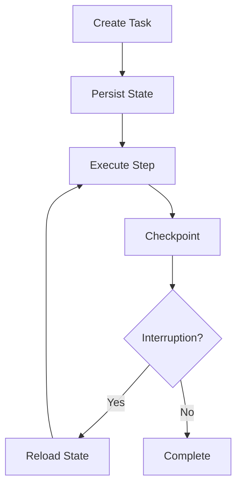

### FC-23 — Goals and Projects
```text
[Goal] -> [Project] -> [Milestone] -> [Task] -> [Action] -> [Outcome] -> [Update Progress]
```
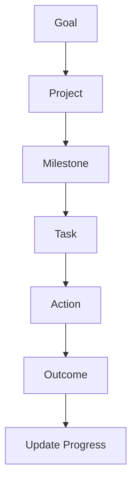

### FC-24 — Calendar and Deadline
```text
[Input] -> [Normalize Time] -> [Create Reminder] -> [Schedule] -> [Notify] -> [Complete]
```
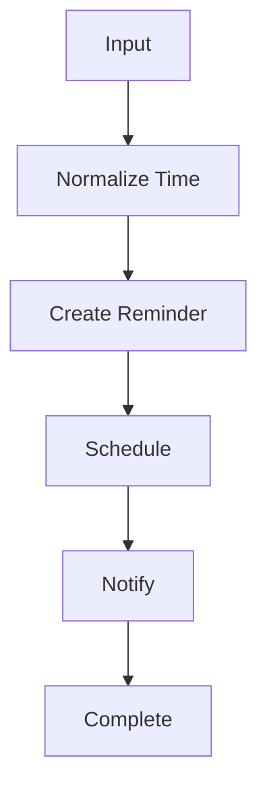

### FC-25 — Proactive Intelligence
```text
[Observe State] -> [Detect Pattern] -> [Score Importance] -> [Check Policy] -> [Suggest / Silent]
```
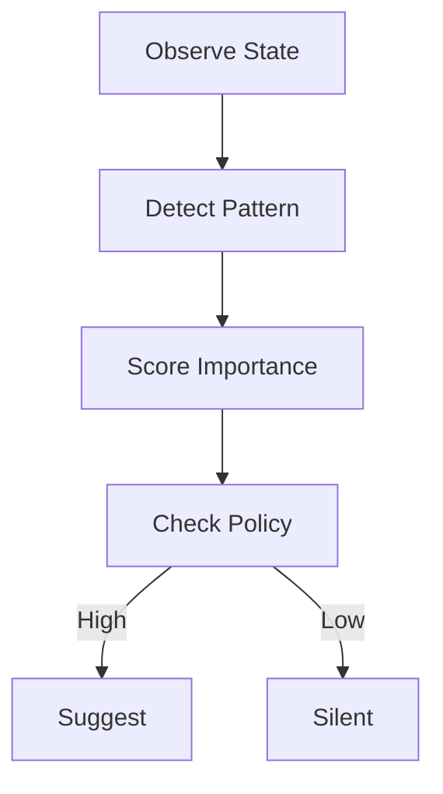

### FC-26 — Useful Interruption
```text
[Alert Generated] -> [Score Urgency] -> [Threshold Check] -> [Interrupt / Queue] -> [Feedback Loop]
```
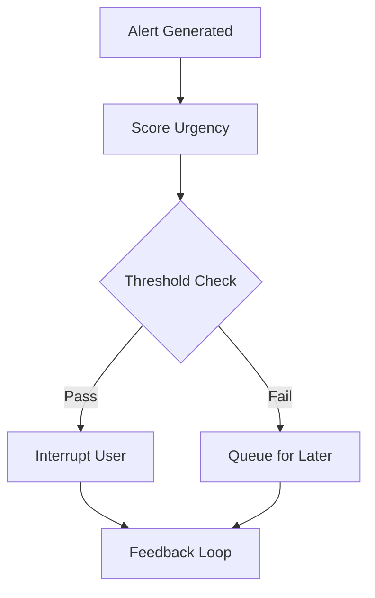

### FC-27 — Continuous Conversation
```text
[Message] -> [Resolve References] -> [Load Context] -> [Identify Task] -> [Respond] -> [Preserve State]
```
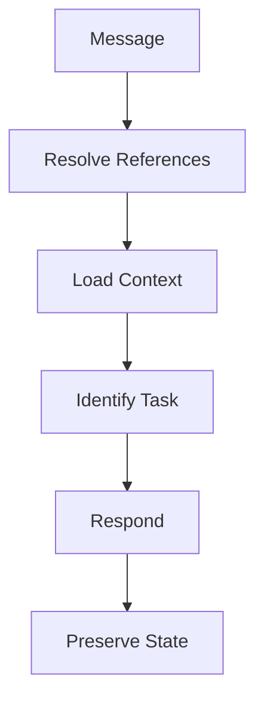

### FC-28 — Status and Progress
```text
[Status Request] -> [Collect Task State] -> [Collect Agent State] -> [Format Summary] -> [Output]
```
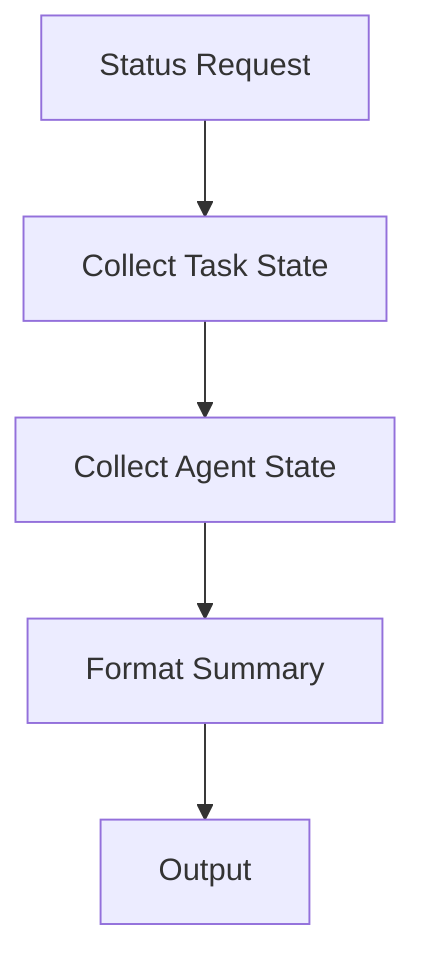

### FC-29 — Self-Reflection and Review
```text
[Output Generated] -> [Compare Requirements] -> [Security Review] -> [Pass/Fail] -> [Retry / Complete]
```
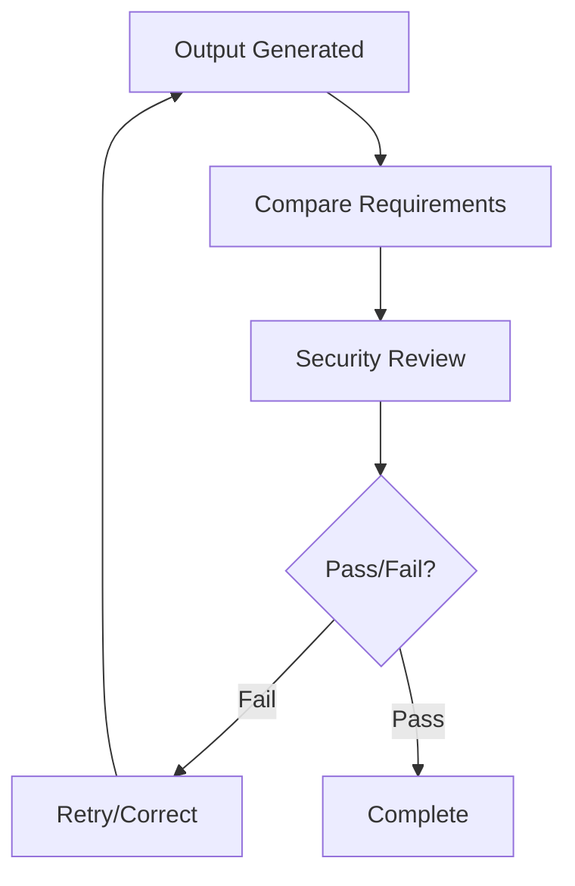

### FC-30 — Skill Discovery
```text
[Detect Repeated Workflow] -> [Propose Skill] -> [Define I/O] -> [Evaluate] -> [Approve] -> [Save to Library]
```
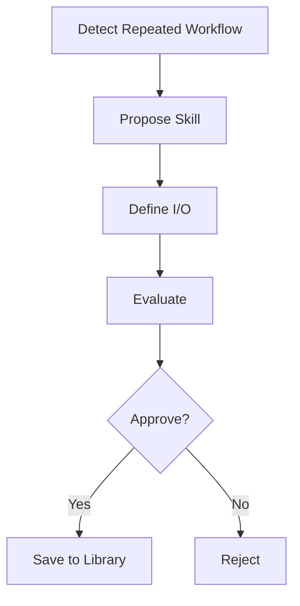

### FC-31 — Skill Execution
```text
[Skill Request] -> [Find in Library] -> [Validate Prerequisites] -> [Check Permissions] -> [Execute] -> [Verify Output]
```
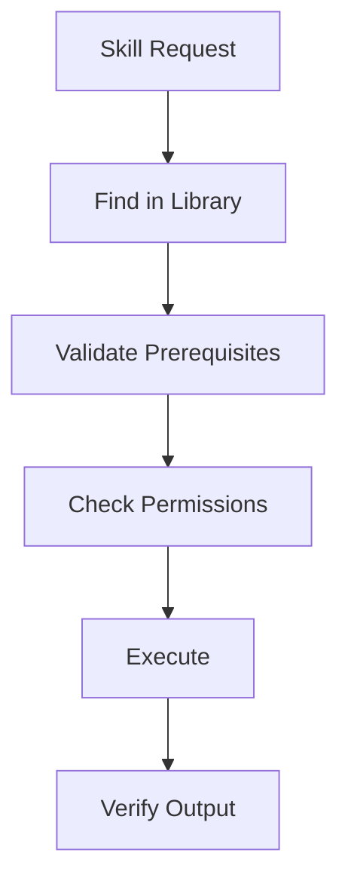

### FC-32 — Model Provider System
```text
[Inference Request] -> [Provider Abstraction] -> [Check Availability] -> [Select Model] -> [Execute] -> [Normalize Response]
```
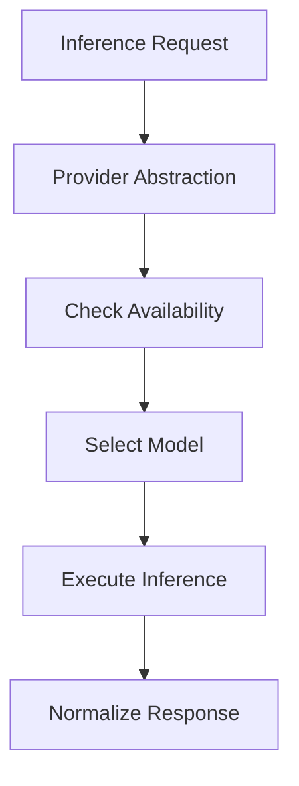

### FC-33 — Model Router
```text
[Task] -> [Classify Complexity] -> [Check Resources] -> [Route to Model] -> [Execute] -> [Fallback on Fail]
```
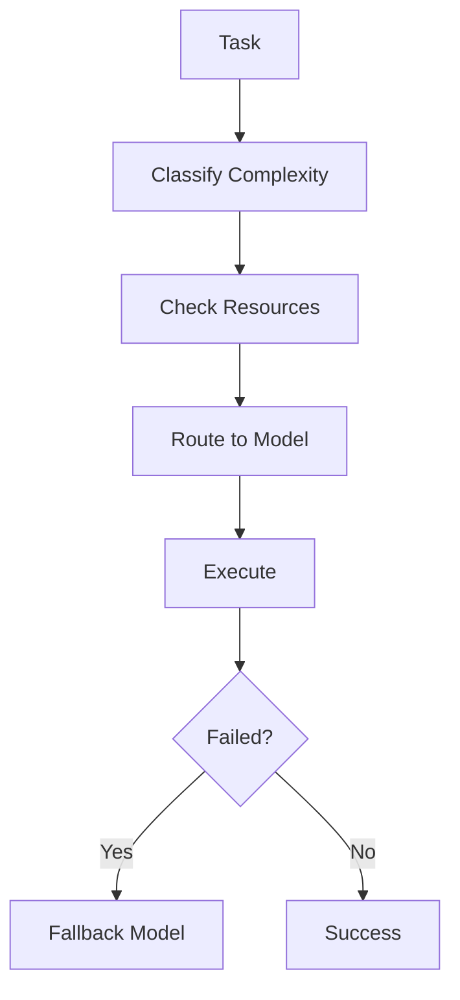

### FC-34 — Resource Awareness
```text
[Task Request] -> [Estimate RAM/CPU Needs] -> [Check Available Resources] -> [Strategy (Run/Chunk/Delay)] -> [Execute]
```
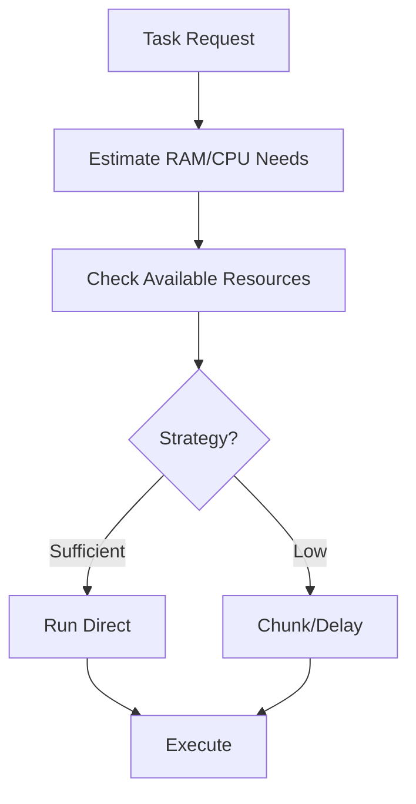

## REQUIRED MODEL SYSTEM & RESOURCE-AWARE DESIGN

The underlying architecture for Atles prioritizes running exclusively on local hardware with constrained resources (Intel i5, 16GB RAM, no dGPU).

### Architecture Principles:
1. **Model Multiplexing:** Only one LLM stays loaded in memory at any given time using Ollama's model swapping capabilities.
2. **Graceful Degradation:** If RAM usage exceeds 85%, background tasks are suspended to allow the foreground reasoning agent to complete its inference.
3. **Provider Abstraction layer:** The `AIProvider` wrapper ensures the core orchestrator never hardcodes Ollama specifics. If the user eventually gains an API key (e.g., Groq, OpenAI), the router can offload complex reasoning to the cloud while keeping sensitive local context strictly to the local Qwen3 4B model.
4. **Quantization Focus:** All local models must be 4-bit or 8-bit quantized. 
5. **Context Window Management:** Context sliding windows are aggressively pruned to prevent memory overflow. Summarization nodes replace verbatim history.

This ensures Atles remains fast, responsive, and completely free to operate in a student's daily development environment.
