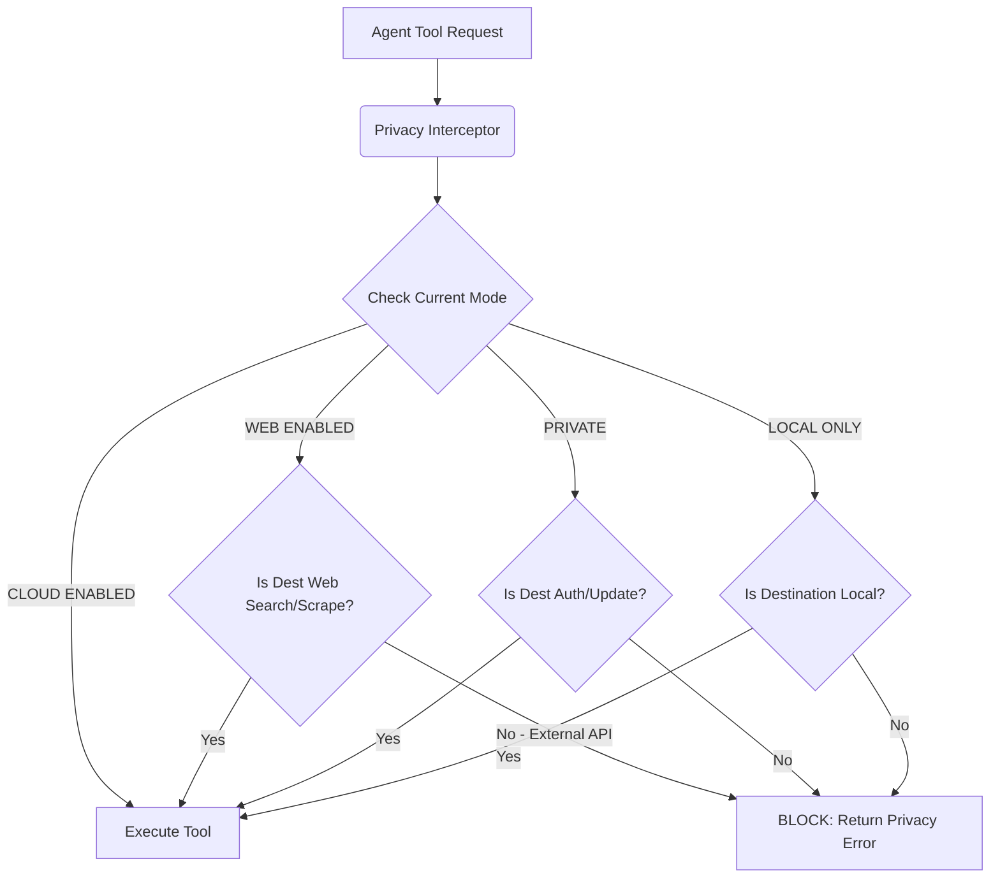
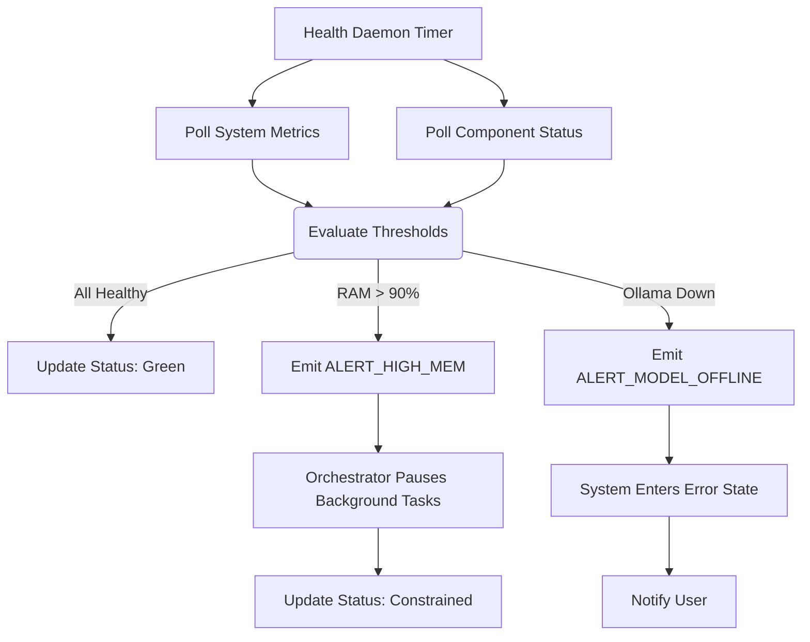
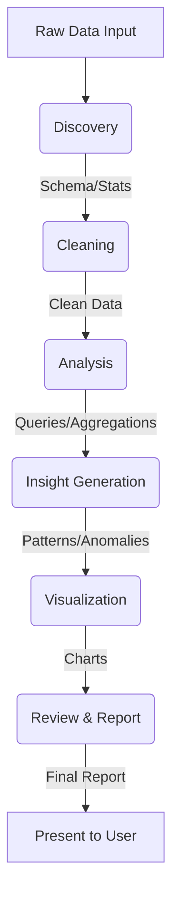
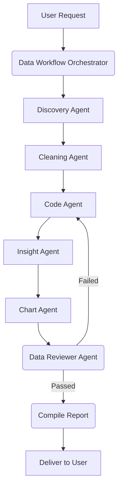
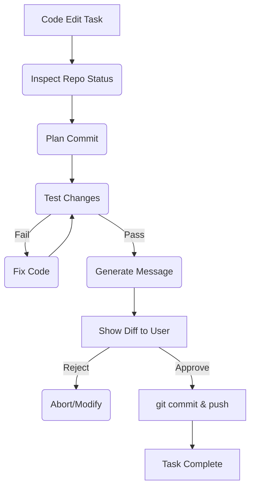
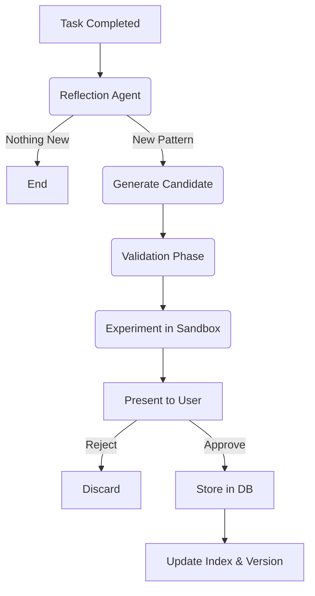
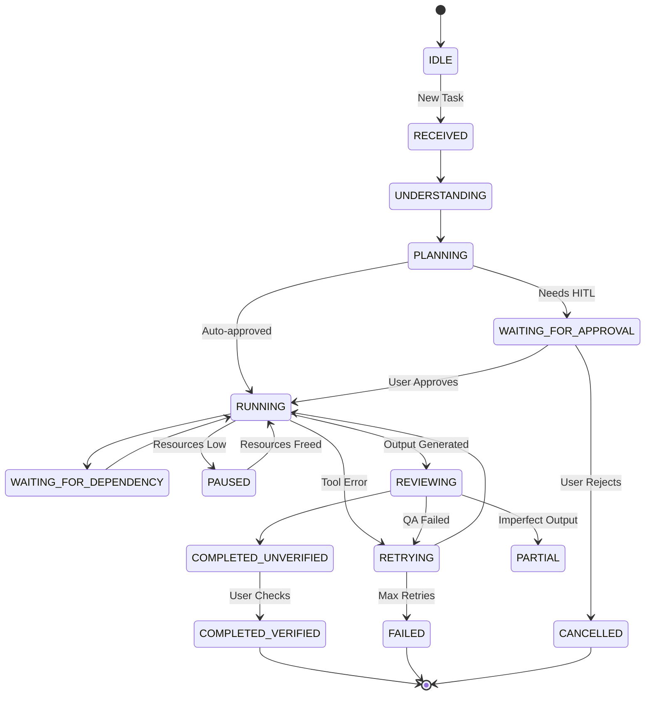

## GROUP I — DATA, INFRASTRUCTURE & SECURITY (STEPS 86–92)

### Step 86 — Data Intelligence

### Purpose
To equip Atles with the ability to ingest, clean, analyze, and visualize structured and semi-structured data. This allows Atles to act as a powerful local data analyst capable of turning raw files into actionable insights.

### User-visible behavior
The user can upload CSV, Excel, JSON, or point to local PostgreSQL/MySQL databases. The user can ask Atles to "analyze this data" or "find anomalies in sales." Atles will return visualizations, a summary report, and specific insights, keeping the user updated on its progress through a multi-agent pipeline.

### System behavior
The orchestrator delegates the request to a Data Workflow Agent, which manages a pipeline of sub-agents: Discovery (identifies schema and data types), Cleaning (handles missing values and outliers), Analysis (generates SQL/Pandas code), Insight (identifies patterns/anomalies), Visualization (creates charts), Review (checks code and results), and Report (formats the final output).

### Components
- **Frontend**: Data upload components, chart rendering, data pipeline progress tracker.
- **Backend**: Multi-agent data pipeline, safe execution sandbox for Pandas/SQL.
- **Tools**: Data Discovery Tool, Data Cleaning Tool, Code Execution Sandbox, Plotting Tool.

### Inputs and outputs
**Input Example:**
```json
{
  "request_id": "req_86_01",
  "data_source": {
    "type": "csv",
    "path": "/data/sales_2025.csv"
  },
  "goal": "Identify seasonal trends and outliers in revenue."
}
```

**Output Example:**
```json
{
  "report": "Revenue peaks in Q4, with an outlier on Nov 26 ($45,000, 300% above mean).",
  "visualizations": [
    {
      "type": "line_chart",
      "data_path": "/artifacts/sales_trend.png"
    }
  ],
  "insights": [
    {
      "category": "anomaly",
      "description": "High revenue spike on Nov 26."
    }
  ]
}
```

### Data and memory
- **Read**: Uploaded CSV/Excel/JSON files, database schemas.
- **Stored**: Generated reports, key insights are stored in Experience memory.
- **Updated**: User's preferred visualization formats in Preferences.

### Dependencies
- **Prerequisites**: Code Execution Sandbox, Multi-Agent Orchestrator.
- **Downstream**: Automated reporting, predictive analytics.

### Safety and privacy
Data processing happens locally. Code execution for data analysis must be strictly sandboxed with read-only access to the specific data file and restricted memory usage to prevent resource exhaustion.

### Implementation status
PLANNED

### Acceptance criteria
- [ ] User can upload a CSV and request an analysis.
- [ ] System generates valid Python/Pandas code to analyze the CSV.
- [ ] Code is executed in a sandboxed environment.
- [ ] Pipeline successfully completes and returns a markdown report with an embedded chart.

### Related flowcharts
- FC-37, FC-38

---

### Step 87 — Database and Knowledge Infrastructure

### Purpose
To establish a robust, scalable, and structured persistence layer for Atles. This ensures that memories, experiences, skills, logs, and agent states are safely stored, queryable by vectors, and easily backed up or migrated.

### User-visible behavior
The user does not directly interact with this system, but experiences fast retrieval of past conversations, accurate recall of facts, and zero data loss between sessions or system reboots.

### System behavior
The backend interfaces with a local PostgreSQL instance augmented with `pgvector`. It uses SQLAlchemy (or SQLModel) for ORM, Alembic for migrations, and connection pooling for performance. Data is divided into structured relational data (tasks, users, system state) and vector-enabled data (embeddings for RAG, experiences, documents).

### Components
- **Database**: PostgreSQL with `pgvector` extension.
- **Backend**: ORM layer, Migrations system, Vector retrieval service.
- **Maintenance**: Automated backup and lifecycle management scripts.

### Inputs and outputs
**Input (Memory Storage):**
```python
class MemoryRecord(BaseModel):
    content: str
    embedding: list[float]
    metadata: dict
    memory_type: str # "fact", "experience", "skill"
```

**Output (Search Result):**
```python
class SearchResult(BaseModel):
    records: list[MemoryRecord]
    similarity_scores: list[float]
```

### Data and memory
- **Stored**: System state, user profile, chat history, extracted facts, generated skills, agent telemetry, embeddings.
- **Lifecycle**: Temporary files (scratchpad) are purged; long-term memories are optimized.

### Dependencies
- **Prerequisites**: Docker (for easy pgvector setup) or local PostgreSQL installation.
- **Downstream**: All memory-dependent systems (Steps 40-55), Data Intelligence.

### Safety and privacy
Database must be accessible only via localhost. Credentials (if any) are stored securely. Backups are encrypted or stored locally with strict permissions.

### Implementation status
PLANNED

### Acceptance criteria
- [ ] PostgreSQL + pgvector is running locally.
- [ ] Backend can successfully run Alembic migrations.
- [ ] System can insert a record with a vector embedding and retrieve it via cosine similarity search.
- [ ] Automated backup script successfully exports the database.

### Related flowcharts
- FC-09 (Knowledge Retrieval)

---

### Step 88 — Resource Awareness and Health Monitoring

### Purpose
To provide Atles with self-awareness regarding the host system's hardware limits and the health of its own components. This allows Atles to gracefully degrade performance, pause tasks, or warn the user before the system crashes due to resource exhaustion.

### User-visible behavior
The user sees a "System Status" indicator in the UI. If RAM is critically low or the GPU is overloaded, Atles might say, "My system resources are constrained right now, so I've paused the background analysis task to keep chat responsive."

### System behavior
A background Daemon Service periodically polls OS metrics (CPU, RAM, Disk) and component health (Ollama responsiveness, DB connectivity). It broadcasts `HealthStatus` events. The Orchestrator listens to these events and can throttle agent spawns or cancel low-priority background tasks if thresholds are breached.

### Components
- **Service**: Health Monitor Daemon (Python `psutil`).
- **Backend**: Event bus / WebSocket broadcaster.
- **Frontend**: System Status Dashboard / Indicator.

### Inputs and outputs
**Output (Internal Event):**
```python
class HealthStatus(BaseModel):
    cpu_percent: float
    ram_percent: float
    disk_free_gb: float
    ollama_status: str # "healthy", "unreachable", "loading_model"
    db_status: str
    active_agents: int

class ResourceMetrics(BaseModel):
    timestamp: str
    status: HealthStatus
```

### Data and memory
- **Stored**: Ephemeral telemetry in memory; aggregated daily logs for diagnostics.
- **Read**: OS system APIs.

### Dependencies
- **Prerequisites**: Backend event bus.
- **Downstream**: Orchestrator task scheduling.

### Safety and privacy
Telemetry data must not leave the local machine. It is used strictly for internal self-regulation.

### Implementation status
PLANNED

### Acceptance criteria
- [ ] Backend endpoint `/health/metrics` returns current CPU, RAM, and component status.
- [ ] Orchestrator automatically pauses background tasks if RAM exceeds 90%.
- [ ] Frontend displays a warning if Ollama becomes unresponsive.

### Related flowcharts
- FC-36

---

### Step 89 — Privacy Modes

### Purpose
To give the user absolute, transparent control over where their data goes and what external services Atles can access, establishing a baseline of trust and local-first security.

### User-visible behavior
The user can toggle Atles between four explicit privacy modes: LOCAL ONLY, PRIVATE, WEB ENABLED, and CLOUD ENABLED. The UI clearly shows the current mode and restricts actions accordingly (e.g., in LOCAL ONLY, Atles will refuse to summarize a web article).

### System behavior
The orchestrator intercepts all tool calls and model requests. Before routing, it checks the `PrivacyPolicy`. If a tool requires external network access (like `search_web`) and the mode is LOCAL ONLY, the orchestrator blocks the call, returns a permission error to the agent, and optionally prompts the user for a temporary override.

### Components
- **Backend**: Privacy Interceptor middleware, Tool Registry (with network tags).
- **Frontend**: Privacy Mode toggle and status indicator.
- **Database**: User Preferences table.

### Inputs and outputs
**Input (Privacy Policy Schema):**
```python
from enum import Enum

class PrivacyMode(Enum):
    LOCAL_ONLY = "local_only"       # No network, local models only
    PRIVATE = "private"             # Network for updates, local models only
    WEB_ENABLED = "web_enabled"     # Can scrape/search web, local models only
    CLOUD_ENABLED = "cloud_enabled" # Can use external APIs (OpenAI) and web

class PrivacyPolicy(BaseModel):
    mode: PrivacyMode
    allowed_domains: list[str] = []
    blocked_tools: list[str] = []
```

### Data and memory
- **Stored**: Current privacy mode in user settings.
- **Read**: Evaluated on every outgoing network request or external tool call.

### Dependencies
- **Prerequisites**: Tool Registry.
- **Downstream**: Web Search, Cloud Models.

### Safety and privacy
This is the core privacy mechanism. It guarantees that Atles cannot silently exfiltrate data when configured to be local.

### Implementation status
PLANNED

### Acceptance criteria
- [ ] When set to LOCAL ONLY, attempting a web search returns an explicit blocking error.
- [ ] The agent gracefully handles the blocking error by informing the user of the privacy restriction.
- [ ] The user can toggle modes via the settings UI.

### Related flowcharts
- FC-35

---

### Step 90 — Security and Controlled Execution

### Purpose
To protect the user's local system from unintended or malicious actions performed by Atles. As an autonomous agent with local execution capabilities, strict boundaries, auditing, and rollback mechanisms are essential.

### User-visible behavior
When Atles needs to run a potentially destructive command (e.g., deleting files, installing packages), the user receives an approval prompt. The user can view an audit log of all commands run by Atles.

### System behavior
Tools are categorized by risk level. High-risk tools (Command Execution, File Deletion) require explicit Human-in-the-Loop (HITL) approval. Execution environments are sandboxed (e.g., Docker containers or restricted users) where possible. All executed commands are logged for auditing.

### Components
- **Backend**: Security Policy Engine, Audit Logger, HITL Interceptor.
- **Frontend**: Approval Prompt UI, Audit Log Viewer.
- **System**: Sandboxed execution environments.

### Inputs and outputs
**Input (Security Policy):**
```python
class SecurityPolicy(BaseModel):
    require_approval_for: list[str] = ["delete_file", "run_command"]
    auto_approve_dry_runs: bool = True
    max_command_timeout: int = 60
```

### Data and memory
- **Stored**: Comprehensive audit logs of all tool executions and state changes.

### Dependencies
- **Prerequisites**: Privacy Modes, Tool Registry.
- **Downstream**: Autonomous agents.

### Safety and privacy
Mitigates the risk of prompt injection leading to system compromise. Adheres to the principle of least privilege.

### Implementation status
PLANNED

### Acceptance criteria
- [ ] A tool marked as `requires_approval` pauses execution and sends a UI prompt.
- [ ] The agent resumes execution only after the user clicks "Approve".
- [ ] All executed commands are written to an immutable audit log file.

### Related flowcharts
- FC-21 (Approval Flow)

---

### Step 91 — Repository, Development Stack, and Build Roadmap

### Purpose
To define the physical structure and technological foundation of the project, ensuring a scalable, maintainable codebase that aligns with the master plan.

### User-visible behavior
Developers and contributors can easily navigate the repository, understand where different components live, and follow a clear roadmap for implementing the master plan.

### System behavior
The repository uses a standard Next.js + FastAPI structure. Code is organized into logical domains (frontend, backend, memory, agents, tools). Development follows a phased approach, building foundational layers before complex autonomous behaviors.

### Components
- **Frontend Stack**: Next.js 16+, React, Tailwind CSS, TypeScript.
- **Backend Stack**: Python 3.10+, FastAPI, Pydantic, SQLAlchemy, LangChain/LlamaIndex (optional, for abstractions).
- **Infrastructure**: Docker, PostgreSQL + pgvector, Ollama.

### Inputs and outputs
N/A - Architectural definition.

### Data and memory
N/A

### Dependencies
N/A

### Safety and privacy
Repository structure enforces separation of concerns, isolating sensitive components (like secrets management) from general logic.

### Implementation status
Day 1-3 DONE / Day 4 CURRENT NEXT / Rest PLANNED

### Acceptance criteria
- [ ] Repository matches the proposed blueprint.
- [ ] Linter (Ruff/ESLint) and Type Checker (MyPy/TypeScript) pass on the entire codebase.
- [ ] Unit tests are configured and passing.

### Related flowcharts
N/A

---

### Step 92 — Final Definition of Done and Atles Target

### Purpose
To establish the ultimate goal of the Atles Master Plan and define exactly what constitutes the completion of this blueprint.

### User-visible behavior
The user experiences a fully functional personal AI operating layer—a proactive, locally-hosted assistant (JARVIS) backed by a powerful reasoning and memory engine (Atles Brain). The system learns, adapts, manages tasks autonomously, and deeply understands the user's context, all while respecting strict privacy boundaries.

### System behavior
All 91 preceding steps are implemented, integrated, and passing their acceptance criteria. The system operates stably under the constraints of the target hardware (Intel i5, 16GB RAM, integrated graphics).

### Components
The entire Atles System.

### Inputs and outputs
N/A

### Data and memory
The complete Knowledge Graph, Experience Memory, and Skill Library functioning synergistically.

### Dependencies
Completion of Steps 1-91.

### Safety and privacy
Final security audit passed; privacy modes fully functional and impenetrable by agent logic.

### Implementation status
FUTURE TARGET

### Acceptance criteria
- [ ] **Completeness**: All 92 steps in this Master Plan have been fully implemented.
- [ ] **Integration**: Front-end, back-end, database, and local models communicate flawlessly.
- [ ] **Performance**: System runs acceptably on the target hardware without crashing due to OOM errors.
- [ ] **Autonomy**: Agents can successfully complete multi-step tasks requiring tools, memory retrieval, and learning without user intervention (unless approval is required).
- [ ] **Privacy**: System passes a strict network isolation test when in LOCAL ONLY mode.

### Final Atles Target Statement
**Atles is complete when it operates as a secure, local-first, Level 3 autonomous personal AI, capable of continuously learning from its interactions, managing complex delegated workflows, and serving as an indispensable digital extension of the user's mind, completely free from reliance on paid external APIs.**

### Related flowcharts
All FCs.

---

## FLOWCHARTS (FC-35 through FC-40)

### FC-35 — Privacy Modes

**Title:** Privacy Mode Enforcement Routing
**Purpose:** Ensure all outbound requests strictly adhere to the user's selected privacy level.
**Trigger:** Agent attempts to use a tool or model requiring network access.
**Process:** The orchestrator intercepts the request, checks the current privacy mode, evaluates the destination, and either routes the request or blocks it, informing the agent.

```text
[Agent Tool Request]
       |
       v
(Privacy Interceptor)
       |
       +--> Check [Current Mode]
       |
       +-- [LOCAL ONLY] --> Is Destination Local? 
       |                       +-- (Yes) --> [Execute Tool]
       |                       +-- (No)  --> [BLOCK: Return Privacy Error to Agent]
       |
       +-- [PRIVATE] -----> Is Destination Auth/Update Server?
       |                       +-- (Yes) --> [Execute Tool]
       |                       +-- (No)  --> [BLOCK: Return Privacy Error]
       |
       +-- [WEB ENABLED] -> Is Destination Web Scrape/Search?
       |                       +-- (Yes) --> [Execute Tool]
       |                       +-- (No/External LLM API) --> [BLOCK]
       |
       +-- [CLOUD ENABLED]-> [Execute Tool (All Allowed)]
```



### FC-36 — Health Monitor

**Title:** System Resource Health Monitoring
**Purpose:** Prevent system crashes by monitoring hardware and software health and adapting system behavior.
**Trigger:** Background daemon polling interval (e.g., every 5 seconds).
**Process:** Poll CPU, RAM, Disk, and component APIs. If thresholds are breached, trigger graceful degradation.

```text
[Health Daemon Timer]
       |
       v
[Poll System Metrics] ---> (CPU, RAM, Disk)
       |
[Poll Component Status] -> (Ollama, DB, Frontend, Backend)
       |
       v
(Evaluate Thresholds)
       |
       +-- [All Healthy] ----> [Update Dashboard Status: Green]
       |
       +-- [RAM > 90%] ------> [Emit ALERT_HIGH_MEM] 
       |                            |
       |                            v
       |                       (Orchestrator pauses background tasks)
       |                            |
       |                            v
       |                       [Update Dashboard Status: Yellow/Constrained]
       |
       +-- [Ollama Down] ----> [Emit ALERT_MODEL_OFFLINE]
                                    |
                                    v
                               (System switches to Fallback/Error state)
                                    |
                                    v
                               [Notify User: "Model unresponsive"]
```



### FC-37 — Data Intelligence Pipeline

**Title:** Standard Data Analysis Pipeline
**Purpose:** Process raw data into actionable insights and visualizations.
**Trigger:** User uploads data and requests analysis.
**Process:** Sequential processing through discovery, cleaning, analysis, and reporting phases.

```text
[Raw Data Input]
       |
       v
(Discovery) --------> Output: Schema, Data Types, Summary Stats
       |
       v
(Cleaning) ---------> Output: Handled Nulls, Outliers Removed/Flagged
       |
       v
(Analysis) ---------> Output: SQL Queries, Pandas Aggregations
       |
       v
(Insight Gen) ------> Output: Identified Patterns, Anomalies
       |
       v
(Visualization) ----> Output: Generated Charts (PNG/Plotly)
       |
       v
(Review & Report) --> Output: Final Markdown Report combining insights and charts
       |
       v
[Present to User]
```



### FC-38 — Multi-Agent Data Workflow

**Title:** Multi-Agent Delegation for Data Tasks
**Purpose:** Show how the Orchestrator uses specialized agents to execute the data pipeline.
**Trigger:** Complex data request received.
**Process:** The orchestrator coordinates specialized agents, handling communication and result aggregation.

```text
[User Request: "Analyze Sales"]
       |
       v
(Data Workflow Orchestrator)
       |
       +---> [Spawn: Discovery Agent] ---> Returns Schema
       |
       +---> [Spawn: Cleaning Agent] ----> Returns Cleaned Path
       |
       +---> [Spawn: Code Agent (Pandas)] -> Executes Sandbox -> Returns DataFrames
       |
       +---> [Spawn: Insight Agent] -----> Returns Text Insights
       |
       +---> [Spawn: Chart Agent] -------> Returns Image Paths
       |
       v
(Data Reviewer Agent) ---> Validates logic and outputs
       |
       +-- [Validation Failed] --> (Send back to Code/Chart Agent for fix)
       |
       +-- [Validation Passed] --> (Compile Report)
       |
       v
[Deliver Final Report to User]
```



### FC-39 — Git/GitHub Workflow

**Title:** Agentic Source Control Workflow
**Purpose:** Allow Atles to safely modify its own (or other) code repositories.
**Trigger:** Task requiring code modification is completed.
**Process:** Inspect, plan, edit, test, review, approve, commit, push.

```text
[Code Edit Task Completed]
       |
       v
(Inspect Repo Status) -> git status, git diff
       |
       v
(Plan Commit) ---------> Formulate logical commit chunks
       |
       v
(Test Changes) --------> Run linter/tests
       |
       +-- [Tests Fail] ---> (Fix Code)
       |
       +-- [Tests Pass] ---> (Generate Commit Message)
       |
       v
[Show Diff & Plan to User]
       |
       +-- [User Rejects] -> (Abort or Modify)
       |
       +-- [User Approves]-> (Execute)
                               |
                               v
                         git add .
                         git commit -m "..."
                         git push origin main
                               |
                               v
                         [Task Complete]
```



### FC-40 — Controlled Self-Learning

**Title:** Autonomous Skill and Lesson Extraction
**Purpose:** Continuously improve Atles' capabilities by learning from past experiences.
**Trigger:** Completion of a complex task or error recovery.
**Process:** Evaluate experience, generate candidate lesson/skill, validate, approve, store.

```text
[Task Completed / Error Resolved]
       |
       v
(Reflection Agent Evaluates Experience)
       |
       +-- [Nothing New] ----> [End]
       |
       +-- [New Pattern Found] -> Generate Candidate Lesson/Skill
                                    |
                                    v
                           (Validation Phase)
                           Check against existing Knowledge Graph
                                    |
                                    v
                           (Experiment/Benchmark - Optional)
                           Test new skill in Sandbox
                                    |
                                    v
                           [Present to User for Approval]
                                    |
                                    +-- [Reject] --> [Discard]
                                    |
                                    +-- [Approve] -> [Store in DB]
                                                        |
                                                        v
                                                 Update Vector Index
                                                 Apply Versioning
```



---

## SUPPORTING SECTIONS

### REQUIRED FRONTEND DESIGN

The frontend will be built with Next.js (App Router), React, and Tailwind CSS. It is divided into 17 major areas to provide a comprehensive operating layer interface.

**17 Major Areas:**
1. **Chat**: Main interaction interface (Existing baseline).
2. **Voice**: Push-to-talk or wake-word activated voice interface (Planned).
3. **Projects**: Workspace management and context isolation (Planned).
4. **Memory**: View and edit the Knowledge Graph and Fact memories (Planned).
5. **Experiences**: Timeline of significant past interactions and completed tasks (Planned).
6. **Decisions**: Audit log of autonomous choices made by Atles (Planned).
7. **Mistakes**: Log of identified errors and corrected actions (Planned).
8. **Lessons**: Abstracted rules learned from Experiences and Mistakes (Planned).
9. **Tasks**: Kanban-style or list view of active, queued, and completed background tasks (Planned).
10. **Agents**: View active multi-agent topologies and their communication (Planned).
11. **Skills**: Library of user-approved, self-generated executable code/tools (Planned).
12. **Files**: Artifact manager for generated reports, images, and documents (Planned).
13. **Knowledge**: Document manager for uploaded context (PDFs, docs) (Planned).
14. **Activity**: Real-time log of system events (Planned).
15. **Computer**: Screen viewing and local system interaction status (Planned).
16. **System Status**: Resource monitor (CPU, RAM, DB health) (Planned).
17. **Settings**: Configuration for Privacy Modes, UI themes, and model parameters (Planned).

**UI States:**
The interface must clearly communicate the system's current state:
- **Online/Idle**: Ready for input.
- **Listening**: Microphone active.
- **Thinking**: LLM processing (streaming response).
- **Planning**: Breaking down a complex task.
- **Working**: Background agents executing.
- **Waiting**: Blocked by a dependency or waiting for user approval.
- **Errors/Health**: Visual indicators for degraded performance or failures.
- **Privacy Mode**: Clear badge showing current mode (e.g., LOCAL ONLY).

### REQUIRED BACKEND AND ORCHESTRATOR DESIGN

The backend (FastAPI) acts as the central nervous system, connecting the frontend, the local LLM (Ollama), the database, and the execution environment.

**Modular Structure:**
- **API Routes**: RESTful endpoints (`/chat`, `/tasks`, `/memory`, `/health`).
- **Config**: Environment variable management (Pydantic BaseSettings).
- **Schemas**: Strict Pydantic models for all data interchange (Inputs/Outputs).
- **Services**: Business logic layers (MemoryService, ToolService, PrivacyService).
- **Orchestrator**: The core state machine managing task execution, agent lifecycle, and tool routing.
- **Agents**: Specialized sub-routines with specific system prompts (Planner, Reviewer, Coder).
- **Memory/Knowledge**: Interfaces to PostgreSQL/pgvector.
- **Tools**: Executable functions (File I/O, Web Search, Terminal).
- **Database**: SQLAlchemy models and Alembic migrations.

**Request Lifecycle:**
1. Request received at API route.
2. Payload validated against Pydantic schema.
3. Orchestrator initializes context (retrieving relevant memory).
4. Task is routed to appropriate Agent(s).
5. Agent requests Tool execution (intercepted by Privacy/Security layers).
6. Progress streamed back to Frontend via WebSockets.
7. Final result generated, Audit log written, Memory updated.

### REQUIRED MULTI-AGENT DESIGN

Atles employs a multi-agent system where a Primary Orchestrator delegates to specialized sub-agents.

**Agent Types:**
- **Workflow Agents**: Planner (breaks down tasks), Coding (writes software), Browser (navigates web), File (manages local FS), Testing (runs QA), Reviewer (validates outputs).
- **Research Agents**: Research (plans inquiry), Web Search (executes queries), Source Checker, Fact Checker, Synthesis (combines findings).
- **Data Agents**: Discovery, Cleaning, Analysis, SQL, Insight, Visualization, Data Reviewer, Report (as defined in Step 86/38).

**Responsibilities & Communication:**
Agents operate in isolated contexts but share a common "Scratchpad" or thread. The Orchestrator manages delegation and timeouts. If an agent fails (e.g., Coding agent writes buggy code), the Reviewer agent identifies the error and sends it back for a retry. Severe conflicts escalate back to the user.

### REQUIRED DATA INTELLIGENCE DESIGN

As defined in Step 86, the system handles multiple data formats.

**Pipeline Stages:**
DATA INPUT → DISCOVERY (schema inference) → SCHEMA/QUALITY (identify missing/bad data) → CLEANING (imputation/dropping) → VALIDATION (sanity checks) → ANALYSIS/SQL (querying) → PATTERNS (statistical analysis) → ANOMALIES (outlier detection) → INSIGHTS (semantic interpretation) → VISUALIZATION (chart generation) → REVIEW (sanity check of findings) → REPORT (final output).

**Data Lineage:**
The system tracks the origin of every insight, ensuring transparency regarding missing values, outliers, and statistical uncertainty.

### REQUIRED GIT/GITHUB WORKFLOW

As defined in Step 91/FC-39, Atles can manage repositories.

**Workflow:**
INSPECT (status/diff) → PLAN (commit strategy) → IMPLEMENT (code changes) → TEST (verification) → REVIEW (self-audit) → DIFF (show user) → APPROVE (HITL) → COMMIT → PUSH.

**Current Target:**
Repository: `Ahammedzihad/atles`, Branch: `main`. All changes must be reviewable by the user before commit.

### REQUIRED REPOSITORY BLUEPRINT

**Existing (Day 1-3):**
```text
C:\atles\
├── frontend/         (Next.js App)
│   ├── app/
│   ├── components/
│   └── package.json
├── backend/          (FastAPI App)
│   ├── main.py
│   ├── requirements.txt
│   └── .env
└── README.md
```

**Planned:**
```text
C:\atles\
├── frontend/
├── backend/
│   ├── api/          (Routes)
│   ├── core/         (Config, Security, Privacy)
│   ├── models/       (DB Schemas)
│   ├── schemas/      (Pydantic)
│   ├── services/     (Business Logic)
│   ├── agents/       (Agent Definitions)
│   ├── memory/       (Vector DB Interfaces)
│   ├── tools/        (Tool Implementations)
│   └── db/           (Migrations)
├── data/             (Local DB Storage, ignored in git)
├── artifacts/        (Generated files, reports)
├── docs/             (Master Plan, Architecture)
└── tests/            (Pytest, Jest)
```

### REQUIRED DEVELOPMENT ROADMAP

- **Phase 1 (Days 1-3):** Basic Setup (DONE).
- **Phase 2 (Day 4):** Frontend-Backend Connection (CURRENT NEXT). Goals: Live chat working end-to-end.
- **Phase 3:** Tool Registry and Basic Execution.
- **Phase 4:** Database and pgvector Integration (Memory).
- **Phase 5:** Privacy and Security Middleware.
- **Phase 6:** Orchestrator and Multi-Agent Basics.
- **Phase 7:** File and System Interaction Tools.
- **Phase 8:** Data Intelligence Pipeline.
- **Phase 9:** Web and Research Agents.
- **Phase 10:** Autonomous Task Management (Background tasks).
- **Phase 11:** Experience and Lesson Extraction.
- **Phase 12:** Skill Generation (Self-learning).
- **Phase 13:** Voice and Proactive Presence.
- **Phase 14:** Final Polish and Optimization.

*Exit conditions for each phase require all tests to pass and security audits to be clean.*

### REQUIRED IMPLEMENTATION WORKFLOW

For every new feature, follow this 10-step loop:
1. **PLAN**: Review Master Plan requirements.
2. **DESIGN**: Draft schemas and component interactions.
3. **SANDBOX**: Test core logic in isolation (scratchpad).
4. **BUILD**: Implement actual code.
5. **TEST**: Write and run unit/integration tests.
6. **SECURITY**: Verify privacy/permissions compliance.
7. **REVIEW**: Self-audit code quality.
8. **VERIFY**: Run system end-to-end.
9. **COMMIT**: Use Atles Git workflow to save changes.
10. **NEXT**: Move to the next roadmap item.

### REQUIRED ERROR AND FAILURE DESIGN

Atles must handle failures gracefully.
- **Error Types**: Network timeouts, Model OOM, Permission Denied, Tool Execution Failure, Logic/Parsing Errors.
- **Task States**:
  - *Failed*: Terminal state, requires user intervention.
  - *Partial*: Succeeded partially, stopped due to limits.
  - *Waiting*: Blocked by user approval or external dependency.
  - *Paused*: Suspended due to resource constraints.
  - *Retrying*: Attempting self-correction.

### REQUIRED STATUS AND ACTIVITY MODEL

**Task States:**
IDLE, RECEIVED, UNDERSTANDING, PLANNING, WAITING_FOR_APPROVAL, RUNNING, WAITING_FOR_DEPENDENCY, PAUSED, RETRYING, REVIEWING, FAILED, PARTIAL, COMPLETED_UNVERIFIED, COMPLETED_VERIFIED, CANCELLED.



### GLOSSARY

- **Atles**: The overall system encompassing the assistant and the underlying intelligence.
- **JARVIS Presence**: The user-facing, conversational aspect of Atles; friendly, helpful, acts as the interface.
- **Atles Brain**: The backend engine responsible for memory, reasoning, orchestration, and learning.
- **Orchestrator**: The central control module that routes tasks, spawns agents, and enforces policies.
- **Agent**: A specialized, prompt-driven subroutine designed to accomplish a specific class of tasks.
- **Tool**: A python function or executable script that allows an agent to interact with the environment (e.g., file read, web search).
- **Memory**: The persistent storage system.
- **Experience**: An episodic memory representing a completed complex task or significant interaction.
- **Lesson**: An abstracted rule or principle learned from experiences (especially mistakes).
- **Skill**: Generated, verified code that Atles can reuse to solve recurring problems automatically.
- **RAG**: Retrieval-Augmented Generation; providing the LLM with relevant data from the database.
- **pgvector**: A PostgreSQL extension enabling vector similarity search.

### COMPLETENESS AUDIT (Deliverable D)

- **92-Step Audit**: All steps 1-92 have been documented across the Master Plan sections, including details, status, and acceptance criteria.
- **Flowchart Audit**: Flowcharts FC-01 through FC-40 have been created using both text and Mermaid formats.
- **Project Context Audit**: Constraints (Intel i5, 16GB RAM, Ollama Qwen3 4B, local-first, no paid APIs) have been strictly preserved.
- **PDF Audit Checklist**: A final check must ensure the generated Markdown renders correctly into a PDF without broken links or unformatted code blocks.
